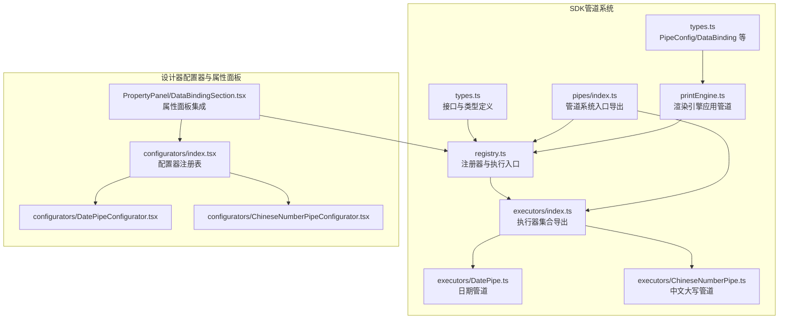
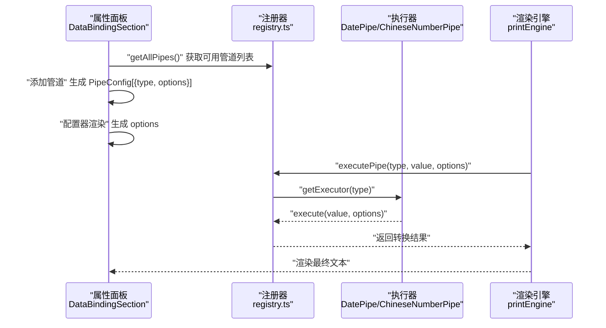
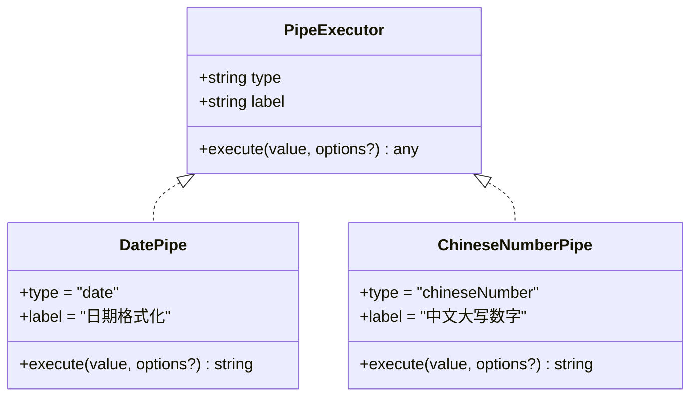
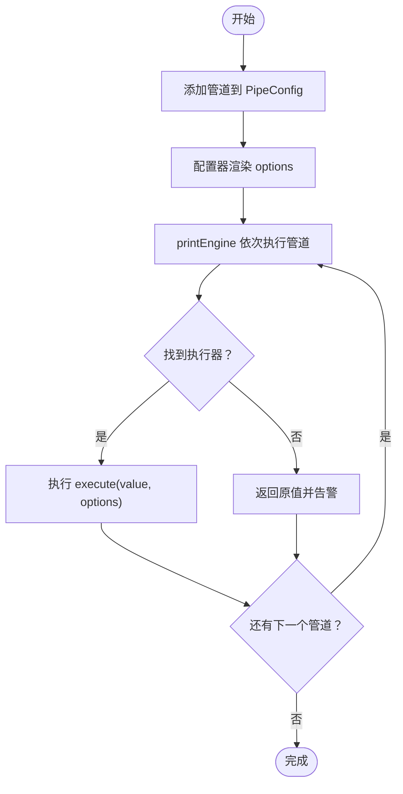
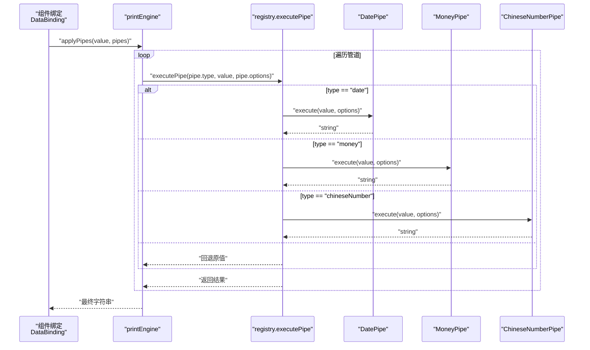
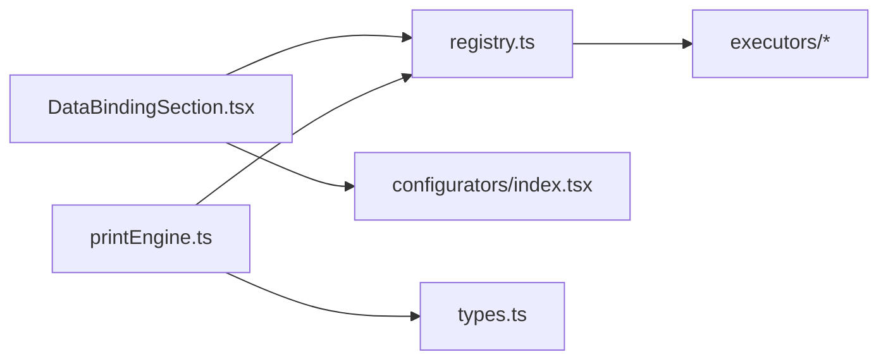

# 自定义管道开发

<cite>
**本文引用的文件**
- [sdk/src/pipes/types.ts](file://sdk/src/pipes/types.ts)
- [sdk/src/pipes/registry.ts](file://sdk/src/pipes/registry.ts)
- [sdk/src/pipes/executors/index.ts](file://sdk/src/pipes/executors/index.ts)
- [sdk/src/pipes/executors/DatePipe.ts](file://sdk/src/pipes/executors/DatePipe.ts)
- [sdk/src/pipes/executors/ChineseNumberPipe.ts](file://sdk/src/pipes/executors/ChineseNumberPipe.ts)
- [sdk/src/pipes/index.ts](file://sdk/src/pipes/index.ts)
- [sdk/src/printEngine.ts](file://sdk/src/printEngine.ts)
- [sdk/src/types.ts](file://sdk/src/types.ts)
- [designer/src/pipes/configurators/index.tsx](file://designer/src/pipes/configurators/index.tsx)
- [designer/src/pipes/configurators/DatePipeConfigurator.tsx](file://designer/src/pipes/configurators/DatePipeConfigurator.tsx)
- [designer/src/pipes/configurators/ChineseNumberPipeConfigurator.tsx](file://designer/src/pipes/configurators/ChineseNumberPipeConfigurator.tsx)
- [designer/src/pages/Designer/components/PropertyPanel/DataBindingSection.tsx](file://designer/src/pages/Designer/components/PropertyPanel/DataBindingSection.tsx)
- [docs/技术架构文档(仅参考).md](file://docs/技术架构文档(仅参考).md)
</cite>

## 目录
1. [简介](#简介)
2. [项目结构](#项目结构)
3. [核心组件](#核心组件)
4. [架构总览](#架构总览)
5. [详细组件分析](#详细组件分析)
6. [依赖分析](#依赖分析)
7. [性能考虑](#性能考虑)
8. [故障排查指南](#故障排查指南)
9. [结论](#结论)
10. [附录](#附录)

## 简介
本指南面向希望为打印设计器与 SDK 系统开发“自定义数据管道”的工程师，系统讲解：
- 管道执行器的接口规范与实现要点（type、label、execute）
- 管道注册器的使用与注册流程
- 自定义管道的开发步骤与配置器实现
- 管道链式调用的扩展机制与参数传递规则
- 测试与调试方法
- 最佳实践与性能优化建议

## 项目结构
围绕“管道系统”，代码主要分布在两个子工程：
- SDK 层（后端/核心逻辑）：定义执行器接口、注册器、内置执行器与导出入口
- 设计器前端（UI 层）：提供配置器 UI、属性面板集成与管道链式配置

图表来源
- [sdk/src/pipes/types.ts:1-30](file://sdk/src/pipes/types.ts#L1-L30)
- [sdk/src/pipes/registry.ts:1-65](file://sdk/src/pipes/registry.ts#L1-L65)
- [sdk/src/pipes/executors/index.ts:1-45](file://sdk/src/pipes/executors/index.ts#L1-L45)
- [sdk/src/pipes/executors/DatePipe.ts:1-35](file://sdk/src/pipes/executors/DatePipe.ts#L1-L35)
- [sdk/src/pipes/executors/ChineseNumberPipe.ts:1-138](file://sdk/src/pipes/executors/ChineseNumberPipe.ts#L1-L138)
- [sdk/src/pipes/index.ts:1-9](file://sdk/src/pipes/index.ts#L1-L9)
- [sdk/src/printEngine.ts:110-125](file://sdk/src/printEngine.ts#L110-L125)
- [sdk/src/types.ts:77-86](file://sdk/src/types.ts#L77-L86)
- [designer/src/pipes/configurators/index.tsx:1-85](file://designer/src/pipes/configurators/index.tsx#L1-L85)
- [designer/src/pipes/configurators/DatePipeConfigurator.tsx:1-23](file://designer/src/pipes/configurators/DatePipeConfigurator.tsx#L1-L23)
- [designer/src/pipes/configurators/ChineseNumberPipeConfigurator.tsx:1-58](file://designer/src/pipes/configurators/ChineseNumberPipeConfigurator.tsx#L1-L58)
- [designer/src/pages/Designer/components/PropertyPanel/DataBindingSection.tsx:1-127](file://designer/src/pages/Designer/components/PropertyPanel/DataBindingSection.tsx#L1-L127)

章节来源
- [sdk/src/pipes/types.ts:1-30](file://sdk/src/pipes/types.ts#L1-L30)
- [sdk/src/pipes/registry.ts:1-65](file://sdk/src/pipes/registry.ts#L1-L65)
- [sdk/src/pipes/executors/index.ts:1-45](file://sdk/src/pipes/executors/index.ts#L1-L45)
- [sdk/src/pipes/index.ts:1-9](file://sdk/src/pipes/index.ts#L1-L9)
- [sdk/src/printEngine.ts:110-125](file://sdk/src/printEngine.ts#L110-L125)
- [sdk/src/types.ts:77-86](file://sdk/src/types.ts#L77-L86)
- [designer/src/pipes/configurators/index.tsx:1-85](file://designer/src/pipes/configurators/index.tsx#L1-L85)
- [designer/src/pipes/configurators/DatePipeConfigurator.tsx:1-23](file://designer/src/pipes/configurators/DatePipeConfigurator.tsx#L1-L23)
- [designer/src/pipes/configurators/ChineseNumberPipeConfigurator.tsx:1-58](file://designer/src/pipes/configurators/ChineseNumberPipeConfigurator.tsx#L1-L58)
- [designer/src/pages/Designer/components/PropertyPanel/DataBindingSection.tsx:1-127](file://designer/src/pages/Designer/components/PropertyPanel/DataBindingSection.tsx#L1-L127)

## 核心组件
- 管道执行器接口（PipeExecutor）
  - 必备字段：type（唯一标识）、label（显示名称）、execute(value, options?)（转换逻辑）
  - 作用域：SDK 层，负责实际数据转换
- 管道注册器（Registry）
  - 提供 registerExecutor/getExecutor/getAllPipes/executePipe 四大能力
  - 内置初始化时注册了多个执行器
- 管道系统入口（pipes/index.ts）
  - 统一导出类型、注册器与执行器集合，便于外部按需引入
- 渲染引擎（printEngine）
  - 在渲染阶段按顺序对绑定值应用管道链，形成最终渲染文本
- 配置器（UI 层）
  - 为不同管道类型提供可视化配置界面，驱动 options 的生成
- 数据绑定模型（types.ts）
  - PipeConfig 与 DataBinding 定义了管道链的结构与参数载体

章节来源
- [sdk/src/pipes/types.ts:11-29](file://sdk/src/pipes/types.ts#L11-L29)
- [sdk/src/pipes/registry.ts:17-52](file://sdk/src/pipes/registry.ts#L17-L52)
- [sdk/src/pipes/index.ts:6-8](file://sdk/src/pipes/index.ts#L6-L8)
- [sdk/src/printEngine.ts:110-125](file://sdk/src/printEngine.ts#L110-L125)
- [sdk/src/types.ts:77-86](file://sdk/src/types.ts#L77-L86)

## 架构总览
管道系统采用“执行器 + 注册器 + 配置器”的插件化架构：
- 执行器实现具体转换逻辑
- 注册器集中管理执行器并提供执行入口
- 配置器在 UI 层生成 options
- 渲染引擎在运行期按顺序执行管道链

图表来源
- [sdk/src/pipes/registry.ts:31-52](file://sdk/src/pipes/registry.ts#L31-L52)
- [sdk/src/pipes/executors/DatePipe.ts:7-34](file://sdk/src/pipes/executors/DatePipe.ts#L7-L34)
- [sdk/src/pipes/executors/ChineseNumberPipe.ts:99-137](file://sdk/src/pipes/executors/ChineseNumberPipe.ts#L99-L137)
- [sdk/src/printEngine.ts:110-125](file://sdk/src/printEngine.ts#L110-L125)
- [designer/src/pages/Designer/components/PropertyPanel/DataBindingSection.tsx:20-43](file://designer/src/pages/Designer/components/PropertyPanel/DataBindingSection.tsx#L20-L43)

章节来源
- [docs/技术架构文档(仅参考).md:100-124](file://docs/技术架构文档(仅参考).md#L100-L124)
- [sdk/src/pipes/registry.ts:31-52](file://sdk/src/pipes/registry.ts#L31-L52)
- [sdk/src/printEngine.ts:110-125](file://sdk/src/printEngine.ts#L110-L125)

## 详细组件分析

### 管道执行器接口与实现规范
- 接口定义
  - type：字符串，唯一标识，用于注册与查找
  - label：字符串，用于 UI 下拉与展示
  - execute(value, options?)：核心转换函数，返回任意类型
- 实现要点
  - 输入校验：对空值、非法值进行兜底处理
  - 选项解析：从 options 中安全读取默认值
  - 错误处理：异常时返回原始值或空字符串，避免中断渲染
  - 可组合性：保持纯函数特性，便于链式串联

图表来源
- [sdk/src/pipes/types.ts:11-29](file://sdk/src/pipes/types.ts#L11-L29)
- [sdk/src/pipes/executors/DatePipe.ts:7-34](file://sdk/src/pipes/executors/DatePipe.ts#L7-L34)
- [sdk/src/pipes/executors/ChineseNumberPipe.ts:99-137](file://sdk/src/pipes/executors/ChineseNumberPipe.ts#L99-L137)

章节来源
- [sdk/src/pipes/types.ts:11-29](file://sdk/src/pipes/types.ts#L11-L29)
- [sdk/src/pipes/executors/DatePipe.ts:7-34](file://sdk/src/pipes/executors/DatePipe.ts#L7-L34)
- [sdk/src/pipes/executors/ChineseNumberPipe.ts:99-137](file://sdk/src/pipes/executors/ChineseNumberPipe.ts#L99-L137)

### 管道注册器与使用流程
- 注册器职责
  - registerExecutor：注册执行器
  - getExecutor：按 type 获取执行器
  - getAllPipes：返回 UI 下拉选项
  - executePipe：执行转换（找不到执行器时返回原值并告警）
- 初始化注册
  - 内置执行器在注册器初始化时批量注册，确保开箱即用
- 使用流程
  - 设计器侧：通过 getAllPipes 获取可用管道，添加到 PipeConfig 数组
  - 渲染侧：printEngine 依次调用 executePipe，形成链式转换

图表来源
- [sdk/src/pipes/registry.ts:17-52](file://sdk/src/pipes/registry.ts#L17-L52)
- [sdk/src/printEngine.ts:110-125](file://sdk/src/printEngine.ts#L110-L125)
- [designer/src/pages/Designer/components/PropertyPanel/DataBindingSection.tsx:20-43](file://designer/src/pages/Designer/components/PropertyPanel/DataBindingSection.tsx#L20-L43)

章节来源
- [sdk/src/pipes/registry.ts:17-52](file://sdk/src/pipes/registry.ts#L17-L52)
- [sdk/src/printEngine.ts:110-125](file://sdk/src/printEngine.ts#L110-L125)
- [designer/src/pages/Designer/components/PropertyPanel/DataBindingSection.tsx:20-43](file://designer/src/pages/Designer/components/PropertyPanel/DataBindingSection.tsx#L20-L43)

### 自定义管道开发步骤
- 步骤一：实现执行器
  - 定义对象，包含 type、label、execute
  - 在 execute 中处理输入、解析 options、返回转换结果
  - 参考现有实现：日期管道、中文大写管道
- 步骤二：注册执行器
  - 在注册器中调用 registerExecutor 注册
  - 或在初始化处加入批量注册
- 步骤三：实现配置器（UI）
  - 定义 PipeConfigurator，renderConfig(config, onChange) 返回 Ant Design 组件
  - onChange(option, value) 更新 config.options
  - 在配置器注册表中登记 type -> 配置器
- 步骤四：在属性面板使用
  - 通过 getAllPipes 获取下拉列表
  - 添加管道并渲染对应配置器
- 步骤五：在渲染引擎应用
  - printEngine 会遍历 PipeConfig 数组，依次执行

章节来源
- [sdk/src/pipes/registry.ts:17-52](file://sdk/src/pipes/registry.ts#L17-L52)
- [sdk/src/pipes/executors/DatePipe.ts:7-34](file://sdk/src/pipes/executors/DatePipe.ts#L7-L34)
- [sdk/src/pipes/executors/ChineseNumberPipe.ts:99-137](file://sdk/src/pipes/executors/ChineseNumberPipe.ts#L99-L137)
- [designer/src/pipes/configurators/index.tsx:69-84](file://designer/src/pipes/configurators/index.tsx#L69-L84)
- [designer/src/pages/Designer/components/PropertyPanel/DataBindingSection.tsx:20-43](file://designer/src/pages/Designer/components/PropertyPanel/DataBindingSection.tsx#L20-L43)
- [sdk/src/printEngine.ts:110-125](file://sdk/src/printEngine.ts#L110-L125)

### 管道链式调用与参数传递
- 链式调用机制
  - printEngine 会按顺序遍历 PipeConfig 数组
  - 上一个管道的输出作为下一个管道的输入
- 参数传递规则
  - 每个管道接收相同的 value 与 options
  - options 来自当前配置器的 onChange 更新
- 典型场景
  - 先日期格式化，再货币化，最后中文大写
  - 通过 options 控制格式、单位、连接符等

图表来源
- [sdk/src/printEngine.ts:110-125](file://sdk/src/printEngine.ts#L110-L125)
- [sdk/src/pipes/registry.ts:45-52](file://sdk/src/pipes/registry.ts#L45-L52)
- [sdk/src/pipes/executors/DatePipe.ts:11-34](file://sdk/src/pipes/executors/DatePipe.ts#L11-L34)
- [sdk/src/pipes/executors/ChineseNumberPipe.ts:103-137](file://sdk/src/pipes/executors/ChineseNumberPipe.ts#L103-L137)

章节来源
- [sdk/src/printEngine.ts:110-125](file://sdk/src/printEngine.ts#L110-L125)
- [sdk/src/types.ts:77-86](file://sdk/src/types.ts#L77-L86)

### 配置器实现方式与示例
- 配置器接口
  - type：与执行器一致
  - renderConfig(config, onChange)：返回 Ant Design UI，onChange(option, value) 更新 options
- 常见控件
  - 文本输入：Input
  - 数字输入：InputNumber
  - 下拉选择：Select
- 示例参考
  - 日期管道配置器：输入格式模板
  - 中文大写配置器：输出模式、连接符、单位

章节来源
- [designer/src/pipes/configurators/index.tsx:17-20](file://designer/src/pipes/configurators/index.tsx#L17-L20)
- [designer/src/pipes/configurators/DatePipeConfigurator.tsx:9-22](file://designer/src/pipes/configurators/DatePipeConfigurator.tsx#L9-L22)
- [designer/src/pipes/configurators/ChineseNumberPipeConfigurator.tsx:11-57](file://designer/src/pipes/configurators/ChineseNumberPipeConfigurator.tsx#L11-L57)

## 依赖分析
- 组件耦合
  - printEngine 依赖 registry.executePipe，间接依赖各执行器
  - 属性面板依赖 registry.getAllPipes 与 configurators 注册表
  - types.ts 为两者提供 PipeConfig/DataBinding 类型契约
- 外部依赖
  - Ant Design 组件用于配置器 UI
  - 注册器与执行器之间通过 type 关联，低耦合、易扩展

图表来源
- [sdk/src/pipes/registry.ts:31-52](file://sdk/src/pipes/registry.ts#L31-L52)
- [sdk/src/printEngine.ts:110-125](file://sdk/src/printEngine.ts#L110-L125)
- [sdk/src/types.ts:77-86](file://sdk/src/types.ts#L77-L86)
- [designer/src/pages/Designer/components/PropertyPanel/DataBindingSection.tsx:10-11](file://designer/src/pages/Designer/components/PropertyPanel/DataBindingSection.tsx#L10-L11)
- [designer/src/pipes/configurators/index.tsx:69-84](file://designer/src/pipes/configurators/index.tsx#L69-L84)

章节来源
- [sdk/src/pipes/registry.ts:31-52](file://sdk/src/pipes/registry.ts#L31-L52)
- [sdk/src/printEngine.ts:110-125](file://sdk/src/printEngine.ts#L110-L125)
- [sdk/src/types.ts:77-86](file://sdk/src/types.ts#L77-L86)
- [designer/src/pages/Designer/components/PropertyPanel/DataBindingSection.tsx:10-11](file://designer/src/pages/Designer/components/PropertyPanel/DataBindingSection.tsx#L10-L11)
- [designer/src/pipes/configurators/index.tsx:69-84](file://designer/src/pipes/configurators/index.tsx#L69-L84)

## 性能考虑
- 纯函数与不可变性
  - execute 应尽量无副作用，避免缓存导致的状态污染
- 选项解析成本
  - 将 options 解析放在 execute 开头，减少重复计算
- 链长度控制
  - 管道链过长会增加多次字符串转换成本，建议合并相近功能
- 错误兜底
  - 发生异常时快速返回原值，避免阻塞渲染
- UI 渲染节流
  - 配置器 onChange 触发频繁时，可在 UI 层做防抖，减少不必要的重渲染

## 故障排查指南
- 管道未生效
  - 检查 type 是否正确，是否已在注册器中注册
  - 检查 printEngine.applyPipes 是否被调用
- 配置器不显示
  - 检查 configurators 注册表是否登记该 type
  - 检查属性面板是否调用 getAllPipes 与 getConfigurator
- 输出异常
  - 查看执行器对空值、非法值的兜底逻辑
  - 检查 options 是否传入正确键名
- 调试技巧
  - 在 registry.executePipe 与 printEngine.applyPipes 中加日志
  - 在配置器 onChange 中打印 options 变化
  - 使用最小化数据样本复现问题

章节来源
- [sdk/src/pipes/registry.ts:45-52](file://sdk/src/pipes/registry.ts#L45-L52)
- [sdk/src/printEngine.ts:110-125](file://sdk/src/printEngine.ts#L110-L125)
- [designer/src/pipes/configurators/index.tsx:82-84](file://designer/src/pipes/configurators/index.tsx#L82-L84)
- [designer/src/pages/Designer/components/PropertyPanel/DataBindingSection.tsx:113-115](file://designer/src/pages/Designer/components/PropertyPanel/DataBindingSection.tsx#L113-L115)

## 结论
通过“执行器 + 注册器 + 配置器”的插件化架构，系统实现了高扩展性的数据管道体系。开发者只需遵循接口规范、完成注册与配置器实现，并在渲染引擎中按顺序应用，即可快速扩展新的格式化能力。

## 附录
- 快速对照清单
  - 实现执行器：type、label、execute
  - 注册执行器：registerExecutor
  - 实现配置器：type、renderConfig
  - 注册配置器：configuratorRegistry.set
  - 属性面板：getAllPipes、getConfigurator、onChange
  - 渲染应用：printEngine.applyPipes