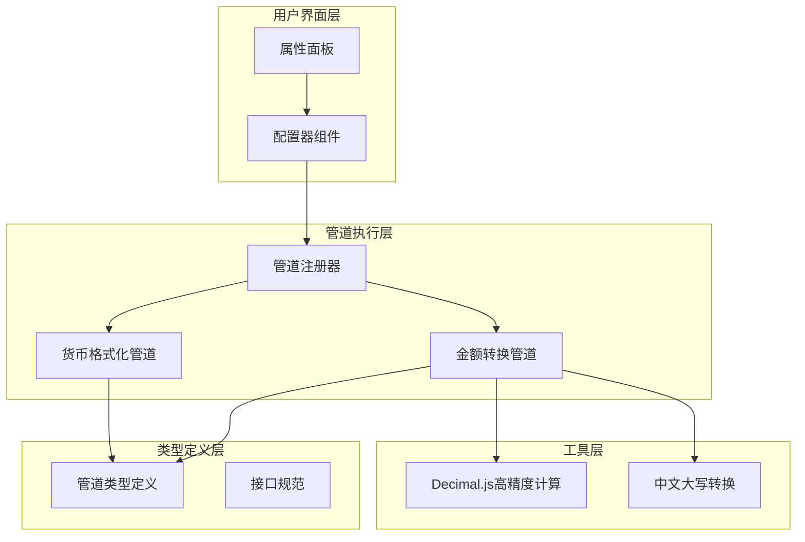
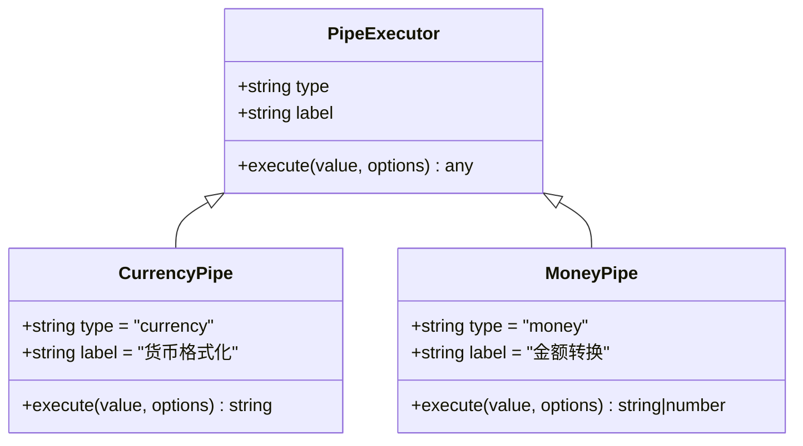
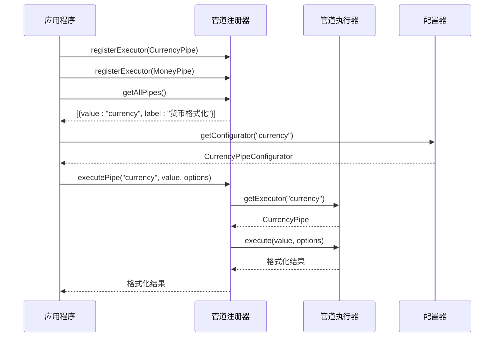
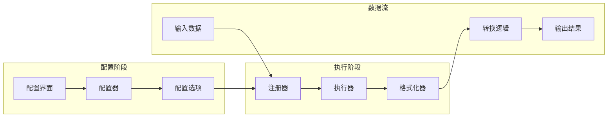
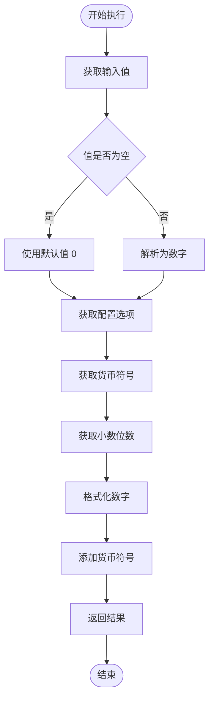
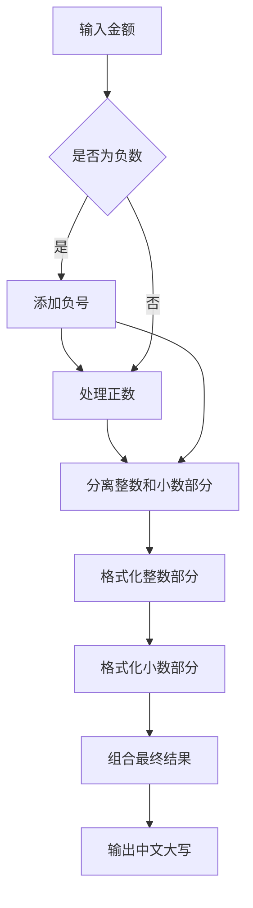
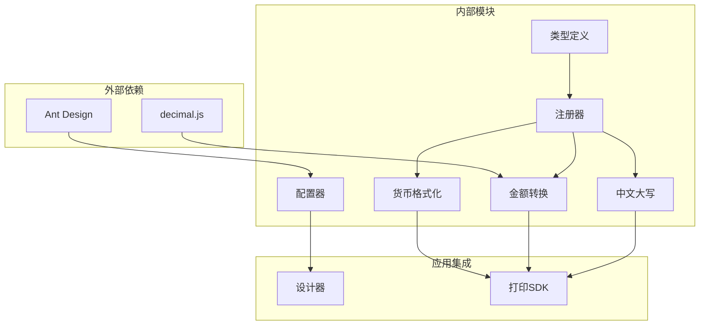

# 货币格式化管道

<cite>
**本文档引用的文件**
- [CurrencyPipe.ts](file://sdk/src/pipes/executors/CurrencyPipe.ts)
- [CurrencyPipeConfigurator.tsx](file://designer/src/pipes/configurators/CurrencyPipeConfigurator.tsx)
- [MoneyPipe.ts](file://sdk/src/pipes/executors/MoneyPipe.ts)
- [MoneyPipeConfigurator.tsx](file://designer/src/pipes/configurators/MoneyPipeConfigurator.tsx)
- [registry.ts](file://sdk/src/pipes/registry.ts)
- [types.ts](file://sdk/src/pipes/types.ts)
- [index.ts](file://sdk/src/pipes/index.ts)
- [ChineseNumberPipe.ts](file://sdk/src/pipes/executors/ChineseNumberPipe.ts)
</cite>

## 目录
1. [简介](#简介)
2. [项目结构](#项目结构)
3. [核心组件](#核心组件)
4. [架构概览](#架构概览)
5. [详细组件分析](#详细组件分析)
6. [依赖关系分析](#依赖关系分析)
7. [性能考虑](#性能考虑)
8. [故障排除指南](#故障排除指南)
9. [结论](#结论)
10. [附录](#附录)

## 简介

货币格式化管道是打印设计系统中的重要数据处理组件，负责将原始数值转换为符合业务需求的货币格式。该系统提供了两种主要的货币格式化能力：

- **基础货币格式化**：支持自定义货币符号、小数位数控制和简单数值格式化
- **高级金额转换**：基于decimal.js实现精确计算，支持分元转换、千分位分隔、中文大写等功能

系统设计遵循模块化原则，通过管道执行器和配置器的分离，实现了高度的可扩展性和易用性。

## 项目结构

货币格式化管道系统采用分层架构设计，主要包含以下层次：

**图表来源**
- [registry.ts:1-64](file://sdk/src/pipes/registry.ts#L1-L64)
- [CurrencyPipe.ts:1-17](file://sdk/src/pipes/executors/CurrencyPipe.ts#L1-L17)
- [MoneyPipe.ts:1-130](file://sdk/src/pipes/executors/MoneyPipe.ts#L1-L130)

**章节来源**
- [index.ts:1-9](file://sdk/src/pipes/index.ts#L1-L9)
- [types.ts:1-29](file://sdk/src/pipes/types.ts#L1-L29)

## 核心组件

### 管道执行器接口

所有管道执行器都遵循统一的接口规范，确保系统的可扩展性和一致性：

**图表来源**
- [types.ts:11-29](file://sdk/src/pipes/types.ts#L11-L29)
- [CurrencyPipe.ts:7-16](file://sdk/src/pipes/executors/CurrencyPipe.ts#L7-L16)
- [MoneyPipe.ts:59-129](file://sdk/src/pipes/executors/MoneyPipe.ts#L59-L129)

### 管道注册器

管道注册器负责管理所有可用的管道执行器，提供统一的访问接口：

**图表来源**
- [registry.ts:45-52](file://sdk/src/pipes/registry.ts#L45-L52)
- [registry.ts:56-64](file://sdk/src/pipes/registry.ts#L56-L64)

**章节来源**
- [registry.ts:1-64](file://sdk/src/pipes/registry.ts#L1-L64)

## 架构概览

货币格式化管道系统采用插件化架构，支持动态注册和扩展：

**图表来源**
- [CurrencyPipeConfigurator.tsx:9-22](file://designer/src/pipes/configurators/CurrencyPipeConfigurator.tsx#L9-L22)
- [MoneyPipeConfigurator.tsx:9-143](file://designer/src/pipes/configurators/MoneyPipeConfigurator.tsx#L9-L143)
- [registry.ts:45-52](file://sdk/src/pipes/registry.ts#L45-L52)

## 详细组件分析

### 基础货币格式化管道

基础货币格式化管道提供简单的货币符号添加和小数位控制功能：

#### 核心功能特性

| 特性 | 默认值 | 描述 |
|------|--------|------|
| 货币符号 | ¥ | 支持任意Unicode货币符号 |
| 小数位数 | 2 | 可配置的小数位数 |
| 数值处理 | 0 | 空值自动转换为0 |

#### 执行流程

**图表来源**
- [CurrencyPipe.ts:11-15](file://sdk/src/pipes/executors/CurrencyPipe.ts#L11-L15)

#### 配置选项

| 选项名 | 类型 | 默认值 | 描述 |
|--------|------|--------|------|
| symbol | string | ¥ | 货币符号 |
| precision | number | 2 | 小数位数 |

**章节来源**
- [CurrencyPipe.ts:1-17](file://sdk/src/pipes/executors/CurrencyPipe.ts#L1-L17)
- [CurrencyPipeConfigurator.tsx:12-21](file://designer/src/pipes/configurators/CurrencyPipeConfigurator.tsx#L12-L21)

### 高级金额转换管道

高级金额转换管道基于decimal.js实现高精度计算，提供完整的金额处理功能：

#### 主要功能

1. **精确数值计算**：使用decimal.js避免浮点数精度问题
2. **多种转换模式**：支持分转元、元转分、不转换
3. **灵活格式化**：支持数字格式和中文大写格式
4. **国际化支持**：可配置货币符号和千分位分隔

#### 转换模式对比

| 模式 | 输入示例 | 输出示例 | 用途场景 |
|------|----------|----------|----------|
| fenToYuan | 1234 | 12.34 | 分单位金额转元单位 |
| yuanToFen | 12.34 | 1234 | 元单位金额转分单位 |
| none | 12.34 | 12.34 | 仅格式化不转换 |

#### 中文大写转换算法

**图表来源**
- [MoneyPipe.ts:18-57](file://sdk/src/pipes/executors/MoneyPipe.ts#L18-L57)

#### 配置选项详解

| 选项名 | 类型 | 默认值 | 描述 |
|--------|------|--------|------|
| mode | string | fenToYuan | 转换模式 |
| format | string | number | 输出格式 |
| precision | number | 2 | 小数位数 |
| symbol | string | 空 | 货币符号 |
| separator | boolean | false | 千分位分隔 |
| uppercaseMode | string | uppercase | 中文大写模式 |

**章节来源**
- [MoneyPipe.ts:63-129](file://sdk/src/pipes/executors/MoneyPipe.ts#L63-L129)
- [MoneyPipeConfigurator.tsx:12-142](file://designer/src/pipes/configurators/MoneyPipeConfigurator.tsx#L12-L142)

### 中文大写数字转换

中文大写数字转换管道提供会计规范的中文金额表示：

#### 转换规则

| 数值范围 | 中文表示 | 示例 |
|----------|----------|------|
| 0-9 | 零壹贰叁肆伍陆柒捌玖 | 5 → 伍 |
| 10-90 | 拾佰仟 | 20 → 贰拾 |
| 100-900 | 佰 | 300 → 叁佰 |
| 1000-9000 | 仟 | 4000 → 肆仟 |
| 10000-99999999 | 万 | 50000 → 伍万 |

#### 输出格式

| 模式 | 输出示例 | 说明 |
|------|----------|------|
| uppercase | 壹仟贰佰叁拾肆元伍角陆分整 | 仅中文大写 |
| both | 1234.56（壹仟贰佰叁拾肆元伍角陆分整） | 原值+中文大写 |

**章节来源**
- [ChineseNumberPipe.ts:17-62](file://sdk/src/pipes/executors/ChineseNumberPipe.ts#L17-L62)
- [MoneyPipe.ts:96-110](file://sdk/src/pipes/executors/MoneyPipe.ts#L96-L110)

## 依赖关系分析

货币格式化管道系统具有清晰的依赖层次结构：

**图表来源**
- [MoneyPipe.ts:6](file://sdk/src/pipes/executors/MoneyPipe.ts#L6)
- [registry.ts:7](file://sdk/src/pipes/registry.ts#L7)

### 关键依赖关系

1. **decimal.js依赖**：用于高精度数值计算，避免浮点数精度问题
2. **Ant Design依赖**：提供用户友好的配置界面组件
3. **类型系统依赖**：确保编译时类型安全

**章节来源**
- [registry.ts:6](file://sdk/src/pipes/registry.ts#L6)
- [registry.ts:7](file://sdk/src/pipes/registry.ts#L7)

## 性能考虑

### 计算复杂度分析

| 操作类型 | 时间复杂度 | 空间复杂度 | 说明 |
|----------|------------|------------|------|
| 基础格式化 | O(1) | O(1) | 字符串拼接操作 |
| 高精度计算 | O(1) | O(n) | decimal.js内部实现 |
| 中文大写转换 | O(d) | O(d) | d为数字位数 |
| 千分位分隔 | O(n) | O(n) | n为数字长度 |

### 优化策略

1. **缓存机制**：对常用格式化结果进行缓存
2. **延迟计算**：在用户交互时才执行格式化
3. **批量处理**：对大量数据进行批处理优化

## 故障排除指南

### 常见问题及解决方案

#### 数值格式化异常

**问题描述**：输入非数值类型导致格式化失败

**解决方案**：
1. 使用try-catch捕获异常
2. 提供默认值回退机制
3. 在UI层面进行输入验证

#### 浮点数精度问题

**问题描述**：JavaScript浮点数运算导致精度丢失

**解决方案**：
1. 使用decimal.js进行高精度计算
2. 在MoneyPipe中统一使用Decimal对象
3. 避免直接使用parseFloat或parseInt

#### 中文大写转换错误

**问题描述**：特殊数值（如0、负数）处理不当

**解决方案**：
1. 在toChineseMoneyUppercase函数中添加边界检查
2. 对负数情况进行特殊处理
3. 确保零值的正确表示

**章节来源**
- [MoneyPipe.ts:124-127](file://sdk/src/pipes/executors/MoneyPipe.ts#L124-L127)
- [ChineseNumberPipe.ts:103-136](file://sdk/src/pipes/executors/ChineseNumberPipe.ts#L103-L136)

## 结论

货币格式化管道系统通过模块化设计实现了功能的高内聚和低耦合。系统不仅满足了基本的货币格式化需求，还提供了高级的金额处理能力，包括精确计算、中文大写转换等专业功能。

### 主要优势

1. **模块化设计**：管道执行器和配置器分离，便于扩展和维护
2. **高精度计算**：基于decimal.js避免浮点数精度问题
3. **国际化支持**：灵活的货币符号和格式化配置
4. **用户体验**：直观的配置界面和实时预览

### 发展方向

1. **多币种支持**：扩展更多国际货币符号和格式标准
2. **本地化配置**：支持不同地区的货币显示习惯
3. **性能优化**：针对大数据量场景的性能优化
4. **插件生态**：建立第三方管道扩展机制

## 附录

### 配置选项完整列表

| 选项名 | 类型 | 默认值 | 描述 | 适用管道 |
|--------|------|--------|------|----------|
| symbol | string | ¥ | 货币符号 | currency, money | 
| precision | number | 2 | 小数位数 | money |
| mode | string | fenToYuan | 转换模式 | money |
| format | string | number | 输出格式 | money |
| separator | boolean | false | 千分位分隔 | money |
| uppercaseMode | string | uppercase | 中文大写模式 | money |
| unit | string | 空 | 单位后缀 | chineseNumber |
| defaultValue | string | 空 | 默认值 | default |

### 实际应用场景

1. **财务报表**：精确的金额格式化和中文大写转换
2. **电商系统**：商品价格的多币种显示
3. **银行应用**：账户余额和交易记录的格式化
4. **税务系统**：发票和收据的金额标准化