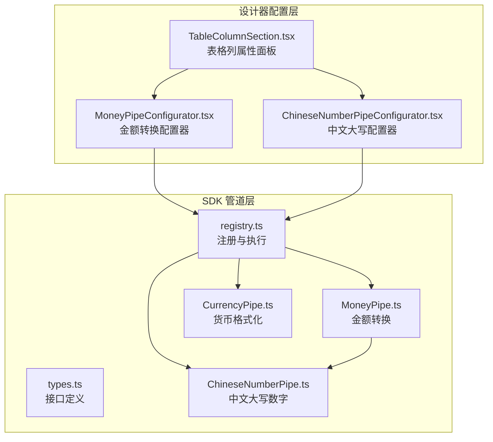
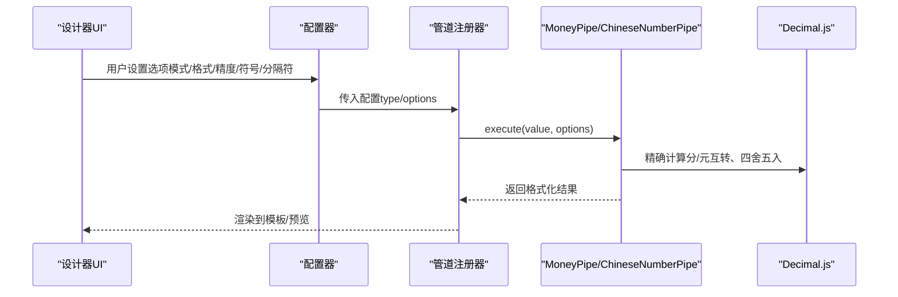
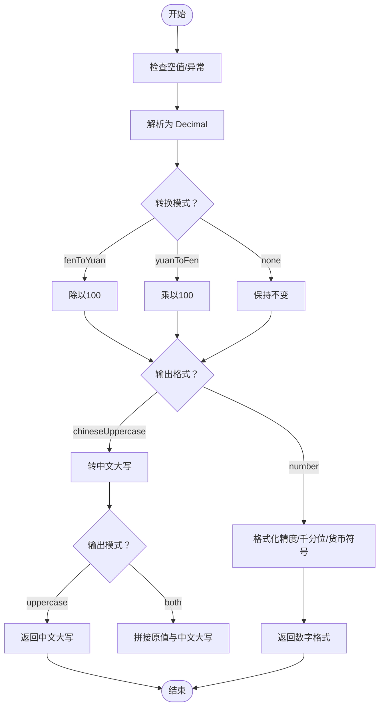
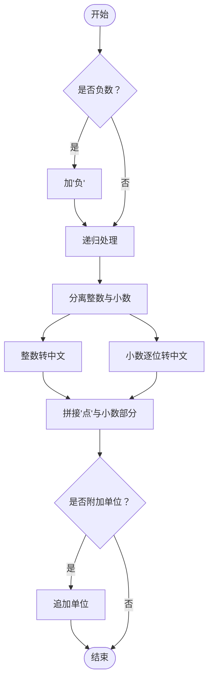
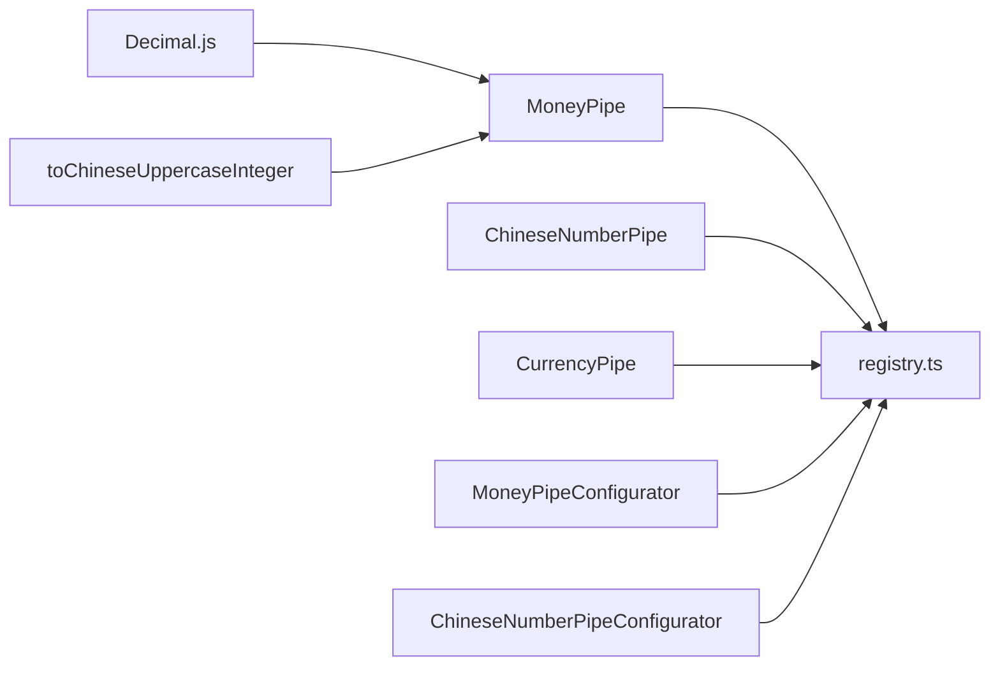

# 金额转换管道

<cite>
**本文引用的文件**
- [MoneyPipe.ts](file://sdk/src/pipes/executors/MoneyPipe.ts)
- [ChineseNumberPipe.ts](file://sdk/src/pipes/executors/ChineseNumberPipe.ts)
- [CurrencyPipe.ts](file://sdk/src/pipes/executors/CurrencyPipe.ts)
- [registry.ts](file://sdk/src/pipes/registry.ts)
- [types.ts](file://sdk/src/pipes/types.ts)
- [MoneyPipeConfigurator.tsx](file://designer/src/pipes/configurators/MoneyPipeConfigurator.tsx)
- [ChineseNumberPipeConfigurator.tsx](file://designer/src/pipes/configurators/ChineseNumberPipePipeConfigurator.tsx)
- [TableColumnSection.tsx](file://designer/src/pages/Designer/components/PropertyPanel/TableColumnSection.tsx)
</cite>

## 目录
1. [简介](#简介)
2. [项目结构](#项目结构)
3. [核心组件](#核心组件)
4. [架构总览](#架构总览)
5. [详细组件分析](#详细组件分析)
6. [依赖关系分析](#依赖关系分析)
7. [性能考量](#性能考量)
8. [故障排查指南](#故障排查指南)
9. [结论](#结论)
10. [附录](#附录)

## 简介
本技术指南围绕“金额转换管道”展开，系统讲解分与元之间的转换逻辑、精确计算与精度处理、千分位格式化与自定义分隔符支持、以及中文大写金额的转换算法与规则。同时给出中文大写数字对照表与转换示例，并结合业务场景与合规性进行说明，帮助开发者在设计器与打印引擎中正确使用该能力。

## 项目结构
金额转换能力由 SDK 管道系统提供，前端设计器通过配置器可视化配置，最终在渲染阶段调用执行器完成格式化与转换。

图表来源
- [registry.ts:54-65](file://sdk/src/pipes/registry.ts#L54-L65)
- [MoneyPipe.ts:59-129](file://sdk/src/pipes/executors/MoneyPipe.ts#L59-L129)
- [ChineseNumberPipe.ts:99-137](file://sdk/src/pipes/executors/ChineseNumberPipe.ts#L99-L137)
- [CurrencyPipe.ts:7-16](file://sdk/src/pipes/executors/CurrencyPipe.ts#L7-L16)
- [MoneyPipeConfigurator.tsx:9-142](file://designer/src/pipes/configurators/MoneyPipeConfigurator.tsx#L9-L142)
- [ChineseNumberPipeConfigurator.tsx:11-57](file://designer/src/pipes/configurators/ChineseNumberPipeConfigurator.tsx#L11-L57)
- [TableColumnSection.tsx:391-398](file://designer/src/pages/Designer/components/PropertyPanel/TableColumnSection.tsx#L391-L398)

章节来源
- [registry.ts:1-65](file://sdk/src/pipes/registry.ts#L1-L65)
- [MoneyPipe.ts:1-130](file://sdk/src/pipes/executors/MoneyPipe.ts#L1-L130)
- [ChineseNumberPipe.ts:1-138](file://sdk/src/pipes/executors/ChineseNumberPipe.ts#L1-L138)
- [CurrencyPipe.ts:1-17](file://sdk/src/pipes/executors/CurrencyPipe.ts#L1-L17)
- [MoneyPipeConfigurator.tsx:1-143](file://designer/src/pipes/configurators/MoneyPipeConfigurator.tsx#L1-L143)
- [ChineseNumberPipeConfigurator.tsx:1-58](file://designer/src/pipes/configurators/ChineseNumberPipeConfigurator.tsx#L1-L58)
- [TableColumnSection.tsx:383-413](file://designer/src/pages/Designer/components/PropertyPanel/TableColumnSection.tsx#L383-L413)

## 核心组件
- 金额转换管道（MoneyPipe）：支持分转元、元转分、数字格式化（精度、千分位、货币符号）、中文大写金额（含“整”字规则与角分处理）。
- 中文大写数字管道（ChineseNumberPipe）：支持整数与小数的中文大写转换，整数部分按“亿/万/个”分组与“拾/佰/仟”组合，小数部分逐位读出。
- 货币格式化管道（CurrencyPipe）：快速输出带货币符号与固定精度的数字格式。
- 管道注册与执行（registry.ts）：统一注册内置管道，提供执行入口。
- 配置器（MoneyPipeConfigurator、ChineseNumberPipeConfigurator）：在设计器中可视化配置金额转换与中文大写选项。
- 使用入口（TableColumnSection）：在表格列属性面板中选择并应用金额转换管道。

章节来源
- [MoneyPipe.ts:59-129](file://sdk/src/pipes/executors/MoneyPipe.ts#L59-L129)
- [ChineseNumberPipe.ts:99-137](file://sdk/src/pipes/executors/ChineseNumberPipe.ts#L99-L137)
- [CurrencyPipe.ts:7-16](file://sdk/src/pipes/executors/CurrencyPipe.ts#L7-L16)
- [registry.ts:44-65](file://sdk/src/pipes/registry.ts#L44-L65)
- [MoneyPipeConfigurator.tsx:9-142](file://designer/src/pipes/configurators/MoneyPipeConfigurator.tsx#L9-L142)
- [ChineseNumberPipeConfigurator.tsx:11-57](file://designer/src/pipes/configurators/ChineseNumberPipeConfigurator.tsx#L11-L57)
- [TableColumnSection.tsx:391-398](file://designer/src/pages/Designer/components/PropertyPanel/TableColumnSection.tsx#L391-L398)

## 架构总览
金额转换在运行时的调用链路如下：

图表来源
- [registry.ts:44-52](file://sdk/src/pipes/registry.ts#L44-L52)
- [MoneyPipe.ts:63-129](file://sdk/src/pipes/executors/MoneyPipe.ts#L63-L129)
- [ChineseNumberPipe.ts:103-137](file://sdk/src/pipes/executors/ChineseNumberPipe.ts#L103-L137)

## 详细组件分析

### 金额转换管道（MoneyPipe）
- 功能要点
  - 分/元互转：分转元除以100，元转分乘以100；使用高精度 Decimal 避免浮点误差。
  - 数字格式化：支持小数精度、千分位分隔、货币符号。
  - 中文大写：遵循会计规范，输出“元、角、分、整”，并处理“零”与“整”的边界情况。
  - 双模式输出：可仅输出中文大写，或与原数值拼接（自定义连接符或默认括号）。
- 关键流程

图表来源
- [MoneyPipe.ts:63-129](file://sdk/src/pipes/executors/MoneyPipe.ts#L63-L129)

章节来源
- [MoneyPipe.ts:18-57](file://sdk/src/pipes/executors/MoneyPipe.ts#L18-L57)
- [MoneyPipe.ts:63-129](file://sdk/src/pipes/executors/MoneyPipe.ts#L63-L129)

### 中文大写数字管道（ChineseNumberPipe）
- 功能要点
  - 整数部分：按“亿/万/个”分组，每组内按“拾/佰/仟”组合，自动插入“零”。
  - 小数部分：逐位读出中文数字，中间加“点”。
  - 支持负数与负号输出。
  - 可选“原值+大写”模式与自定义连接符。
- 关键流程

图表来源
- [ChineseNumberPipe.ts:70-97](file://sdk/src/pipes/executors/ChineseNumberPipe.ts#L70-L97)
- [ChineseNumberPipe.ts:17-62](file://sdk/src/pipes/executors/ChineseNumberPipe.ts#L17-L62)

章节来源
- [ChineseNumberPipe.ts:17-62](file://sdk/src/pipes/executors/ChineseNumberPipe.ts#L17-L62)
- [ChineseNumberPipe.ts:70-97](file://sdk/src/pipes/executors/ChineseNumberPipe.ts#L70-L97)
- [ChineseNumberPipe.ts:103-137](file://sdk/src/pipes/executors/ChineseNumberPipe.ts#L103-L137)

### 货币格式化管道（CurrencyPipe）
- 功能要点
  - 快速输出带货币符号与固定精度的数字格式。
  - 默认货币符号与精度可通过选项配置。
- 使用建议
  - 适用于简单场景；复杂金额（含中文大写、分/元转换）请使用 MoneyPipe。

章节来源
- [CurrencyPipe.ts:7-16](file://sdk/src/pipes/executors/CurrencyPipe.ts#L7-L16)

### 管道注册与执行（registry.ts）
- 功能要点
  - 统一注册内置管道（含 MoneyPipe、ChineseNumberPipe、CurrencyPipe 等）。
  - 提供执行入口 executePipe，按类型查找执行器并执行。
- 设计意义
  - 解耦配置与执行，便于扩展新管道。

章节来源
- [registry.ts:12-26](file://sdk/src/pipes/registry.ts#L12-L26)
- [registry.ts:44-52](file://sdk/src/pipes/registry.ts#L44-L52)
- [registry.ts:56-65](file://sdk/src/pipes/registry.ts#L56-L65)

### 配置器（MoneyPipeConfigurator、ChineseNumberPipeConfigurator）
- 功能要点
  - 金额转换配置器：输出格式（数字/中文大写）、转换模式（分→元/元→分/不转换）、小数精度、货币符号、千分位分隔、中文大写双模式与连接符。
  - 中文大写配置器：输出模式（仅大写/原值+大写）、连接符、后缀单位。
- 交互设计
  - 在表格列属性面板中选择管道类型并配置，实时生效于预览。

章节来源
- [MoneyPipeConfigurator.tsx:9-142](file://designer/src/pipes/configurators/MoneyPipeConfigurator.tsx#L9-L142)
- [ChineseNumberPipeConfigurator.tsx:11-57](file://designer/src/pipes/configurators/ChineseNumberPipeConfigurator.tsx#L11-L57)
- [TableColumnSection.tsx:391-398](file://designer/src/pages/Designer/components/PropertyPanel/TableColumnSection.tsx#L391-L398)

## 依赖关系分析
- MoneyPipe 依赖 Decimal.js 进行高精度计算，并复用 ChineseNumberPipe 的整数中文大写能力。
- ChineseNumberPipe 为纯数学与字符串处理，不依赖外部库。
- registry.ts 统一注册与执行，避免各处直接导入执行器，降低耦合。
- 设计器配置器通过 getAllPipes 拉取可用管道列表，保证 UI 与实现一致。

图表来源
- [MoneyPipe.ts:6-8](file://sdk/src/pipes/executors/MoneyPipe.ts#L6-L8)
- [registry.ts:56-65](file://sdk/src/pipes/registry.ts#L56-L65)

章节来源
- [MoneyPipe.ts:6-8](file://sdk/src/pipes/executors/MoneyPipe.ts#L6-L8)
- [registry.ts:56-65](file://sdk/src/pipes/registry.ts#L56-L65)

## 性能考量
- 精度与开销
  - Decimal.js 提供高精度运算，适合金融场景，但相较原生 Number 有一定开销。建议在需要严格精度的金额转换中使用。
- 正则与字符串处理
  - 千分位分隔使用正则替换，复杂度 O(n)，对长串数字影响有限。
- 复杂度总结
  - MoneyPipe 主要瓶颈在 Decimal 运算与字符串拼接；ChineseNumberPipe 在长整数时字符串构建可能成为关注点。
- 优化建议
  - 对超大金额（超过亿级）的中文大写，可考虑缓存中间结果或限制长度。
  - 合理设置精度，避免不必要的小数位导致字符串过长。

## 故障排查指南
- 常见问题
  - 输入为空或非数字：返回空字符串或原值，避免抛错。
  - 转换异常：捕获错误并回退为原始字符串，保证稳定性。
  - 中文大写“零”缺失：确保元>0 且角=0 时补“零”。
  - “整”字误判：仅当角分均为 0 且元>0 时输出“整”。
- 排查步骤
  - 检查输入类型与空值处理。
  - 核对转换模式与精度设置。
  - 确认千分位与货币符号是否冲突。
  - 验证中文大写模式与连接符配置。

章节来源
- [MoneyPipe.ts:63-129](file://sdk/src/pipes/executors/MoneyPipe.ts#L63-L129)
- [ChineseNumberPipe.ts:103-137](file://sdk/src/pipes/executors/ChineseNumberPipe.ts#L103-L137)

## 结论
金额转换管道通过高精度 Decimal 计算与严谨的中文大写规则，满足金融与票据场景的精确与合规需求。配合设计器配置器，用户可灵活选择输出格式、转换模式与展示样式，快速应用于各类打印模板与报表场景。

## 附录

### 中文大写数字对照表
- 零、壹、贰、叁、肆、伍、陆、柒、捌、玖
- 拾、佰、仟
- 万、亿

章节来源
- [ChineseNumberPipe.ts:8-10](file://sdk/src/pipes/executors/ChineseNumberPipe.ts#L8-L10)

### 中文大写金额转换规则摘要
- 元、角、分、整：角分缺省时按会计规范输出；元>0 且角=0 时分前补“零”。
- 负数：统一加“负”字。
- 整数分组：按“亿/万/个”分组，组内按“拾/佰/仟”组合，必要时插入“零”。

章节来源
- [MoneyPipe.ts:18-57](file://sdk/src/pipes/executors/MoneyPipe.ts#L18-L57)
- [ChineseNumberPipe.ts:17-62](file://sdk/src/pipes/executors/ChineseNumberPipe.ts#L17-L62)

### 业务场景与合规性
- 场景建议
  - 发票/收据：优先使用中文大写金额，避免篡改风险。
  - 报表/导出：根据受众选择数字格式或中文大写。
  - 国际化：若涉及外币，结合 CurrencyPipe 设置符号与精度。
- 合规提示
  - 严格控制精度，避免四舍五入偏差。
  - 中文大写“整”仅在角分全为 0 时出现。
  - 负金额需明确标注“负”字，符合会计规范。