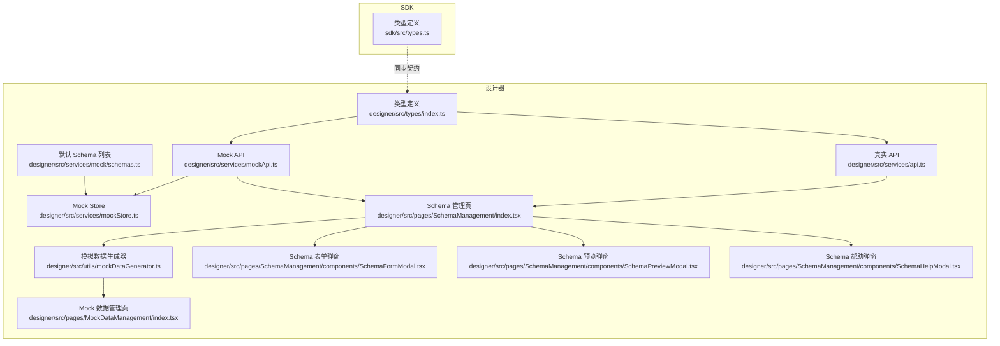
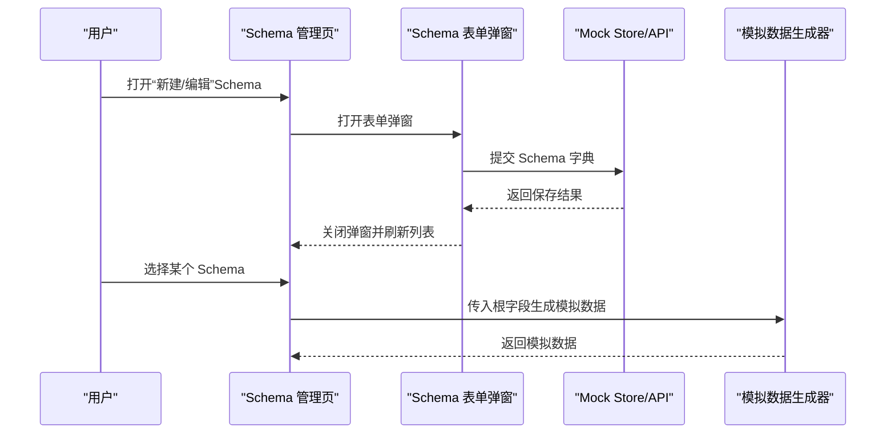
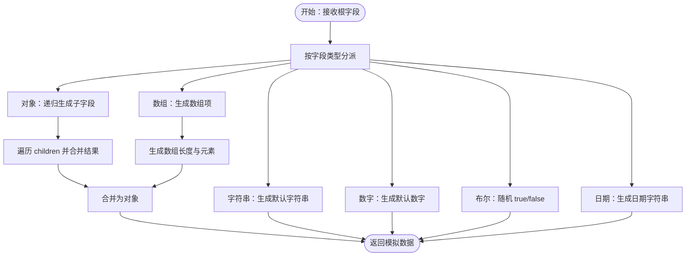
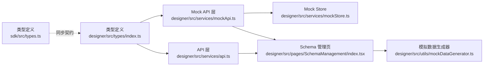

# Schema 字典定义

<cite>
**本文引用的文件**
- [designer/src/types/index.ts](file://designer/src/types/index.ts)
- [sdk/src/types.ts](file://sdk/src/types.ts)
- [designer/src/services/api.ts](file://designer/src/services/api.ts)
- [designer/src/services/mockApi.ts](file://designer/src/services/mockApi.ts)
- [designer/src/services/mockStore.ts](file://designer/src/services/mockStore.ts)
- [designer/src/services/mock/schemas.ts](file://designer/src/services/mock/schemas.ts)
- [designer/src/utils/mockDataGenerator.ts](file://designer/src/utils/mockDataGenerator.ts)
- [designer/src/pages/SchemaManagement/index.tsx](file://designer/src/pages/SchemaManagement/index.tsx)
- [designer/src/pages/SchemaManagement/components/SchemaFormModal.tsx](file://designer/src/pages/SchemaManagement/components/SchemaFormModal.tsx)
- [designer/src/pages/SchemaManagement/components/SchemaPreviewModal.tsx](file://designer/src/pages/SchemaManagement/components/SchemaPreviewModal.tsx)
- [designer/src/pages/SchemaManagement/components/SchemaHelpModal.tsx](file://designer/src/pages/SchemaManagement/components/SchemaHelpModal.tsx)
- [designer/src/pages/MockDataManagement/index.tsx](file://designer/src/pages/MockDataManagement/index.tsx)
</cite>

## 目录
1. [引言](#引言)
2. [项目结构](#项目结构)
3. [核心组件](#核心组件)
4. [架构总览](#架构总览)
5. [详细组件分析](#详细组件分析)
6. [依赖关系分析](#依赖关系分析)
7. [性能考虑](#性能考虑)
8. [故障排查指南](#故障排查指南)
9. [结论](#结论)
10. [附录](#附录)

## 引言
本文件围绕“Schema 字典定义”展开，系统阐述其设计理念与工作机制，覆盖以下要点：
- 设计目标：通过统一的 Schema 字典描述业务数据结构，支撑模板设计、数据绑定、预览渲染与模拟数据生成。
- 关键对象：SchemaFieldType（数据类型）、SchemaField（字段定义）、SchemaDictionary（字典整体结构）。
- 使用场景：在设计器中进行字段级配置、枚举与格式化设置；在 SDK 中进行打印渲染时的数据校验与转换。

## 项目结构
Schema 相关能力横跨前端设计器与 SDK 两部分：
- 类型定义：位于设计器与 SDK 的类型文件中，保持一致的接口契约。
- 服务层：提供 Schema 的增删改查 API，包含真实 API 与 Mock 实现。
- 工具层：提供基于 Schema 的模拟数据生成器。
- 页面与组件：Schema 管理页面、表单弹窗、预览弹窗与帮助弹窗。
- 默认示例：提供默认 Schema 列表，便于快速体验。

图表来源
- [designer/src/types/index.ts:1-52](file://designer/src/types/index.ts#L1-L52)
- [sdk/src/types.ts:1-28](file://sdk/src/types.ts#L1-L28)
- [designer/src/services/api.ts:1-60](file://designer/src/services/api.ts#L1-L60)
- [designer/src/services/mockApi.ts:1-40](file://designer/src/services/mockApi.ts#L1-L40)
- [designer/src/services/mockStore.ts:1-55](file://designer/src/services/mockStore.ts#L1-L55)
- [designer/src/utils/mockDataGenerator.ts:1-120](file://designer/src/utils/mockDataGenerator.ts#L1-L120)
- [designer/src/pages/SchemaManagement/index.tsx:1-39](file://designer/src/pages/SchemaManagement/index.tsx#L1-L39)
- [designer/src/pages/SchemaManagement/components/SchemaFormModal.tsx:1-200](file://designer/src/pages/SchemaManagement/components/SchemaFormModal.tsx#L1-L200)
- [designer/src/pages/SchemaManagement/components/SchemaPreviewModal.tsx:1-200](file://designer/src/pages/SchemaManagement/components/SchemaPreviewModal.tsx#L1-L200)
- [designer/src/pages/SchemaManagement/components/SchemaHelpModal.tsx:1-200](file://designer/src/pages/SchemaManagement/components/SchemaHelpModal.tsx#L1-L200)
- [designer/src/pages/MockDataManagement/index.tsx:1-120](file://designer/src/pages/MockDataManagement/index.tsx#L1-L120)
- [designer/src/services/mock/schemas.ts:1-200](file://designer/src/services/mock/schemas.ts#L1-L200)

章节来源
- [designer/src/types/index.ts:1-52](file://designer/src/types/index.ts#L1-L52)
- [sdk/src/types.ts:1-28](file://sdk/src/types.ts#L1-L28)
- [designer/src/services/api.ts:1-60](file://designer/src/services/api.ts#L1-L60)
- [designer/src/services/mockApi.ts:1-40](file://designer/src/services/mockApi.ts#L1-L40)
- [designer/src/services/mockStore.ts:1-55](file://designer/src/services/mockStore.ts#L1-L55)
- [designer/src/utils/mockDataGenerator.ts:1-120](file://designer/src/utils/mockDataGenerator.ts#L1-L120)
- [designer/src/pages/SchemaManagement/index.tsx:1-39](file://designer/src/pages/SchemaManagement/index.tsx#L1-L39)
- [designer/src/pages/SchemaManagement/components/SchemaFormModal.tsx:1-200](file://designer/src/pages/SchemaManagement/components/SchemaFormModal.tsx#L1-L200)
- [designer/src/pages/SchemaManagement/components/SchemaPreviewModal.tsx:1-200](file://designer/src/pages/SchemaManagement/components/SchemaPreviewModal.tsx#L1-L200)
- [designer/src/pages/SchemaManagement/components/SchemaHelpModal.tsx:1-200](file://designer/src/pages/SchemaManagement/components/SchemaHelpModal.tsx#L1-L200)
- [designer/src/pages/MockDataManagement/index.tsx:1-120](file://designer/src/pages/MockDataManagement/index.tsx#L1-L120)
- [designer/src/services/mock/schemas.ts:1-200](file://designer/src/services/mock/schemas.ts#L1-L200)

## 核心组件
- SchemaFieldType：定义支持的数据类型集合，涵盖字符串、数字、布尔、日期、日期时间、对象、数组。
- SchemaField：描述单个字段，包含键名、标签、类型、可选描述、子字段（用于对象/数组）、枚举选项、格式化类型。
- SchemaDictionary：描述完整的数据模型，包含唯一标识、名称、根类型（object|array）、根字段、版本与描述。

章节来源
- [designer/src/types/index.ts:5-12](file://designer/src/types/index.ts#L5-L12)
- [designer/src/types/index.ts:18-33](file://designer/src/types/index.ts#L18-L33)
- [designer/src/types/index.ts:39-52](file://designer/src/types/index.ts#L39-L52)
- [sdk/src/types.ts:2-9](file://sdk/src/types.ts#L2-L9)
- [sdk/src/types.ts:11-19](file://sdk/src/types.ts#L11-L19)
- [sdk/src/types.ts:21-28](file://sdk/src/types.ts#L21-L28)

## 架构总览
Schema 的端到端流程如下：
- 定义：在设计器中通过 Schema 表单弹窗构建 SchemaDictionary。
- 存储：通过 API 或 Mock Store 持久化 Schema。
- 使用：在 Mock 数据管理页选择 Schema，生成模拟数据；在模板渲染时按 Schema 进行数据绑定与格式化。

图表来源
- [designer/src/pages/SchemaManagement/index.tsx:1-39](file://designer/src/pages/SchemaManagement/index.tsx#L1-L39)
- [designer/src/pages/SchemaManagement/components/SchemaFormModal.tsx:1-200](file://designer/src/pages/SchemaManagement/components/SchemaFormModal.tsx#L1-L200)
- [designer/src/services/mockStore.ts:1-55](file://designer/src/services/mockStore.ts#L1-L55)
- [designer/src/services/api.ts:1-60](file://designer/src/services/api.ts#L1-L60)
- [designer/src/utils/mockDataGenerator.ts:1-120](file://designer/src/utils/mockDataGenerator.ts#L1-L120)

## 详细组件分析

### SchemaFieldType（数据类型）
- 覆盖范围：string、number、boolean、date、datetime、object、array。
- 作用：作为 SchemaField 的 type 字段取值，决定字段的语义与后续处理逻辑（如枚举、格式化、递归子字段）。

章节来源
- [designer/src/types/index.ts:5-12](file://designer/src/types/index.ts#L5-L12)
- [sdk/src/types.ts:2-9](file://sdk/src/types.ts#L2-L9)

### SchemaField（字段定义）
- 关键属性与职责：
  - key：字段键名，用于数据访问与绑定。
  - label：显示名称，用于界面呈现。
  - type：数据类型，与 SchemaFieldType 对应。
  - description：可选描述，辅助理解字段用途。
  - children：当 type 为 object|array 时，用于声明子字段树。
  - enum：当 type 为 string|number 时，提供枚举选项（value/label）。
  - format：可选格式化类型，如 date、datetime、money、percent，用于渲染与展示优化。
- 设计要点：
  - children 与 type 的一致性：object 类型必须提供 children；array 类型通常需要指定其元素的子结构（可通过 children 指向元素的 SchemaField）。
  - enum 与 format 的组合：枚举值可配合 format 实现更友好的展示（例如 money/percent）。
  - description 与 label：建议同时提供，提升可维护性与可读性。

章节来源
- [designer/src/types/index.ts:18-33](file://designer/src/types/index.ts#L18-L33)
- [sdk/src/types.ts:11-19](file://sdk/src/types.ts#L11-L19)

### SchemaDictionary（字典整体结构）
- 关键字段与职责：
  - id：唯一标识，用于存储与检索。
  - name：字典名称，便于识别与选择。
  - rootType：根类型，限定为 object 或 array。
  - root：根字段定义，即整个数据模型的顶层结构。
  - version：可选版本号，便于演进与回溯。
  - description：可选描述，用于说明用途或约束。
- 设计要点：
  - rootType 与 root 的一致性：rootType 决定渲染与数据生成策略；root 必须与之匹配。
  - 版本管理：建议在迭代中维护版本号，避免破坏性变更影响既有模板。

章节来源
- [designer/src/types/index.ts:39-52](file://designer/src/types/index.ts#L39-L52)
- [sdk/src/types.ts:21-28](file://sdk/src/types.ts#L21-L28)

### 模拟数据生成（基于 Schema）
- 入口函数：根据根字段生成模拟数据。
- 处理逻辑概览：
  - 根据字段类型分派到具体生成器。
  - 对于 object/array，递归调用子字段生成器。
  - 对于枚举字段，从 enum 选项中随机选取。
  - 对于日期类字段，生成符合格式的字符串。
- 最佳实践：
  - 在 children 中明确子字段结构，确保生成数据的完整性。
  - 为枚举字段提供清晰的 value/label 映射，便于渲染与调试。
  - 对于 money/percent 等格式化类型，建议在生成器中提供合理的默认值区间。

图表来源
- [designer/src/utils/mockDataGenerator.ts:1-120](file://designer/src/utils/mockDataGenerator.ts#L1-L120)

章节来源
- [designer/src/utils/mockDataGenerator.ts:1-120](file://designer/src/utils/mockDataGenerator.ts#L1-L120)

### Schema 管理页面与组件
- 页面职责：展示、新增、编辑、删除、预览、导入导出 Schema。
- 组件职责：
  - 表单弹窗：收集并提交 Schema 字典。
  - 预览弹窗：以可视化方式展示 Schema 结构。
  - 帮助弹窗：提供字段属性说明与最佳实践提示。
- 交互流程：打开弹窗 -> 填写表单 -> 提交 -> 成功后刷新列表 -> 可选预览。

章节来源
- [designer/src/pages/SchemaManagement/index.tsx:1-39](file://designer/src/pages/SchemaManagement/index.tsx#L1-L39)
- [designer/src/pages/SchemaManagement/components/SchemaFormModal.tsx:1-200](file://designer/src/pages/SchemaManagement/components/SchemaFormModal.tsx#L1-L200)
- [designer/src/pages/SchemaManagement/components/SchemaPreviewModal.tsx:1-200](file://designer/src/pages/SchemaManagement/components/SchemaPreviewModal.tsx#L1-L200)
- [designer/src/pages/SchemaManagement/components/SchemaHelpModal.tsx:1-200](file://designer/src/pages/SchemaManagement/components/SchemaHelpModal.tsx#L1-L200)

### API 与存储
- 真实 API：提供 list/get/create/update 等方法，供页面与工具调用。
- Mock API：在开发阶段替代真实 API，便于本地调试。
- Mock Store：在内存中维护 Schema 列表，提供 CRUD 能力。
- 默认 Schema：提供一组示例，便于快速上手。

章节来源
- [designer/src/services/api.ts:1-60](file://designer/src/services/api.ts#L1-L60)
- [designer/src/services/mockApi.ts:1-40](file://designer/src/services/mockApi.ts#L1-L40)
- [designer/src/services/mockStore.ts:1-55](file://designer/src/services/mockStore.ts#L1-L55)
- [designer/src/services/mock/schemas.ts:1-200](file://designer/src/services/mock/schemas.ts#L1-L200)

## 依赖关系分析
- 类型一致性：设计器与 SDK 的类型定义保持一致，确保契约稳定。
- 服务层解耦：页面通过 API 抽象与服务层交互，Mock 层便于开发与测试。
- 工具层复用：模拟数据生成器独立于 UI，可在不同模块复用。

图表来源
- [designer/src/types/index.ts:1-52](file://designer/src/types/index.ts#L1-L52)
- [sdk/src/types.ts:1-28](file://sdk/src/types.ts#L1-L28)
- [designer/src/services/api.ts:1-60](file://designer/src/services/api.ts#L1-L60)
- [designer/src/services/mockApi.ts:1-40](file://designer/src/services/mockApi.ts#L1-L40)
- [designer/src/services/mockStore.ts:1-55](file://designer/src/services/mockStore.ts#L1-L55)
- [designer/src/pages/SchemaManagement/index.tsx:1-39](file://designer/src/pages/SchemaManagement/index.tsx#L1-L39)
- [designer/src/utils/mockDataGenerator.ts:1-120](file://designer/src/utils/mockDataGenerator.ts#L1-L120)

章节来源
- [designer/src/types/index.ts:1-52](file://designer/src/types/index.ts#L1-L52)
- [sdk/src/types.ts:1-28](file://sdk/src/types.ts#L1-L28)
- [designer/src/services/api.ts:1-60](file://designer/src/services/api.ts#L1-L60)
- [designer/src/services/mockApi.ts:1-40](file://designer/src/services/mockApi.ts#L1-L40)
- [designer/src/services/mockStore.ts:1-55](file://designer/src/services/mockStore.ts#L1-L55)
- [designer/src/pages/SchemaManagement/index.tsx:1-39](file://designer/src/pages/SchemaManagement/index.tsx#L1-L39)
- [designer/src/utils/mockDataGenerator.ts:1-120](file://designer/src/utils/mockDataGenerator.ts#L1-L120)

## 性能考虑
- 生成复杂嵌套结构时，注意控制递归深度与数组长度，避免生成过大的模拟数据。
- 枚举值过多时，建议在 UI 中提供筛选或分页，减少渲染压力。
- 在 Mock Store 中缓存常用 Schema，减少重复解析与初始化成本。
- API 请求建议采用分页与条件过滤，避免一次性加载过多数据。

## 故障排查指南
- 字段类型不匹配：检查 SchemaField 的 type 与 children 是否一致（object/array 必须提供 children）。
- 枚举值缺失：当字段为枚举类型时，确认 enum 数组是否正确配置。
- 格式化异常：确认 format 设置与渲染组件是否匹配（如 money/percent/date/datetime）。
- 数据生成失败：核对 children 结构与默认值生成策略，必要时添加边界保护与日志输出。
- API 调用错误：检查请求参数与响应格式，确认 Mock 与真实 API 的差异。

章节来源
- [designer/src/types/index.ts:18-33](file://designer/src/types/index.ts#L18-L33)
- [designer/src/utils/mockDataGenerator.ts:1-120](file://designer/src/utils/mockDataGenerator.ts#L1-L120)
- [designer/src/services/api.ts:1-60](file://designer/src/services/api.ts#L1-L60)
- [designer/src/services/mockApi.ts:1-40](file://designer/src/services/mockApi.ts#L1-L40)

## 结论
Schema 字典通过标准化的类型体系与字段定义，为模板设计与数据绑定提供了清晰的契约。结合 Mock 数据生成与可视化管理组件，能够高效地完成复杂业务数据结构的建模与验证。建议在团队内统一字段命名规范、枚举值与格式化策略，并通过版本管理保障演进的稳定性。

## 附录

### 字段枚举值配置最佳实践
- 枚举项应具备明确的业务含义，value 与 label 应一一对应。
- 枚举数量不宜过多，建议分组或分页展示。
- 对于多语言场景，建议将 label 本地化处理。

章节来源
- [designer/src/types/index.ts:29-30](file://designer/src/types/index.ts#L29-L30)

### 格式化类型设置最佳实践
- money：适用于金额字段，建议配合数值范围与精度控制。
- percent：适用于百分比字段，建议限制取值范围并在 UI 中统一显示样式。
- date/datetime：建议统一日期格式，避免跨环境差异。
- 与渲染组件保持一致：确保 format 与渲染器约定相匹配。

章节来源
- [designer/src/types/index.ts:31-32](file://designer/src/types/index.ts#L31-L32)

### 实际定义示例（路径指引）
- 基础对象结构示例：参见默认 Schema 列表中的对象类型定义。
- 嵌套对象与数组示例：参见默认 Schema 列表中的复合结构定义。
- 枚举与格式化示例：参见默认 Schema 列表中的枚举与格式化字段定义。

章节来源
- [designer/src/services/mock/schemas.ts:1-200](file://designer/src/services/mock/schemas.ts#L1-L200)