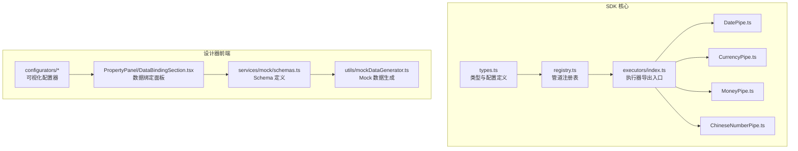
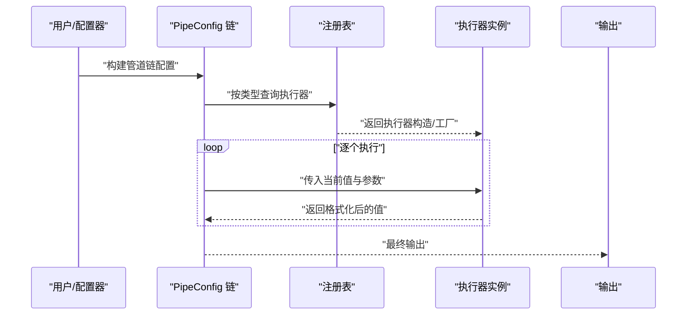
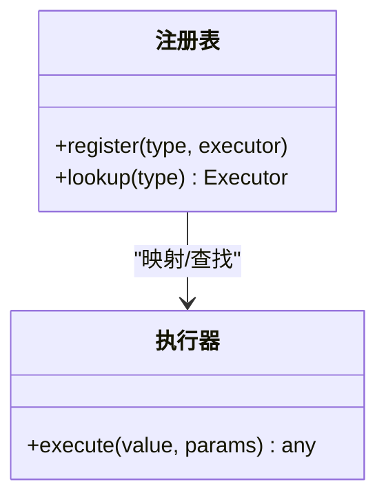
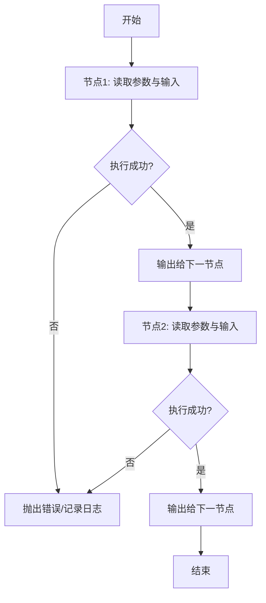
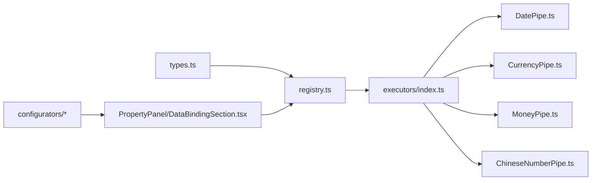

# 数据管道系统

<cite>
**本文引用的文件**
- [types.ts](file://sdk/src/pipes/types.ts)
- [registry.ts](file://sdk/src/pipes/registry.ts)
- [index.ts](file://sdk/src/pipes/executors/index.ts)
- [DatePipe.ts](file://sdk/src/pipes/executors/DatePipe.ts)
- [CurrencyPipe.ts](file://sdk/src/pipes/executors/CurrencyPipe.ts)
- [MoneyPipe.ts](file://sdk/src/pipes/executors/MoneyPipe.ts)
- [ChineseNumberPipe.ts](file://sdk/src/pipes/executors/ChineseNumberPipe.ts)
- [index.ts](file://designer/src/pipes/index.ts)
- [DatePipeConfigurator.tsx](file://designer/src/pipes/configurators/DatePipeConfigurator.tsx)
- [CurrencyPipeConfigurator.tsx](file://designer/src/pipes/configurators/CurrencyPipeConfigurator.tsx)
- [MoneyPipeConfigurator.tsx](file://designer/src/pipes/configurators/MoneyPipeConfigurator.tsx)
- [ChineseNumberPipeConfigurator.tsx](file://designer/src/pipes/configurators/ChineseNumberPipeConfigurator.tsx)
- [DataBindingSection.tsx](file://designer/src/pages/Designer/components/PropertyPanel/DataBindingSection.tsx)
- [index.ts](file://designer/src/services/mock/schemas.ts)
- [mockDataGenerator.ts](file://designer/src/utils/mockDataGenerator.ts)
- [README.md](file://sdk/README.md)
</cite>

## 目录
1. [引言](#引言)
2. [项目结构](#项目结构)
3. [核心组件](#核心组件)
4. [架构总览](#架构总览)
5. [详细组件分析](#详细组件分析)
6. [依赖关系分析](#依赖关系分析)
7. [性能考虑](#性能考虑)
8. [故障排查指南](#故障排查指南)
9. [结论](#结论)
10. [附录](#附录)

## 引言
本文件面向“数据管道系统”的使用者与开发者，系统性阐述其设计架构、执行机制与扩展方式。重点覆盖以下方面：
- 管道配置结构与类型定义
- 内置管道类型（日期、货币、金额、中文大写数字）的功能特性与适用场景
- 管道注册机制与插件化扩展原理
- 自定义管道执行器的开发方法
- 管道链式执行的工作流程（输入/输出、参数传递、错误传播）
- 实际配置示例与组合策略
- 性能优化策略与最佳实践
- 调试与故障排查方法

## 项目结构
数据管道系统位于 SDK 模块中，采用“类型定义 + 注册表 + 执行器集合”的分层组织方式；在设计器前端中提供可视化配置器与绑定面板。

图表来源
- [types.ts:1-200](file://sdk/src/pipes/types.ts#L1-L200)
- [registry.ts:1-200](file://sdk/src/pipes/registry.ts#L1-L200)
- [index.ts:1-200](file://sdk/src/pipes/executors/index.ts#L1-L200)
- [DatePipe.ts:1-200](file://sdk/src/pipes/executors/DatePipe.ts#L1-L200)
- [CurrencyPipe.ts:1-200](file://sdk/src/pipes/executors/CurrencyPipe.ts#L1-L200)
- [MoneyPipe.ts:1-200](file://sdk/src/pipes/executors/MoneyPipe.ts#L1-L200)
- [ChineseNumberPipe.ts:1-200](file://sdk/src/pipes/executors/ChineseNumberPipe.ts#L1-L200)
- [index.ts:1-200](file://designer/src/pipes/index.ts#L1-L200)
- [DatePipeConfigurator.tsx:1-200](file://designer/src/pipes/configurators/DatePipeConfigurator.tsx#L1-L200)
- [CurrencyPipeConfigurator.tsx:1-200](file://designer/src/pipes/configurators/CurrencyPipeConfigurator.tsx#L1-L200)
- [MoneyPipeConfigurator.tsx:1-200](file://designer/src/pipes/configurators/MoneyPipeConfigurator.tsx#L1-L200)
- [ChineseNumberPipeConfigurator.tsx:1-200](file://designer/src/pipes/configurators/ChineseNumberPipeConfigurator.tsx#L1-L200)
- [DataBindingSection.tsx:1-200](file://designer/src/pages/Designer/components/PropertyPanel/DataBindingSection.tsx#L1-L200)
- [schemas.ts:1-200](file://designer/src/services/mock/schemas.ts#L1-L200)
- [mockDataGenerator.ts:1-200](file://designer/src/utils/mockDataGenerator.ts#L1-L200)

章节来源
- [types.ts:1-200](file://sdk/src/pipes/types.ts#L1-L200)
- [registry.ts:1-200](file://sdk/src/pipes/registry.ts#L1-L200)
- [index.ts:1-200](file://sdk/src/pipes/executors/index.ts#L1-L200)
- [index.ts:1-200](file://designer/src/pipes/index.ts#L1-L200)

## 核心组件
- 类型与配置定义：集中定义 PipeConfig、管道类型枚举、参数接口等，确保配置结构统一且可扩展。
- 注册表：维护“类型到执行器”的映射，支持动态注册与查找。
- 执行器集合：内置多种格式化执行器，作为具体转换逻辑的承载单元。
- 可视化配置器：在设计器中提供图形化界面，用于编辑各管道的参数与链式顺序。
- 数据绑定面板：将字段与管道链进行绑定，驱动渲染时的值转换。

章节来源
- [types.ts:1-200](file://sdk/src/pipes/types.ts#L1-L200)
- [registry.ts:1-200](file://sdk/src/pipes/registry.ts#L1-L200)
- [index.ts:1-200](file://sdk/src/pipes/executors/index.ts#L1-L200)
- [index.ts:1-200](file://designer/src/pipes/index.ts#L1-L200)

## 架构总览
系统通过“配置驱动 + 执行器插件化”的模式实现数据格式化。配置对象描述了链式管道的类型与参数；运行时由注册表解析并按序调用执行器，最终得到格式化结果。

图表来源
- [types.ts:1-200](file://sdk/src/pipes/types.ts#L1-L200)
- [registry.ts:1-200](file://sdk/src/pipes/registry.ts#L1-L200)
- [index.ts:1-200](file://sdk/src/pipes/executors/index.ts#L1-L200)

## 详细组件分析

### 管道配置结构与类型定义
- PipeConfig：描述单个管道节点，包含类型标识、参数对象、以及可选的条件/分支控制字段（如是否启用、前置条件等）。
- 管道类型枚举：定义内置类型常量，如 date、currency、money、chineseNumber 等，便于注册与查找。
- 参数接口：每个类型对应一组参数接口，用于校验与提示，保证配置一致性。

章节来源
- [types.ts:1-200](file://sdk/src/pipes/types.ts#L1-L200)

### 管道注册机制与插件化扩展
- 注册表职责：提供 register(type, executor) 与 lookup(type) 方法，实现类型到执行器的映射管理。
- 插件化原则：新增管道只需实现执行器接口并调用 register 完成注册，即可被配置链复用。
- 默认导出：executors/index.ts 将所有内置执行器集中导出，便于统一引入与注册。

图表来源
- [registry.ts:1-200](file://sdk/src/pipes/registry.ts#L1-L200)
- [index.ts:1-200](file://sdk/src/pipes/executors/index.ts#L1-L200)

章节来源
- [registry.ts:1-200](file://sdk/src/pipes/registry.ts#L1-L200)
- [index.ts:1-200](file://sdk/src/pipes/executors/index.ts#L1-L200)

### 内置管道类型与功能特性

#### 日期（date）
- 功能概述：对时间戳或日期对象进行本地化/格式化输出，支持多种显示风格与语言环境。
- 典型场景：报表中的日期列、日志时间戳、页面展示的友好日期。
- 关键参数：格式模板、时区、语言等（以参数接口为准）。

章节来源
- [DatePipe.ts:1-200](file://sdk/src/pipes/executors/DatePipe.ts#L1-L200)
- [DatePipeConfigurator.tsx:1-200](file://designer/src/pipes/configurators/DatePipeConfigurator.tsx#L1-L200)

#### 货币（currency）
- 功能概述：将数值转换为带货币符号与小数位的字符串，支持符号位置、小数精度、千分位分隔符等。
- 典型场景：价格展示、财务报表、订单金额。
- 关键参数：货币代码/符号、小数位、分隔符、正负号样式等。

章节来源
- [CurrencyPipe.ts:1-200](file://sdk/src/pipes/executors/CurrencyPipe.ts#L1-L200)
- [CurrencyPipeConfigurator.tsx:1-200](file://designer/src/pipes/configurators/CurrencyPipeConfigurator.tsx#L1-L200)

#### 金额（money）
- 功能概述：面向中文语境的金额大写转换，常用于票据、合同等正式文档。
- 典型场景：发票、收据、合同金额栏位。
- 关键参数：是否带“整”字、单位层级、零的处理策略等。

章节来源
- [MoneyPipe.ts:1-200](file://sdk/src/pipes/executors/MoneyPipe.ts#L1-L200)
- [MoneyPipeConfigurator.tsx:1-200](file://designer/src/pipes/configurators/MoneyPipeConfigurator.tsx#L1-L200)

#### 中文大写数字（chineseNumber）
- 功能概述：将阿拉伯数字转换为中文大写形式，支持整数与小数部分。
- 典型场景：财务凭证、法律文书、票据填写。
- 关键参数：是否保留小数、精度控制、单位映射等。

章节来源
- [ChineseNumberPipe.ts:1-200](file://sdk/src/pipes/executors/ChineseNumberPipe.ts#L1-L200)
- [ChineseNumberPipeConfigurator.tsx:1-200](file://designer/src/pipes/configurators/ChineseNumberPipeConfigurator.tsx#L1-L200)

### 管道链式执行工作流程
- 输入输出：链首接收原始值，链尾产出最终字符串/文本片段；中间节点将上一节点输出作为当前输入。
- 参数传递：每个节点从 PipeConfig 读取自身参数，执行后将结果传递给下一个节点。
- 错误传播：若某节点抛出异常，应向上游或下游暴露错误信息，以便定位问题节点与参数。
- 条件控制：可在配置中加入启用开关或前置条件，实现按需跳过或分支处理。

图表来源
- [types.ts:1-200](file://sdk/src/pipes/types.ts#L1-L200)
- [registry.ts:1-200](file://sdk/src/pipes/registry.ts#L1-L200)

章节来源
- [types.ts:1-200](file://sdk/src/pipes/types.ts#L1-L200)
- [registry.ts:1-200](file://sdk/src/pipes/registry.ts#L1-L200)

### 自定义管道执行器开发指南
- 实现执行器：遵循统一接口，提供 execute(value, params) -> any 的转换函数。
- 注册执行器：调用 register(type, executor) 完成注册，type 与配置中的类型一致。
- 配置器联动：在设计器中为新类型添加可视化配置器，提升易用性。
- 测试与验证：编写单元测试覆盖边界值、异常路径与性能点。

章节来源
- [registry.ts:1-200](file://sdk/src/pipes/registry.ts#L1-L200)
- [index.ts:1-200](file://sdk/src/pipes/executors/index.ts#L1-L200)

### 管道配置示例与组合策略
- 示例目标：将“原始金额数值”转换为“中文大写金额+元整”，并在表格中以货币形式展示。
- 组合思路：
  1) 使用 money 管道生成中文大写金额；
  2) 使用 chineseNumber 管道处理纯数字场景；
  3) 使用 currency 管道在界面中以货币格式显示；
  4) 在数据绑定面板中将字段与上述链路关联。
- Schema 与 Mock 数据：通过服务端/本地 Schema 定义字段类型，结合 Mock 数据生成器进行端到端验证。

章节来源
- [DataBindingSection.tsx:1-200](file://designer/src/pages/Designer/components/PropertyPanel/DataBindingSection.tsx#L1-L200)
- [schemas.ts:1-200](file://designer/src/services/mock/schemas.ts#L1-L200)
- [mockDataGenerator.ts:1-200](file://designer/src/utils/mockDataGenerator.ts#L1-L200)

## 依赖关系分析
- 类型层依赖：所有执行器共享 types.ts 中的配置与参数接口，确保类型安全与一致性。
- 运行时依赖：executors/index.ts 汇聚执行器，registry.ts 提供查找能力，形成“配置 -> 注册表 -> 执行器”的调用链。
- 设计器依赖：configurators 与 PropertyPanel/DataBindingSection 依赖 SDK 的类型与注册表，完成可视化配置与绑定。

图表来源
- [types.ts:1-200](file://sdk/src/pipes/types.ts#L1-L200)
- [registry.ts:1-200](file://sdk/src/pipes/registry.ts#L1-L200)
- [index.ts:1-200](file://sdk/src/pipes/executors/index.ts#L1-L200)
- [DatePipe.ts:1-200](file://sdk/src/pipes/executors/DatePipe.ts#L1-L200)
- [CurrencyPipe.ts:1-200](file://sdk/src/pipes/executors/CurrencyPipe.ts#L1-L200)
- [MoneyPipe.ts:1-200](file://sdk/src/pipes/executors/MoneyPipe.ts#L1-L200)
- [ChineseNumberPipe.ts:1-200](file://sdk/src/pipes/executors/ChineseNumberPipe.ts#L1-L200)
- [index.ts:1-200](file://designer/src/pipes/index.ts#L1-L200)
- [DatePipeConfigurator.tsx:1-200](file://designer/src/pipes/configurators/DatePipeConfigurator.tsx#L1-L200)
- [CurrencyPipeConfigurator.tsx:1-200](file://designer/src/pipes/configurators/CurrencyPipeConfigurator.tsx#L1-L200)
- [MoneyPipeConfigurator.tsx:1-200](file://designer/src/pipes/configurators/MoneyPipeConfigurator.tsx#L1-L200)
- [ChineseNumberPipeConfigurator.tsx:1-200](file://designer/src/pipes/configurators/ChineseNumberPipeConfigurator.tsx#L1-L200)
- [DataBindingSection.tsx:1-200](file://designer/src/pages/Designer/components/PropertyPanel/DataBindingSection.tsx#L1-L200)

章节来源
- [types.ts:1-200](file://sdk/src/pipes/types.ts#L1-L200)
- [registry.ts:1-200](file://sdk/src/pipes/registry.ts#L1-L200)
- [index.ts:1-200](file://sdk/src/pipes/executors/index.ts#L1-L200)
- [index.ts:1-200](file://designer/src/pipes/index.ts#L1-L200)

## 性能考虑
- 批量处理：对同一字段的多条记录，优先使用批量转换减少重复初始化开销。
- 缓存策略：对昂贵的格式化（如货币符号/语言环境切换）进行缓存，避免重复计算。
- 延迟加载：执行器按需注册，避免一次性加载全部执行器导致的启动延迟。
- 参数校验：在配置阶段尽早发现无效参数，减少运行时异常与回退成本。
- 渲染优化：在设计器中对配置器进行防抖与节流，降低频繁重算带来的卡顿。

## 故障排查指南
- 配置校验失败：检查 PipeConfig 的类型与参数是否匹配 types.ts 中的定义。
- 执行器未找到：确认执行器已在 executors/index.ts 中导出并调用 register 完成注册。
- 链式执行中断：逐节点验证输入/输出类型，定位第一个抛错的节点。
- 设计器配置不生效：核对 PropertyPanel/DataBindingSection 是否正确绑定字段与管道链。
- Mock 数据不一致：检查 Schema 与 Mock 数据生成器，确保字段类型与示例数据一致。

章节来源
- [types.ts:1-200](file://sdk/src/pipes/types.ts#L1-L200)
- [registry.ts:1-200](file://sdk/src/pipes/registry.ts#L1-L200)
- [index.ts:1-200](file://sdk/src/pipes/executors/index.ts#L1-L200)
- [DataBindingSection.tsx:1-200](file://designer/src/pages/Designer/components/PropertyPanel/DataBindingSection.tsx#L1-L200)
- [schemas.ts:1-200](file://designer/src/services/mock/schemas.ts#L1-L200)
- [mockDataGenerator.ts:1-200](file://designer/src/utils/mockDataGenerator.ts#L1-L200)

## 结论
该数据管道系统通过清晰的类型定义、灵活的注册机制与可扩展的执行器体系，实现了从配置到执行的一体化流程。内置管道覆盖常见格式化需求，同时提供插件化扩展能力，满足复杂业务场景。配合设计器的可视化配置与绑定面板，能够高效地完成复杂数据格式化任务。

## 附录
- 快速参考：在 SDK 的 README 中可找到安装与基础使用说明，建议结合本文档进行实践。

章节来源
- [README.md:1-200](file://sdk/README.md#L1-L200)