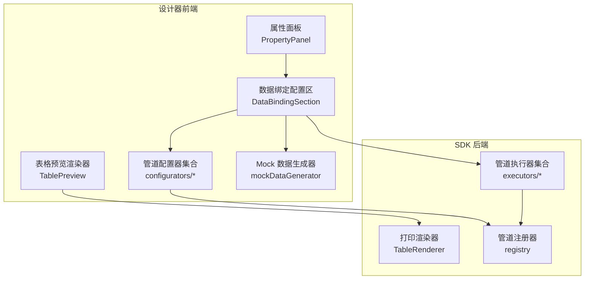
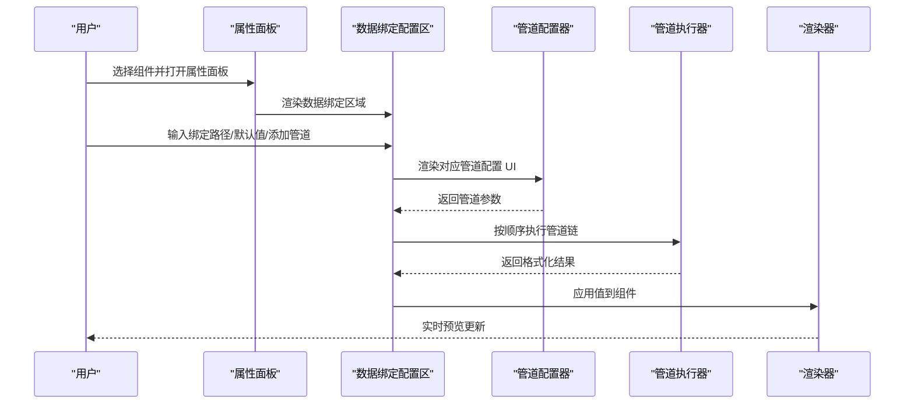
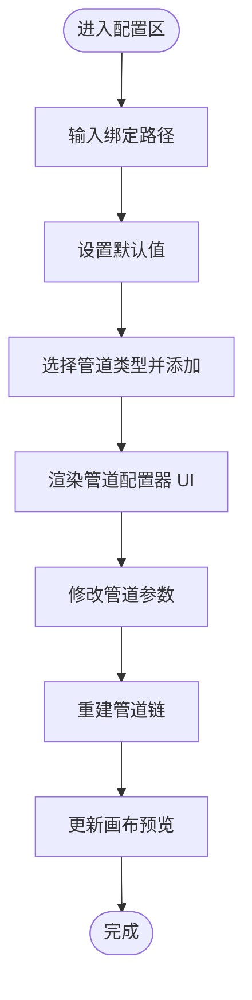
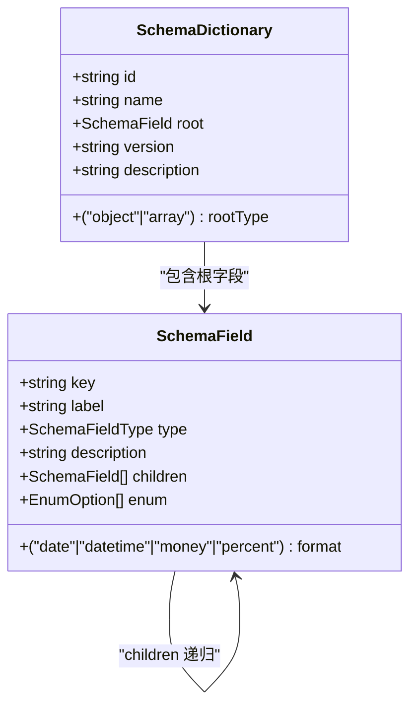
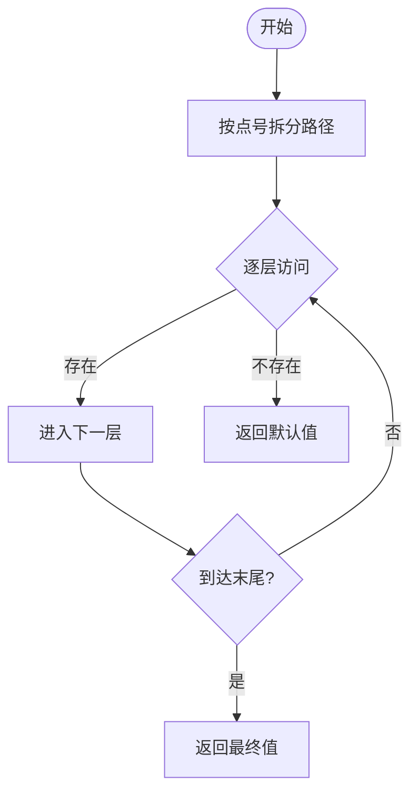
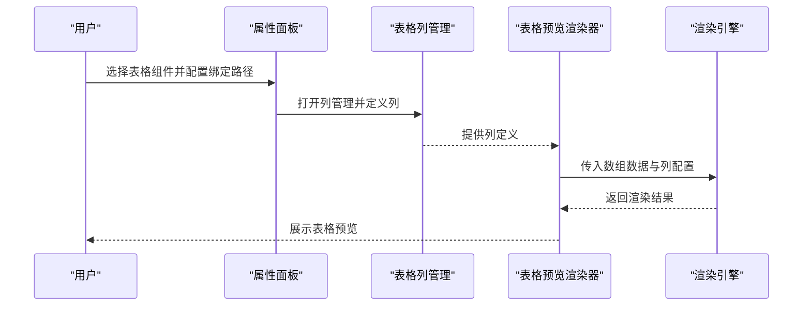
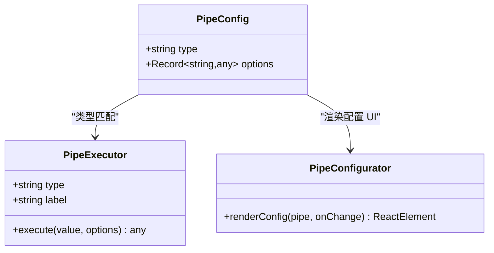
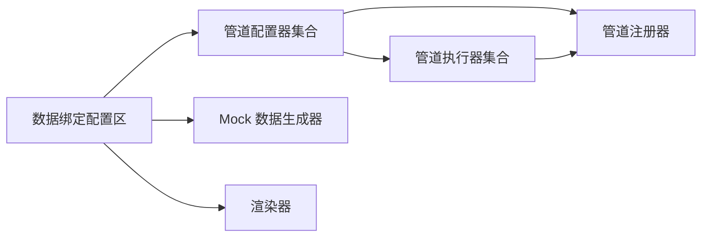

# 数据绑定系统

<cite>
**本文引用的文件**
- [DataBindingSection.tsx](file://designer/src/pages/Designer/components/PropertyPanel/DataBindingSection.tsx)
- [index.tsx](file://designer/src/pages/Designer/components/PropertyPanel/index.tsx)
- [index.ts](file://designer/src/types/index.ts)
- [mockDataGenerator.ts](file://designer/src/utils/mockDataGenerator.ts)
- [TablePreview.tsx](file://designer/src/pages/Designer/components/Canvas/componentRenderers/TablePreview.tsx)
- [ChineseNumberPipeConfigurator.tsx](file://designer/src/pipes/configurators/ChineseNumberPipeConfigurator.tsx)
- [CurrencyPipeConfigurator.tsx](file://designer/src/pipes/configurators/CurrencyPipeConfigurator.tsx)
- [DatePipeConfigurator.tsx](file://designer/src/pipes/configurators/DatePipeConfigurator.tsx)
- [MoneyPipeConfigurator.tsx](file://designer/src/pipes/configurators/MoneyPipeConfigurator.tsx)
- [index.ts](file://designer/src/pipes/index.ts)
- [registry.ts](file://sdk/src/pipes/registry.ts)
- [types.ts](file://sdk/src/pipes/types.ts)
- [executors/index.ts](file://sdk/src/pipes/executors/index.ts)
- [ChineseNumberPipe.ts](file://sdk/src/pipes/executors/ChineseNumberPipe.ts)
- [CurrencyPipe.ts](file://sdk/src/pipes/executors/CurrencyPipe.ts)
- [DatePipe.ts](file://sdk/src/pipes/executors/DatePipe.ts)
- [MoneyPipe.ts](file://sdk/src/pipes/executors/MoneyPipe.ts)
- [index.ts](file://sdk/src/printEngine/renderers/TableRenderer.ts)
- [index.ts](file://sdk/src/printEngine/types.ts)
- [技术架构文档(仅参考).md](file://docs/技术架构文档(仅参考).md)
</cite>

## 目录
1. [简介](#简介)
2. [项目结构](#项目结构)
3. [核心组件](#核心组件)
4. [架构总览](#架构总览)
5. [详细组件分析](#详细组件分析)
6. [依赖分析](#依赖分析)
7. [性能考虑](#性能考虑)
8. [故障排除指南](#故障排除指南)
9. [结论](#结论)
10. [附录](#附录)

## 简介
本文件系统性阐述数据绑定系统的设计理念与实现细节，围绕以下主题展开：
- Schema 驱动的数据模型：如何通过 Schema 字典定义数据结构与字段类型，并据此生成 Mock 数据与可视化资产树。
- 点号路径（a.b.c）安全取值机制：如何在运行时安全地从复杂嵌套数据结构中提取值。
- 数组字段自动生成表格：如何基于 Schema 中的数组字段在画布上渲染表格组件，并支持列配置与智能标记。
- 管道（Pipe）转换链：如何以插件化方式串联多个格式化函数，实现数据的链式转换。
- 空值默认值处理策略：如何在取值失败时回退到默认值，保证 UI 的稳定性。
- 配置界面与实时预览：如何在属性面板中配置绑定路径、默认值与管道，并在画布中即时看到效果。
- 错误处理机制：如何在取值失败、管道执行异常、Schema 不匹配等场景下进行稳健处理。
- Schema 字典定义规范、字段类型说明与数据验证机制：如何定义可维护的 Schema 并确保数据一致性。

## 项目结构
数据绑定系统主要分布在设计器前端与 SDK 后端两部分：
- 设计器前端负责：
  - 属性面板配置区（数据绑定、样式、布局、表格列管理）。
  - 画布渲染器（表格、文本、图片等组件的预览渲染）。
  - 管道配置器（为不同管道类型提供配置 UI）。
  - Mock 数据生成器（根据 Schema 生成示例数据）。
- SDK 后端负责：
  - 管道执行器（实际执行格式化逻辑）。
  - 渲染引擎（将组件与绑定数据结合生成最终输出）。

**图表来源**
- [index.tsx:17-151](file://designer/src/pages/Designer/components/PropertyPanel/index.tsx#L17-L151)
- [DataBindingSection.tsx:20-127](file://designer/src/pages/Designer/components/PropertyPanel/DataBindingSection.tsx#L20-L127)
- [TablePreview.tsx](file://designer/src/pages/Designer/components/Canvas/componentRenderers/TablePreview.tsx)
- [mockDataGenerator.ts:1-112](file://designer/src/utils/mockDataGenerator.ts#L1-L112)
- [registry.ts](file://sdk/src/pipes/registry.ts)
- [executors/index.ts](file://sdk/src/pipes/executors/index.ts)
- [index.ts](file://sdk/src/printEngine/renderers/TableRenderer.ts)

**章节来源**
- [index.tsx:17-151](file://designer/src/pages/Designer/components/PropertyPanel/index.tsx#L17-L151)
- [DataBindingSection.tsx:20-127](file://designer/src/pages/Designer/components/PropertyPanel/DataBindingSection.tsx#L20-L127)

## 核心组件
- 数据绑定配置区（DataBindingSection）：提供绑定路径输入、默认值设置与管道配置 UI，支持动态增删管道与参数调整。
- 属性面板（PropertyPanel）：统一装配布局、数据绑定、样式与表格列管理等子面板，按组件类型条件渲染。
- 管道配置器（Configurator）：为每种管道类型提供配置 UI，通过注册器模式与执行器解耦。
- 管道执行器（Executor）：在 SDK 层实现具体格式化逻辑，按顺序执行形成转换链。
- Mock 数据生成器：依据 Schema 自动推断字段类型并生成示例数据，便于预览与调试。
- 表格预览渲染器：将数组字段渲染为表格，支持列配置与智能标记（如禁止拖拽）。

**章节来源**
- [DataBindingSection.tsx:20-127](file://designer/src/pages/Designer/components/PropertyPanel/DataBindingSection.tsx#L20-L127)
- [index.tsx:17-151](file://designer/src/pages/Designer/components/PropertyPanel/index.tsx#L17-L151)
- [mockDataGenerator.ts:1-112](file://designer/src/utils/mockDataGenerator.ts#L1-L112)
- [TablePreview.tsx](file://designer/src/pages/Designer/components/Canvas/componentRenderers/TablePreview.tsx)

## 架构总览
数据绑定系统采用“Schema 驱动 + 管道链式转换”的架构：
- Schema 字典定义数据结构与字段类型，作为数据模型的权威来源。
- 组件在属性面板中配置绑定路径与默认值，并可叠加多个管道。
- 运行时通过 Path Resolver 安全取值，再依次经过各管道执行器进行格式化。
- 渲染器将处理后的值应用到组件，实现实时预览。

**图表来源**
- [DataBindingSection.tsx:20-127](file://designer/src/pages/Designer/components/PropertyPanel/DataBindingSection.tsx#L20-L127)
- [index.ts](file://designer/src/pipes/index.ts)
- [registry.ts](file://sdk/src/pipes/registry.ts)
- [executors/index.ts](file://sdk/src/pipes/executors/index.ts)

## 详细组件分析

### 数据绑定配置区（DataBindingSection）
- 功能要点
  - 绑定路径输入：支持点号路径（如 a.b.c），并提供提示与清空能力。
  - 默认值（Fallback）：当取值为空、null 或 undefined 时显示默认值。
  - 管道配置：通过下拉选择添加管道，渲染对应配置器 UI，支持删除与参数变更。
- 处理逻辑
  - 添加管道：向 binding.pipes 追加新管道配置。
  - 删除管道：过滤掉指定索引的管道，若为空则移除 pipes 字段。
  - 参数变更：合并当前管道的 options，触发父级回调更新组件绑定。
- 与渲染器的关系
  - 配置变更后，系统会重新解析路径并执行管道链，随后更新画布预览。

**图表来源**
- [DataBindingSection.tsx:20-127](file://designer/src/pages/Designer/components/PropertyPanel/DataBindingSection.tsx#L20-L127)

**章节来源**
- [DataBindingSection.tsx:20-127](file://designer/src/pages/Designer/components/PropertyPanel/DataBindingSection.tsx#L20-L127)

### Schema 字典与字段类型
- Schema 字典（SchemaDictionary）
  - 包含唯一标识、名称、根类型（object/array）、根字段定义、版本与描述。
- 字段类型（SchemaFieldType）
  - 支持 string、number、boolean、date、datetime、object、array。
- 字段定义（SchemaField）
  - 关键字段包括 key、label、type、description、children（用于 object/array）、enum（枚举）、format（格式化类型如 date/datetime/money/percent）。
- 推断与生成
  - 提供从示例数据推断 Schema 的能力，自动识别基础类型与日期格式，并递归生成对象与数组的子字段。

**图表来源**
- [index.ts:18-52](file://designer/src/types/index.ts#L18-L52)

**章节来源**
- [index.ts:1-52](file://designer/src/types/index.ts#L1-L52)
- [mockDataGenerator.ts:1-112](file://designer/src/utils/mockDataGenerator.ts#L1-L112)

### 点号路径安全取值机制
- 设计目标
  - 在复杂嵌套数据结构中安全提取值，避免访问 null/undefined 导致的异常。
- 实现思路
  - 将路径按点号拆分为片段序列。
  - 逐层遍历，若某一层不存在则返回默认值。
  - 支持数组索引（如 items.0）与对象属性（如 user.name）的混合路径。
- 典型用法
  - 绑定路径 a.b.c 会在运行时解析为 data.a.b.c，若中间任一环缺失则返回默认值。

**图表来源**
- [技术架构文档(仅参考).md](file://docs/技术架构文档(仅参考).md#L96-L98)

**章节来源**
- [技术架构文档(仅参考).md](file://docs/技术架构文档(仅参考).md#L96-L98)

### 数组字段自动生成表格
- 触发条件
  - 当组件类型为 table 且绑定路径指向数组字段时，系统自动渲染表格。
- 列配置
  - 通过表格列管理区域（TableColumnSection）定义列标题、绑定路径与显示格式。
- 智能标记（禁止拖拽）
  - 对于数组子字段，系统将其标记为不可拖拽，防止误操作导致 Schema 不一致。
- 渲染流程
  - 渲染器读取数组数据，逐行渲染；列定义决定每列的显示内容与格式。

**图表来源**
- [TablePreview.tsx](file://designer/src/pages/Designer/components/Canvas/componentRenderers/TablePreview.tsx)
- [index.tsx:142-147](file://designer/src/pages/Designer/components/PropertyPanel/index.tsx#L142-L147)

**章节来源**
- [index.tsx:126-132](file://designer/src/pages/Designer/components/PropertyPanel/index.tsx#L126-L132)
- [TablePreview.tsx](file://designer/src/pages/Designer/components/Canvas/componentRenderers/TablePreview.tsx)

### 管道（Pipe）转换链工作机制
- 插件化设计
  - 执行器（Executor）与配置器（Configurator）分离，新增管道只需三步：实现执行器、实现配置器、注册到注册器。
- 执行顺序
  - 管道按数组顺序依次执行，前一个管道的输出作为下一个管道的输入。
- 常见管道
  - 日期格式化、货币格式化、中文大写、金额格式化等，均由对应执行器与配置器实现。
- 配置器渲染
  - 每个管道类型提供独立的配置 UI，用户可调整格式化参数（如日期格式模板、货币符号等）。

**图表来源**
- [types.ts](file://sdk/src/pipes/types.ts)
- [registry.ts](file://sdk/src/pipes/registry.ts)
- [index.ts](file://designer/src/pipes/index.ts)
- [ChineseNumberPipeConfigurator.tsx](file://designer/src/pipes/configurators/ChineseNumberPipeConfigurator.tsx)
- [CurrencyPipeConfigurator.tsx](file://designer/src/pipes/configurators/CurrencyPipeConfigurator.tsx)
- [DatePipeConfigurator.tsx](file://designer/src/pipes/configurators/DatePipeConfigurator.tsx)
- [MoneyPipeConfigurator.tsx](file://designer/src/pipes/configurators/MoneyPipeConfigurator.tsx)

**章节来源**
- [技术架构文档(仅参考).md](file://docs/技术架构文档(仅参考).md#L100-L124)
- [types.ts](file://sdk/src/pipes/types.ts)
- [registry.ts](file://sdk/src/pipes/registry.ts)
- [index.ts](file://designer/src/pipes/index.ts)

### 空值默认值处理策略
- 取值失败的判定
  - 当路径解析过程中出现 null、undefined 或不存在的属性时，视为取值失败。
- 默认值回退
  - 若绑定设置了 fallback，默认值将作为回退显示，保证 UI 的稳定性。
- 管道中的空值处理
  - 管道执行器应具备对空值的健壮处理，避免因上游空值导致格式化异常。

**章节来源**
- [DataBindingSection.tsx:60-70](file://designer/src/pages/Designer/components/PropertyPanel/DataBindingSection.tsx#L60-L70)

### 配置界面与实时预览
- 配置界面
  - 属性面板按组件类型条件渲染数据绑定区域，提供绑定路径、默认值与管道配置。
- 实时预览
  - 当绑定路径、默认值或管道参数发生变化时，系统立即重新解析路径并执行管道链，随后更新画布组件的显示。

**章节来源**
- [index.tsx:126-132](file://designer/src/pages/Designer/components/PropertyPanel/index.tsx#L126-L132)
- [DataBindingSection.tsx:20-127](file://designer/src/pages/Designer/components/PropertyPanel/DataBindingSection.tsx#L20-L127)

### 错误处理机制
- 路径解析错误
  - 当路径不合法或超出数据结构范围时，返回默认值并记录警告日志。
- 管道执行异常
  - 捕获管道执行过程中的异常，回退到原始值或默认值，并提示用户检查管道配置。
- Schema 不匹配
  - 当绑定路径指向的字段类型与组件期望不一致时，给出可视化提示并建议修正 Schema 或绑定路径。

**章节来源**
- [技术架构文档(仅参考).md](file://docs/技术架构文档(仅参考).md#L83-L124)

## 依赖分析
- 组件耦合
  - 属性面板与数据绑定配置区松耦合，通过回调更新组件状态。
  - 管道配置器与执行器通过注册器解耦，新增管道无需修改现有代码。
- 外部依赖
  - 使用 Ant Design 组件库提供表单控件与弹窗。
  - 通过 SDK 的管道注册器与执行器实现格式化能力。

**图表来源**
- [index.ts](file://designer/src/pipes/index.ts)
- [registry.ts](file://sdk/src/pipes/registry.ts)
- [executors/index.ts](file://sdk/src/pipes/executors/index.ts)

**章节来源**
- [index.ts](file://designer/src/pipes/index.ts)
- [registry.ts](file://sdk/src/pipes/registry.ts)

## 性能考虑
- 管道链长度控制：避免过长的管道链导致渲染延迟，建议将复杂逻辑拆分为多个简单管道。
- 路径解析缓存：对常用路径的解析结果进行缓存，减少重复计算。
- 渲染节流：在频繁变更场景下对预览更新进行节流，提升交互流畅度。
- Mock 数据规模：数组字段的 Mock 数据量应适度，避免影响预览性能。

## 故障排除指南
- 绑定路径无效
  - 检查路径是否与 Schema 一致，确认中间层级是否存在。
  - 若路径包含数组索引，请确认数据中该索引位置有有效值。
- 管道配置错误
  - 检查管道参数是否符合预期（如日期格式模板），必要时回退到默认值。
  - 如需临时禁用某个管道，可先移除后再逐步排查。
- 默认值未生效
  - 确认绑定路径确实返回了空值，检查上游数据源与 Schema。
- 表格列不显示
  - 检查表格绑定路径是否指向数组字段，确认列定义是否正确。
  - 确保数组子字段被标记为不可拖拽，避免误操作导致列定义丢失。

**章节来源**
- [DataBindingSection.tsx:20-127](file://designer/src/pages/Designer/components/PropertyPanel/DataBindingSection.tsx#L20-L127)
- [TablePreview.tsx](file://designer/src/pages/Designer/components/Canvas/componentRenderers/TablePreview.tsx)

## 结论
数据绑定系统通过 Schema 驱动与管道链式转换实现了高度灵活与可扩展的数据展示能力。其插件化的管道体系、安全的路径取值机制与实时预览功能，显著提升了设计效率与用户体验。配合完善的错误处理与智能标记策略，系统在复杂业务场景下仍能保持稳定与易用。

## 附录

### Schema 字典定义规范与字段类型说明
- SchemaDictionary
  - id：Schema 唯一标识。
  - name：Schema 名称。
  - rootType：根类型，支持 object 或 array。
  - root：根字段定义。
  - version：版本号。
  - description：描述说明。
- SchemaField
  - key：字段键名。
  - label：字段显示名称。
  - type：字段类型（string/number/boolean/date/datetime/object/array）。
  - description：字段描述。
  - children：子字段列表（用于 object/array）。
  - enum：枚举值选项（用于 string/number）。
  - format：格式化类型（date/datetime/money/percent）。

**章节来源**
- [index.ts:18-52](file://designer/src/types/index.ts#L18-L52)

### 数据验证机制
- 类型校验：确保绑定路径指向的字段类型与组件期望一致。
- 枚举校验：对枚举字段，仅允许枚举值范围内取值。
- 格式校验：对日期/金额等字段，确保格式化参数合法。

**章节来源**
- [index.ts:18-52](file://designer/src/types/index.ts#L18-L52)

### 实际使用案例
- 案例一：订单详情页
  - 使用 Schema 定义订单对象与商品数组。
  - 文本组件绑定订单编号与客户姓名，设置默认值“无”。
  - 商品表格绑定商品数组，列定义包含名称、单价与数量，启用货币格式化管道。
- 案例二：报表统计
  - 使用日期字段与百分比字段，分别启用日期格式化与百分比格式化管道。
  - 对空数据设置默认值“—”，确保报表美观。

**章节来源**
- [mockDataGenerator.ts:1-112](file://designer/src/utils/mockDataGenerator.ts#L1-L112)
- [技术架构文档(仅参考).md](file://docs/技术架构文档(仅参考).md#L83-L124)