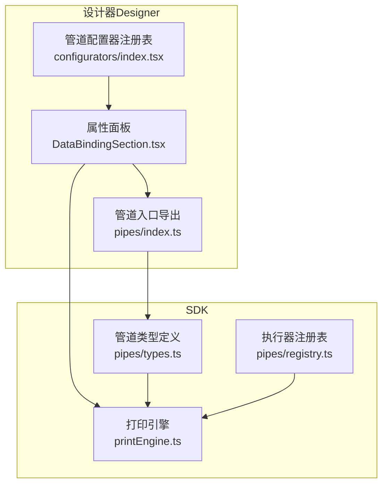
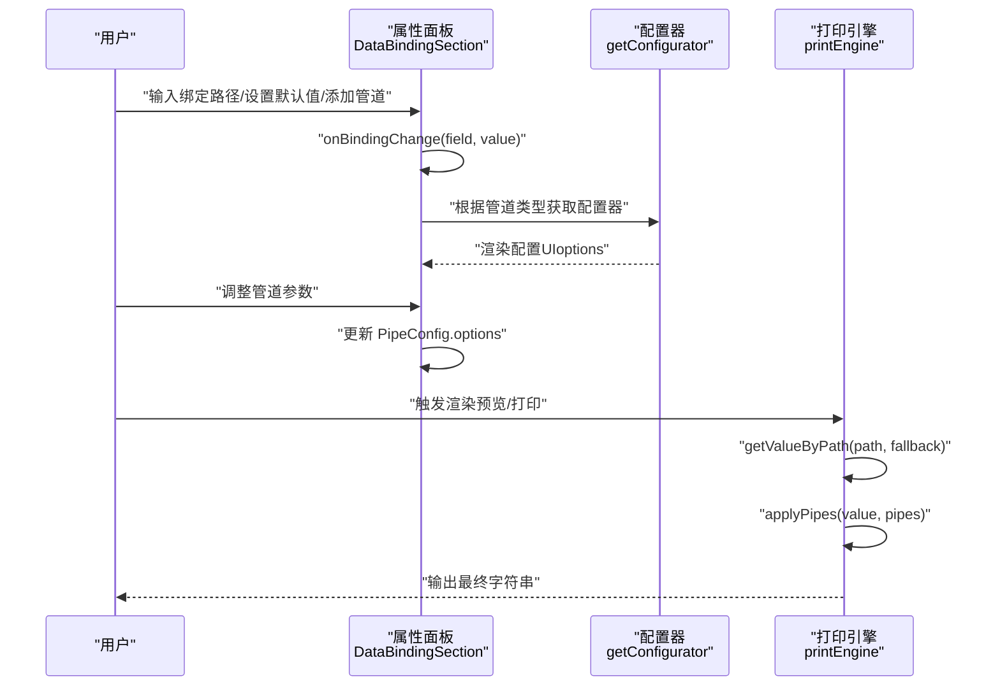
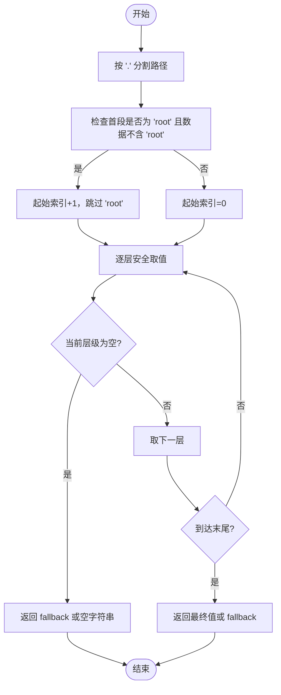
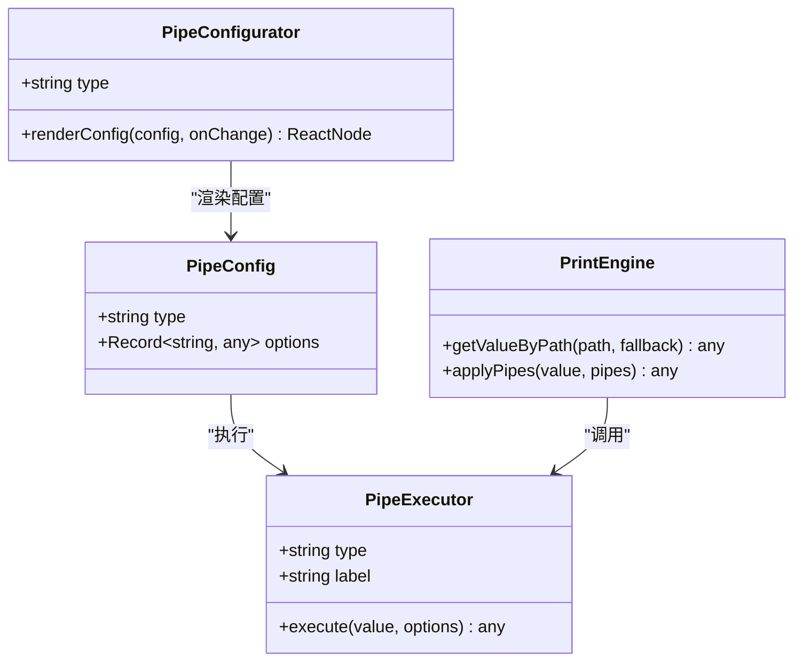
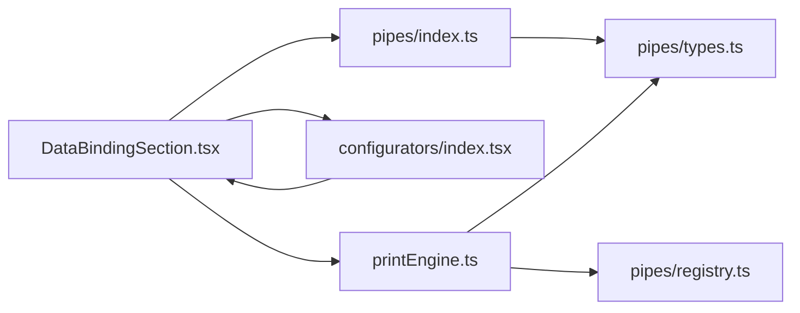

# 数据绑定配置

<cite>
**本文引用的文件**
- [DataBindingSection.tsx](file://designer/src/pages/Designer/components/PropertyPanel/DataBindingSection.tsx)
- [index.tsx](file://designer/src/pipes/configurators/index.tsx)
- [index.ts](file://designer/src/pipes/index.ts)
- [printEngine.ts](file://sdk/src/printEngine.ts)
- [types.ts](file://sdk/src/pipes/types.ts)
- [registry.ts](file://sdk/src/pipes/registry.ts)
- [技术架构文档(仅参考).md](file://docs/技术架构文档(仅参考).md)
- [TableColumnSection.tsx](file://designer/src/pages/Designer/components/PropertyPanel/TableColumnSection.tsx)
</cite>

## 目录
1. [简介](#简介)
2. [项目结构](#项目结构)
3. [核心组件](#核心组件)
4. [架构总览](#架构总览)
5. [详细组件分析](#详细组件分析)
6. [依赖分析](#依赖分析)
7. [性能考虑](#性能考虑)
8. [故障排查指南](#故障排查指南)
9. [结论](#结论)
10. [附录](#附录)

## 简介
本文件围绕“数据绑定配置”进行系统性说明，涵盖以下主题：
- DataBinding 接口的设计与实现原理
- path 点号路径访问机制（如 'user.profile.name'）的安全取值实现
- pipes 管道配置的工作原理（链式调用、参数传递、执行顺序）
- fallback 默认值处理策略（空值回退机制）
- 数据绑定配置界面的使用方法（路径选择器、管道配置器、预览交互）
- 实际配置示例（简单字段、嵌套对象、数组索引）
- 数据绑定的验证与错误处理策略

## 项目结构
数据绑定能力由设计器（Property Panel）与打印引擎（SDK）协同实现：
- 设计器负责 UI 配置（路径输入、管道选择、参数配置、预览联动）
- SDK 负责运行时安全取值、管道链式执行与回退策略

**图表来源**
- [DataBindingSection.tsx:1-127](file://designer/src/pages/Designer/components/PropertyPanel/DataBindingSection.tsx#L1-L127)
- [index.tsx:48-84](file://designer/src/pipes/configurators/index.tsx#L48-L84)
- [index.ts:1-10](file://designer/src/pipes/index.ts#L1-L10)
- [printEngine.ts:82-171](file://sdk/src/printEngine.ts#L82-L171)
- [types.ts:1-29](file://sdk/src/pipes/types.ts#L1-L29)
- [registry.ts](file://sdk/src/pipes/registry.ts)

**章节来源**
- [DataBindingSection.tsx:1-127](file://designer/src/pages/Designer/components/PropertyPanel/DataBindingSection.tsx#L1-L127)
- [index.tsx:48-84](file://designer/src/pipes/configurators/index.tsx#L48-L84)
- [index.ts:1-10](file://designer/src/pipes/index.ts#L1-L10)
- [printEngine.ts:82-171](file://sdk/src/printEngine.ts#L82-L171)
- [types.ts:1-29](file://sdk/src/pipes/types.ts#L1-L29)
- [registry.ts](file://sdk/src/pipes/registry.ts)

## 核心组件
- 属性面板数据绑定区：提供路径输入、默认值输入、管道选择与配置 UI。
- 管道配置器：根据管道类型渲染对应配置项（如日期格式、货币符号、默认值等）。
- 打印引擎：负责安全取值、管道链式执行与回退。

关键职责与交互：
- 路径输入变更触发 onBindingChange 回调，更新组件绑定配置。
- 管道选择器从 SDK 导入的 getAllPipes 列表中选择类型，生成 PipeConfig 并进入配置器。
- 配置器渲染对应 UI，并通过回调更新 options。
- 打印引擎在渲染时按顺序执行管道，最后输出字符串结果。

**章节来源**
- [DataBindingSection.tsx:15-127](file://designer/src/pages/Designer/components/PropertyPanel/DataBindingSection.tsx#L15-L127)
- [index.tsx:48-84](file://designer/src/pipes/configurators/index.tsx#L48-L84)
- [index.ts:1-10](file://designer/src/pipes/index.ts#L1-L10)

## 架构总览
数据绑定的端到端流程如下：

**图表来源**
- [DataBindingSection.tsx:20-127](file://designer/src/pages/Designer/components/PropertyPanel/DataBindingSection.tsx#L20-L127)
- [index.tsx:48-84](file://designer/src/pipes/configurators/index.tsx#L48-L84)
- [printEngine.ts:82-171](file://sdk/src/printEngine.ts#L82-L171)

## 详细组件分析

### DataBinding 接口与路径解析
- 设计器侧通过 Input 绑定 path 与 fallback 字段；变更时调用 onBindingChange 更新组件绑定配置。
- SDK 侧在打印引擎中实现 getValueByPath，支持点号路径安全取值，并内置对 'root' 前缀的智能跳过逻辑，避免在无 root 层数据时误取。

**图表来源**
- [printEngine.ts:82-104](file://sdk/src/printEngine.ts#L82-L104)

**章节来源**
- [DataBindingSection.tsx:49-70](file://designer/src/pages/Designer/components/PropertyPanel/DataBindingSection.tsx#L49-L70)
- [printEngine.ts:82-104](file://sdk/src/printEngine.ts#L82-L104)

### 管道系统（Pipes）
- 类型与执行器分离：SDK 定义 PipeExecutor 接口，包含 type、label 与 execute 方法；执行器注册在 registry 中。
- 设计器仅保留 UI 配置器（Configurator），通过 getConfigurator(type) 动态渲染配置 UI，并将 options 写回 PipeConfig。
- 打印引擎在渲染前调用 applyPipes，按顺序执行每个管道的 execute，形成链式转换。

**图表来源**
- [types.ts:11-29](file://sdk/src/pipes/types.ts#L11-L29)
- [registry.ts](file://sdk/src/pipes/registry.ts)
- [index.tsx:48-84](file://designer/src/pipes/configurators/index.tsx#L48-L84)
- [printEngine.ts:109-125](file://sdk/src/printEngine.ts#L109-L125)

**章节来源**
- [types.ts:1-29](file://sdk/src/pipes/types.ts#L1-L29)
- [index.tsx:48-84](file://designer/src/pipes/configurators/index.tsx#L48-L84)
- [index.ts:1-10](file://designer/src/pipes/index.ts#L1-L10)
- [printEngine.ts:109-125](file://sdk/src/printEngine.ts#L109-L125)

### 默认值（Fallback）策略
- 设计器提供 fallback 输入框，便于在数据缺失时显示占位文本。
- SDK 在路径取值失败或最终值为 null/undefined 时，统一回退到 fallback 或空字符串，确保渲染稳定。

**章节来源**
- [DataBindingSection.tsx:60-70](file://designer/src/pages/Designer/components/PropertyPanel/DataBindingSection.tsx#L60-L70)
- [printEngine.ts:97-103](file://sdk/src/printEngine.ts#L97-L103)

### 预览与交互流程
- 设计器属性面板在用户输入路径、设置默认值、调整管道参数时，即时更新组件绑定配置。
- 打印引擎在渲染阶段读取最新绑定配置，执行安全取值与管道链，输出最终字符串，驱动预览更新。

**章节来源**
- [DataBindingSection.tsx:20-44](file://designer/src/pages/Designer/components/PropertyPanel/DataBindingSection.tsx#L20-L44)
- [printEngine.ts:155-164](file://sdk/src/printEngine.ts#L155-L164)

### 表格列绑定中的管道应用
- 表格列绑定同样支持管道配置，设计器通过 getColumnConfig 的配置器渲染列级管道 UI，并在 onChange 中更新列的 pipes 字段。
- 渲染时引擎按列绑定执行对应的管道链，保证表格数据格式化一致。

**章节来源**
- [TableColumnSection.tsx:350-385](file://designer/src/pages/Designer/components/PropertyPanel/TableColumnSection.tsx#L350-L385)

## 依赖分析
- 设计器依赖 SDK 的 getAllPipes 与执行器注册表，以动态展示与应用管道。
- 管道配置器注册表集中管理各类型配置器，便于扩展新管道。
- 打印引擎依赖执行器注册表完成管道执行。

**图表来源**
- [DataBindingSection.tsx:1-12](file://designer/src/pages/Designer/components/PropertyPanel/DataBindingSection.tsx#L1-L12)
- [index.ts:1-10](file://designer/src/pipes/index.ts#L1-L10)
- [index.tsx:48-84](file://designer/src/pipes/configurators/index.tsx#L48-L84)
- [printEngine.ts:109-125](file://sdk/src/printEngine.ts#L109-L125)
- [types.ts:1-29](file://sdk/src/pipes/types.ts#L1-L29)
- [registry.ts](file://sdk/src/pipes/registry.ts)

**章节来源**
- [DataBindingSection.tsx:1-12](file://designer/src/pages/Designer/components/PropertyPanel/DataBindingSection.tsx#L1-L12)
- [index.ts:1-10](file://designer/src/pipes/index.ts#L1-L10)
- [index.tsx:48-84](file://designer/src/pipes/configurators/index.tsx#L48-L84)
- [printEngine.ts:109-125](file://sdk/src/printEngine.ts#L109-L125)
- [types.ts:1-29](file://sdk/src/pipes/types.ts#L1-L29)
- [registry.ts](file://sdk/src/pipes/registry.ts)

## 性能考虑
- 路径解析为线性遍历，时间复杂度 O(n)，n 为路径段数；在常规模板中开销极低。
- 管道链式执行按顺序调用，建议控制管道数量与复杂度，避免在高频渲染场景下产生明显延迟。
- 对于表格等重复渲染组件，建议缓存已计算的单元格值，减少重复计算。

## 故障排查指南
常见问题与处理建议：
- 路径无效或数据为空
  - 现象：预览显示空或默认值
  - 处理：检查路径拼写、确认数据源是否存在对应键；必要时设置 fallback
  - 参考实现：路径解析与回退逻辑
    - [printEngine.ts:82-104](file://sdk/src/printEngine.ts#L82-L104)
- 管道参数错误
  - 现象：格式化异常或报错
  - 处理：核对配置器参数（如日期格式、货币符号等）；逐步移除管道定位问题
  - 参考实现：配置器注册与渲染
    - [index.tsx:48-84](file://designer/src/pipes/configurators/index.tsx#L48-L84)
- 管道未生效
  - 现象：修改参数后未见效果
  - 处理：确认绑定配置已保存；检查 onBindingChange 是否正确更新 pipes；重新触发渲染
  - 参考实现：管道链式执行
    - [printEngine.ts:109-125](file://sdk/src/printEngine.ts#L109-L125)

**章节来源**
- [printEngine.ts:82-125](file://sdk/src/printEngine.ts#L82-L125)
- [index.tsx:48-84](file://designer/src/pipes/configurators/index.tsx#L48-L84)

## 结论
数据绑定配置通过“路径解析 + 管道链式转换 + 默认值回退”的组合，在设计器与 SDK 之间实现了清晰的职责分离与稳定的运行时行为。其插件化架构使得新增管道成本低、扩展性强，适合在复杂模板场景中灵活应用。

## 附录

### 使用方法与交互流程
- 路径选择器
  - 在属性面板输入点号路径（如 user.profile.name、items.0.title）
  - 支持从左侧数据资产拖拽生成路径
  - 参考实现：路径输入与变更回调
    - [DataBindingSection.tsx:49-58](file://designer/src/pages/Designer/components/PropertyPanel/DataBindingSection.tsx#L49-L58)
- 管道配置器
  - 从下拉选择器中选择管道类型，系统加载对应配置器渲染 UI
  - 通过配置器设置参数（如日期格式、默认值等），参数写入 PipeConfig.options
  - 参考实现：管道选择与配置器渲染
    - [DataBindingSection.tsx:71-121](file://designer/src/pages/Designer/components/PropertyPanel/DataBindingSection.tsx#L71-L121)
    - [index.tsx:48-84](file://designer/src/pipes/configurators/index.tsx#L48-L84)
- 预览功能
  - 配置变更后，打印引擎在渲染时执行路径解析与管道链，实时更新预览
  - 参考实现：绑定解析与管道应用
    - [printEngine.ts:155-164](file://sdk/src/printEngine.ts#L155-L164)
    - [printEngine.ts:109-125](file://sdk/src/printEngine.ts#L109-L125)

**章节来源**
- [DataBindingSection.tsx:49-121](file://designer/src/pages/Designer/components/PropertyPanel/DataBindingSection.tsx#L49-L121)
- [index.tsx:48-84](file://designer/src/pipes/configurators/index.tsx#L48-L84)
- [printEngine.ts:109-164](file://sdk/src/printEngine.ts#L109-L164)

### 实际配置示例（场景与要点）
- 简单字段绑定
  - 场景：绑定用户姓名
  - 路径：user.name
  - 建议：设置 fallback 占位
  - 参考实现：路径输入与默认值
    - [DataBindingSection.tsx:49-70](file://designer/src/pages/Designer/components/PropertyPanel/DataBindingSection.tsx#L49-L70)
- 嵌套对象绑定
  - 场景：绑定用户档案中的部门名称
  - 路径：user.profile.department.name
  - 建议：若中间任一层可能缺失，设置 fallback
  - 参考实现：安全取值与回退
    - [printEngine.ts:82-104](file://sdk/src/printEngine.ts#L82-L104)
- 数组字段绑定
  - 场景：绑定订单商品列表的第一个标题
  - 路径：order.items.0.title
  - 建议：数组为空时设置 fallback
  - 参考实现：路径解析与回退
    - [printEngine.ts:82-104](file://sdk/src/printEngine.ts#L82-L104)
- 管道链式调用
  - 场景：先截断字符串，再转中文大写金额
  - 管道：slice → chineseNumber
  - 建议：按期望顺序排列，逐个验证参数
  - 参考实现：管道链式执行
    - [printEngine.ts:109-125](file://sdk/src/printEngine.ts#L109-L125)
    - [index.tsx:48-84](file://designer/src/pipes/configurators/index.tsx#L48-L84)

**章节来源**
- [DataBindingSection.tsx:49-70](file://designer/src/pages/Designer/components/PropertyPanel/DataBindingSection.tsx#L49-L70)
- [printEngine.ts:82-125](file://sdk/src/printEngine.ts#L82-L125)
- [index.tsx:48-84](file://designer/src/pipes/configurators/index.tsx#L48-L84)

### 验证机制与错误处理策略
- 路径验证
  - 建议：在输入时提示合法路径格式（点号分隔、数组索引数字）
  - 参考实现：路径解析与空值回退
    - [printEngine.ts:82-104](file://sdk/src/printEngine.ts#L82-L104)
- 管道验证
  - 建议：配置器对参数进行基础校验（如日期格式字符串），并在 onChange 中及时反馈
  - 参考实现：配置器渲染与参数更新
    - [index.tsx:48-84](file://designer/src/pipes/configurators/index.tsx#L48-L84)
- 错误处理
  - 建议：在渲染阶段捕获异常并降级为 fallback 或空字符串，避免中断预览
  - 参考实现：回退策略
    - [printEngine.ts:97-103](file://sdk/src/printEngine.ts#L97-L103)

**章节来源**
- [printEngine.ts:82-103](file://sdk/src/printEngine.ts#L82-L103)
- [index.tsx:48-84](file://designer/src/pipes/configurators/index.tsx#L48-L84)