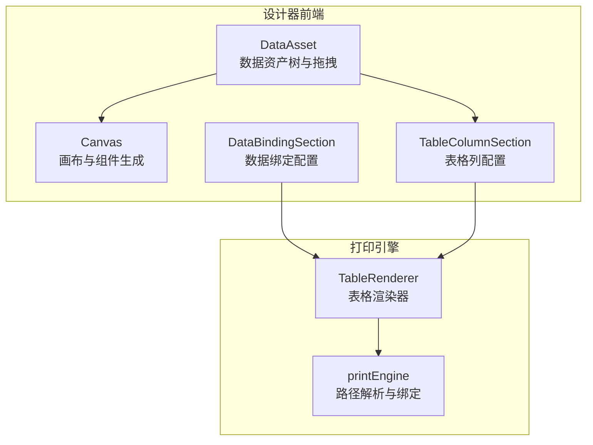
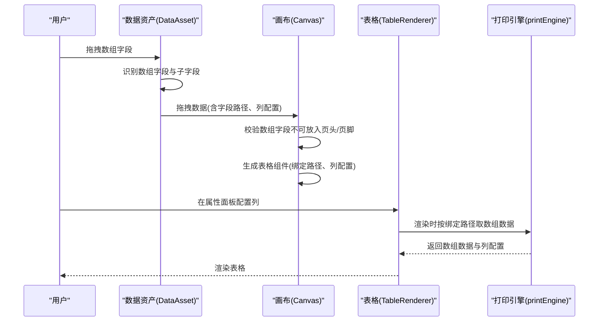
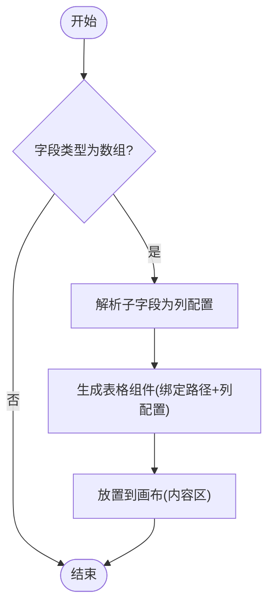
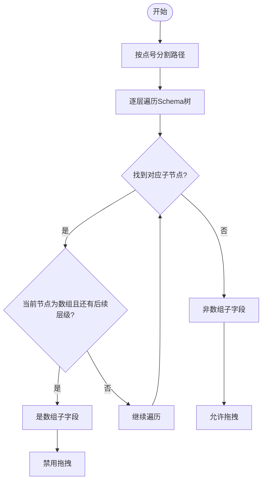
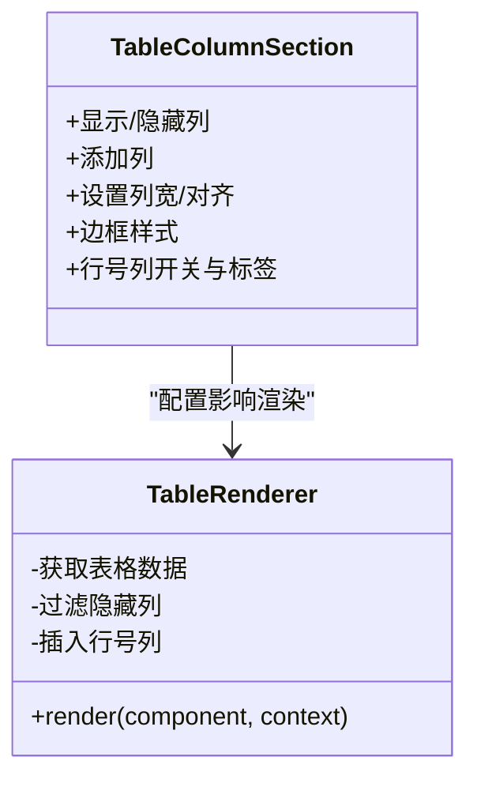
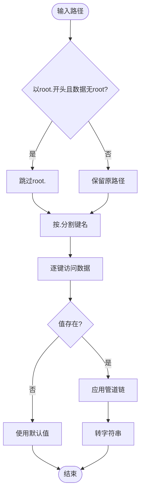
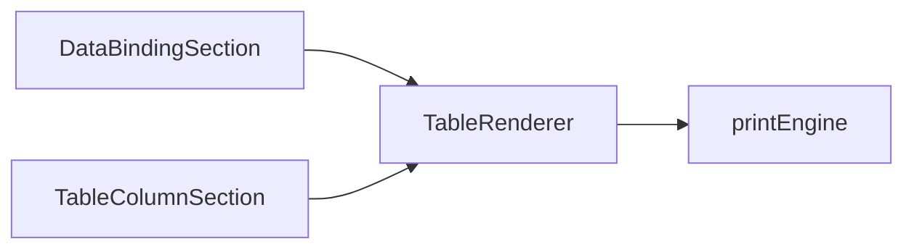

# 数组字段处理

<cite>
**本文引用的文件**
- [designer/src/pages/Designer/components/AssetPanel/DataAsset/index.tsx](file://designer/src/pages/Designer/components/AssetPanel/DataAsset/index.tsx)
- [designer/src/pages/Designer/components/Canvas/index.tsx](file://designer/src/pages/Designer/components/Canvas/index.tsx)
- [designer/src/pages/Designer/components/PropertyPanel/DataBindingSection.tsx](file://designer/src/pages/Designer/components/PropertyPanel/DataBindingSection.tsx)
- [designer/src/pages/Designer/components/PropertyPanel/TableColumnSection.tsx](file://designer/src/pages/Designer/components/PropertyPanel/TableColumnSection.tsx)
- [sdk/src/printEngine/renderers/TableRenderer.ts](file://sdk/src/printEngine/renderers/TableRenderer.ts)
- [sdk/src/printEngine.ts](file://sdk/src/printEngine.ts)
- [docs/技术架构文档(仅参考).md](file://docs/技术架构文档(仅参考).md)
</cite>

## 目录
1. [简介](#简介)
2. [项目结构](#项目结构)
3. [核心组件](#核心组件)
4. [架构总览](#架构总览)
5. [详细组件分析](#详细组件分析)
6. [依赖分析](#依赖分析)
7. [性能考量](#性能考量)
8. [故障排查指南](#故障排查指南)
9. [结论](#结论)
10. [附录](#附录)

## 简介
本章节围绕“数组字段处理”展开，重点说明：
- 数组字段在数据绑定中的特殊处理机制
- 数组字段自动生成表格的实现原理
- 数组子字段的智能标记机制及为何禁止拖拽
- 表格组件的动态列生成机制
- 数组数据绑定的路径表达式（索引访问、属性访问等）
- 实际使用案例（简单数组、对象数组、嵌套数组）
- 限制条件与注意事项（性能与数据量）

## 项目结构
与数组字段处理直接相关的模块主要分布在设计器前端与打印引擎两部分：
- 设计器前端负责：数据资产树构建、数组字段识别与标记、拖拽行为控制、表格列配置
- 打印引擎负责：表格渲染、数据路径解析、数组数据绑定

图表来源
- [designer/src/pages/Designer/components/AssetPanel/DataAsset/index.tsx:223-349](file://designer/src/pages/Designer/components/AssetPanel/DataAsset/index.tsx#L223-L349)
- [designer/src/pages/Designer/components/Canvas/index.tsx:412-426](file://designer/src/pages/Designer/components/Canvas/index.tsx#L412-L426)
- [designer/src/pages/Designer/components/PropertyPanel/DataBindingSection.tsx:45-71](file://designer/src/pages/Designer/components/PropertyPanel/DataBindingSection.tsx#L45-L71)
- [designer/src/pages/Designer/components/PropertyPanel/TableColumnSection.tsx:1-472](file://designer/src/pages/Designer/components/PropertyPanel/TableColumnSection.tsx#L1-L472)
- [sdk/src/printEngine/renderers/TableRenderer.ts:147-178](file://sdk/src/printEngine/renderers/TableRenderer.ts#L147-L178)
- [sdk/src/printEngine.ts:79-104](file://sdk/src/printEngine.ts#L79-L104)

章节来源
- [designer/src/pages/Designer/components/AssetPanel/DataAsset/index.tsx:223-349](file://designer/src/pages/Designer/components/AssetPanel/DataAsset/index.tsx#L223-L349)
- [designer/src/pages/Designer/components/Canvas/index.tsx:412-426](file://designer/src/pages/Designer/components/Canvas/index.tsx#L412-L426)
- [designer/src/pages/Designer/components/PropertyPanel/DataBindingSection.tsx:45-71](file://designer/src/pages/Designer/components/PropertyPanel/DataBindingSection.tsx#L45-L71)
- [designer/src/pages/Designer/components/PropertyPanel/TableColumnSection.tsx:1-472](file://designer/src/pages/Designer/components/PropertyPanel/TableColumnSection.tsx#L1-L472)
- [sdk/src/printEngine/renderers/TableRenderer.ts:147-178](file://sdk/src/printEngine/renderers/TableRenderer.ts#L147-L178)
- [sdk/src/printEngine.ts:79-104](file://sdk/src/printEngine.ts#L79-L104)

## 核心组件
- 数据资产树与拖拽（DataAsset）
  - 将 Schema 中的数组字段转换为表格组件，并在拖拽时携带列配置
  - 对数组子字段进行智能标记与禁用拖拽
- 画布组件生成（Canvas）
  - 接收拖拽数据，生成表格组件并设置绑定路径
- 数据绑定配置（DataBindingSection）
  - 提供绑定路径输入与默认值配置，支持从数据资产拖拽
- 表格列配置（TableColumnSection）
  - 动态管理表格列、显示/隐藏、边框、行号等
- 表格渲染器（TableRenderer）
  - 渲染表格，支持跨页分页数据、可见列过滤、行号列
- 路径解析与绑定（printEngine）
  - 支持点号路径、索引访问、智能前缀跳过等

章节来源
- [designer/src/pages/Designer/components/AssetPanel/DataAsset/index.tsx:223-349](file://designer/src/pages/Designer/components/AssetPanel/DataAsset/index.tsx#L223-L349)
- [designer/src/pages/Designer/components/Canvas/index.tsx:412-426](file://designer/src/pages/Designer/components/Canvas/index.tsx#L412-L426)
- [designer/src/pages/Designer/components/PropertyPanel/DataBindingSection.tsx:45-71](file://designer/src/pages/Designer/components/PropertyPanel/DataBindingSection.tsx#L45-L71)
- [designer/src/pages/Designer/components/PropertyPanel/TableColumnSection.tsx:1-472](file://designer/src/pages/Designer/components/PropertyPanel/TableColumnSection.tsx#L1-L472)
- [sdk/src/printEngine/renderers/TableRenderer.ts:147-178](file://sdk/src/printEngine/renderers/TableRenderer.ts#L147-L178)
- [sdk/src/printEngine.ts:79-104](file://sdk/src/printEngine.ts#L79-L104)

## 架构总览
数组字段处理的端到端流程如下：

图表来源
- [designer/src/pages/Designer/components/AssetPanel/DataAsset/index.tsx:223-349](file://designer/src/pages/Designer/components/AssetPanel/DataAsset/index.tsx#L223-L349)
- [designer/src/pages/Designer/components/Canvas/index.tsx:412-426](file://designer/src/pages/Designer/components/Canvas/index.tsx#L412-L426)
- [sdk/src/printEngine/renderers/TableRenderer.ts:147-178](file://sdk/src/printEngine/renderers/TableRenderer.ts#L147-L178)
- [sdk/src/printEngine.ts:79-104](file://sdk/src/printEngine.ts#L79-L104)

## 详细组件分析

### 数组字段自动生成表格
- 设计器在拖拽数组字段时，会读取其子字段并生成表格列配置，随后在画布上创建表格组件并绑定路径
- 生成的表格组件宽度会铺满可用区域，高度固定，便于预览与布局

图表来源
- [designer/src/pages/Designer/components/AssetPanel/DataAsset/index.tsx:223-257](file://designer/src/pages/Designer/components/AssetPanel/DataAsset/index.tsx#L223-L257)
- [designer/src/pages/Designer/components/Canvas/index.tsx:412-426](file://designer/src/pages/Designer/components/Canvas/index.tsx#L412-L426)

章节来源
- [designer/src/pages/Designer/components/AssetPanel/DataAsset/index.tsx:223-257](file://designer/src/pages/Designer/components/AssetPanel/DataAsset/index.tsx#L223-L257)
- [designer/src/pages/Designer/components/Canvas/index.tsx:412-426](file://designer/src/pages/Designer/components/Canvas/index.tsx#L412-L426)

### 数组子字段的智能标记与禁用拖拽
- 智能标记：当遍历 Schema 路径时，若某个祖先节点为数组且路径仍有后续层级，则当前节点为“数组子字段”，在资产树中以灰色标题与“仅表格列”标签提示
- 禁用拖拽：在拖拽树节点时，若检测到数组子字段则直接返回不可拖拽，防止误操作

图表来源
- [designer/src/pages/Designer/components/AssetPanel/DataAsset/index.tsx:133-164](file://designer/src/pages/Designer/components/AssetPanel/DataAsset/index.tsx#L133-L164)
- [designer/src/pages/Designer/components/AssetPanel/DataAsset/index.tsx:320-324](file://designer/src/pages/Designer/components/AssetPanel/DataAsset/index.tsx#L320-L324)

章节来源
- [designer/src/pages/Designer/components/AssetPanel/DataAsset/index.tsx:133-164](file://designer/src/pages/Designer/components/AssetPanel/DataAsset/index.tsx#L133-L164)
- [designer/src/pages/Designer/components/AssetPanel/DataAsset/index.tsx:320-324](file://designer/src/pages/Designer/components/AssetPanel/DataAsset/index.tsx#L320-L324)

### 表格组件的动态列生成机制
- 列配置来源于数组字段的子字段集合，每个子字段映射为一列（title、dataIndex）
- 用户可在属性面板中启用/隐藏列、调整宽度、设置边框与行号等
- 渲染阶段仅显示未隐藏的列，并可插入序号列

图表来源
- [designer/src/pages/Designer/components/PropertyPanel/TableColumnSection.tsx:1-472](file://designer/src/pages/Designer/components/PropertyPanel/TableColumnSection.tsx#L1-L472)
- [sdk/src/printEngine/renderers/TableRenderer.ts:147-178](file://sdk/src/printEngine/renderers/TableRenderer.ts#L147-L178)

章节来源
- [designer/src/pages/Designer/components/PropertyPanel/TableColumnSection.tsx:1-472](file://designer/src/pages/Designer/components/PropertyPanel/TableColumnSection.tsx#L1-L472)
- [sdk/src/printEngine/renderers/TableRenderer.ts:147-178](file://sdk/src/printEngine/renderers/TableRenderer.ts#L147-L178)

### 数组数据绑定的路径表达式
- 支持点号路径与索引访问，如“items.0.title”
- 路径解析具备智能前缀跳过能力：当路径以“root.”开头但数据顶层无“root”时，自动跳过“root.”前缀
- 绑定解析流程：先按路径取值，再应用管道链，最后转字符串输出

图表来源
- [sdk/src/printEngine.ts:79-104](file://sdk/src/printEngine.ts#L79-L104)
- [sdk/src/printEngine.ts:155-164](file://sdk/src/printEngine.ts#L155-L164)

章节来源
- [sdk/src/printEngine.ts:79-104](file://sdk/src/printEngine.ts#L79-L104)
- [sdk/src/printEngine.ts:155-164](file://sdk/src/printEngine.ts#L155-L164)
- [docs/技术架构文档(仅参考).md](file://docs/技术架构文档(仅参考).md#L83-L124)

### 实际使用案例
- 简单数组：绑定路径如“tags”，渲染为单列表格，每行显示一个数组元素
- 对象数组：绑定路径如“orders”，子字段映射为多列表格；例如“orders.0.amount”作为金额列
- 嵌套数组：绑定路径如“categories.products”，渲染为表格并结合列配置进行展示

章节来源
- [designer/src/pages/Designer/components/PropertyPanel/DataBindingSection.tsx:45-71](file://designer/src/pages/Designer/components/PropertyPanel/DataBindingSection.tsx#L45-L71)
- [sdk/src/printEngine.ts:79-104](file://sdk/src/printEngine.ts#L79-L104)

### 限制条件与注意事项
- 数组字段生成的表格组件不允许放入页头/页脚区域，仅支持内容区
- 数组子字段在资产树中禁用拖拽，仅作为表格列使用
- 表格渲染依赖数组数据，若绑定路径指向非数组值，将被视为空数组处理
- 性能建议：大数组数据应考虑分页或截断策略，避免一次性渲染过多行导致卡顿

章节来源
- [designer/src/pages/Designer/components/Canvas/index.tsx:412-426](file://designer/src/pages/Designer/components/Canvas/index.tsx#L412-L426)
- [designer/src/pages/Designer/components/AssetPanel/DataAsset/index.tsx:101-119](file://designer/src/pages/Designer/components/AssetPanel/DataAsset/index.tsx#L101-L119)
- [sdk/src/printEngine/renderers/TableRenderer.ts:150-162](file://sdk/src/printEngine/renderers/TableRenderer.ts#L150-L162)

## 依赖分析
- 设计器前端依赖打印引擎的渲染器与路径解析能力
- 表格列配置直接影响渲染器的可见列与行号列
- 数据绑定路径贯穿属性面板与渲染器两端

图表来源
- [designer/src/pages/Designer/components/PropertyPanel/DataBindingSection.tsx:45-71](file://designer/src/pages/Designer/components/PropertyPanel/DataBindingSection.tsx#L45-L71)
- [designer/src/pages/Designer/components/PropertyPanel/TableColumnSection.tsx:1-472](file://designer/src/pages/Designer/components/PropertyPanel/TableColumnSection.tsx#L1-L472)
- [sdk/src/printEngine/renderers/TableRenderer.ts:147-178](file://sdk/src/printEngine/renderers/TableRenderer.ts#L147-L178)
- [sdk/src/printEngine.ts:79-104](file://sdk/src/printEngine.ts#L79-L104)

章节来源
- [designer/src/pages/Designer/components/PropertyPanel/DataBindingSection.tsx:45-71](file://designer/src/pages/Designer/components/PropertyPanel/DataBindingSection.tsx#L45-L71)
- [designer/src/pages/Designer/components/PropertyPanel/TableColumnSection.tsx:1-472](file://designer/src/pages/Designer/components/PropertyPanel/TableColumnSection.tsx#L1-L472)
- [sdk/src/printEngine/renderers/TableRenderer.ts:147-178](file://sdk/src/printEngine/renderers/TableRenderer.ts#L147-L178)
- [sdk/src/printEngine.ts:79-104](file://sdk/src/printEngine.ts#L79-L104)

## 性能考量
- 大数组渲染：建议在数据源侧做分页或截断，避免一次性渲染过多行
- 列数量控制：列数过多会增加渲染与排版压力，建议按需显示列
- 管道链长度：管道链越长，渲染耗时越久，应精简必要管道
- 跨页分页：表格支持分页数据，可将大数据集拆分为多页渲染

## 故障排查指南
- 绑定路径无效：确认路径是否正确，是否存在大小写或拼写错误
- 默认值未生效：检查默认值配置是否填写，以及数据是否为 null/undefined
- 表格不显示：确认绑定路径指向的是数组，且表格列配置已启用至少一列
- 子字段无法拖拽：确认该字段是否为数组子字段，数组子字段被设计为仅表格列用途

章节来源
- [designer/src/pages/Designer/components/PropertyPanel/DataBindingSection.tsx:45-71](file://designer/src/pages/Designer/components/PropertyPanel/DataBindingSection.tsx#L45-L71)
- [designer/src/pages/Designer/components/AssetPanel/DataAsset/index.tsx:101-119](file://designer/src/pages/Designer/components/AssetPanel/DataAsset/index.tsx#L101-L119)
- [sdk/src/printEngine/renderers/TableRenderer.ts:150-162](file://sdk/src/printEngine/renderers/TableRenderer.ts#L150-L162)

## 结论
数组字段处理通过“资产树智能标记 + 拖拽生成表格 + 动态列配置 + 路径解析绑定”的协同机制，实现了从设计到渲染的完整闭环。数组子字段的禁用拖拽策略有效避免了误用，而表格渲染器与列配置则提供了灵活的展示能力。在实际使用中，应关注路径表达式的正确性与性能优化，确保复杂数据场景下的稳定表现。

## 附录
- 路径解析与绑定的参考文档：见“技术架构文档(仅参考).md”