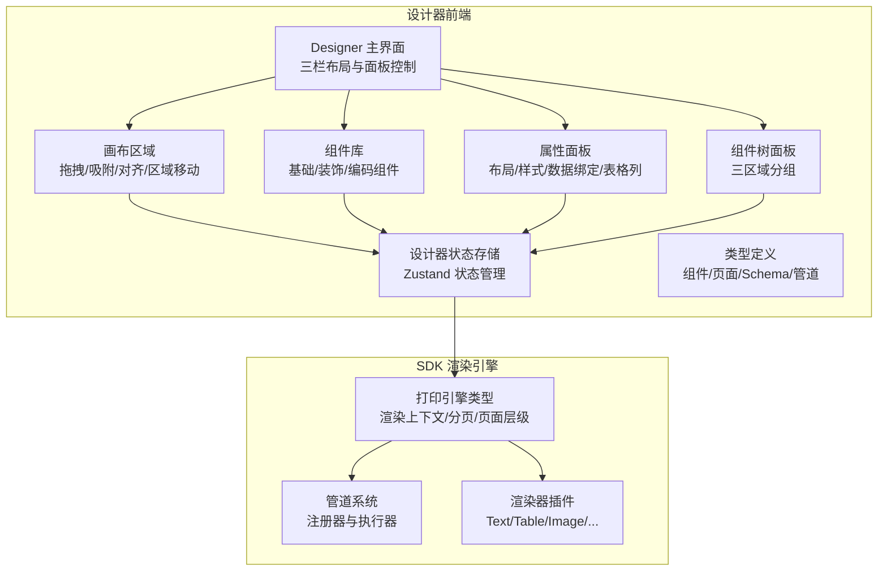
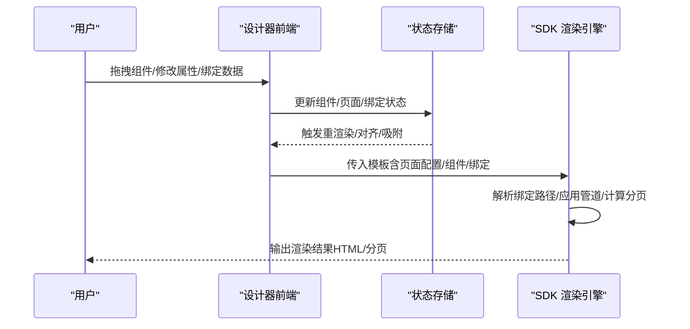
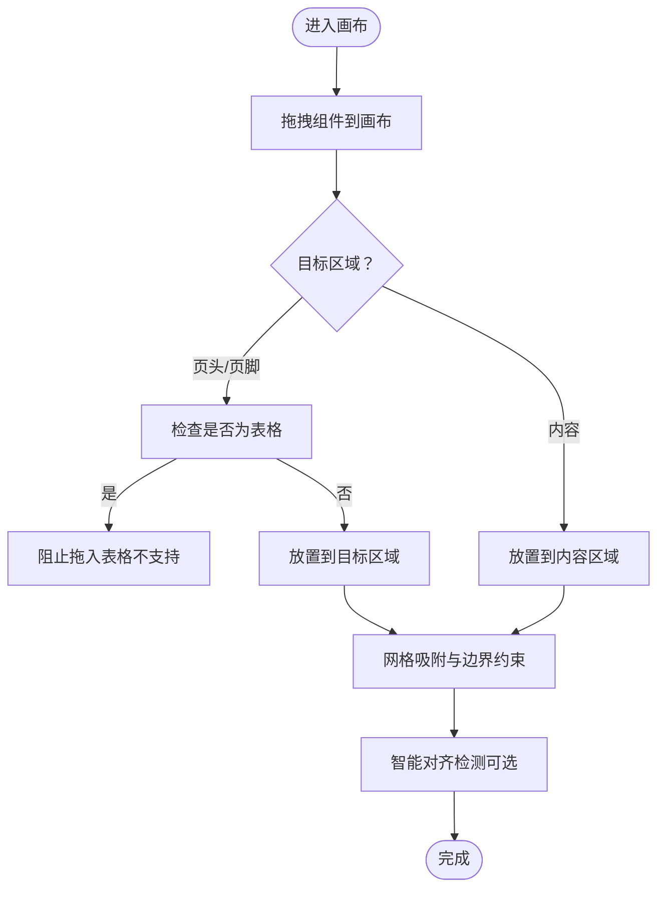
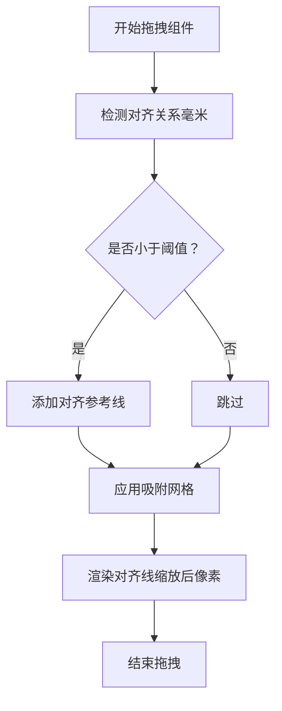
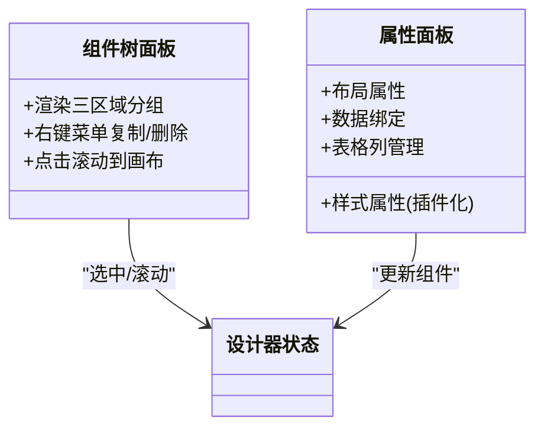
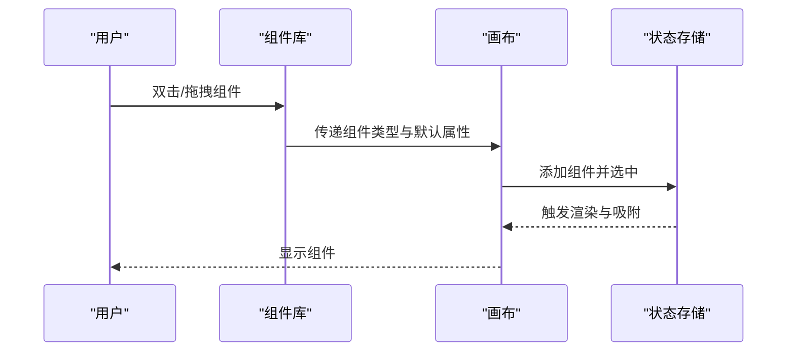
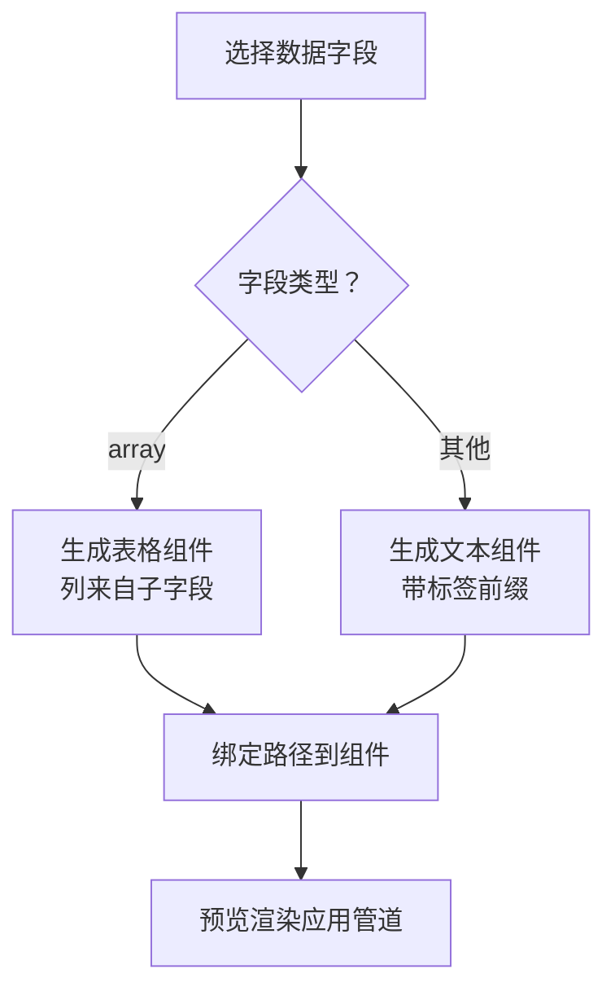
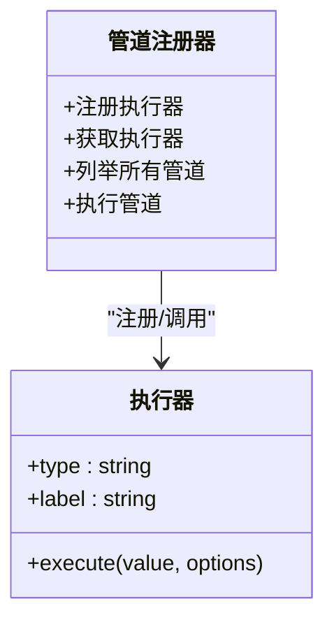
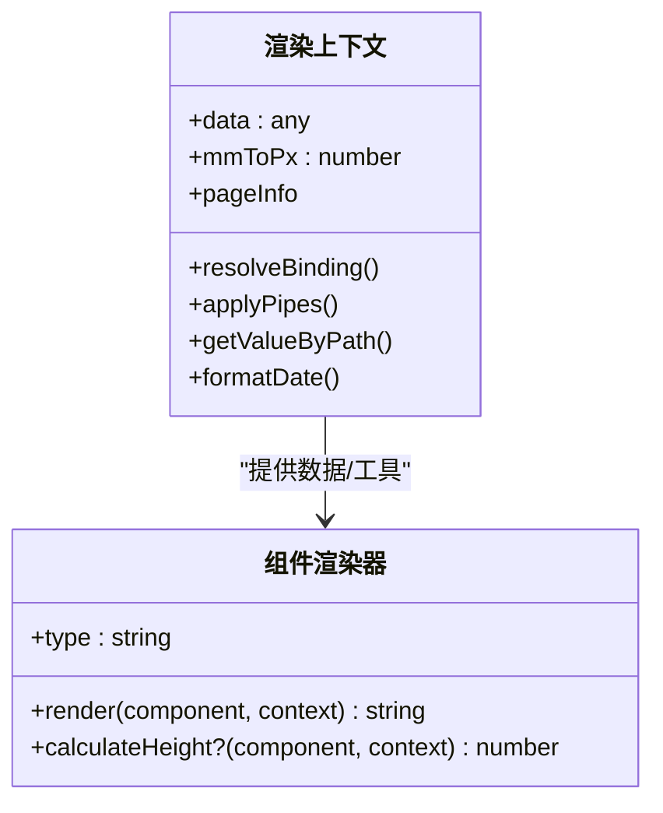
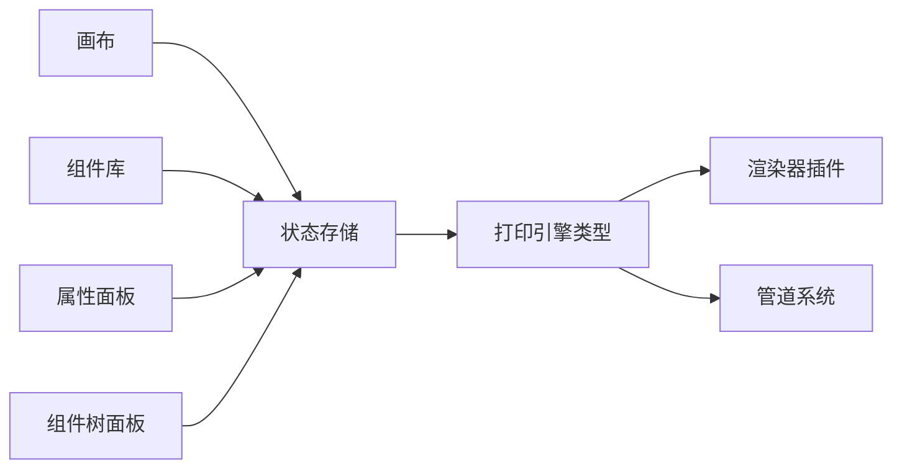

# 核心特性

<cite>
**本文引用的文件**
- [Designer 主界面](file://designer/src/pages/Designer/index.tsx)
- [画布区域](file://designer/src/pages/Designer/components/Canvas/index.tsx)
- [组件库](file://designer/src/pages/Designer/components/AssetPanel/ComponentLibrary/index.tsx)
- [属性面板](file://designer/src/pages/Designer/components/PropertyPanel/index.tsx)
- [组件树面板](file://designer/src/pages/Designer/components/ComponentTreePanel/index.tsx)
- [智能对齐参考线](file://designer/src/pages/Designer/components/Canvas/AlignmentGuides.tsx)
- [对齐检测工具](file://designer/src/pages/Designer/components/Canvas/alignmentDetector.ts)
- [设计器状态存储](file://designer/src/store/designer.ts)
- [设计器类型定义](file://designer/src/types/index.ts)
- [管道系统入口](file://designer/src/pipes/index.ts)
- [SDK 渲染器类型](file://sdk/src/printEngine/types.ts)
- [SDK 渲染器导出](file://sdk/src/printEngine/renderers/index.ts)
- [SDK 管道注册器](file://sdk/src/pipes/registry.ts)
- [SDK 类型定义](file://sdk/src/types.ts)
</cite>

## 目录
1. [简介](#简介)
2. [项目结构](#项目结构)
3. [核心组件](#核心组件)
4. [架构概览](#架构概览)
5. [详细组件分析](#详细组件分析)
6. [依赖分析](#依赖分析)
7. [性能考量](#性能考量)
8. [故障排查指南](#故障排查指南)
9. [结论](#结论)
10. [附录](#附录)

## 简介
本文件面向打印设计器项目，系统性梳理其核心特性与实现要点，重点覆盖：
- 可视化模板设计器的三栏布局设计与三区域画布（页头/内容/页脚）
- 智能网格吸附与对齐参考线
- 组件树面板与属性面板
- 丰富组件库（文本、表格、图片、二维码、条形码、线条、矩形等）
- 数据绑定系统（Schema 驱动、点号路径安全取值、数组字段自动生成表格）
- 插件化管道系统（八大内置管道类型）
- 高级打印引擎（相对间距分页模型、表格高级功能、渲染器插件化）

## 项目结构
打印设计器采用“设计器前端 + SDK 渲染引擎”的分层架构：
- 设计器前端负责可视化编辑体验（组件库、画布、属性面板、组件树、网格/对齐、缩放等）
- SDK 负责渲染执行（渲染器插件化、管道系统、分页与表格高级能力）

图表来源
- [Designer 主界面:1-365](file://designer/src/pages/Designer/index.tsx#L1-L365)
- [画布区域:1-800](file://designer/src/pages/Designer/components/Canvas/index.tsx#L1-L800)
- [组件库:1-238](file://designer/src/pages/Designer/components/AssetPanel/ComponentLibrary/index.tsx#L1-L238)
- [属性面板:1-152](file://designer/src/pages/Designer/components/PropertyPanel/index.tsx#L1-L152)
- [组件树面板:1-159](file://designer/src/pages/Designer/components/ComponentTreePanel/index.tsx#L1-L159)
- [设计器状态存储:1-773](file://designer/src/store/designer.ts#L1-L773)
- [设计器类型定义:1-378](file://designer/src/types/index.ts#L1-L378)
- [SDK 渲染器类型:1-116](file://sdk/src/printEngine/types.ts#L1-L116)
- [SDK 渲染器导出:1-13](file://sdk/src/printEngine/renderers/index.ts#L1-L13)
- [SDK 管道注册器:1-65](file://sdk/src/pipes/registry.ts#L1-L65)

章节来源
- [Designer 主界面:1-365](file://designer/src/pages/Designer/index.tsx#L1-L365)
- [设计器状态存储:1-773](file://designer/src/store/designer.ts#L1-L773)
- [设计器类型定义:1-378](file://designer/src/types/index.ts#L1-L378)

## 核心组件
- 三栏布局设计
  - 左侧组件库（基础/装饰/编码组件分类）
  - 中央画布（三区域：页头/内容/页脚）
  - 右侧属性面板（布局/样式/数据绑定/表格列）
- 三区域画布
  - 页头/页脚区域可配置高度与开关
  - 内容区域支持绝对定位布局与跨区域移动
- 智能网格吸附与对齐参考线
  - 网格吸附（可按住 Shift 临时禁用）
  - 拖拽时显示对齐参考线，支持多组件对齐与分布
- 组件树面板
  - 三区域分组展示，支持右键菜单复制/删除
- 丰富组件库
  - 文本、图片、表格、线条、二维码、条形码、矩形
  - 每个组件提供默认布局与样式，支持拖拽精确放置
- 数据绑定系统
  - Schema 驱动，支持点号路径取值与管道转换
  - 数组字段自动识别并生成表格组件
- 插件化管道系统
  - 八大内置执行器（日期、货币、金额、大写、小写、切片、默认、中文大写）
  - UI 配置器与 SDK 执行器分离
- 高级打印引擎
  - 渲染器插件化（Text/Table/Image/Rect/Line/QRCode/Barcode/PageNumber）
  - 相对间距分页模型、表格跨页重复表头、合计与额外行

章节来源
- [组件库:1-238](file://designer/src/pages/Designer/components/AssetPanel/ComponentLibrary/index.tsx#L1-L238)
- [画布区域:1-800](file://designer/src/pages/Designer/components/Canvas/index.tsx#L1-L800)
- [智能对齐参考线:1-66](file://designer/src/pages/Designer/components/Canvas/AlignmentGuides.tsx#L1-L66)
- [对齐检测工具:1-127](file://designer/src/pages/Designer/components/Canvas/alignmentDetector.ts#L1-L127)
- [组件树面板:1-159](file://designer/src/pages/Designer/components/ComponentTreePanel/index.tsx#L1-L159)
- [属性面板:1-152](file://designer/src/pages/Designer/components/PropertyPanel/index.tsx#L1-L152)
- [设计器状态存储:1-773](file://designer/src/store/designer.ts#L1-L773)
- [设计器类型定义:1-378](file://designer/src/types/index.ts#L1-L378)
- [管道系统入口:1-11](file://designer/src/pipes/index.ts#L1-L11)
- [SDK 渲染器类型:1-116](file://sdk/src/printEngine/types.ts#L1-L116)
- [SDK 渲染器导出:1-13](file://sdk/src/printEngine/renderers/index.ts#L1-L13)
- [SDK 管道注册器:1-65](file://sdk/src/pipes/registry.ts#L1-L65)
- [SDK 类型定义:1-228](file://sdk/src/types.ts#L1-L228)

## 架构概览
设计器前端与 SDK 渲染引擎通过统一的模板与类型定义协作：
- 设计器生成包含页面配置、组件列表与数据绑定的模板
- SDK 接收模板，解析绑定路径与管道，按渲染器插件输出 HTML/分页

图表来源
- [设计器状态存储:1-773](file://designer/src/store/designer.ts#L1-L773)
- [SDK 渲染器类型:1-116](file://sdk/src/printEngine/types.ts#L1-L116)
- [SDK 类型定义:1-228](file://sdk/src/types.ts#L1-L228)

## 详细组件分析

### 三栏布局与三区域画布
- 三栏布局
  - 左侧组件库：基础/装饰/编码三大类，支持双击快速添加与拖拽放置
  - 中央画布：三区域（页头/内容/页脚），支持区域高度拖拽调整与跨区域移动
  - 右侧属性面板：布局/样式/数据绑定/表格列管理
- 三区域画布
  - 页头/页脚区域高度可配置，最小高度限制与网格吸附
  - 内容区域支持绝对定位与跨区域移动（表格不允许进入页头/页脚）

图表来源
- [画布区域:281-479](file://designer/src/pages/Designer/components/Canvas/index.tsx#L281-L479)
- [组件库:152-180](file://designer/src/pages/Designer/components/AssetPanel/ComponentLibrary/index.tsx#L152-L180)

章节来源
- [Designer 主界面:24-315](file://designer/src/pages/Designer/index.tsx#L24-L315)
- [画布区域:1-800](file://designer/src/pages/Designer/components/Canvas/index.tsx#L1-L800)
- [组件库:1-238](file://designer/src/pages/Designer/components/AssetPanel/ComponentLibrary/index.tsx#L1-L238)

### 智能网格吸附与对齐参考线
- 网格吸附
  - 可配置网格大小（默认 5mm），支持按住 Shift 临时禁用
- 对齐参考线
  - 拖拽时检测与其它组件的对齐关系，显示垂直/水平参考线
  - 吸附阈值（约 0.8mm），避免频繁抖动
  - 将毫米坐标转换为缩放后的像素用于渲染

图表来源
- [对齐检测工具:31-126](file://designer/src/pages/Designer/components/Canvas/alignmentDetector.ts#L31-L126)
- [智能对齐参考线:21-63](file://designer/src/pages/Designer/components/Canvas/AlignmentGuides.tsx#L21-L63)
- [画布区域:582-599](file://designer/src/pages/Designer/components/Canvas/index.tsx#L582-L599)

章节来源
- [对齐检测工具:1-127](file://designer/src/pages/Designer/components/Canvas/alignmentDetector.ts#L1-L127)
- [智能对齐参考线:1-66](file://designer/src/pages/Designer/components/Canvas/AlignmentGuides.tsx#L1-L66)
- [画布区域:99-106](file://designer/src/pages/Designer/components/Canvas/index.tsx#L99-L106)

### 组件树面板与属性面板
- 组件树面板
  - 三区域分组展示，支持右键菜单复制/删除
  - 点击树节点可滚动到画布并选中组件
- 属性面板
  - 布局属性（x/y/宽/高/zIndex）
  - 样式属性（插件化，不同组件类型支持不同样式）
  - 数据绑定（路径/管道/回退值）
  - 表格列管理（仅表格组件）

图表来源
- [组件树面板:66-159](file://designer/src/pages/Designer/components/ComponentTreePanel/index.tsx#L66-L159)
- [属性面板:17-152](file://designer/src/pages/Designer/components/PropertyPanel/index.tsx#L17-L152)
- [设计器状态存储:108-773](file://designer/src/store/designer.ts#L108-L773)

章节来源
- [组件树面板:1-159](file://designer/src/pages/Designer/components/ComponentTreePanel/index.tsx#L1-L159)
- [属性面板:1-152](file://designer/src/pages/Designer/components/PropertyPanel/index.tsx#L1-L152)
- [设计器状态存储:1-773](file://designer/src/store/designer.ts#L1-L773)

### 丰富组件库与拖拽放置
- 组件类型
  - 文本、图片、表格、线条、二维码、条形码、矩形
- 默认布局与样式
  - 每个组件提供默认尺寸/位置/样式，支持拖拽精确放置
- 拖拽行为
  - 双击快速添加；拖拽时应用网格吸附与边界约束
  - 数据资产拖拽：根据字段类型生成文本或表格组件

图表来源
- [组件库:152-180](file://designer/src/pages/Designer/components/AssetPanel/ComponentLibrary/index.tsx#L152-L180)
- [画布区域:281-479](file://designer/src/pages/Designer/components/Canvas/index.tsx#L281-L479)
- [设计器状态存储:113-125](file://designer/src/store/designer.ts#L113-L125)

章节来源
- [组件库:1-238](file://designer/src/pages/Designer/components/AssetPanel/ComponentLibrary/index.tsx#L1-L238)
- [画布区域:281-479](file://designer/src/pages/Designer/components/Canvas/index.tsx#L281-L479)
- [设计器状态存储:113-125](file://designer/src/store/designer.ts#L113-L125)

### 数据绑定系统（Schema 驱动）
- Schema 字段类型
  - string/number/boolean/date/datetime/object/array
- 数据绑定
  - 支持点号路径（如 'user.name'）安全取值
  - 支持管道链式转换（如日期格式化、金额格式化）
  - 回退值 fallback
- 数组字段自动生成表格
  - 拖拽数组字段到画布时，自动识别子字段生成表格列
  - 表格组件默认宽度铺满可用区域

图表来源
- [画布区域:415-479](file://designer/src/pages/Designer/components/Canvas/index.tsx#L415-L479)
- [设计器类型定义:15-33](file://designer/src/types/index.ts#L15-L33)
- [SDK 类型定义:82-86](file://sdk/src/types.ts#L82-L86)

章节来源
- [画布区域:415-479](file://designer/src/pages/Designer/components/Canvas/index.tsx#L415-L479)
- [设计器类型定义:1-378](file://designer/src/types/index.ts#L1-L378)
- [SDK 类型定义:1-228](file://sdk/src/types.ts#L1-L228)

### 插件化管道系统（八大内置管道）
- 管道注册与执行
  - 注册器集中管理执行器，提供获取/执行/列举能力
  - 执行器类型：日期、货币、金额、大写、小写、切片、默认、中文大写
- 设计器集成
  - UI 配置器负责可视化配置（格式/参数）
  - 执行器由 SDK 导入并在渲染阶段应用

图表来源
- [SDK 管道注册器:1-65](file://sdk/src/pipes/registry.ts#L1-L65)
- [管道系统入口:1-11](file://designer/src/pipes/index.ts#L1-L11)

章节来源
- [SDK 管道注册器:1-65](file://sdk/src/pipes/registry.ts#L1-L65)
- [管道系统入口:1-11](file://designer/src/pipes/index.ts#L1-L11)

### 高级打印引擎（渲染器插件化与分页）
- 渲染器插件化
  - Text/Table/Image/Rect/Line/QRCode/Barcode/PageNumber
  - 统一渲染上下文：数据、绑定解析、管道应用、页面信息
- 相对间距分页模型
  - 组件高度计算（部分渲染器支持）
  - 页面层级（流式层/覆盖层）
- 表格高级功能
  - 跨页重复表头、合计与额外行、序号列、边框样式、列宽与对齐

图表来源
- [SDK 渲染器类型:11-82](file://sdk/src/printEngine/types.ts#L11-L82)
- [SDK 渲染器导出:1-13](file://sdk/src/printEngine/renderers/index.ts#L1-L13)

章节来源
- [SDK 渲染器类型:1-116](file://sdk/src/printEngine/types.ts#L1-L116)
- [SDK 渲染器导出:1-13](file://sdk/src/printEngine/renderers/index.ts#L1-L13)

## 依赖分析
- 组件耦合
  - 画布与状态存储强耦合，负责拖拽、吸附、对齐、区域移动与撤销重做
  - 属性面板与组件树面板均依赖状态存储进行组件选择与更新
- 外部依赖
  - Ant Design UI 组件库
  - Zustand 状态管理
  - SDK 渲染引擎（渲染器/管道/类型）

图表来源
- [设计器状态存储:1-773](file://designer/src/store/designer.ts#L1-L773)
- [SDK 渲染器类型:1-116](file://sdk/src/printEngine/types.ts#L1-L116)
- [SDK 管道注册器:1-65](file://sdk/src/pipes/registry.ts#L1-L65)

章节来源
- [设计器状态存储:1-773](file://designer/src/store/designer.ts#L1-L773)
- [SDK 渲染器类型:1-116](file://sdk/src/printEngine/types.ts#L1-L116)
- [SDK 管道注册器:1-65](file://sdk/src/pipes/registry.ts#L1-L65)

## 性能考量
- 状态更新与重渲染
  - 使用 Zustand 管理组件列表与页面配置，避免不必要的重渲染
  - 撤销/重做采用全量快照，限制历史步数（最多 20 步）
- 拖拽性能
  - 使用 useRef 缓存状态与回调，减少事件监听器重绑
  - 对齐检测与吸附在毫米层面计算，避免缩放影响
- 渲染性能
  - 渲染器插件化，按需渲染组件
  - 分页模型基于相对间距，减少复杂布局计算

## 故障排查指南
- 组件无法拖入页头/页脚
  - 场景：拖拽表格到页头/页脚区域被阻止
  - 原因：表格组件不允许放入页头/页脚
  - 处理：将表格放入内容区域
- 组件超出画布边界
  - 场景：拖拽组件越界提示
  - 原因：连续纸模式仅检测宽度；普通纸张同时检测宽度与高度
  - 处理：调整组件位置或缩小尺寸
- 对齐参考线不显示
  - 场景：拖拽时无对齐线
  - 原因：距离超过吸附阈值（约 0.8mm）
  - 处理：靠近其他组件或关闭吸附以观察效果
- 管道未生效
  - 场景：数据绑定后格式未变化
  - 原因：管道类型或参数配置错误
  - 处理：检查管道配置器与执行器注册情况

章节来源
- [画布区域:222-279](file://designer/src/pages/Designer/components/Canvas/index.tsx#L222-L279)
- [对齐检测工具:11-127](file://designer/src/pages/Designer/components/Canvas/alignmentDetector.ts#L11-L127)
- [SDK 管道注册器:44-52](file://sdk/src/pipes/registry.ts#L44-L52)

## 结论
打印设计器通过“可视化编辑 + 插件化渲染”的架构，实现了：
- 高效的三栏布局与三区域画布编辑体验
- 智能网格吸附与对齐参考线提升布局精度
- 丰富的组件库与数据绑定系统，支持 Schema 驱动与数组字段自动生成表格
- 八大内置管道与可扩展的管道注册机制
- 高级打印引擎的渲染器插件化与相对间距分页模型，满足复杂打印场景

## 附录
- 使用场景示例
  - 快速制作发票模板：拖拽文本/线条/表格组件，绑定数据字段，应用日期/货币管道
  - 制作产品目录：使用图片组件与表格组件，配置边框与列宽，启用跨页重复表头
  - 制作标签模板：利用网格吸附与对齐参考线，保证批量打印的整齐一致