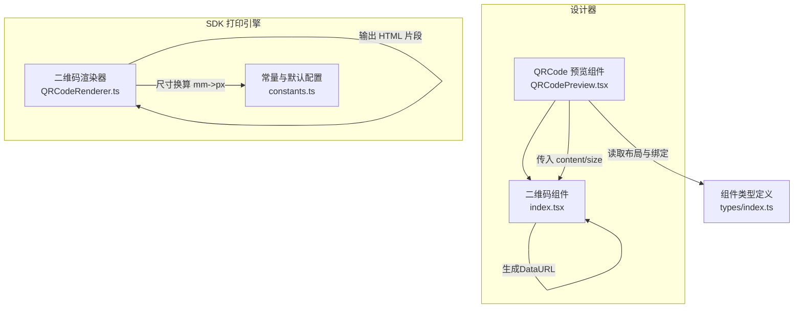
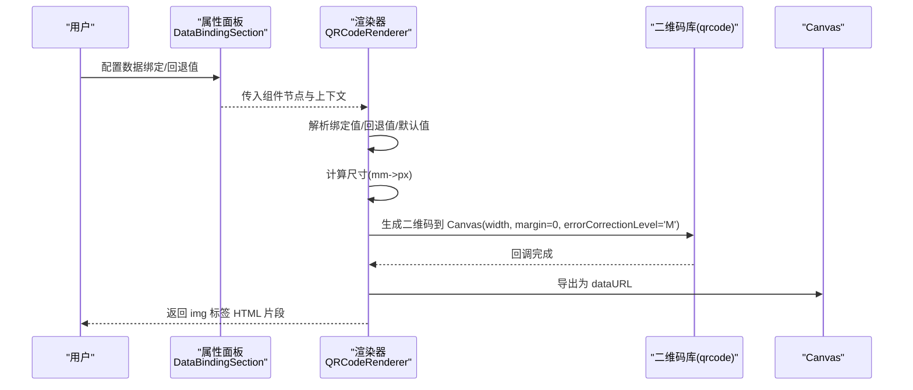
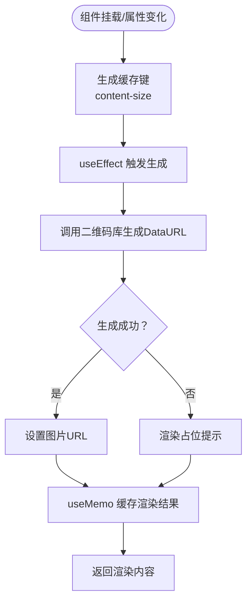
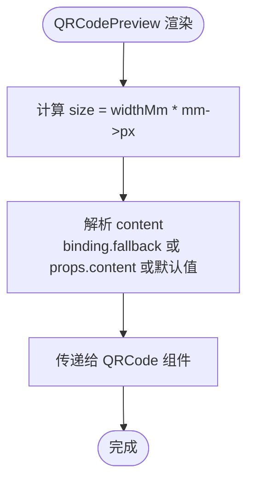
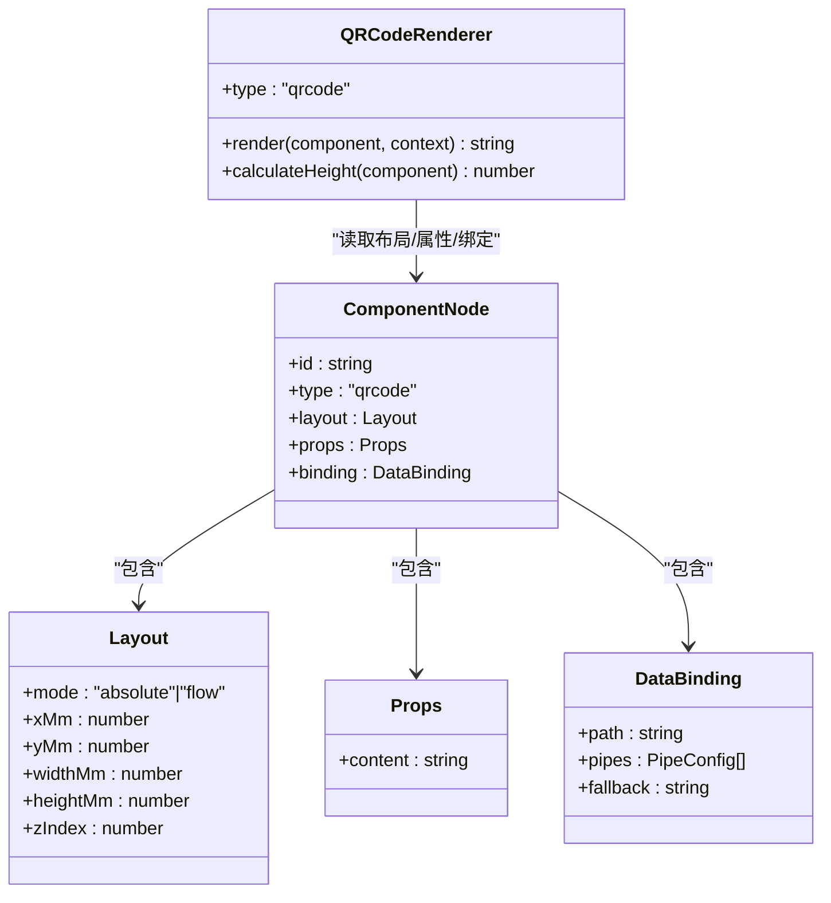
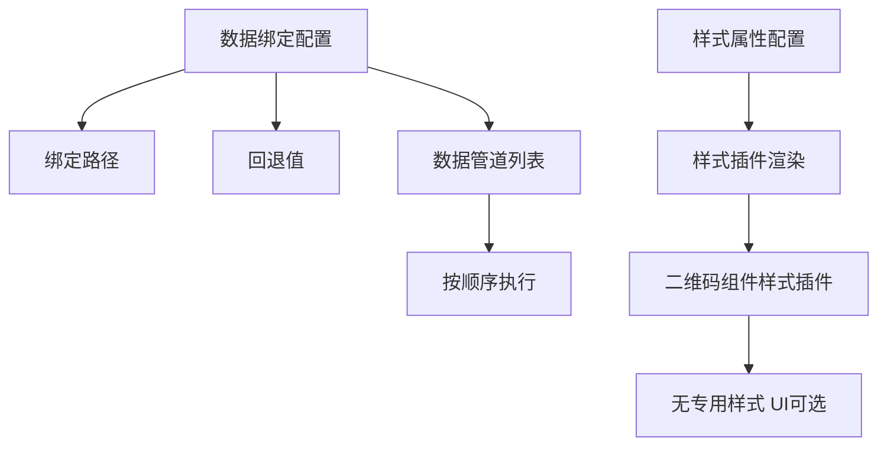
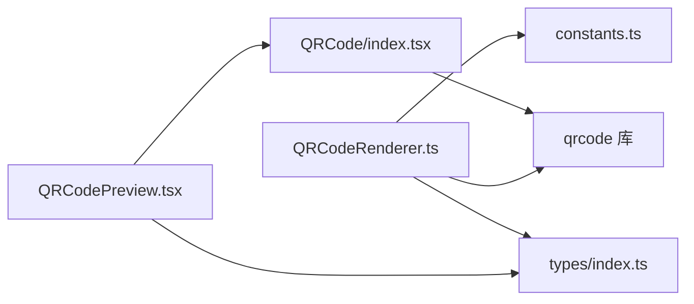

# 二维码组件

<cite>
**本文引用的文件**
- [designer/src/components/QRCode/index.tsx](file://designer/src/components/QRCode/index.tsx)
- [designer/src/pages/Designer/components/Canvas/componentRenderers/QRCodePreview.tsx](file://designer/src/pages/Designer/components/Canvas/componentRenderers/QRCodePreview.tsx)
- [sdk/src/printEngine/renderers/QRCodeRenderer.ts](file://sdk/src/printEngine/renderers/QRCodeRenderer.ts)
- [sdk/src/printEngine/constants.ts](file://sdk/src/printEngine/constants.ts)
- [designer/src/types/index.ts](file://designer/src/types/index.ts)
- [designer/src/pages/Designer/components/PropertyPanel/DataBindingSection.tsx](file://designer/src/pages/Designer/components/PropertyPanel/DataBindingSection.tsx)
- [designer/src/pages/Designer/components/PropertyPanel/StyleSection.tsx](file://designer/src/pages/Designer/components/PropertyPanel/StyleSection.tsx)
</cite>

## 目录
1. [简介](#简介)
2. [项目结构](#项目结构)
3. [核心组件](#核心组件)
4. [架构总览](#架构总览)
5. [详细组件分析](#详细组件分析)
6. [依赖分析](#依赖分析)
7. [性能考虑](#性能考虑)
8. [故障排查指南](#故障排查指南)
9. [结论](#结论)
10. [附录](#附录)

## 简介
本文件系统性介绍二维码组件的设计与实现，覆盖以下方面：
- 动态二维码生成：基于输入内容实时生成二维码图像
- 数据绑定：支持静态内容与动态数据绑定，含回退值与数据管道
- 尺寸与样式：通过布局参数控制尺寸，支持边距与像素密度控制
- 渲染引擎：浏览器端同步绘制到 Canvas 并输出为图片
- 设计器交互：预览组件与属性面板联动，支持在画布中编辑与调试
- 实际应用：在打印模板中嵌入动态二维码的配置方法与示例思路

## 项目结构
二维码组件在设计器与打印 SDK 中分别提供“预览”和“渲染”两种实现，二者协同工作：
- 设计器侧预览组件：用于可视化编辑与调试
- SDK 侧渲染器：用于生成最终 HTML/图片嵌入打印模板

**图表来源**
- [designer/src/pages/Designer/components/Canvas/componentRenderers/QRCodePreview.tsx:1-17](file://designer/src/pages/Designer/components/Canvas/componentRenderers/QRCodePreview.tsx#L1-L17)
- [designer/src/components/QRCode/index.tsx:1-52](file://designer/src/components/QRCode/index.tsx#L1-L52)
- [sdk/src/printEngine/renderers/QRCodeRenderer.ts:1-63](file://sdk/src/printEngine/renderers/QRCodeRenderer.ts#L1-L63)
- [sdk/src/printEngine/constants.ts:1-113](file://sdk/src/printEngine/constants.ts#L1-L113)
- [designer/src/types/index.ts:300-331](file://designer/src/types/index.ts#L300-L331)

**章节来源**
- [designer/src/pages/Designer/components/Canvas/componentRenderers/QRCodePreview.tsx:1-17](file://designer/src/pages/Designer/components/Canvas/componentRenderers/QRCodePreview.tsx#L1-L17)
- [designer/src/components/QRCode/index.tsx:1-52](file://designer/src/components/QRCode/index.tsx#L1-L52)
- [sdk/src/printEngine/renderers/QRCodeRenderer.ts:1-63](file://sdk/src/printEngine/renderers/QRCodeRenderer.ts#L1-L63)
- [sdk/src/printEngine/constants.ts:1-113](file://sdk/src/printEngine/constants.ts#L1-L113)
- [designer/src/types/index.ts:300-331](file://designer/src/types/index.ts#L300-L331)

## 核心组件
- 二维码组件（React 组件）：负责接收内容与尺寸，使用外部库生成二维码数据，并以图片形式渲染
- 二维码预览组件（设计器）：读取组件布局与数据绑定，将内容与尺寸传递给二维码组件
- 二维码渲染器（SDK）：在打印引擎中同步生成二维码到 Canvas，导出为 base64 图片并嵌入 img 标签

关键能力与限制：
- 内容来源：优先使用数据绑定解析后的值；若为空则回退到组件属性 content；若仍为空则使用默认内容
- 尺寸来源：预览组件使用布局宽度（mm）乘以像素密度换算得到像素；渲染器同样使用布局宽度（mm）换算为像素
- 边距：生成时 margin 设置为 0，保证二维码紧贴容器边界
- 错误处理：生成失败时返回占位提示或空状态

**章节来源**
- [designer/src/components/QRCode/index.tsx:10-49](file://designer/src/components/QRCode/index.tsx#L10-L49)
- [designer/src/pages/Designer/components/Canvas/componentRenderers/QRCodePreview.tsx:11-16](file://designer/src/pages/Designer/components/Canvas/componentRenderers/QRCodePreview.tsx#L11-L16)
- [sdk/src/printEngine/renderers/QRCodeRenderer.ts:15-57](file://sdk/src/printEngine/renderers/QRCodeRenderer.ts#L15-L57)
- [sdk/src/printEngine/constants.ts:106-112](file://sdk/src/printEngine/constants.ts#L106-L112)

## 架构总览
二维码组件在“设计时”和“运行时”的两条路径如下：

**图表来源**
- [sdk/src/printEngine/renderers/QRCodeRenderer.ts:15-57](file://sdk/src/printEngine/renderers/QRCodeRenderer.ts#L15-L57)
- [sdk/src/printEngine/constants.ts:8](file://sdk/src/printEngine/constants.ts#L8)

**章节来源**
- [sdk/src/printEngine/renderers/QRCodeRenderer.ts:15-57](file://sdk/src/printEngine/renderers/QRCodeRenderer.ts#L15-L57)
- [sdk/src/printEngine/constants.ts:8](file://sdk/src/printEngine/constants.ts#L8)

## 详细组件分析

### 设计器侧二维码组件（React）
- 输入属性：content（字符串）、size（像素）
- 缓存策略：基于 content 与 size 组合生成缓存键，避免重复生成
- 渲染逻辑：生成成功则渲染图片，否则渲染占位提示（带图标与样式）

**图表来源**
- [designer/src/components/QRCode/index.tsx:13-46](file://designer/src/components/QRCode/index.tsx#L13-L46)

**章节来源**
- [designer/src/components/QRCode/index.tsx:10-49](file://designer/src/components/QRCode/index.tsx#L10-L49)

### 设计器侧二维码预览组件
- 尺寸计算：将布局宽度（mm）乘以像素密度换算为像素
- 内容来源：优先使用绑定的回退值，其次使用组件属性 content，最后使用默认值
- 传递给二维码组件：将 content 与 size 作为 props 传入

**图表来源**
- [designer/src/pages/Designer/components/Canvas/componentRenderers/QRCodePreview.tsx:11-16](file://designer/src/pages/Designer/components/Canvas/componentRenderers/QRCodePreview.tsx#L11-L16)

**章节来源**
- [designer/src/pages/Designer/components/Canvas/componentRenderers/QRCodePreview.tsx:11-16](file://designer/src/pages/Designer/components/Canvas/componentRenderers/QRCodePreview.tsx#L11-L16)

### SDK 侧二维码渲染器
- 输入：组件节点（包含布局、属性、绑定）、渲染上下文（含 mm->px 换算）
- 处理流程：
  - 解析绑定值，回退到 props.content，再回退到默认内容
  - 计算尺寸：widthMm 乘以 mm->px 得到像素
  - 使用 qrcode 库同步绘制到 Canvas，设置 margin=0、纠错级别 M
  - 导出为 dataURL 并拼装为 img 标签 HTML 片段
  - 异常时返回占位提示
- 高度计算：返回布局高度（mm）或默认尺寸

**图表来源**
- [sdk/src/printEngine/renderers/QRCodeRenderer.ts:12-62](file://sdk/src/printEngine/renderers/QRCodeRenderer.ts#L12-L62)
- [designer/src/types/index.ts:303-331](file://designer/src/types/index.ts#L303-L331)

**章节来源**
- [sdk/src/printEngine/renderers/QRCodeRenderer.ts:15-61](file://sdk/src/printEngine/renderers/QRCodeRenderer.ts#L15-L61)
- [sdk/src/printEngine/constants.ts:8](file://sdk/src/printEngine/constants.ts#L8)
- [sdk/src/printEngine/constants.ts:106-112](file://sdk/src/printEngine/constants.ts#L106-L112)
- [designer/src/types/index.ts:303-331](file://designer/src/types/index.ts#L303-L331)

### 数据绑定与样式配置
- 数据绑定区域：支持绑定路径、回退值、数据管道（按顺序执行）
- 样式属性区域：根据组件类型动态加载样式插件；二维码属于装饰性组件，样式插件可能不提供专用 UI

**图表来源**
- [designer/src/pages/Designer/components/PropertyPanel/DataBindingSection.tsx:20-125](file://designer/src/pages/Designer/components/PropertyPanel/DataBindingSection.tsx#L20-L125)
- [designer/src/pages/Designer/components/PropertyPanel/StyleSection.tsx:17-33](file://designer/src/pages/Designer/components/PropertyPanel/StyleSection.tsx#L17-L33)

**章节来源**
- [designer/src/pages/Designer/components/PropertyPanel/DataBindingSection.tsx:20-125](file://designer/src/pages/Designer/components/PropertyPanel/DataBindingSection.tsx#L20-L125)
- [designer/src/pages/Designer/components/PropertyPanel/StyleSection.tsx:17-33](file://designer/src/pages/Designer/components/PropertyPanel/StyleSection.tsx#L17-L33)

## 依赖分析
- 外部库依赖：二维码生成依赖 qrcode 库（浏览器端）
- 内部依赖：
  - 渲染器依赖常量配置（像素密度、默认尺寸、默认内容）
  - 预览组件依赖组件类型定义（布局、属性、绑定）
  - 属性面板依赖组件类型与数据绑定结构

**图表来源**
- [designer/src/pages/Designer/components/Canvas/componentRenderers/QRCodePreview.tsx:1-16](file://designer/src/pages/Designer/components/Canvas/componentRenderers/QRCodePreview.tsx#L1-L16)
- [designer/src/components/QRCode/index.tsx:1-3](file://designer/src/components/QRCode/index.tsx#L1-L3)
- [sdk/src/printEngine/renderers/QRCodeRenderer.ts:6-10](file://sdk/src/printEngine/renderers/QRCodeRenderer.ts#L6-L10)
- [sdk/src/printEngine/constants.ts:8](file://sdk/src/printEngine/constants.ts#L8)

**章节来源**
- [designer/src/pages/Designer/components/Canvas/componentRenderers/QRCodePreview.tsx:1-16](file://designer/src/pages/Designer/components/Canvas/componentRenderers/QRCodePreview.tsx#L1-L16)
- [designer/src/components/QRCode/index.tsx:1-3](file://designer/src/components/QRCode/index.tsx#L1-L3)
- [sdk/src/printEngine/renderers/QRCodeRenderer.ts:6-10](file://sdk/src/printEngine/renderers/QRCodeRenderer.ts#L6-L10)
- [sdk/src/printEngine/constants.ts:8](file://sdk/src/printEngine/constants.ts#L8)

## 性能考虑
- 生成缓存：预览组件使用 useMemo 与组合缓存键，减少重复生成
- 同步生成：SDK 渲染器在浏览器端同步生成 Canvas，避免异步等待，但需注意大尺寸时的 CPU 占用
- 边距与纠错：margin=0 且纠错级别 M，在保证清晰度的同时降低像素密度与内存占用
- 尺寸换算：统一使用 mm->px 换算常量，确保设计与打印一致性

优化建议：
- 大批量二维码时，考虑在后台线程或服务端生成并返回 dataURL
- 对高频更新场景，增加节流/防抖策略
- 预览与渲染保持一致的纠错级别与 margin，避免视觉差异

**章节来源**
- [designer/src/components/QRCode/index.tsx:13-20](file://designer/src/components/QRCode/index.tsx#L13-L20)
- [sdk/src/printEngine/renderers/QRCodeRenderer.ts:32-48](file://sdk/src/printEngine/renderers/QRCodeRenderer.ts#L32-L48)
- [sdk/src/printEngine/constants.ts:8](file://sdk/src/printEngine/constants.ts#L8)

## 故障排查指南
常见问题与处理：
- 二维码空白或占位提示
  - 检查内容是否为空，确认绑定路径与回退值
  - 确认尺寸是否过小导致不可识别
- 生成异常
  - 查看控制台错误日志，检查 qrcode 库回调错误
  - 渲染器捕获异常并返回占位提示，便于定位问题
- 尺寸不一致
  - 确认布局宽度（mm）与像素密度换算一致
  - 预览与渲染器使用相同 mm->px 常量

**章节来源**
- [sdk/src/printEngine/renderers/QRCodeRenderer.ts:52-56](file://sdk/src/printEngine/renderers/QRCodeRenderer.ts#L52-L56)
- [designer/src/pages/Designer/components/Canvas/componentRenderers/QRCodePreview.tsx:11-16](file://designer/src/pages/Designer/components/Canvas/componentRenderers/QRCodePreview.tsx#L11-L16)

## 结论
二维码组件在设计器与 SDK 中分别承担“可视化预览”和“打印渲染”的职责，二者通过统一的数据结构与尺寸换算协同工作。组件具备良好的扩展性：支持数据绑定、回退值与数据管道，尺寸与边距可控，渲染引擎稳定可靠。在实际应用中，建议结合数据绑定与属性面板配置，确保内容、尺寸与打印效果一致。

## 附录

### 属性与配置清单
- 组件属性
  - content：二维码内容（字符串）
  - size：二维码尺寸（像素）
- 组件节点（布局/属性/绑定）
  - layout.widthMm：组件宽度（mm）
  - props.content：默认内容
  - binding.path/fallback/pipes：数据绑定与回退值
- 渲染常量
  - mm->px 换算系数
  - 二维码默认尺寸与默认内容

**章节来源**
- [designer/src/components/QRCode/index.tsx:5-8](file://designer/src/components/QRCode/index.tsx#L5-L8)
- [designer/src/types/index.ts:309-322](file://designer/src/types/index.ts#L309-L322)
- [sdk/src/printEngine/constants.ts:8](file://sdk/src/printEngine/constants.ts#L8)
- [sdk/src/printEngine/constants.ts:109-112](file://sdk/src/printEngine/constants.ts#L109-L112)

### 实际使用示例（思路）
- 在打印模板中添加二维码组件
  - 设置布局宽度（mm），渲染器会据此换算像素
  - 配置数据绑定：填写数据路径与回退值，必要时添加数据管道
  - 在设计器中预览效果，确认内容与尺寸
  - 导出模板并使用 SDK 渲染，生成包含二维码的 HTML/图片

**章节来源**
- [designer/src/pages/Designer/components/Canvas/componentRenderers/QRCodePreview.tsx:11-16](file://designer/src/pages/Designer/components/Canvas/componentRenderers/QRCodePreview.tsx#L11-L16)
- [designer/src/pages/Designer/components/PropertyPanel/DataBindingSection.tsx:20-125](file://designer/src/pages/Designer/components/PropertyPanel/DataBindingSection.tsx#L20-L125)
- [sdk/src/printEngine/renderers/QRCodeRenderer.ts:15-57](file://sdk/src/printEngine/renderers/QRCodeRenderer.ts#L15-L57)