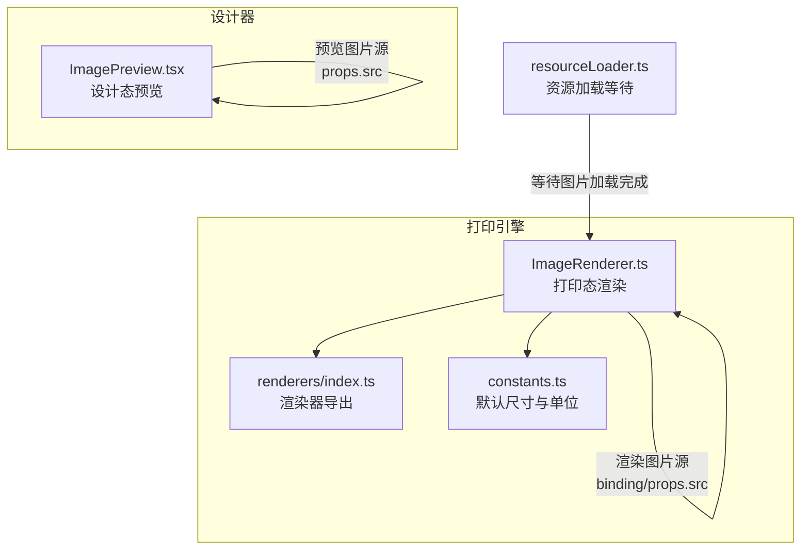
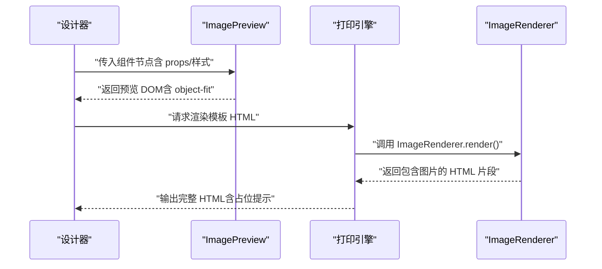
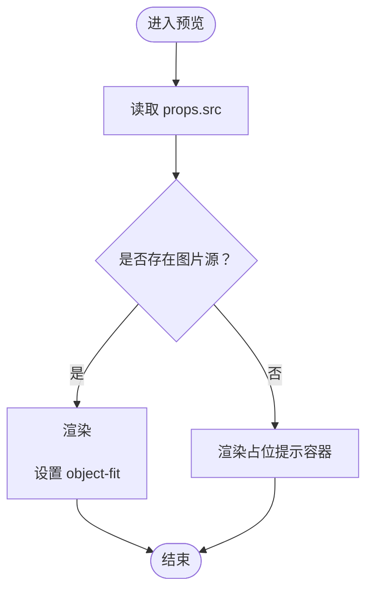
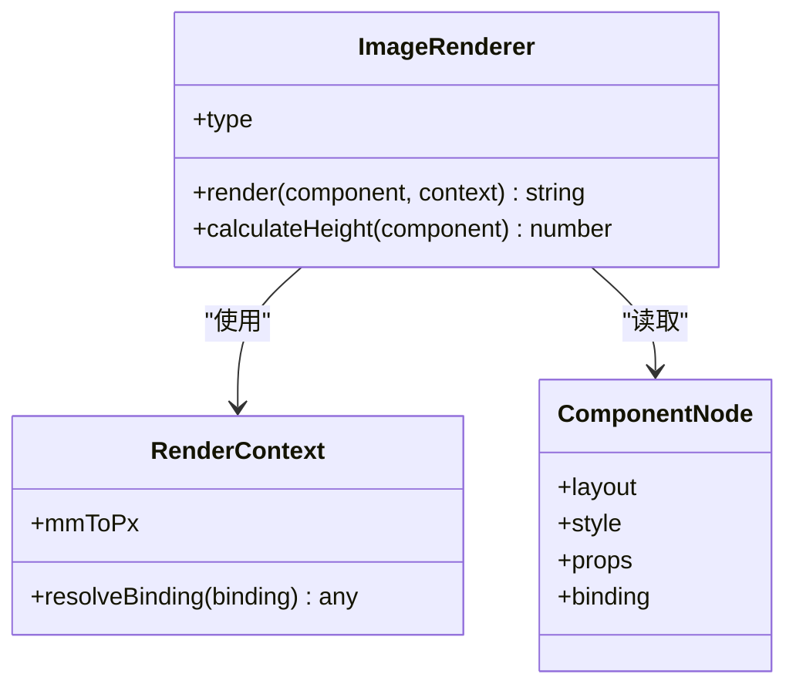
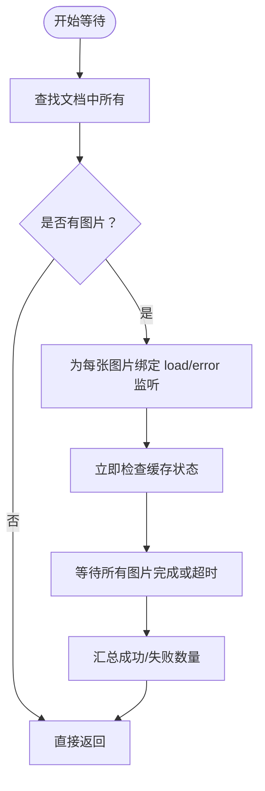
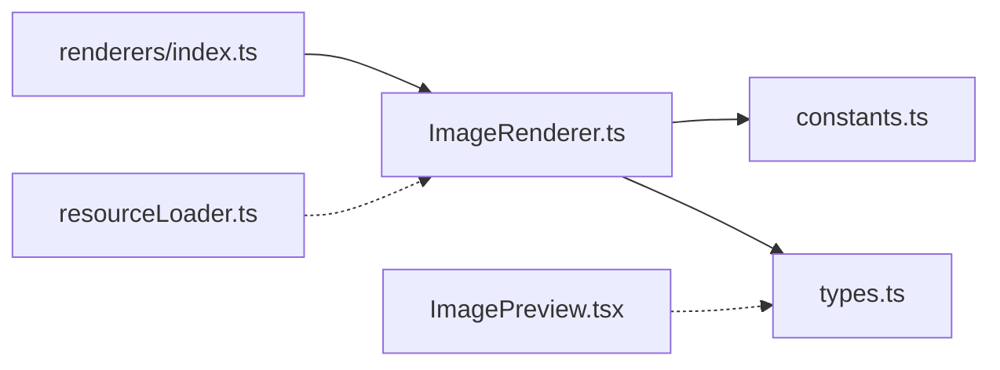

# 图片组件

<cite>
**本文引用的文件**
- [ImagePreview.tsx](file://designer/src/pages/Designer/components/Canvas/componentRenderers/ImagePreview.tsx)
- [ImageRenderer.ts](file://sdk/src/printEngine/renderers/ImageRenderer.ts)
- [resourceLoader.ts](file://sdk/src/utils/resourceLoader.ts)
- [constants.ts](file://sdk/src/printEngine/constants.ts)
- [index.ts](file://sdk/src/printEngine/renderers/index.ts)
- [types.ts](file://sdk/src/types.ts)
</cite>

## 目录
1. [简介](#简介)
2. [项目结构](#项目结构)
3. [核心组件](#核心组件)
4. [架构总览](#架构总览)
5. [详细组件分析](#详细组件分析)
6. [依赖分析](#依赖分析)
7. [性能考虑](#性能考虑)
8. [故障排查指南](#故障排查指南)
9. [结论](#结论)
10. [附录](#附录)

## 简介
本文件系统性地介绍图片组件的设计与实现，覆盖以下能力与特性：
- 图片来源：本地图片、远程图片、数据绑定动态源
- 尺寸控制：以毫米为单位的绝对布局与默认尺寸
- 图片裁剪与缩放：通过 object-fit 控制填充策略
- 渲染机制：设计态预览与打印态渲染两套实现
- 资源加载：异步加载等待、超时与错误处理
- 实际使用：属性配置、响应式最佳实践与多格式处理建议

## 项目结构
图片组件涉及两个层面的实现：
- 设计器侧预览：用于画布实时预览，强调交互与视觉一致性
- 打印引擎渲染：用于最终 HTML 输出，强调精度与跨设备稳定性

图表来源
- [ImagePreview.tsx:1-34](file://designer/src/pages/Designer/components/Canvas/componentRenderers/ImagePreview.tsx#L1-L34)
- [ImageRenderer.ts:1-55](file://sdk/src/printEngine/renderers/ImageRenderer.ts#L1-L55)
- [index.ts:1-13](file://sdk/src/printEngine/renderers/index.ts#L1-L13)
- [constants.ts:1-113](file://sdk/src/printEngine/constants.ts#L1-L113)
- [resourceLoader.ts:1-90](file://sdk/src/utils/resourceLoader.ts#L1-L90)

章节来源
- [ImagePreview.tsx:1-34](file://designer/src/pages/Designer/components/Canvas/componentRenderers/ImagePreview.tsx#L1-L34)
- [ImageRenderer.ts:1-55](file://sdk/src/printEngine/renderers/ImageRenderer.ts#L1-L55)
- [index.ts:1-13](file://sdk/src/printEngine/renderers/index.ts#L1-L13)
- [constants.ts:1-113](file://sdk/src/printEngine/constants.ts#L1-L113)
- [resourceLoader.ts:1-90](file://sdk/src/utils/resourceLoader.ts#L1-L90)

## 核心组件
- 设计态预览组件：负责在画布中即时展示图片，支持 object-fit 控制与占位提示。
- 打印态渲染器：负责将图片组件渲染为最终 HTML 片段，严格按毫米布局输出，并提供占位提示。

章节来源
- [ImagePreview.tsx:1-34](file://designer/src/pages/Designer/components/Canvas/componentRenderers/ImagePreview.tsx#L1-L34)
- [ImageRenderer.ts:1-55](file://sdk/src/printEngine/renderers/ImageRenderer.ts#L1-L55)

## 架构总览
图片组件在“设计态”和“打印态”分别采用不同的实现策略：
- 设计态：基于 React 的 ImagePreview，直接使用  展示，支持 object-fit 与占位提示。
- 打印态：基于 ImageRenderer，将组件布局转换为像素并输出 HTML，确保跨设备一致的排版。

图表来源
- [ImagePreview.tsx:1-34](file://designer/src/pages/Designer/components/Canvas/componentRenderers/ImagePreview.tsx#L1-L34)
- [ImageRenderer.ts:1-55](file://sdk/src/printEngine/renderers/ImageRenderer.ts#L1-L55)

## 详细组件分析

### 设计态预览组件（ImagePreview）
- 功能要点
  - 从组件节点读取图片源：优先使用 props.src，若为空则显示占位提示。
  - 使用内联样式控制最大宽高与 object-fit，保证预览符合预期。
  - 占位提示提供统一的视觉反馈，便于用户感知组件状态。
- 关键行为
  - 当存在图片源时，渲染  并应用 object-fit。
  - 当不存在图片源时，渲染带提示文字的容器，便于编辑器识别。

图表来源
- [ImagePreview.tsx:1-34](file://designer/src/pages/Designer/components/Canvas/componentRenderers/ImagePreview.tsx#L1-L34)

章节来源
- [ImagePreview.tsx:1-34](file://designer/src/pages/Designer/components/Canvas/componentRenderers/ImagePreview.tsx#L1-L34)

### 打印态渲染器（ImageRenderer）
- 功能要点
  - 解析组件布局：以毫米为单位，转换为像素并构建容器样式。
  - 解析图片源：优先使用数据绑定解析后的值，其次回退到 props.src。
  - 图片样式：严格按容器 100% 尺寸渲染，避免自适应导致排版漂移。
  - 占位提示：当无图片源时，输出提示文本，便于阅读与调试。
- 关键行为
  - 计算容器位置与尺寸：使用布局参数与单位换算系数。
  - 生成图片样式字符串：包含 width/height 与 object-fit。
  - 返回 HTML 片段：包含容器与图片或占位提示。

图表来源
- [ImageRenderer.ts:1-55](file://sdk/src/printEngine/renderers/ImageRenderer.ts#L1-L55)

章节来源
- [ImageRenderer.ts:1-55](file://sdk/src/printEngine/renderers/ImageRenderer.ts#L1-L55)

### 资源加载与等待（resourceLoader）
- 功能要点
  - 等待文档中所有图片加载完成：统计成功与失败数量，支持超时。
  - 适用于打印前的最终校验：确保图片资源就绪后再输出。
  - 二维码与条形码在渲染时已同步生成为 base64，无需额外等待。
- 关键行为
  - 遍历文档中的  元素，监听 load/error 事件。
  - 支持超时：超时后记录已加载/失败数量并继续流程。
  - 错误日志：记录失败的图片 URL 与事件信息。

图表来源
- [resourceLoader.ts:1-90](file://sdk/src/utils/resourceLoader.ts#L1-L90)

章节来源
- [resourceLoader.ts:1-90](file://sdk/src/utils/resourceLoader.ts#L1-L90)

### 布局与尺寸（constants 与渲染器）
- 默认尺寸
  - 图片组件默认宽度与高度以毫米为单位，确保模板一致性。
- 单位换算
  - 提供毫米到像素的换算系数，渲染器据此将布局参数转换为像素。
- 渲染策略
  - 容器严格按毫米布局转换为像素，图片样式固定为 100% 宽高，避免自适应影响排版。

章节来源
- [constants.ts:1-113](file://sdk/src/printEngine/constants.ts#L1-L113)
- [ImageRenderer.ts:1-55](file://sdk/src/printEngine/renderers/ImageRenderer.ts#L1-L55)

### 组件类型与属性（types）
- 组件类型
  - 图片组件类型标识为 image，用于渲染器选择与匹配。
- 组件节点结构
  - 包含布局、样式、属性与数据绑定字段，图片组件使用 props.src 与 style.objectFit。
- 数据绑定
  - 支持通过 binding.path 与 pipes 注入动态值，渲染器会优先使用绑定解析结果。

章节来源
- [types.ts:72-202](file://sdk/src/types.ts#L72-L202)
- [ImageRenderer.ts:1-55](file://sdk/src/printEngine/renderers/ImageRenderer.ts#L1-L55)

## 依赖分析
- 渲染器导出
  - renderers/index.ts 导出各组件渲染器，包括 ImageRenderer，便于上层统一调度。
- 渲染器耦合
  - ImageRenderer 依赖样式构建工具与常量配置，确保输出稳定一致。
- 预览与渲染的关系
  - 设计态预览与打印态渲染共享“图片源优先级”与“object-fit 控制”的语义，但实现细节不同。

图表来源
- [index.ts:1-13](file://sdk/src/printEngine/renderers/index.ts#L1-L13)
- [ImageRenderer.ts:1-55](file://sdk/src/printEngine/renderers/ImageRenderer.ts#L1-L55)
- [constants.ts:1-113](file://sdk/src/printEngine/constants.ts#L1-L113)
- [types.ts:72-202](file://sdk/src/types.ts#L72-L202)
- [ImagePreview.tsx:1-34](file://designer/src/pages/Designer/components/Canvas/componentRenderers/ImagePreview.tsx#L1-L34)
- [resourceLoader.ts:1-90](file://sdk/src/utils/resourceLoader.ts#L1-L90)

章节来源
- [index.ts:1-13](file://sdk/src/printEngine/renderers/index.ts#L1-L13)
- [ImageRenderer.ts:1-55](file://sdk/src/printEngine/renderers/ImageRenderer.ts#L1-L55)
- [constants.ts:1-113](file://sdk/src/printEngine/constants.ts#L1-L113)
- [types.ts:72-202](file://sdk/src/types.ts#L72-L202)
- [ImagePreview.tsx:1-34](file://designer/src/pages/Designer/components/Canvas/componentRenderers/ImagePreview.tsx#L1-L34)
- [resourceLoader.ts:1-90](file://sdk/src/utils/resourceLoader.ts#L1-L90)

## 性能考虑
- 渲染路径优化
  - 打印态渲染器严格按毫米布局输出，避免反复测量与重排。
  - 图片样式固定为 100% 宽高，减少布局抖动。
- 加载等待
  - 使用资源等待工具在打印前集中处理图片加载，避免异步阻塞主流程。
  - 超时机制防止长时间等待，提升整体吞吐。
- 建议
  - 优先使用高分辨率且压缩良好的图片，减少加载时间与内存占用。
  - 合理设置 object-fit，避免过度缩放导致清晰度下降。

## 故障排查指南
- 图片未显示
  - 检查组件节点的 props.src 或数据绑定是否正确解析。
  - 若为远程图片，确认网络可达与跨域策略。
- 预览与打印不一致
  - 确认 object-fit 设置是否符合预期。
  - 打印前使用资源等待工具确保图片加载完成。
- 加载超时或失败
  - 查看控制台输出的错误日志，定位失败的图片 URL。
  - 适当提高超时阈值或优化图片资源。

章节来源
- [ImageRenderer.ts:1-55](file://sdk/src/printEngine/renderers/ImageRenderer.ts#L1-L55)
- [resourceLoader.ts:1-90](file://sdk/src/utils/resourceLoader.ts#L1-L90)

## 结论
图片组件在设计态与打印态分别提供了直观预览与稳定输出的能力。通过明确的图片源优先级、严格的布局与尺寸控制、以及完善的资源加载等待机制，能够满足多样化的业务场景需求。配合合理的 object-fit 与占位提示，既保证了开发体验，也提升了最终打印质量的一致性。

## 附录

### 属性配置清单（概览）
- 图片源
  - 设计态：props.src
  - 打印态：优先使用数据绑定解析值，其次回退到 props.src
- 尺寸控制
  - 布局：layout.widthMm / heightMm（毫米）
  - 默认尺寸：IMAGE_WIDTH / IMAGE_HEIGHT（毫米）
  - 单位换算：MM_TO_PX（毫米到像素）
- 裁剪与缩放
  - style.objectFit：控制图片填充策略
- 占位提示
  - 设计态：占位提示容器
  - 打印态：提示文本

章节来源
- [types.ts:72-202](file://sdk/src/types.ts#L72-L202)
- [constants.ts:1-113](file://sdk/src/printEngine/constants.ts#L1-L113)
- [ImagePreview.tsx:1-34](file://designer/src/pages/Designer/components/Canvas/componentRenderers/ImagePreview.tsx#L1-L34)
- [ImageRenderer.ts:1-55](file://sdk/src/printEngine/renderers/ImageRenderer.ts#L1-L55)

### 实际使用示例（步骤说明）
- 本地图片
  - 在组件属性中设置本地图片路径，预览与打印均会正常显示。
- 远程图片
  - 设置远程图片 URL，注意网络与跨域策略；打印前使用资源等待工具确保加载完成。
- 数据绑定动态源
  - 通过数据绑定注入动态值，渲染器优先使用绑定解析结果。
- 响应式与尺寸控制
  - 使用 layout.widthMm / heightMm 精确控制尺寸；结合 object-fit 实现不同填充策略。
- 最佳实践
  - 优先使用高分辨率且压缩良好的图片；
  - 合理设置 object-fit，避免过度缩放；
  - 打印前统一调用资源等待工具，确保图片加载完成。

章节来源
- [ImagePreview.tsx:1-34](file://designer/src/pages/Designer/components/Canvas/componentRenderers/ImagePreview.tsx#L1-L34)
- [ImageRenderer.ts:1-55](file://sdk/src/printEngine/renderers/ImageRenderer.ts#L1-L55)
- [resourceLoader.ts:1-90](file://sdk/src/utils/resourceLoader.ts#L1-L90)