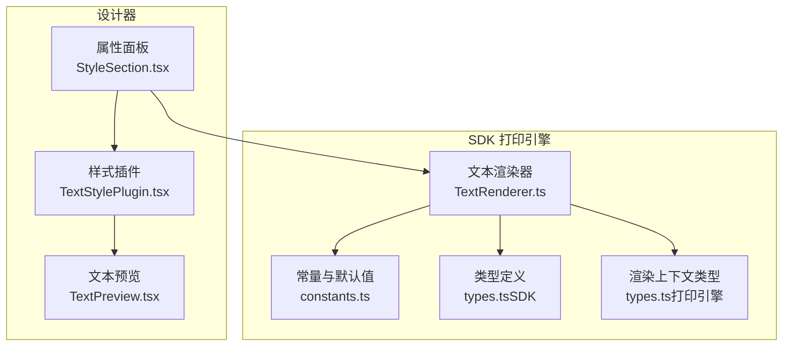
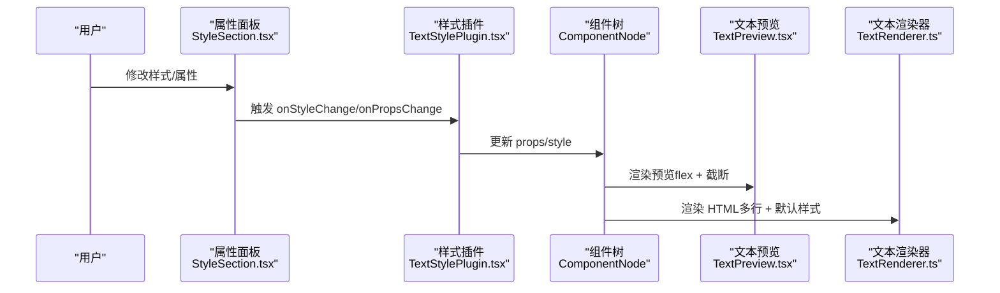
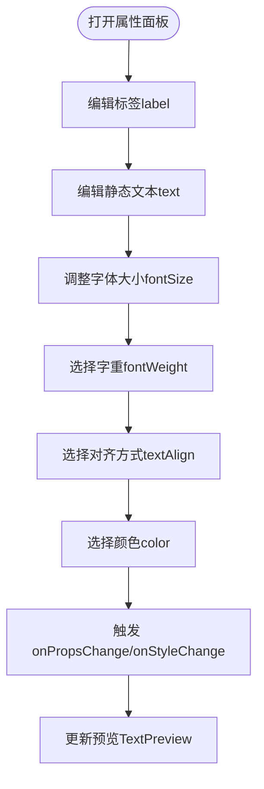
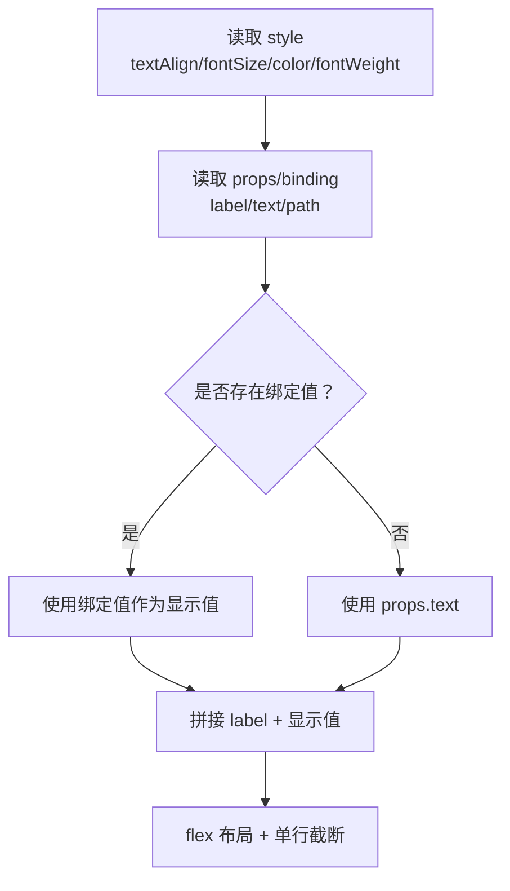
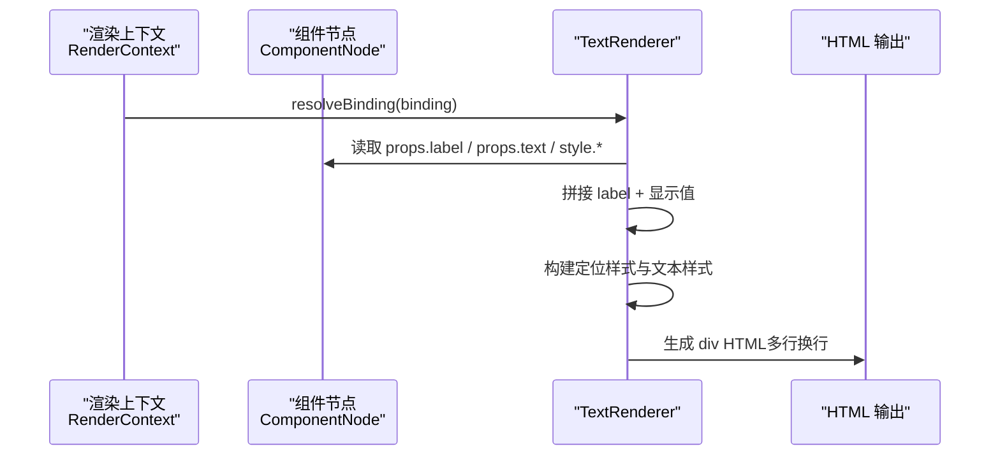
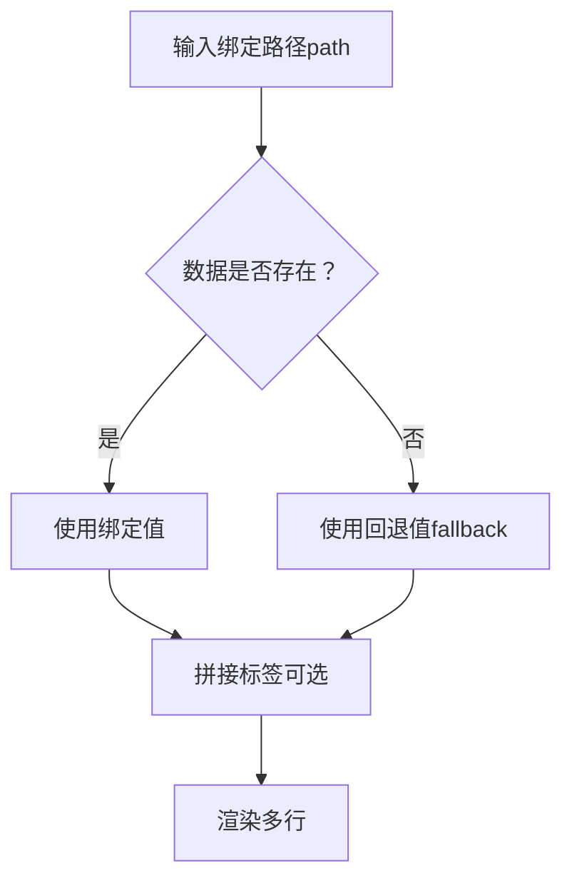
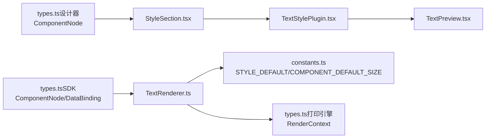

# 文本组件

<cite>
**本文引用的文件**
- [TextPreview.tsx](file://designer/src/pages/Designer/components/Canvas/componentRenderers/TextPreview.tsx)
- [TextRenderer.ts](file://sdk/src/printEngine/renderers/TextRenderer.ts)
- [TextStylePlugin.tsx](file://designer/src/pages/Designer/components/PropertyPanel/stylePlugins/TextStylePlugin.tsx)
- [StyleSection.tsx](file://designer/src/pages/Designer/components/PropertyPanel/StyleSection.tsx)
- [DataBindingSection.tsx](file://designer/src/pages/Designer/components/PropertyPanel/DataBindingSection.tsx)
- [types.ts（SDK）](file://sdk/src/types.ts)
- [types.ts（设计器）](file://designer/src/types/index.ts)
- [constants.ts](file://sdk/src/printEngine/constants.ts)
- [types.ts（打印引擎）](file://sdk/src/printEngine/types.ts)
</cite>

## 目录
1. [简介](#简介)
2. [项目结构](#项目结构)
3. [核心组件](#核心组件)
4. [架构概览](#架构概览)
5. [详细组件分析](#详细组件分析)
6. [依赖分析](#依赖分析)
7. [性能考虑](#性能考虑)
8. [故障排查指南](#故障排查指南)
9. [结论](#结论)
10. [附录](#附录)

## 简介
本章节面向“文本组件”的完整使用与实现说明，涵盖以下能力与目标：
- 标签显示：支持在文本前添加固定前缀标签，便于呈现“键值对”式文案。
- 数据绑定配置：通过 JSON 路径绑定业务数据，并支持回退值与数据管道。
- 多行文本支持：渲染器采用正常换行策略，配合行高与断词规则实现多行展示。
- 字体样式设置：支持字体大小、颜色、字重（常规/加粗），以及对齐方式（左/中/右）。
- 文本换行与截断：预览组件默认单行截断，渲染器默认多行换行；两者行为可区分使用场景。

## 项目结构
文本组件涉及三个层面：
- 设计器侧（可视化编辑与属性面板）
  - 文本样式插件：提供标签、静态文本、字体大小、字重、对齐方式、颜色等配置入口。
  - 文本预览：基于组件样式与 props/binding 渲染预览 DOM，采用 flex 布局与单行截断策略。
- SDK 打印引擎（渲染与分页）
  - 文本渲染器：解析绑定值，拼接标签，生成 HTML 片段，支持多行换行与默认样式。
  - 常量与默认值：统一字体、颜色、对齐、行高等默认行为。
- 类型与上下文
  - 组件节点、数据绑定、渲染上下文等类型定义贯穿两端，确保一致性。

**图表来源**
- [StyleSection.tsx:17-32](file://designer/src/pages/Designer/components/PropertyPanel/StyleSection.tsx#L17-L32)
- [TextStylePlugin.tsx:11-85](file://designer/src/pages/Designer/components/PropertyPanel/stylePlugins/TextStylePlugin.tsx#L11-L85)
- [TextPreview.tsx:10-30](file://designer/src/pages/Designer/components/Canvas/componentRenderers/TextPreview.tsx#L10-L30)
- [TextRenderer.ts:10-59](file://sdk/src/printEngine/renderers/TextRenderer.ts#L10-L59)
- [constants.ts:63-78](file://sdk/src/printEngine/constants.ts#L63-L78)
- [types.ts（SDK）:185-202](file://sdk/src/types.ts#L185-L202)
- [types.ts（打印引擎）:11-55](file://sdk/src/printEngine/types.ts#L11-L55)

**章节来源**
- [StyleSection.tsx:17-32](file://designer/src/pages/Designer/components/PropertyPanel/StyleSection.tsx#L17-L32)
- [TextStylePlugin.tsx:11-85](file://designer/src/pages/Designer/components/PropertyPanel/stylePlugins/TextStylePlugin.tsx#L11-L85)
- [TextPreview.tsx:10-30](file://designer/src/pages/Designer/components/Canvas/componentRenderers/TextPreview.tsx#L10-L30)
- [TextRenderer.ts:10-59](file://sdk/src/printEngine/renderers/TextRenderer.ts#L10-L59)
- [constants.ts:63-78](file://sdk/src/printEngine/constants.ts#L63-L78)
- [types.ts（SDK）:185-202](file://sdk/src/types.ts#L185-L202)
- [types.ts（打印引擎）:11-55](file://sdk/src/printEngine/types.ts#L11-L55)

## 核心组件
- 文本样式插件（设计器）
  - 提供标签（label）、静态文本（text）、字体大小、字重、对齐方式、颜色等配置项。
  - 通过 onPropsChange/onStyleChange 回调更新组件节点的 props 与 style。
- 文本预览（设计器）
  - 基于组件 style 的 textAlign/fontSize/color/fontWeight 渲染预览。
  - 使用 flex 布局与单行截断策略（overflow: hidden、whiteSpace: nowrap、textOverflow: ellipsis）。
- 文本渲染器（SDK）
  - 解析数据绑定，拼接标签与显示值，输出多行可换行的 HTML 片段。
  - 默认样式包含行高、断词与对齐转换（textAlign → justifyContent）。

**章节来源**
- [TextStylePlugin.tsx:11-85](file://designer/src/pages/Designer/components/PropertyPanel/stylePlugins/TextStylePlugin.tsx#L11-L85)
- [TextPreview.tsx:10-30](file://designer/src/pages/Designer/components/Canvas/componentRenderers/TextPreview.tsx#L10-L30)
- [TextRenderer.ts:10-59](file://sdk/src/printEngine/renderers/TextRenderer.ts#L10-L59)

## 架构概览
文本组件在设计器与 SDK 之间通过统一的组件节点结构传递数据与样式。设计器负责可视化配置与预览，SDK 负责最终渲染与分页。

**图表来源**
- [StyleSection.tsx:17-32](file://designer/src/pages/Designer/components/PropertyPanel/StyleSection.tsx#L17-L32)
- [TextStylePlugin.tsx:14-81](file://designer/src/pages/Designer/components/PropertyPanel/stylePlugins/TextStylePlugin.tsx#L14-L81)
- [TextPreview.tsx:10-30](file://designer/src/pages/Designer/components/Canvas/componentRenderers/TextPreview.tsx#L10-L30)
- [TextRenderer.ts:13-53](file://sdk/src/printEngine/renderers/TextRenderer.ts#L13-L53)

## 详细组件分析

### 文本样式插件（设计器）
- 功能要点
  - 标签（label）：用于在文本前添加固定前缀，如“订单号：”。
  - 静态文本（text）：未绑定数据时的默认显示文本。
  - 字体大小（fontSize）：数值输入，单位为 px。
  - 字重（fontWeight）：选择“常规/加粗”。
  - 对齐方式（textAlign）：选择“左对齐/居中/右对齐”，内部转换为 flex 的 justifyContent。
  - 字体颜色（color）：颜色选择器。
- 数据流
  - 用户修改触发 onPropsChange/onStyleChange，更新当前组件节点的 props/style。
  - 预览组件读取 style 与 props，即时反映变化。

**图表来源**
- [TextStylePlugin.tsx:14-81](file://designer/src/pages/Designer/components/PropertyPanel/stylePlugins/TextStylePlugin.tsx#L14-L81)

**章节来源**
- [TextStylePlugin.tsx:11-85](file://designer/src/pages/Designer/components/PropertyPanel/stylePlugins/TextStylePlugin.tsx#L11-L85)

### 文本预览（设计器）
- 渲染逻辑
  - 读取组件 style：textAlign、fontSize、color、fontWeight。
  - 读取组件 props/binding：优先显示 label + 显示值，否则回退到 text 或绑定路径。
  - 使用 flex 布局与单行截断策略，适合在画布中直观预览单行效果。
- 适用场景
  - 设计阶段的快速预览与交互反馈。
  - 不支持多行换行，超出宽度自动截断。

**图表来源**
- [TextPreview.tsx:10-30](file://designer/src/pages/Designer/components/Canvas/componentRenderers/TextPreview.tsx#L10-L30)

**章节来源**
- [TextPreview.tsx:10-30](file://designer/src/pages/Designer/components/Canvas/componentRenderers/TextPreview.tsx#L10-L30)

### 文本渲染器（SDK）
- 渲染流程
  - 解析数据绑定：从渲染上下文中解析出最终显示值。
  - 拼接标签：若存在 label，则前置显示。
  - 生成定位样式：基于布局坐标与尺寸，转换为像素单位。
  - 构建文本样式：字体大小、颜色、字重、flex 布局、对齐、行高、断词与换行。
  - 输出 HTML：包裹为 div，支持多行文本。
- 高度计算
  - 若未显式设置高度，使用默认高度常量。

**图表来源**
- [TextRenderer.ts:13-53](file://sdk/src/printEngine/renderers/TextRenderer.ts#L13-L53)
- [types.ts（打印引擎）:11-55](file://sdk/src/printEngine/types.ts#L11-L55)

**章节来源**
- [TextRenderer.ts:10-59](file://sdk/src/printEngine/renderers/TextRenderer.ts#L10-L59)
- [constants.ts:63-78](file://sdk/src/printEngine/constants.ts#L63-L78)

### 数据绑定与回退值
- 绑定路径（path）：支持 JSON 路径，如 user.name、items.0.title。
- 回退值（fallback）：当数据为空、null 或 undefined 时显示的默认文本。
- 绑定区域（设计器）
  - 数据绑定面板提供 path 与 fallback 的输入控件，支持清空与提示信息。

**图表来源**
- [DataBindingSection.tsx:45-71](file://designer/src/pages/Designer/components/PropertyPanel/DataBindingSection.tsx#L45-L71)
- [TextRenderer.ts:14-20](file://sdk/src/printEngine/renderers/TextRenderer.ts#L14-L20)

**章节来源**
- [DataBindingSection.tsx:45-71](file://designer/src/pages/Designer/components/PropertyPanel/DataBindingSection.tsx#L45-L71)
- [TextRenderer.ts:14-20](file://sdk/src/printEngine/renderers/TextRenderer.ts#L14-L20)

## 依赖分析
- 组件节点与类型
  - 统一的 ComponentNode 结构贯穿设计器与 SDK，保证 props/style/binding 的一致性。
- 渲染上下文
  - 提供 resolveBinding、applyPipes、getValueByPath 等能力，支撑数据绑定与格式化。
- 默认值与常量
  - STYLE_DEFAULT 与 COMPONENT_DEFAULT_SIZE 提供默认字体、颜色、对齐与尺寸，保障渲染一致性。

**图表来源**
- [types.ts（SDK）:185-202](file://sdk/src/types.ts#L185-L202)
- [types.ts（设计器）:303-331](file://designer/src/types/index.ts#L303-L331)
- [TextRenderer.ts:10-59](file://sdk/src/printEngine/renderers/TextRenderer.ts#L10-L59)
- [constants.ts:63-78](file://sdk/src/printEngine/constants.ts#L63-L78)
- [types.ts（打印引擎）:11-55](file://sdk/src/printEngine/types.ts#L11-L55)

**章节来源**
- [types.ts（SDK）:185-202](file://sdk/src/types.ts#L185-L202)
- [types.ts（设计器）:303-331](file://designer/src/types/index.ts#L303-L331)
- [TextRenderer.ts:10-59](file://sdk/src/printEngine/renderers/TextRenderer.ts#L10-L59)
- [constants.ts:63-78](file://sdk/src/printEngine/constants.ts#L63-L78)
- [types.ts（打印引擎）:11-55](file://sdk/src/printEngine/types.ts#L11-L55)

## 性能考虑
- 预览与渲染差异
  - 预览组件采用单行截断，避免复杂排版计算，提升交互流畅度。
  - 渲染器采用多行换行与断词策略，适合真实打印输出，但需注意长文本的分页与换行成本。
- 默认样式与常量
  - 使用默认样式与常量减少运行时计算，提高渲染效率。
- 建议
  - 大量文本组件建议在渲染阶段统一处理换行与分页，避免在预览阶段做过多 DOM 计算。

## 故障排查指南
- 文本未显示或显示为路径
  - 检查数据绑定路径是否正确，确认业务数据是否已传入渲染上下文。
  - 如需回退，设置 fallback 值并在设计器数据绑定面板中配置。
- 预览与渲染不一致
  - 预览组件默认单行截断，渲染器默认多行换行；这是预期行为差异。
  - 若期望预览也多行，可在预览组件中调整样式（不建议改变默认行为）。
- 对齐方式无效
  - 确认 textAlign 设置为 left/center/right，渲染器会将其转换为 justifyContent。
- 字体大小/颜色/字重不生效
  - 检查 props/style 是否正确更新，确认样式插件已触发 onStyleChange。

**章节来源**
- [DataBindingSection.tsx:45-71](file://designer/src/pages/Designer/components/PropertyPanel/DataBindingSection.tsx#L45-L71)
- [TextPreview.tsx:10-30](file://designer/src/pages/Designer/components/Canvas/componentRenderers/TextPreview.tsx#L10-L30)
- [TextRenderer.ts:32-48](file://sdk/src/printEngine/renderers/TextRenderer.ts#L32-L48)

## 结论
文本组件在设计器与 SDK 之间实现了清晰的职责分离：设计器负责可视化配置与预览，SDK 负责最终渲染与分页。通过统一的组件节点结构与默认常量，组件具备良好的扩展性与一致性。实际使用中，应根据场景选择合适的预览与渲染策略，并合理配置数据绑定与样式属性。

## 附录

### 属性配置清单（设计器）
- 标签（label）：字符串，前置显示在文本前。
- 静态文本（text）：字符串，未绑定数据时的默认显示。
- 字体大小（fontSize）：数字，单位 px。
- 字重（fontWeight）：枚举，常规/加粗。
- 对齐方式（textAlign）：枚举，左对齐/居中/右对齐。
- 字体颜色（color）：十六进制颜色值。

**章节来源**
- [TextStylePlugin.tsx:18-81](file://designer/src/pages/Designer/components/PropertyPanel/stylePlugins/TextStylePlugin.tsx#L18-L81)

### 渲染机制与默认值（SDK）
- 渲染器
  - 解析绑定值，拼接标签与显示值。
  - 构建定位样式与文本样式，输出多行可换行的 HTML。
- 默认值
  - 字体大小、颜色、字重、对齐、行高均有默认值，确保渲染一致性。

**章节来源**
- [TextRenderer.ts:13-53](file://sdk/src/printEngine/renderers/TextRenderer.ts#L13-L53)
- [constants.ts:63-78](file://sdk/src/printEngine/constants.ts#L63-L78)