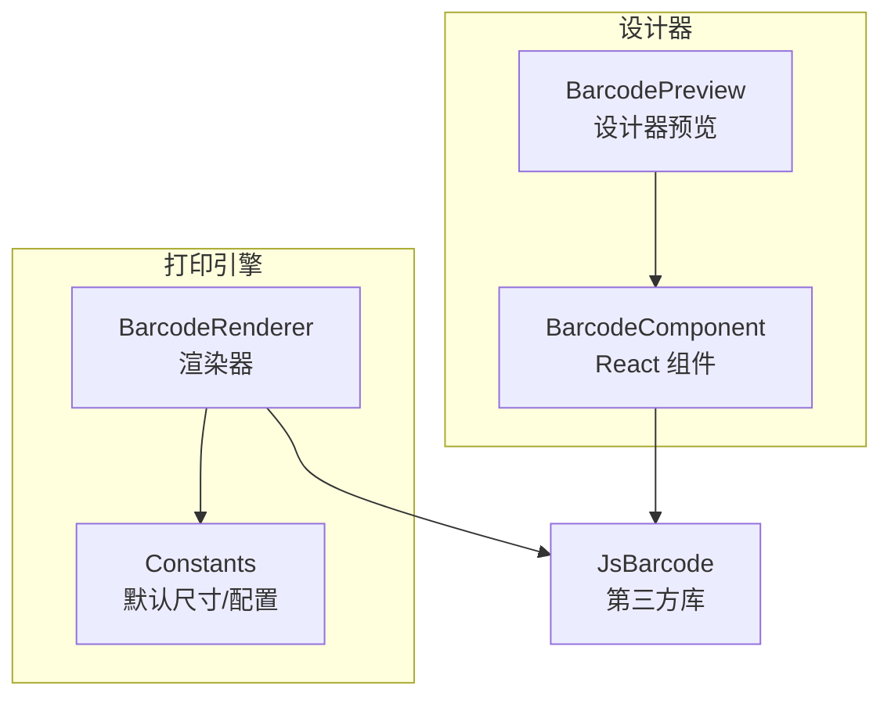
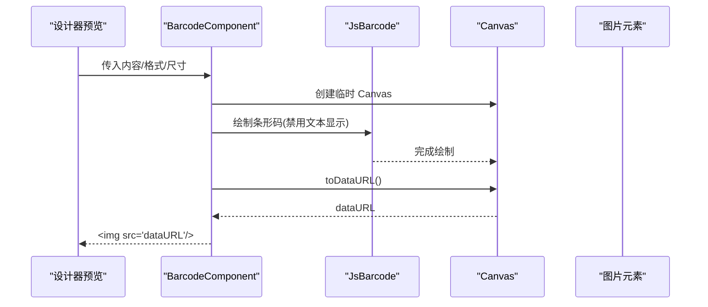
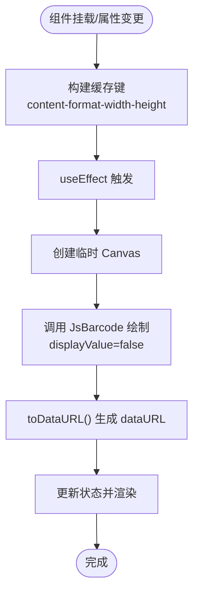
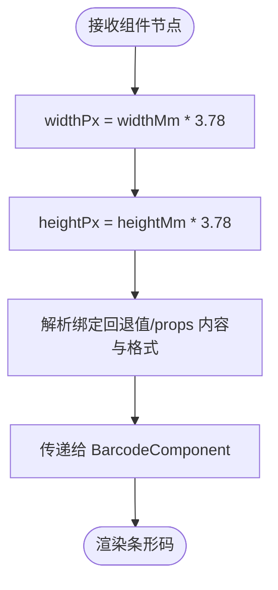
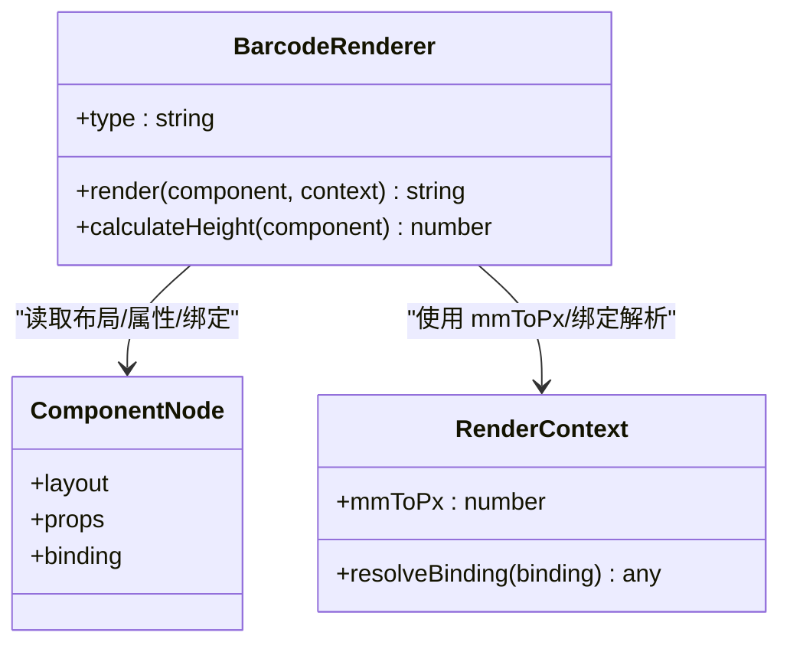
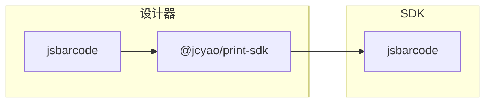

# 条形码组件

<cite>
**本文引用的文件**
- [designer/src/components/Barcode/index.tsx](file://designer/src/components/Barcode/index.tsx)
- [designer/src/pages/Designer/components/Canvas/componentRenderers/BarcodePreview.tsx](file://designer/src/pages/Designer/components/Canvas/componentRenderers/BarcodePreview.tsx)
- [sdk/src/printEngine/renderers/BarcodeRenderer.ts](file://sdk/src/printEngine/renderers/BarcodeRenderer.ts)
- [sdk/src/printEngine/constants.ts](file://sdk/src/printEngine/constants.ts)
- [sdk/src/types.ts](file://sdk/src/types.ts)
- [designer/package.json](file://designer/package.json)
- [sdk/package.json](file://sdk/package.json)
- [designer/src/services/mock/templates.ts](file://designer/src/services/mock/templates.ts)
- [docs/技术架构文档(仅参考).md](file://docs/技术架构文档(仅参考).md)
</cite>

## 目录
1. [简介](#简介)
2. [项目结构](#项目结构)
3. [核心组件](#核心组件)
4. [架构总览](#架构总览)
5. [详细组件分析](#详细组件分析)
6. [依赖关系分析](#依赖关系分析)
7. [性能考量](#性能考量)
8. [故障排查指南](#故障排查指南)
9. [结论](#结论)
10. [附录](#附录)

## 简介
本文件系统性地介绍条形码组件的设计与实现，覆盖以下方面：
- 多种条形码格式支持现状与扩展路径（当前默认 CODE128，可扩展其他格式）
- 动态条形码生成流程与 Canvas 绘制算法
- 数据绑定到文本内容、尺寸与样式配置、文本显示控制
- 预览组件与设计器集成方式
- 实际使用示例与最佳实践

## 项目结构
条形码能力由两部分协同实现：
- 设计器端预览组件：基于 React + jsbarcode，在浏览器中生成条形码并以图片形式渲染
- 打印引擎渲染器：在渲染上下文中同步生成条形码 Base64 图片并内嵌到 HTML 中

图表来源
- [designer/src/components/Barcode/index.tsx:1-66](file://designer/src/components/Barcode/index.tsx#L1-L66)
- [designer/src/pages/Designer/components/Canvas/componentRenderers/BarcodePreview.tsx:1-26](file://designer/src/pages/Designer/components/Canvas/componentRenderers/BarcodePreview.tsx#L1-L26)
- [sdk/src/printEngine/renderers/BarcodeRenderer.ts:1-63](file://sdk/src/printEngine/renderers/BarcodeRenderer.ts#L1-L63)
- [sdk/src/printEngine/constants.ts:1-113](file://sdk/src/printEngine/constants.ts#L1-L113)

章节来源
- [designer/src/components/Barcode/index.tsx:1-66](file://designer/src/components/Barcode/index.tsx#L1-L66)
- [designer/src/pages/Designer/components/Canvas/componentRenderers/BarcodePreview.tsx:1-26](file://designer/src/pages/Designer/components/Canvas/componentRenderers/BarcodePreview.tsx#L1-L26)
- [sdk/src/printEngine/renderers/BarcodeRenderer.ts:1-63](file://sdk/src/printEngine/renderers/BarcodeRenderer.ts#L1-L63)
- [sdk/src/printEngine/constants.ts:1-113](file://sdk/src/printEngine/constants.ts#L1-L113)

## 核心组件
- 设计器端条形码组件：负责在画布预览中渲染条形码，使用 Canvas + jsbarcode 生成图片并缓存
- 设计器端预览：将组件节点布局与绑定信息转换为组件渲染所需的尺寸与内容
- 打印引擎渲染器：在渲染上下文中同步生成条形码图片并输出到最终 HTML

章节来源
- [designer/src/components/Barcode/index.tsx:1-66](file://designer/src/components/Barcode/index.tsx#L1-L66)
- [designer/src/pages/Designer/components/Canvas/componentRenderers/BarcodePreview.tsx:1-26](file://designer/src/pages/Designer/components/Canvas/componentRenderers/BarcodePreview.tsx#L1-L26)
- [sdk/src/printEngine/renderers/BarcodeRenderer.ts:1-63](file://sdk/src/printEngine/renderers/BarcodeRenderer.ts#L1-L63)

## 架构总览
条形码渲染采用“同步 Canvas 生成 + Base64 内嵌”的策略，确保在浏览器环境中即时完成，避免异步等待与网络依赖。

图表来源
- [designer/src/components/Barcode/index.tsx:21-34](file://designer/src/components/Barcode/index.tsx#L21-L34)
- [designer/src/pages/Designer/components/Canvas/componentRenderers/BarcodePreview.tsx:11-24](file://designer/src/pages/Designer/components/Canvas/componentRenderers/BarcodePreview.tsx#L11-L24)

章节来源
- [designer/src/components/Barcode/index.tsx:1-66](file://designer/src/components/Barcode/index.tsx#L1-L66)
- [designer/src/pages/Designer/components/Canvas/componentRenderers/BarcodePreview.tsx:1-26](file://designer/src/pages/Designer/components/Canvas/componentRenderers/BarcodePreview.tsx#L1-L26)
- [docs/技术架构文档(仅参考).md:633-722](file://docs/技术架构文档(仅参考).md#L633-L722)

## 详细组件分析

### 设计器端条形码组件（BarcodeComponent）
- 接收属性：内容、格式、宽度、高度
- 渲染策略：
  - 使用 useMemo 缓存 content-format-width-height 组合作为依赖，减少重复生成
  - 在 useEffect 中创建临时 Canvas，调用 jsbarcode 绘制（禁用文本显示）
  - 将 Canvas 转为 dataURL 并以  渲染；若未生成则显示占位提示
- 性能优化：通过缓存键避免重复绘制；仅在尺寸或内容变化时重新生成

图表来源
- [designer/src/components/Barcode/index.tsx:15-34](file://designer/src/components/Barcode/index.tsx#L15-L34)

章节来源
- [designer/src/components/Barcode/index.tsx:1-66](file://designer/src/components/Barcode/index.tsx#L1-L66)

### 设计器端预览（BarcodePreview）
- 将组件节点的布局尺寸（mm）转换为像素（使用 3.78 的换算系数）
- 优先使用绑定回退值或组件 props 的内容与格式，否则使用默认值
- 将计算后的尺寸与内容传递给 BarcodeComponent

图表来源
- [designer/src/pages/Designer/components/Canvas/componentRenderers/BarcodePreview.tsx:11-24](file://designer/src/pages/Designer/components/Canvas/componentRenderers/BarcodePreview.tsx#L11-L24)

章节来源
- [designer/src/pages/Designer/components/Canvas/componentRenderers/BarcodePreview.tsx:1-26](file://designer/src/pages/Designer/components/Canvas/componentRenderers/BarcodePreview.tsx#L1-L26)

### 打印引擎渲染器（BarcodeRenderer）
- 输入：组件节点、渲染上下文（包含 mm-to-px 换算）
- 输出：包含条形码图片的 HTML 片段（内嵌 dataURL）
- 关键步骤：
  - 解析绑定值或组件 props 的内容与格式，使用默认配置兜底
  - 计算位置样式与尺寸（mm -> px），并设置条形码高度比例
  - 使用 jsbarcode 在临时 Canvas 上绘制（禁用文本显示）
  - 转换为 PNG 的 dataURL，并返回  标签
  - 异常时返回带错误提示的占位元素

图表来源
- [sdk/src/printEngine/renderers/BarcodeRenderer.ts:12-62](file://sdk/src/printEngine/renderers/BarcodeRenderer.ts#L12-L62)
- [sdk/src/printEngine/constants.ts:94-104](file://sdk/src/printEngine/constants.ts#L94-L104)

章节来源
- [sdk/src/printEngine/renderers/BarcodeRenderer.ts:1-63](file://sdk/src/printEngine/renderers/BarcodeRenderer.ts#L1-L63)
- [sdk/src/printEngine/constants.ts:1-113](file://sdk/src/printEngine/constants.ts#L1-L113)

### 数据模型与类型
- 组件类型：barocde 已注册为组件类型之一
- 组件节点结构：包含布局（绝对定位/流式）、样式、数据绑定、属性等
- 模板中条形码组件示例：包含布局、绑定与格式属性

章节来源
- [sdk/src/types.ts:72](file://sdk/src/types.ts#L72)
- [sdk/src/types.ts:185-202](file://sdk/src/types.ts#L185-L202)
- [designer/src/services/mock/templates.ts:232-249](file://designer/src/services/mock/templates.ts#L232-L249)

## 依赖关系分析
- 第三方库：jsbarcode 用于 Canvas 绘制
- 设计器端：依赖 jsbarcode 生成图片并在组件中渲染
- 打印引擎：同样依赖 jsbarcode，但生成的是内嵌在 HTML 的 dataURL 图片

图表来源
- [designer/package.json:22](file://designer/package.json#L22)
- [sdk/package.json:51](file://sdk/package.json#L51)

章节来源
- [designer/package.json:13-30](file://designer/package.json#L13-L30)
- [sdk/package.json:49-53](file://sdk/package.json#L49-L53)

## 性能考量
- 同步生成：在浏览器端同步完成 Canvas 绘制与 dataURL 转换，避免异步等待与网络依赖
- 缓存策略：设计器端通过缓存键避免重复生成；打印引擎端每次按需生成
- 尺寸换算：统一使用 mm-to-px 比例（约 3.78），保证预览与打印一致
- 文本显示：默认关闭文本显示，减小绘制复杂度与体积

章节来源
- [docs/技术架构文档(仅参考).md:633-646](file://docs/技术架构文档(仅参考).md#L633-L646)
- [designer/src/components/Barcode/index.tsx:15-34](file://designer/src/components/Barcode/index.tsx#L15-L34)
- [sdk/src/printEngine/renderers/BarcodeRenderer.ts:34-56](file://sdk/src/printEngine/renderers/BarcodeRenderer.ts#L34-L56)

## 故障排查指南
- 条形码生成失败
  - 现象：控制台报错或占位提示出现
  - 可能原因：输入内容不符合格式要求、格式不被支持、Canvas 绘制异常
  - 处理建议：检查内容与格式；确认默认配置；查看异常日志
- 预览与打印不一致
  - 现象：预览清晰，打印模糊
  - 可能原因：分辨率换算或设备像素比差异
  - 处理建议：统一使用 mm-to-px 比例；在打印前确认设备像素比
- 占位图标显示
  - 现象：未生成图片时显示占位提示
  - 可能原因：内容为空、尺寸为 0 或生成异常
  - 处理建议：提供有效内容与合理尺寸；检查绑定回退值

章节来源
- [designer/src/components/Barcode/index.tsx:31-33](file://designer/src/components/Barcode/index.tsx#L31-L33)
- [sdk/src/printEngine/renderers/BarcodeRenderer.ts:52-56](file://sdk/src/printEngine/renderers/BarcodeRenderer.ts#L52-L56)

## 结论
条形码组件通过“同步 Canvas 绘制 + Base64 内嵌”的方式，实现了设计器预览与打印引擎的一致体验。当前默认支持 CODE128，具备良好的扩展性；通过数据绑定、尺寸与样式配置，满足多样化的业务场景需求。

## 附录

### 属性配置清单
- 内容（content）：字符串，条形码编码的数据
- 格式（format）：字符串，条形码类型（默认 CODE128）
- 宽度（width）：数值，像素
- 高度（height）：数值，像素

章节来源
- [designer/src/components/Barcode/index.tsx:5-10](file://designer/src/components/Barcode/index.tsx#L5-L10)
- [sdk/src/printEngine/constants.ts:94-104](file://sdk/src/printEngine/constants.ts#L94-L104)

### 使用示例（模板片段）
- 示例一：基础条形码
  - 布局：绝对定位，尺寸 35mm x 15mm
  - 绑定：使用绑定回退值
  - 属性：格式 CODE128
- 示例二：多格式条形码
  - 可通过修改属性中的格式字段切换不同编码标准（需确保 jsbarcode 支持）

章节来源
- [designer/src/services/mock/templates.ts:232-249](file://designer/src/services/mock/templates.ts#L232-L249)