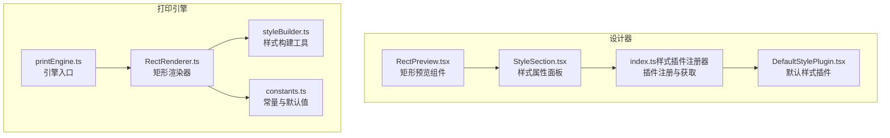
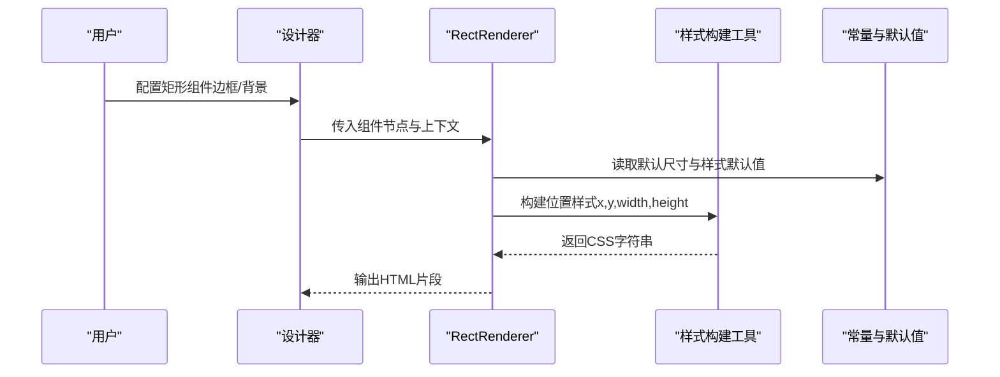
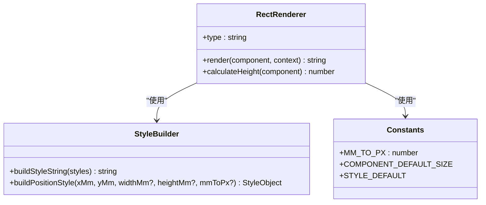
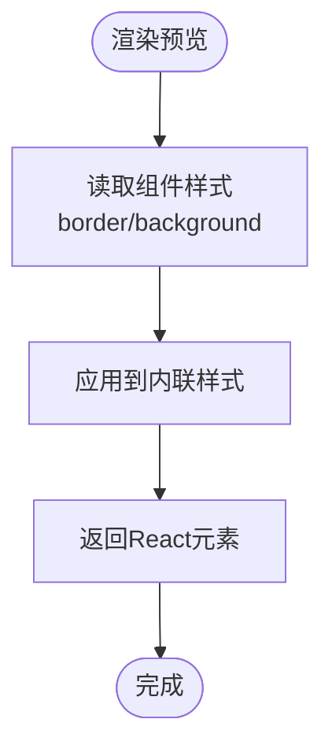
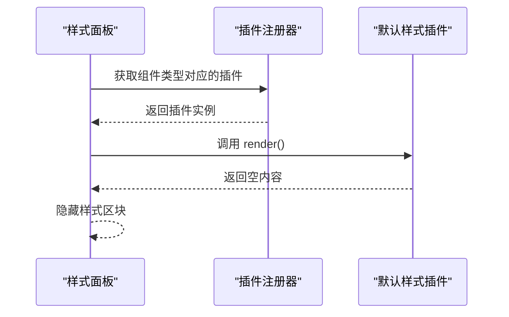
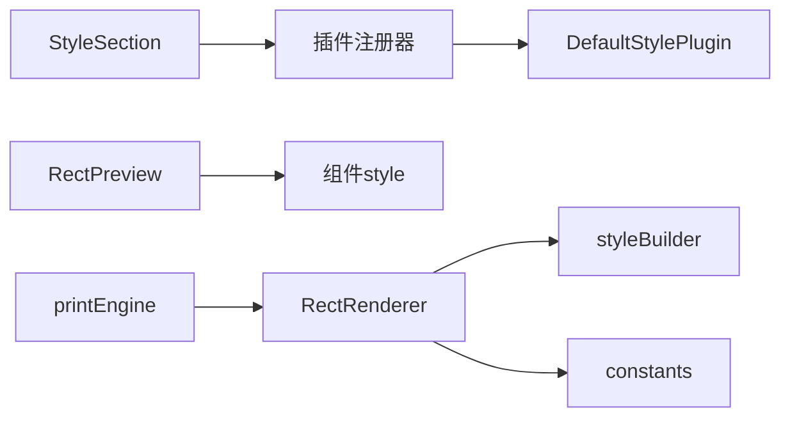

# 矩形组件

<cite>
**本文引用的文件**
- [RectRenderer.ts](file://sdk/src/printEngine/renderers/RectRenderer.ts)
- [RectPreview.tsx](file://designer/src/pages/Designer/components/Canvas/componentRenderers/RectPreview.tsx)
- [styleBuilder.ts](file://sdk/src/printEngine/utils/styleBuilder.ts)
- [constants.ts](file://sdk/src/printEngine/constants.ts)
- [DefaultStylePlugin.tsx](file://designer/src/pages/Designer/components/PropertyPanel/stylePlugins/DefaultStylePlugin.tsx)
- [StyleSection.tsx](file://designer/src/pages/Designer/components/PropertyPanel/StyleSection.tsx)
- [index.ts（样式插件注册器）](file://designer/src/pages/Designer/components/PropertyPanel/stylePlugins/index.ts)
- [printEngine.ts](file://sdk/src/printEngine.ts)
</cite>

## 目录
1. [简介](#简介)
2. [项目结构](#项目结构)
3. [核心组件](#核心组件)
4. [架构总览](#架构总览)
5. [详细组件分析](#详细组件分析)
6. [依赖关系分析](#依赖关系分析)
7. [性能考虑](#性能考虑)
8. [故障排查指南](#故障排查指南)
9. [结论](#结论)
10. [附录](#附录)

## 简介
本文件围绕“矩形组件”进行系统化技术文档整理，重点覆盖以下方面：
- 矩形组件的核心能力：矩形区域绘制、边框样式配置、填充颜色设置、圆角与阴影支持现状、透明度控制。
- 渲染引擎工作原理：基于 Canvas 的绘制 API、路径创建、样式应用的实现思路与扩展点。
- 属性配置：尺寸设置、边框配置、背景色设置、圆角半径、阴影参数等。
- 默认样式插件与矩形预览组件：插件机制如何作用于矩形组件，以及设计器中矩形预览的实现。
- 实际使用示例：装饰性背景、边框容器、分隔区域等场景，以及在打印模板中的应用。

## 项目结构
矩形组件在设计器与打印引擎两端分别有实现与预览：
- 设计器端：提供矩形预览组件，用于画布上实时预览矩形样式。
- 打印引擎端：提供矩形渲染器，负责将矩形组件节点渲染为最终 HTML 片段。

图表来源
- [RectPreview.tsx:1-20](file://designer/src/pages/Designer/components/Canvas/componentRenderers/RectPreview.tsx#L1-L20)
- [StyleSection.tsx:1-35](file://designer/src/pages/Designer/components/PropertyPanel/StyleSection.tsx#L1-L35)
- [DefaultStylePlugin.tsx:1-15](file://designer/src/pages/Designer/components/PropertyPanel/stylePlugins/DefaultStylePlugin.tsx#L1-L15)
- [index.ts（样式插件注册器）:1-51](file://designer/src/pages/Designer/components/PropertyPanel/stylePlugins/index.ts#L1-L51)
- [RectRenderer.ts:1-39](file://sdk/src/printEngine/renderers/RectRenderer.ts#L1-L39)
- [styleBuilder.ts:1-54](file://sdk/src/printEngine/utils/styleBuilder.ts#L1-L54)
- [constants.ts:1-113](file://sdk/src/printEngine/constants.ts#L1-L113)
- [printEngine.ts:1073-1095](file://sdk/src/printEngine.ts#L1073-L1095)

章节来源
- [RectPreview.tsx:1-20](file://designer/src/pages/Designer/components/Canvas/componentRenderers/RectPreview.tsx#L1-L20)
- [RectRenderer.ts:1-39](file://sdk/src/printEngine/renderers/RectRenderer.ts#L1-L39)
- [styleBuilder.ts:1-54](file://sdk/src/printEngine/utils/styleBuilder.ts#L1-L54)
- [constants.ts:1-113](file://sdk/src/printEngine/constants.ts#L1-L113)
- [DefaultStylePlugin.tsx:1-15](file://designer/src/pages/Designer/components/PropertyPanel/stylePlugins/DefaultStylePlugin.tsx#L1-L15)
- [StyleSection.tsx:1-35](file://designer/src/pages/Designer/components/PropertyPanel/StyleSection.tsx#L1-L35)
- [index.ts（样式插件注册器）:1-51](file://designer/src/pages/Designer/components/PropertyPanel/stylePlugins/index.ts#L1-L51)
- [printEngine.ts:1073-1095](file://sdk/src/printEngine.ts#L1073-L1095)

## 核心组件
- 矩形渲染器（RectRenderer）：负责将组件节点渲染为 HTML 片段，应用位置、尺寸与基础样式（边框、背景），并提供高度计算接口。
- 矩形预览组件（RectPreview）：在设计器画布中以 React 组件形式预览矩形样式，直接映射组件的边框与背景配置。
- 样式构建工具（styleBuilder）：将样式对象转换为 CSS 字符串，并生成绝对定位的像素级样式。
- 常量与默认值（constants）：提供毫米到像素的换算系数、组件默认尺寸、样式默认值等。
- 默认样式插件（DefaultStylePlugin）：装饰性组件（含矩形）的样式配置插件，当前不提供额外属性配置。
- 引擎入口（printEngine）：对外暴露注册/注销渲染器的能力，便于扩展或替换渲染器。

章节来源
- [RectRenderer.ts:10-38](file://sdk/src/printEngine/renderers/RectRenderer.ts#L10-L38)
- [RectPreview.tsx:10-19](file://designer/src/pages/Designer/components/Canvas/componentRenderers/RectPreview.tsx#L10-L19)
- [styleBuilder.ts:13-53](file://sdk/src/printEngine/utils/styleBuilder.ts#L13-L53)
- [constants.ts:8-78](file://sdk/src/printEngine/constants.ts#L8-L78)
- [DefaultStylePlugin.tsx:9-15](file://designer/src/pages/Designer/components/PropertyPanel/stylePlugins/DefaultStylePlugin.tsx#L9-L15)
- [printEngine.ts:1084-1093](file://sdk/src/printEngine.ts#L1084-L1093)

## 架构总览
矩形组件在“设计期”和“渲染期”的职责分工清晰：
- 设计期（设计器）：通过 RectPreview 提供即时视觉反馈；通过 DefaultStylePlugin 与 StyleSection 面板联动，允许用户调整边框与背景。
- 渲染期（打印引擎）：通过 RectRenderer 将组件布局与样式转换为最终 HTML 片段，确保输出符合毫米精度与像素换算。

图表来源
- [RectRenderer.ts:13-32](file://sdk/src/printEngine/renderers/RectRenderer.ts#L13-L32)
- [styleBuilder.ts:31-53](file://sdk/src/printEngine/utils/styleBuilder.ts#L31-L53)
- [constants.ts:13-78](file://sdk/src/printEngine/constants.ts#L13-L78)

## 详细组件分析

### 矩形渲染器（RectRenderer）
- 角色与职责
  - 类型标识：rect
  - 渲染流程：读取布局信息（x/y/宽/高，单位 mm），结合像素换算系数生成绝对定位样式；合并边框与背景样式；输出 div HTML 片段。
  - 高度计算：提供 calculateHeight 接口，返回组件高度（mm）。
- 关键实现要点
  - 位置与尺寸：通过 buildPositionStyle 将 mm 转 px 并设置绝对定位。
  - 样式拼接：buildStyleString 将样式对象转为 CSS 字符串。
  - 默认值：若未指定样式，则采用 STYLE_DEFAULT 中的默认边框与背景。
  - 默认尺寸：若未指定尺寸，则采用 COMPONENT_DEFAULT_SIZE 中的 RECT_WIDTH/HEIGHT。
- 可扩展点
  - 圆角与阴影：当前实现未包含 border-radius 与 box-shadow 的样式拼接逻辑，可在样式对象中追加相应键值后由 buildStyleString 输出。
  - 透明度：可通过 background 或额外透明度属性控制，当前默认背景为透明。

图表来源
- [RectRenderer.ts:10-38](file://sdk/src/printEngine/renderers/RectRenderer.ts#L10-L38)
- [styleBuilder.ts:13-53](file://sdk/src/printEngine/utils/styleBuilder.ts#L13-L53)
- [constants.ts:8-78](file://sdk/src/printEngine/constants.ts#L8-L78)

章节来源
- [RectRenderer.ts:10-38](file://sdk/src/printEngine/renderers/RectRenderer.ts#L10-L38)
- [styleBuilder.ts:13-53](file://sdk/src/printEngine/utils/styleBuilder.ts#L13-L53)
- [constants.ts:8-78](file://sdk/src/printEngine/constants.ts#L8-L78)

### 矩形预览组件（RectPreview）
- 角色与职责
  - 在设计器画布中以 React 组件方式呈现矩形样式，直接映射组件的 style.border 与 style.background。
  - 作为装饰性组件，不涉及复杂交互，主要用于视觉校验。
- 关键实现要点
  - 宽高：占满父容器，便于预览边框与背景效果。
  - 样式回退：若未配置样式，默认边框为黑色实线，背景为透明。

图表来源
- [RectPreview.tsx:10-19](file://designer/src/pages/Designer/components/Canvas/componentRenderers/RectPreview.tsx#L10-L19)

章节来源
- [RectPreview.tsx:10-19](file://designer/src/pages/Designer/components/Canvas/componentRenderers/RectPreview.tsx#L10-L19)

### 默认样式插件与样式面板
- 默认样式插件（DefaultStylePlugin）
  - 用途：装饰性/媒体类组件（如 rect、image、qrcode、barcode）无需额外样式属性配置。
  - 行为：render 返回空，表示不显示任何样式配置项。
- 样式面板（StyleSection）
  - 动态加载：根据组件类型调用样式插件注册器获取对应插件。
  - 隐藏策略：当插件无内容时，整块样式属性区域隐藏。
- 插件注册器（index.ts）
  - 注册：初始化时注册文本、表格、线条与默认样式插件。
  - 获取：按组件类型查找插件，未注册时回退到默认插件。

图表来源
- [StyleSection.tsx:17-33](file://designer/src/pages/Designer/components/PropertyPanel/StyleSection.tsx#L17-L33)
- [index.ts（样式插件注册器）:31-38](file://designer/src/pages/Designer/components/PropertyPanel/stylePlugins/index.ts#L31-L38)
- [DefaultStylePlugin.tsx:9-15](file://designer/src/pages/Designer/components/PropertyPanel/stylePlugins/DefaultStylePlugin.tsx#L9-L15)

章节来源
- [DefaultStylePlugin.tsx:9-15](file://designer/src/pages/Designer/components/PropertyPanel/stylePlugins/DefaultStylePlugin.tsx#L9-L15)
- [StyleSection.tsx:17-33](file://designer/src/pages/Designer/components/PropertyPanel/StyleSection.tsx#L17-L33)
- [index.ts（样式插件注册器）:31-38](file://designer/src/pages/Designer/components/PropertyPanel/stylePlugins/index.ts#L31-L38)

### 渲染引擎与扩展点
- 引擎入口（printEngine）
  - 提供 registerRenderer/unregisterRenderer 接口，可注入自定义渲染器或替换现有渲染器（如 RectRenderer）。
- 当前实现与扩展建议
  - 圆角与阴影：可在 RectRenderer 的样式对象中加入 border-radius 与 box-shadow 键值，由 buildStyleString 输出。
  - 透明度：可通过 background 或新增透明度字段控制，当前默认背景为透明。
  - Canvas 绘制 API：当前渲染器输出 HTML 片段，若需 Canvas 渲染，可新增 Canvas 渲染器并在引擎中注册。

章节来源
- [printEngine.ts:1084-1093](file://sdk/src/printEngine.ts#L1084-L1093)
- [RectRenderer.ts:24-32](file://sdk/src/printEngine/renderers/RectRenderer.ts#L24-L32)
- [styleBuilder.ts:13-21](file://sdk/src/printEngine/utils/styleBuilder.ts#L13-L21)

## 依赖关系分析
- 组件耦合
  - RectRenderer 依赖 styleBuilder 与 constants，职责清晰、内聚性良好。
  - RectPreview 与组件数据结构解耦，仅依赖 style 字段。
  - 默认样式插件与样式面板通过注册器解耦，便于扩展其他组件类型。
- 外部依赖
  - 引擎通过 printEngine 暴露注册接口，便于二次开发。
- 潜在循环依赖
  - 当前模块间均为单向依赖，无明显循环。

图表来源
- [RectRenderer.ts:5-8](file://sdk/src/printEngine/renderers/RectRenderer.ts#L5-L8)
- [styleBuilder.ts:5-7](file://sdk/src/printEngine/utils/styleBuilder.ts#L5-L7)
- [constants.ts:5-8](file://sdk/src/printEngine/constants.ts#L5-L8)
- [RectPreview.tsx:1-5](file://designer/src/pages/Designer/components/Canvas/componentRenderers/RectPreview.tsx#L1-L5)
- [StyleSection.tsx:7-8](file://designer/src/pages/Designer/components/PropertyPanel/StyleSection.tsx#L7-L8)
- [index.ts（样式插件注册器）:6-10](file://designer/src/pages/Designer/components/PropertyPanel/stylePlugins/index.ts#L6-L10)
- [printEngine.ts:1084-1093](file://sdk/src/printEngine.ts#L1084-L1093)

章节来源
- [RectRenderer.ts:5-8](file://sdk/src/printEngine/renderers/RectRenderer.ts#L5-L8)
- [styleBuilder.ts:5-7](file://sdk/src/printEngine/utils/styleBuilder.ts#L5-L7)
- [constants.ts:5-8](file://sdk/src/printEngine/constants.ts#L5-L8)
- [RectPreview.tsx:1-5](file://designer/src/pages/Designer/components/Canvas/componentRenderers/RectPreview.tsx#L1-L5)
- [StyleSection.tsx:7-8](file://designer/src/pages/Designer/components/PropertyPanel/StyleSection.tsx#L7-L8)
- [index.ts（样式插件注册器）:6-10](file://designer/src/pages/Designer/components/PropertyPanel/stylePlugins/index.ts#L6-L10)
- [printEngine.ts:1084-1093](file://sdk/src/printEngine.ts#L1084-L1093)

## 性能考虑
- 渲染器输出为静态 HTML 片段，避免重复计算，适合批量渲染。
- 样式构建采用对象到字符串的映射，复杂度与样式键数量线性相关，通常开销较小。
- 建议
  - 若未来引入 Canvas 渲染，需评估路径缓存与重绘策略，减少重复绘制。
  - 对大量矩形的场景，优先复用样式对象，避免频繁创建新对象。

## 故障排查指南
- 现象：矩形未显示或尺寸异常
  - 检查布局尺寸是否提供 mm 值，否则将使用默认尺寸。
  - 检查 mm 到 px 的换算系数是否正确。
- 现象：边框或背景未生效
  - 检查组件 style 是否正确传递至预览与渲染器。
  - 确认默认样式插件未覆盖用户配置。
- 现象：圆角或阴影无效
  - 当前渲染器未包含相应样式键，需扩展样式对象后再输出。
- 现象：透明度不生效
  - 当前默认背景为透明，确认未被上层样式覆盖。

章节来源
- [RectRenderer.ts:16-28](file://sdk/src/printEngine/renderers/RectRenderer.ts#L16-L28)
- [constants.ts:13-78](file://sdk/src/printEngine/constants.ts#L13-L78)
- [RectPreview.tsx:12-17](file://designer/src/pages/Designer/components/Canvas/componentRenderers/RectPreview.tsx#L12-L17)
- [DefaultStylePlugin.tsx:9-15](file://designer/src/pages/Designer/components/PropertyPanel/stylePlugins/DefaultStylePlugin.tsx#L9-L15)

## 结论
矩形组件在当前版本中聚焦于基础绘制与预览能力：通过 RectRenderer 与 RectPreview 分别满足渲染期与设计期需求；默认样式插件与样式面板配合，使装饰性矩形具备简洁可控的外观配置。对于圆角、阴影与透明度等高级样式，当前实现未直接支持，但具备明确的扩展路径：在样式对象中增加相应键值并通过样式构建工具输出即可。未来如需 Canvas 渲染，可在引擎中注册新的渲染器以满足更丰富的图形需求。

## 附录

### 属性配置清单（矩形组件）
- 尺寸设置
  - x/y（mm）：决定矩形在页面中的绝对定位。
  - width/height（mm）：决定矩形的尺寸；未提供时使用默认尺寸。
- 边框配置
  - border：CSS 边框样式字符串；未提供时使用默认边框。
- 背景色设置
  - background：CSS 背景样式字符串；未提供时使用默认透明背景。
- 圆角与阴影（扩展建议）
  - border-radius：建议在样式对象中加入该键值。
  - box-shadow：建议在样式对象中加入该键值。
- 透明度（扩展建议）
  - 可通过 background 或新增透明度字段控制。

章节来源
- [RectRenderer.ts:16-28](file://sdk/src/printEngine/renderers/RectRenderer.ts#L16-L28)
- [constants.ts:13-78](file://sdk/src/printEngine/constants.ts#L13-L78)
- [styleBuilder.ts:13-21](file://sdk/src/printEngine/utils/styleBuilder.ts#L13-L21)

### 实际使用示例（场景与步骤）
- 装饰性背景
  - 步骤：在画布中放置矩形组件，设置背景色为品牌色或渐变，尺寸覆盖目标区域。
  - 适用：页眉、页脚或卡片背景。
- 边框容器
  - 步骤：设置较粗的边框，背景保持透明，用于突出区域边界。
  - 适用：分组区域、重要信息框。
- 分隔区域
  - 步骤：设置细边框或浅色背景，高度较小，用于视觉分隔。
  - 适用：段落之间、列表项之间的分隔线。
- 打印模板中的应用
  - 步骤：在模板中插入矩形组件作为占位或装饰，导出时由渲染器输出为 HTML 片段。
  - 注意：确保尺寸以 mm 设置，利用 mm-to-px 换算保证打印精度。

章节来源
- [RectPreview.tsx:10-19](file://designer/src/pages/Designer/components/Canvas/componentRenderers/RectPreview.tsx#L10-L19)
- [RectRenderer.ts:13-32](file://sdk/src/printEngine/renderers/RectRenderer.ts#L13-L32)
- [constants.ts:8-46](file://sdk/src/printEngine/constants.ts#L8-L46)