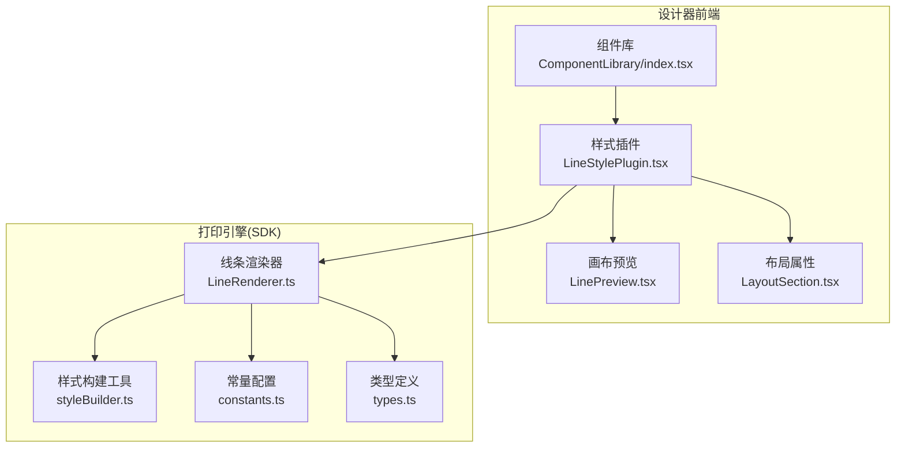
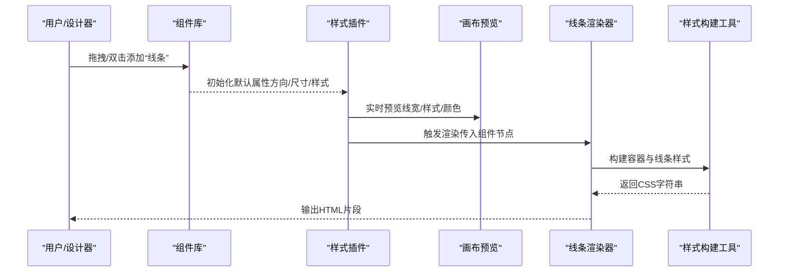
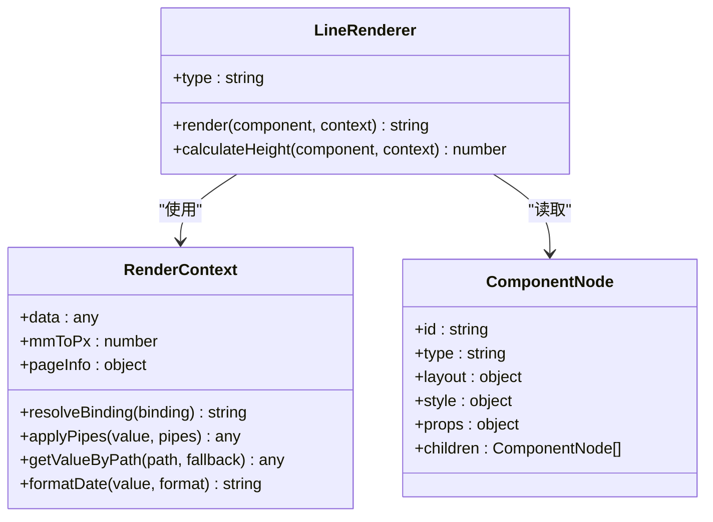
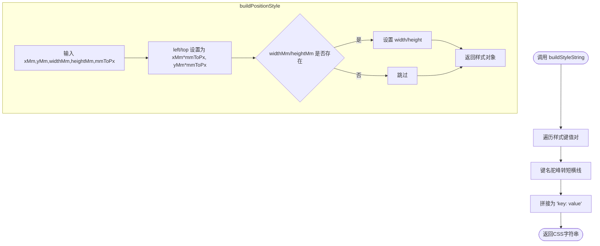
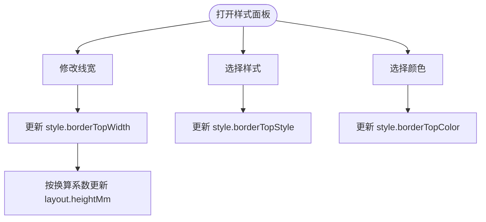
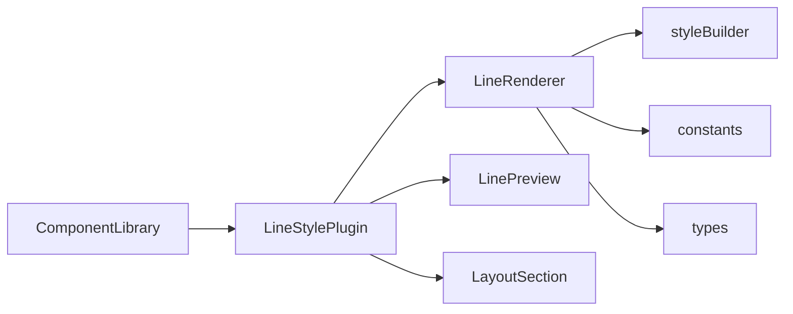

# 线条组件

<cite>
**本文引用的文件**
- [LineRenderer.ts](file://sdk/src/printEngine/renderers/LineRenderer.ts)
- [styleBuilder.ts](file://sdk/src/printEngine/utils/styleBuilder.ts)
- [constants.ts](file://sdk/src/printEngine/constants.ts)
- [types.ts](file://sdk/src/types.ts)
- [LineStylePlugin.tsx](file://designer/src/pages/Designer/components/PropertyPanel/stylePlugins/LineStylePlugin.tsx)
- [LinePreview.tsx](file://designer/src/pages/Designer/components/Canvas/componentRenderers/LinePreview.tsx)
- [ComponentLibrary/index.tsx](file://designer/src/pages/Designer/components/AssetPanel/ComponentLibrary/index.tsx)
- [LayoutSection.tsx](file://designer/src/pages/Designer/components/PropertyPanel/LayoutSection.tsx)
</cite>

## 目录
1. [简介](#简介)
2. [项目结构](#项目结构)
3. [核心组件](#核心组件)
4. [架构总览](#架构总览)
5. [详细组件分析](#详细组件分析)
6. [依赖关系分析](#依赖关系分析)
7. [性能考量](#性能考量)
8. [故障排查指南](#故障排查指南)
9. [结论](#结论)
10. [附录](#附录)

## 简介
线条组件用于在打印模板中添加装饰性或功能性分割线，支持水平与垂直两种方向，并可通过样式插件灵活配置线宽、样式（实线/虚线/点线）、颜色等。其渲染引擎基于 HTML/CSS 的 border 技术，结合坐标系统与样式构建工具，实现毫米到像素的精确换算与布局。

## 项目结构
线条组件涉及三个层面：
- 设计器端（前端）：提供组件库拖拽、属性面板样式配置、画布预览。
- 渲染引擎（SDK）：负责将组件节点渲染为最终 HTML 片段。
- 类型与常量：统一组件类型、默认尺寸与样式常量。

图表来源
- [ComponentLibrary/index.tsx:74-91](file://designer/src/pages/Designer/components/AssetPanel/ComponentLibrary/index.tsx#L74-L91)
- [LineStylePlugin.tsx:11-72](file://designer/src/pages/Designer/components/PropertyPanel/stylePlugins/LineStylePlugin.tsx#L11-L72)
- [LinePreview.tsx:10-30](file://designer/src/pages/Designer/components/Canvas/componentRenderers/LinePreview.tsx#L10-L30)
- [LayoutSection.tsx:17-47](file://designer/src/pages/Designer/components/PropertyPanel/LayoutSection.tsx#L17-L47)
- [LineRenderer.ts:10-58](file://sdk/src/printEngine/renderers/LineRenderer.ts#L10-L58)
- [styleBuilder.ts:13-53](file://sdk/src/printEngine/utils/styleBuilder.ts#L13-L53)
- [constants.ts:13-46](file://sdk/src/printEngine/constants.ts#L13-L46)
- [types.ts:185-202](file://sdk/src/types.ts#L185-L202)

章节来源
- [ComponentLibrary/index.tsx:74-91](file://designer/src/pages/Designer/components/AssetPanel/ComponentLibrary/index.tsx#L74-L91)
- [LineRenderer.ts:10-58](file://sdk/src/printEngine/renderers/LineRenderer.ts#L10-L58)
- [styleBuilder.ts:13-53](file://sdk/src/printEngine/utils/styleBuilder.ts#L13-L53)
- [constants.ts:13-46](file://sdk/src/printEngine/constants.ts#L13-L46)
- [types.ts:185-202](file://sdk/src/types.ts#L185-L202)

## 核心组件
- 线条渲染器（LineRenderer）：根据组件节点的布局、样式与属性，生成带样式的 HTML 片段；提供高度计算以支持分页。
- 样式构建工具（styleBuilder）：将样式对象转换为 CSS 字符串，并提供绝对定位样式构建。
- 常量与默认值（constants）：提供毫米到像素换算系数、组件默认尺寸与样式默认值。
- 类型定义（types）：统一组件节点结构、组件类型枚举、页面配置等。
- 样式插件（LineStylePlugin）：在设计器中提供线宽、样式、颜色的可视化配置。
- 画布预览（LinePreview）：在设计器画布中实时预览线条效果。
- 组件库（ComponentLibrary）：提供“线条”组件的默认属性（方向、尺寸、样式）。

章节来源
- [LineRenderer.ts:10-58](file://sdk/src/printEngine/renderers/LineRenderer.ts#L10-L58)
- [styleBuilder.ts:13-53](file://sdk/src/printEngine/utils/styleBuilder.ts#L13-L53)
- [constants.ts:8-46](file://sdk/src/printEngine/constants.ts#L8-L46)
- [types.ts:72-202](file://sdk/src/types.ts#L72-L202)
- [LineStylePlugin.tsx:11-72](file://designer/src/pages/Designer/components/PropertyPanel/stylePlugins/LineStylePlugin.tsx#L11-L72)
- [LinePreview.tsx:10-30](file://designer/src/pages/Designer/components/Canvas/componentRenderers/LinePreview.tsx#L10-L30)
- [ComponentLibrary/index.tsx:74-91](file://designer/src/pages/Designer/components/AssetPanel/ComponentLibrary/index.tsx#L74-L91)

## 架构总览
线条组件从“组件节点 → 渲染器 → 样式构建 → HTML 输出”的链路如下：

图表来源
- [ComponentLibrary/index.tsx:74-91](file://designer/src/pages/Designer/components/AssetPanel/ComponentLibrary/index.tsx#L74-L91)
- [LineStylePlugin.tsx:14-24](file://designer/src/pages/Designer/components/PropertyPanel/stylePlugins/LineStylePlugin.tsx#L14-L24)
- [LinePreview.tsx:10-30](file://designer/src/pages/Designer/components/Canvas/componentRenderers/LinePreview.tsx#L10-L30)
- [LineRenderer.ts:13-51](file://sdk/src/printEngine/renderers/LineRenderer.ts#L13-L51)
- [styleBuilder.ts:13-53](file://sdk/src/printEngine/utils/styleBuilder.ts#L13-L53)

## 详细组件分析

### 渲染器：LineRenderer
- 功能要点
  - 读取组件布局（x/y/宽/高）、样式（borderTopWidth/Color/Style）与属性（direction）。
  - 使用样式构建工具生成容器绝对定位样式，并通过 flex 实现居中。
  - 根据方向生成水平或垂直线条：水平线使用 borderTop，垂直线使用 borderLeft。
  - 提供高度计算，返回容器高度（mm）以参与分页。

图表来源
- [LineRenderer.ts:10-58](file://sdk/src/printEngine/renderers/LineRenderer.ts#L10-L58)
- [types.ts:11-55](file://sdk/src/printEngine/types.ts#L11-L55)
- [types.ts:185-202](file://sdk/src/types.ts#L185-L202)

章节来源
- [LineRenderer.ts:13-51](file://sdk/src/printEngine/renderers/LineRenderer.ts#L13-L51)
- [LineRenderer.ts:53-57](file://sdk/src/printEngine/renderers/LineRenderer.ts#L53-L57)

### 样式构建工具：styleBuilder
- 功能要点
  - 将样式对象转换为 CSS 字符串（驼峰键转短横线命名）。
  - 构建绝对定位样式：left/top/width/height（毫米转像素）。

图表来源
- [styleBuilder.ts:13-21](file://sdk/src/printEngine/utils/styleBuilder.ts#L13-L21)
- [styleBuilder.ts:31-53](file://sdk/src/printEngine/utils/styleBuilder.ts#L31-L53)

章节来源
- [styleBuilder.ts:13-21](file://sdk/src/printEngine/utils/styleBuilder.ts#L13-L21)
- [styleBuilder.ts:31-53](file://sdk/src/printEngine/utils/styleBuilder.ts#L31-L53)

### 常量与默认值：constants
- 功能要点
  - 提供毫米到像素换算系数（默认 3.78）。
  - 定义组件默认尺寸（线条长度、线条宽度）与样式默认值（文本颜色等）。

章节来源
- [constants.ts:8](file://sdk/src/printEngine/constants.ts#L8)
- [constants.ts:29-46](file://sdk/src/printEngine/constants.ts#L29-L46)

### 类型定义：types
- 功能要点
  - 统一组件节点结构（id/type/layout/style/props/children）。
  - 定义组件类型枚举，其中包含 'line'。
  - 定义渲染上下文接口（含 mmToPx 等）。

章节来源
- [types.ts:72](file://sdk/src/types.ts#L72)
- [types.ts:185-202](file://sdk/src/types.ts#L185-L202)
- [types.ts:11-55](file://sdk/src/printEngine/types.ts#L11-L55)

### 样式插件：LineStylePlugin
- 功能要点
  - 提供线宽（borderTopWidth）配置，同步更新组件高度（heightMm，按像素到毫米换算）。
  - 提供线条样式（solid/dashed/dotted）选择。
  - 提供线条颜色（borderTopColor）选择。
  - 与布局属性联动，确保视觉与布局一致。

图表来源
- [LineStylePlugin.tsx:14-24](file://designer/src/pages/Designer/components/PropertyPanel/stylePlugins/LineStylePlugin.tsx#L14-L24)
- [LineStylePlugin.tsx:42-56](file://designer/src/pages/Designer/components/PropertyPanel/stylePlugins/LineStylePlugin.tsx#L42-L56)
- [LineStylePlugin.tsx:57-67](file://designer/src/pages/Designer/components/PropertyPanel/stylePlugins/LineStylePlugin.tsx#L57-L67)

章节来源
- [LineStylePlugin.tsx:14-24](file://designer/src/pages/Designer/components/PropertyPanel/stylePlugins/LineStylePlugin.tsx#L14-L24)
- [LineStylePlugin.tsx:42-56](file://designer/src/pages/Designer/components/PropertyPanel/stylePlugins/LineStylePlugin.tsx#L42-L56)
- [LineStylePlugin.tsx:57-67](file://designer/src/pages/Designer/components/PropertyPanel/stylePlugins/LineStylePlugin.tsx#L57-L67)

### 画布预览：LinePreview
- 功能要点
  - 读取当前组件的线宽、样式与颜色，渲染一条占满容器宽度的水平线。
  - 用于设计器中实时预览线条效果。

章节来源
- [LinePreview.tsx:10-30](file://designer/src/pages/Designer/components/Canvas/componentRenderers/LinePreview.tsx#L10-L30)

### 组件库：ComponentLibrary（线条默认属性）
- 功能要点
  - “线条”组件默认方向为水平，宽度为 1px，颜色为黑色，样式为实线。
  - 默认宽度为页面可用宽度，高度较小以便作为分割线使用。

章节来源
- [ComponentLibrary/index.tsx:74-91](file://designer/src/pages/Designer/components/AssetPanel/ComponentLibrary/index.tsx#L74-L91)

### 布局属性：LayoutSection
- 功能要点
  - 提供 X/Y 坐标、宽度、高度等布局参数的输入与变更回调。
  - 与样式插件协同，确保线宽变化时高度同步更新。

章节来源
- [LayoutSection.tsx:17-47](file://designer/src/pages/Designer/components/PropertyPanel/LayoutSection.tsx#L17-L47)

## 依赖关系分析
- 渲染器依赖
  - 渲染器依赖样式构建工具（构建容器与线条样式）。
  - 渲染器依赖常量（默认尺寸与样式）。
  - 渲染器依赖类型定义（组件节点与渲染上下文）。
- 设计器依赖
  - 样式插件依赖 Ant Design 组件（InputNumber/Select/ColorPicker）。
  - 画布预览依赖组件节点样式。
  - 组件库提供默认属性，驱动样式插件与渲染器。

图表来源
- [LineRenderer.ts:7-8](file://sdk/src/printEngine/renderers/LineRenderer.ts#L7-L8)
- [styleBuilder.ts:5](file://sdk/src/printEngine/utils/styleBuilder.ts#L5)
- [constants.ts:8](file://sdk/src/printEngine/constants.ts#L8)
- [types.ts:5](file://sdk/src/types.ts#L5)
- [LineStylePlugin.tsx:5](file://designer/src/pages/Designer/components/PropertyPanel/stylePlugins/LineStylePlugin.tsx#L5)
- [LinePreview.tsx:1](file://designer/src/pages/Designer/components/Canvas/componentRenderers/LinePreview.tsx#L1)
- [LayoutSection.tsx:6](file://designer/src/pages/Designer/components/PropertyPanel/LayoutSection.tsx#L6)
- [ComponentLibrary/index.tsx:11](file://designer/src/pages/Designer/components/AssetPanel/ComponentLibrary/index.tsx#L11)

章节来源
- [LineRenderer.ts:7-8](file://sdk/src/printEngine/renderers/LineRenderer.ts#L7-L8)
- [styleBuilder.ts:5](file://sdk/src/printEngine/utils/styleBuilder.ts#L5)
- [constants.ts:8](file://sdk/src/printEngine/constants.ts#L8)
- [types.ts:5](file://sdk/src/types.ts#L5)
- [LineStylePlugin.tsx:5](file://designer/src/pages/Designer/components/PropertyPanel/stylePlugins/LineStylePlugin.tsx#L5)
- [LinePreview.tsx:1](file://designer/src/pages/Designer/components/Canvas/componentRenderers/LinePreview.tsx#L1)
- [LayoutSection.tsx:6](file://designer/src/pages/Designer/components/PropertyPanel/LayoutSection.tsx#L6)
- [ComponentLibrary/index.tsx:11](file://designer/src/pages/Designer/components/AssetPanel/ComponentLibrary/index.tsx#L11)

## 性能考量
- 样式构建为纯函数，复杂度低，适合高频调用。
- 渲染器采用双层结构（容器 + 线条），仅在需要时计算高度，避免多余 DOM。
- 毫米到像素换算系数固定，减少运行时计算成本。
- 建议在批量渲染时复用样式字符串，避免重复构建。

## 故障排查指南
- 线条未显示
  - 检查线宽是否为 0 或样式是否被覆盖。
  - 确认容器高度是否足够容纳线条（高度应大于等于线宽）。
- 方向错误
  - 确认 props.direction 是否为 'horizontal' 或 'vertical'。
- 颜色/样式不生效
  - 检查 style 中对应键名（borderTopWidth/Style/Color）是否正确。
- 坐标错位
  - 检查布局 xMm/yMm 与 mmToPx 换算是否一致。

章节来源
- [LineRenderer.ts:15-18](file://sdk/src/printEngine/renderers/LineRenderer.ts#L15-L18)
- [constants.ts:8](file://sdk/src/printEngine/constants.ts#L8)
- [styleBuilder.ts:31-53](file://sdk/src/printEngine/utils/styleBuilder.ts#L31-L53)

## 结论
线条组件通过简洁的渲染策略与完善的设计器集成，实现了对水平/垂直线条的高效绘制与灵活配置。其基于 border 的实现保证了跨浏览器的一致性，配合毫米到像素的精确换算与样式构建工具，使设计师能够在打印模板中便捷地添加装饰性与结构性线条。

## 附录

### 属性配置清单
- 方向（props.direction）
  - 取值：'horizontal' | 'vertical'
  - 作用：决定线条为水平还是垂直
- 线宽（style.borderTopWidth）
  - 单位：px
  - 作用：控制线条粗细
- 样式（style.borderTopStyle）
  - 取值：'solid' | 'dashed' | 'dotted'
  - 作用：控制线条样式
- 颜色（style.borderTopColor）
  - 取值：CSS 颜色值
  - 作用：控制线条颜色
- 位置与尺寸（layout.xMm/yMm/widthMm/heightMm）
  - 作用：控制线条在页面中的位置与尺寸

章节来源
- [LineRenderer.ts:15-18](file://sdk/src/printEngine/renderers/LineRenderer.ts#L15-L18)
- [LineStylePlugin.tsx:42-67](file://designer/src/pages/Designer/components/PropertyPanel/stylePlugins/LineStylePlugin.tsx#L42-L67)
- [LayoutSection.tsx:17-47](file://designer/src/pages/Designer/components/PropertyPanel/LayoutSection.tsx#L17-L47)
- [ComponentLibrary/index.tsx:81-90](file://designer/src/pages/Designer/components/AssetPanel/ComponentLibrary/index.tsx#L81-L90)

### 实际使用示例（步骤说明）
- 在组件库中添加“线条”组件
  - 通过拖拽或双击将“线条”组件加入画布。
  - 默认为水平线，宽度较小，颜色为黑色。
- 在样式面板中调整
  - 调整线宽：影响 borderTopWidth 与 heightMm。
  - 选择样式：实线/虚线/点线。
  - 选择颜色：十六进制颜色值。
- 在布局面板中微调
  - 调整 X/Y 坐标与宽度，使其适配页面版式。
- 在打印模板中应用
  - 将线条用于分隔标题与正文、表格上下分割、页眉页脚分隔等场景。

章节来源
- [ComponentLibrary/index.tsx:74-91](file://designer/src/pages/Designer/components/AssetPanel/ComponentLibrary/index.tsx#L74-L91)
- [LineStylePlugin.tsx:14-24](file://designer/src/pages/Designer/components/PropertyPanel/stylePlugins/LineStylePlugin.tsx#L14-L24)
- [LayoutSection.tsx:17-47](file://designer/src/pages/Designer/components/PropertyPanel/LayoutSection.tsx#L17-L47)