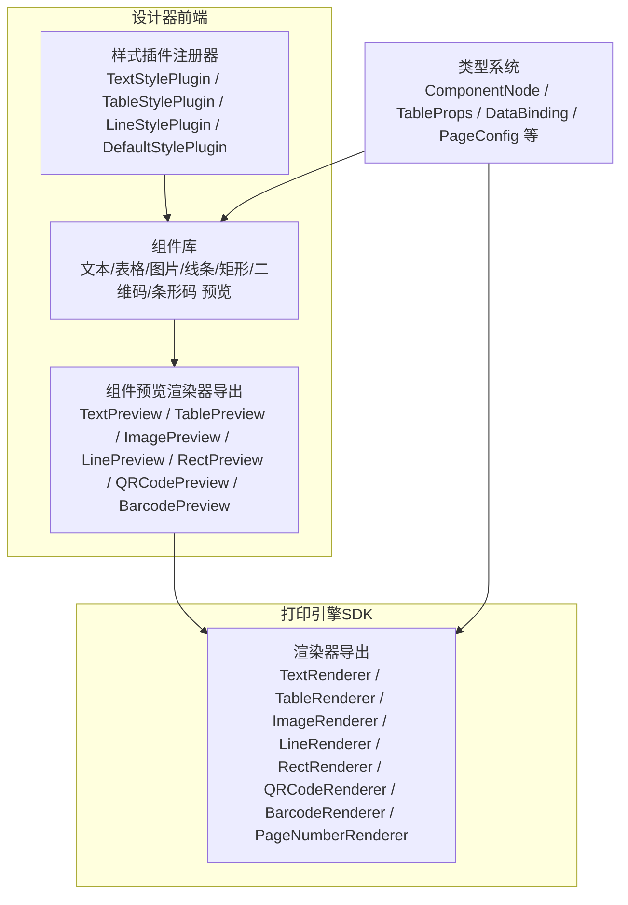
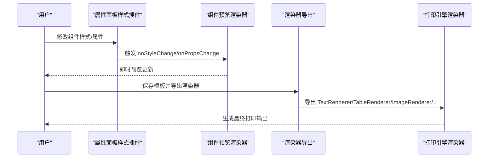
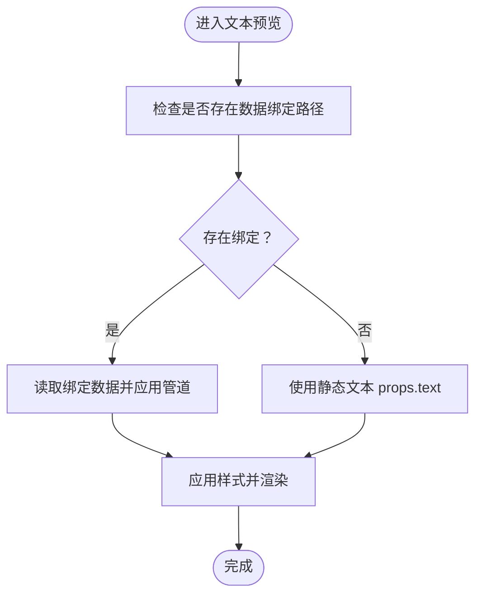
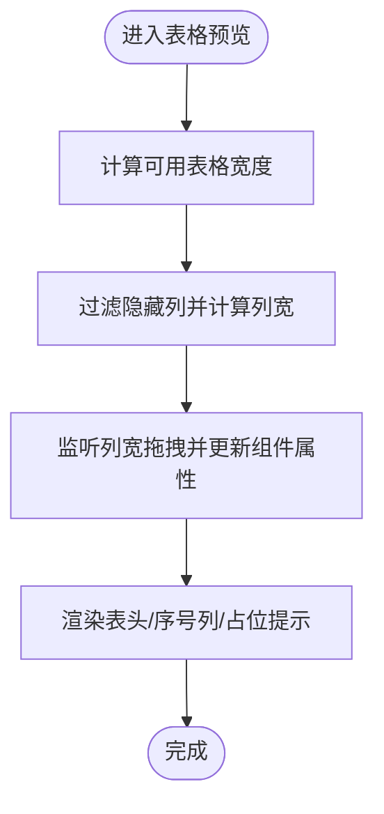
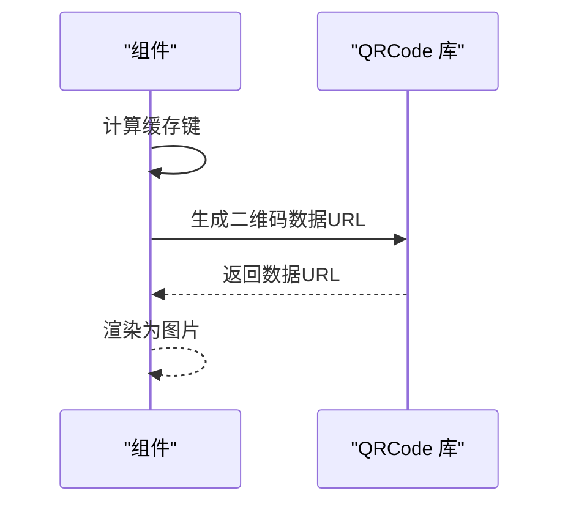
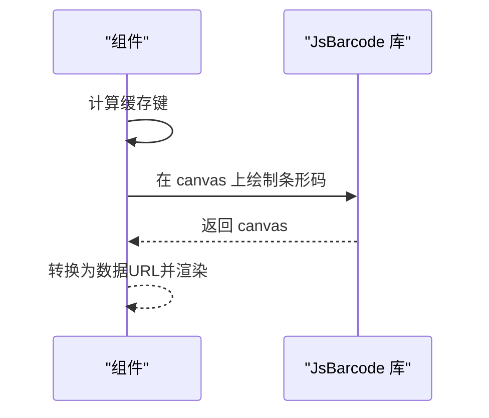
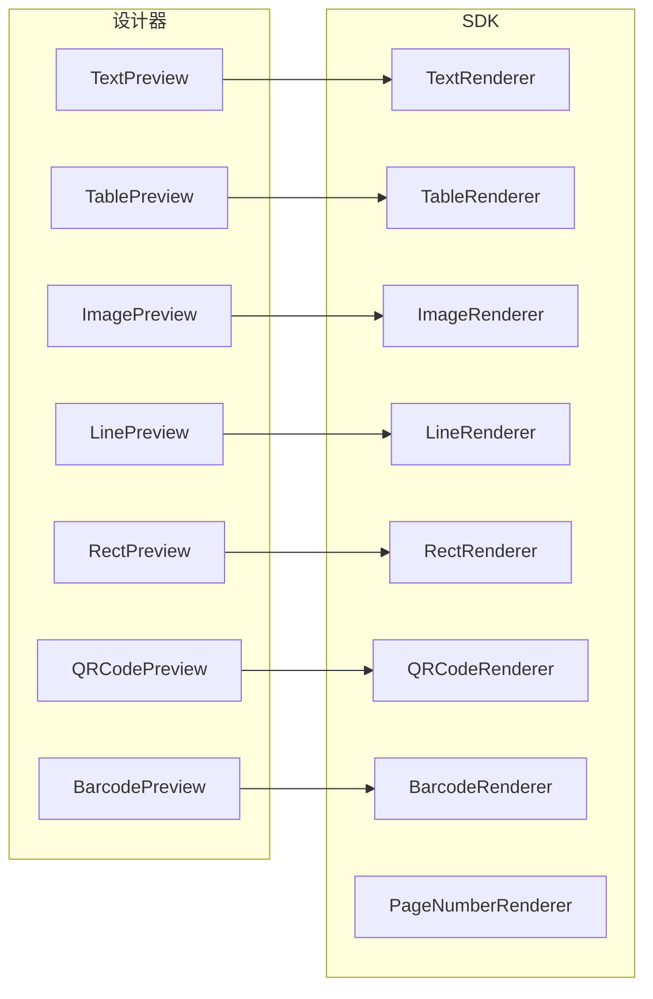

# 组件库系统

<cite>
**本文引用的文件**
- [designer/src/components/Barcode/index.tsx](file://designer/src/components/Barcode/index.tsx)
- [designer/src/components/QRCode/index.tsx](file://designer/src/components/QRCode/index.tsx)
- [designer/src/pages/Designer/components/Canvas/componentRenderers/index.ts](file://designer/src/pages/Designer/components/Canvas/componentRenderers/index.ts)
- [designer/src/pages/Designer/components/Canvas/componentRenderers/TextPreview.tsx](file://designer/src/pages/Designer/components/Canvas/componentRenderers/TextPreview.tsx)
- [designer/src/pages/Designer/components/Canvas/componentRenderers/TablePreview.tsx](file://designer/src/pages/Designer/components/Canvas/componentRenderers/TablePreview.tsx)
- [designer/src/pages/Designer/components/Canvas/componentRenderers/ImagePreview.tsx](file://designer/src/pages/Designer/components/Canvas/componentRenderers/ImagePreview.tsx)
- [designer/src/pages/Designer/components/Canvas/componentRenderers/LinePreview.tsx](file://designer/src/pages/Designer/components/Canvas/componentRenderers/LinePreview.tsx)
- [designer/src/pages/Designer/components/Canvas/componentRenderers/RectPreview.tsx](file://designer/src/pages/Designer/components/Canvas/componentRenderers/RectPreview.tsx)
- [sdk/src/printEngine/renderers/index.ts](file://sdk/src/printEngine/renderers/index.ts)
- [designer/src/pages/Designer/components/PropertyPanel/stylePlugins/index.ts](file://designer/src/pages/Designer/components/PropertyPanel/stylePlugins/index.ts)
- [designer/src/pages/Designer/components/PropertyPanel/stylePlugins/TextStylePlugin.tsx](file://designer/src/pages/Designer/components/PropertyPanel/stylePlugins/TextStylePlugin.tsx)
- [designer/src/pages/Designer/components/PropertyPanel/stylePlugins/TableStylePlugin.tsx](file://designer/src/pages/Designer/components/PropertyPanel/stylePlugins/TableStylePlugin.tsx)
- [designer/src/pages/Designer/components/PropertyPanel/stylePlugins/LineStylePlugin.tsx](file://designer/src/pages/Designer/components/PropertyPanel/stylePlugins/LineStylePlugin.tsx)
- [designer/src/pages/Designer/components/PropertyPanel/stylePlugins/DefaultStylePlugin.tsx](file://designer/src/pages/Designer/components/PropertyPanel/stylePlugins/DefaultStylePlugin.tsx)
- [designer/src/types/index.ts](file://designer/src/types/index.ts)
</cite>

## 目录
1. [简介](#简介)
2. [项目结构](#项目结构)
3. [核心组件](#核心组件)
4. [架构总览](#架构总览)
5. [详细组件分析](#详细组件分析)
6. [依赖分析](#依赖分析)
7. [性能考虑](#性能考虑)
8. [故障排查指南](#故障排查指南)
9. [结论](#结论)
10. [附录](#附录)

## 简介
本组件库系统围绕“所见即所得”的设计与“高保真渲染”的打印引擎两大层面构建，提供七类核心组件：文本、表格、图片、二维码、条形码、线条、矩形。系统采用插件化样式配置与统一的渲染器注册机制，既保证了设计器内组件的预览一致性，也确保了打印引擎端的稳定输出。

## 项目结构
- 设计器前端（React + Ant Design）负责组件拖拽、属性面板配置、样式插件管理与组件预览渲染。
- 打印引擎（SDK）负责将模板渲染为可打印的 HTML/CSS 输出，包含各组件渲染器。
- 类型系统（Types）统一定义组件节点、页面配置、数据绑定、表格分页与合计等核心数据结构。

图表来源
- [designer/src/pages/Designer/components/Canvas/componentRenderers/index.ts:1-11](file://designer/src/pages/Designer/components/Canvas/componentRenderers/index.ts#L1-L11)
- [sdk/src/printEngine/renderers/index.ts:1-13](file://sdk/src/printEngine/renderers/index.ts#L1-L13)
- [designer/src/pages/Designer/components/PropertyPanel/stylePlugins/index.ts:1-52](file://designer/src/pages/Designer/components/PropertyPanel/stylePlugins/index.ts#L1-L52)
- [designer/src/types/index.ts:129-331](file://designer/src/types/index.ts#L129-L331)

章节来源
- [designer/src/pages/Designer/components/Canvas/componentRenderers/index.ts:1-11](file://designer/src/pages/Designer/components/Canvas/componentRenderers/index.ts#L1-L11)
- [sdk/src/printEngine/renderers/index.ts:1-13](file://sdk/src/printEngine/renderers/index.ts#L1-L13)
- [designer/src/pages/Designer/components/PropertyPanel/stylePlugins/index.ts:1-52](file://designer/src/pages/Designer/components/PropertyPanel/stylePlugins/index.ts#L1-L52)
- [designer/src/types/index.ts:129-331](file://designer/src/types/index.ts#L129-L331)

## 核心组件
- 文本组件：支持标签展示、静态文本、数据绑定、字体大小/字重/对齐/颜色等样式配置。
- 表格组件：支持列定义、表头显隐、边框样式、列宽计算与拖拽调整、跨页分页与表头重复、合计行与额外行、序号列。
- 图片组件：支持本地/远程图片、objectFit 等样式控制。
- 二维码组件：基于 qrcode 库生成二维码，支持尺寸配置与缓存。
- 条形码组件：基于 jsbarcode 生成条形码，支持格式、宽高与缓存。
- 线条组件：支持线条高度（px）、样式（实线/虚线/点线）、颜色。
- 矩形组件：支持边框与背景色配置。

章节来源
- [designer/src/pages/Designer/components/Canvas/componentRenderers/TextPreview.tsx:1-31](file://designer/src/pages/Designer/components/Canvas/componentRenderers/TextPreview.tsx#L1-L31)
- [designer/src/pages/Designer/components/Canvas/componentRenderers/TablePreview.tsx:69-175](file://designer/src/pages/Designer/components/Canvas/componentRenderers/TablePreview.tsx#L69-L175)
- [designer/src/pages/Designer/components/Canvas/componentRenderers/ImagePreview.tsx:1-34](file://designer/src/pages/Designer/components/Canvas/componentRenderers/ImagePreview.tsx#L1-L34)
- [designer/src/components/QRCode/index.tsx:1-52](file://designer/src/components/QRCode/index.tsx#L1-L52)
- [designer/src/components/Barcode/index.tsx:1-66](file://designer/src/components/Barcode/index.tsx#L1-L66)
- [designer/src/pages/Designer/components/Canvas/componentRenderers/LinePreview.tsx:1-31](file://designer/src/pages/Designer/components/Canvas/componentRenderers/LinePreview.tsx#L1-L31)
- [designer/src/pages/Designer/components/Canvas/componentRenderers/RectPreview.tsx:1-20](file://designer/src/pages/Designer/components/Canvas/componentRenderers/RectPreview.tsx#L1-L20)
- [designer/src/types/index.ts:196-297](file://designer/src/types/index.ts#L196-L297)

## 架构总览
- 设计器侧通过“组件预览渲染器”将组件节点渲染为可视化预览；样式插件负责属性面板的配置项生成与变更回调。
- 打印引擎侧通过“渲染器导出”统一暴露各组件渲染器，供模板渲染阶段调用。
- 类型系统贯穿两端，确保组件节点、属性、样式、数据绑定等结构一致。

图表来源
- [designer/src/pages/Designer/components/PropertyPanel/stylePlugins/index.ts:22-38](file://designer/src/pages/Designer/components/PropertyPanel/stylePlugins/index.ts#L22-L38)
- [designer/src/pages/Designer/components/Canvas/componentRenderers/index.ts:1-11](file://designer/src/pages/Designer/components/Canvas/componentRenderers/index.ts#L1-L11)
- [sdk/src/printEngine/renderers/index.ts:1-13](file://sdk/src/printEngine/renderers/index.ts#L1-L13)

## 详细组件分析

### 文本组件
- 属性与数据绑定
  - props.label：标签文本（用于说明性前缀）
  - props.text：静态文本（不绑定数据时显示）
  - binding.path：数据绑定路径（如 user.name），支持管道链
  - binding.pipes：数据格式化管道（如日期、货币、中文大写）
  - binding.fallback：数据缺失时的回退值
- 样式系统
  - style.fontSize、style.fontWeight、style.textAlign、style.color
- 渲染机制
  - 预览渲染器根据 props 与 binding 决定显示内容，支持单行省略与对齐
- 使用场景
  - 标签+数据绑定：如“收货人：{{user.name}}”
  - 静态说明：如“客户联”、“备注：请妥善保管”

图表来源
- [designer/src/pages/Designer/components/Canvas/componentRenderers/TextPreview.tsx:10-30](file://designer/src/pages/Designer/components/Canvas/componentRenderers/TextPreview.tsx#L10-L30)
- [designer/src/types/index.ts:157-164](file://designer/src/types/index.ts#L157-L164)

章节来源
- [designer/src/pages/Designer/components/Canvas/componentRenderers/TextPreview.tsx:1-31](file://designer/src/pages/Designer/components/Canvas/componentRenderers/TextPreview.tsx#L1-L31)
- [designer/src/types/index.ts:157-164](file://designer/src/types/index.ts#L157-L164)

### 表格组件
- 属性与功能
  - columns：列定义（dataIndex、title、width、align、hidden、summary）
  - showHeader/bordered/borderStyle/borderColor/borderWidth
  - repeatHeader：跨页时是否重复表头
  - showSummary/summaryMode：合计行与模式（每页/最后一页）
  - summaryLabel/summaryStyle：合计行标签与样式
  - showRowNumber/rowNumberLabel/rowNumberWidth：序号列
  - summaryExtraRows：合计行下方额外行（如大写金额）
- 渲染机制
  - 预览渲染器计算列宽、处理列宽拖拽、控制表头显隐与序号列
  - 使用 SDK 的列宽计算工具与页面宽度计算工具
- 使用场景
  - 商品明细、费用清单、多页报表（开启跨页表头）

图表来源
- [designer/src/pages/Designer/components/Canvas/componentRenderers/TablePreview.tsx:69-175](file://designer/src/pages/Designer/components/Canvas/componentRenderers/TablePreview.tsx#L69-L175)
- [designer/src/types/index.ts:256-297](file://designer/src/types/index.ts#L256-L297)

章节来源
- [designer/src/pages/Designer/components/Canvas/componentRenderers/TablePreview.tsx:1-175](file://designer/src/pages/Designer/components/Canvas/componentRenderers/TablePreview.tsx#L1-L175)
- [designer/src/types/index.ts:196-297](file://designer/src/types/index.ts#L196-L297)

### 图片组件
- 属性与样式
  - props.src：图片地址（本地/远程）
  - style.objectFit：图片填充策略（如 contain）
- 渲染机制
  - 若存在 src 则以 img 渲染；否则显示占位提示
- 使用场景
  - Logo、水印、品牌图

章节来源
- [designer/src/pages/Designer/components/Canvas/componentRenderers/ImagePreview.tsx:1-34](file://designer/src/pages/Designer/components/Canvas/componentRenderers/ImagePreview.tsx#L1-L34)

### 二维码组件
- 属性与渲染
  - props.content：二维码内容
  - props.size：二维码尺寸
  - 使用 qrcode 库生成 base64 数据，缓存于状态并在预览中以 img 显示
- 使用场景
  - 产品溯源、票据识别

图表来源
- [designer/src/components/QRCode/index.tsx:1-52](file://designer/src/components/QRCode/index.tsx#L1-L52)

章节来源
- [designer/src/components/QRCode/index.tsx:1-52](file://designer/src/components/QRCode/index.tsx#L1-L52)

### 条形码组件
- 属性与渲染
  - props.content：条形码内容
  - props.format：条形码格式
  - props.width/props.height：绘制参数
  - 使用 jsbarcode 在 canvas 上绘制，转为 base64 并以 img 显示
- 使用场景
  - 商品 SKU、物流面单

图表来源
- [designer/src/components/Barcode/index.tsx:1-66](file://designer/src/components/Barcode/index.tsx#L1-L66)

章节来源
- [designer/src/components/Barcode/index.tsx:1-66](file://designer/src/components/Barcode/index.tsx#L1-L66)

### 线条组件
- 属性与样式
  - style.borderTopWidth：线条高度（px）
  - style.borderTopStyle：线条样式（solid/dashed/dotted）
  - style.borderTopColor：线条颜色
- 渲染机制
  - 通过单行 div 的 borderTop 渲染
- 使用场景
  - 分割线、装饰线

章节来源
- [designer/src/pages/Designer/components/Canvas/componentRenderers/LinePreview.tsx:1-31](file://designer/src/pages/Designer/components/Canvas/componentRenderers/LinePreview.tsx#L1-L31)

### 矩形组件
- 属性与样式
  - style.border：边框样式
  - style.background：背景色
- 渲染机制
  - 通过 div 的 border 与 background 渲染
- 使用场景
  - 区域框、底纹装饰

章节来源
- [designer/src/pages/Designer/components/Canvas/componentRenderers/RectPreview.tsx:1-20](file://designer/src/pages/Designer/components/Canvas/componentRenderers/RectPreview.tsx#L1-L20)

## 依赖分析
- 组件预览渲染器与渲染器导出
  - 设计器导出 TextPreview/TablePreview/ImagePreview/LinePreview/RectPreview/QRCodePreview/BarcodePreview
  - SDK 导出 TextRenderer/TableRenderer/ImageRenderer/LineRenderer/RectRenderer/QRCodeRenderer/BarcodeRenderer/PageNumberRenderer
- 样式插件注册
  - 注册 TextStylePlugin/TableStylePlugin/LineStylePlugin/DefaultStylePlugin
  - 通过名称映射到具体组件类型，未注册时回退默认插件

图表来源
- [designer/src/pages/Designer/components/Canvas/componentRenderers/index.ts:1-11](file://designer/src/pages/Designer/components/Canvas/componentRenderers/index.ts#L1-L11)
- [sdk/src/printEngine/renderers/index.ts:1-13](file://sdk/src/printEngine/renderers/index.ts#L1-L13)

章节来源
- [designer/src/pages/Designer/components/Canvas/componentRenderers/index.ts:1-11](file://designer/src/pages/Designer/components/Canvas/componentRenderers/index.ts#L1-L11)
- [sdk/src/printEngine/renderers/index.ts:1-13](file://sdk/src/printEngine/renderers/index.ts#L1-L13)
- [designer/src/pages/Designer/components/PropertyPanel/stylePlugins/index.ts:1-52](file://designer/src/pages/Designer/components/PropertyPanel/stylePlugins/index.ts#L1-L52)

## 性能考虑
- 预览渲染缓存
  - 二维码与条形码均使用缓存键（由输入参数组合）避免重复生成，提升交互流畅度。
- 列宽拖拽优化
  - 表格列宽拖拽在移动过程中仅更新本地状态，mouseup 时一次性提交，减少历史记录写入与重绘次数。
- 预览渲染器职责单一
  - 各组件预览仅负责“所见即所得”的可视化呈现，不承担复杂逻辑，便于维护与扩展。

章节来源
- [designer/src/components/QRCode/index.tsx:13-20](file://designer/src/components/QRCode/index.tsx#L13-L20)
- [designer/src/components/Barcode/index.tsx:15-34](file://designer/src/components/Barcode/index.tsx#L15-L34)
- [designer/src/pages/Designer/components/Canvas/componentRenderers/TablePreview.tsx:36-61](file://designer/src/pages/Designer/components/Canvas/componentRenderers/TablePreview.tsx#L36-L61)

## 故障排查指南
- 二维码/条形码空白
  - 检查输入内容与尺寸/格式参数是否合理；确认缓存键是否正确更新。
- 表格列宽无法拖拽
  - 检查鼠标事件绑定与 store 提交时机；确认当前列最大宽度与缩放级别换算。
- 样式插件未生效
  - 检查插件注册表中是否存在对应组件类型的插件；若未注册将回退默认插件。
- 数据绑定不显示
  - 检查 binding.path 是否指向有效数据；确认管道链配置与 fallback 设置。

章节来源
- [designer/src/components/QRCode/index.tsx:16-20](file://designer/src/components/QRCode/index.tsx#L16-L20)
- [designer/src/components/Barcode/index.tsx:21-34](file://designer/src/components/Barcode/index.tsx#L21-L34)
- [designer/src/pages/Designer/components/Canvas/componentRenderers/TablePreview.tsx:46-54](file://designer/src/pages/Designer/components/Canvas/componentRenderers/TablePreview.tsx#L46-L54)
- [designer/src/pages/Designer/components/PropertyPanel/stylePlugins/index.ts:31-38](file://designer/src/pages/Designer/components/PropertyPanel/stylePlugins/index.ts#L31-L38)

## 结论
本组件库系统通过清晰的组件预览渲染器与插件化样式配置，实现了从设计到打印的高保真流转。七类核心组件覆盖常见打印场景，配合表格的跨页与合计能力、二维码/条形码的动态生成，以及统一的类型系统与渲染器导出，满足多样化的打印模板需求。

## 附录
- 组件类型与属性速览
  - 文本：props.label、props.text、binding、style.fontSize/fontWeight/textAlign/color
  - 表格：columns、showHeader/bordered/borderStyle/borderColor/borderWidth、repeatHeader、showSummary/summaryMode、summaryLabel/summaryStyle、showRowNumber/rowNumberLabel/rowNumberWidth、summaryExtraRows
  - 图片：props.src、style.objectFit
  - 二维码：props.content、props.size
  - 条形码：props.content、props.format、props.width、props.height
  - 线条：style.borderTopWidth、style.borderTopStyle、style.borderTopColor
  - 矩形：style.border、style.background

章节来源
- [designer/src/types/index.ts:196-331](file://designer/src/types/index.ts#L196-L331)