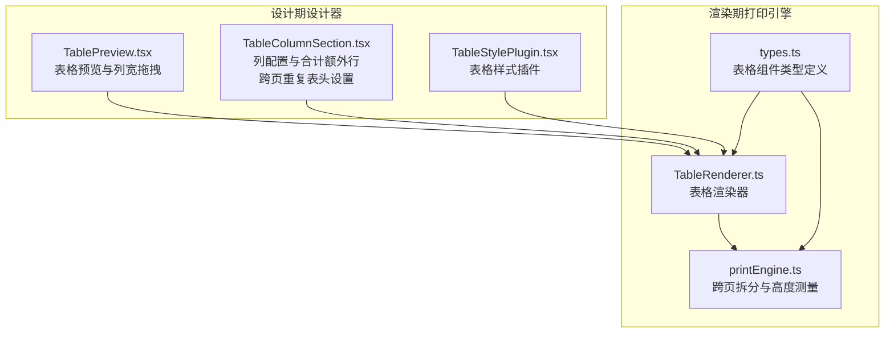
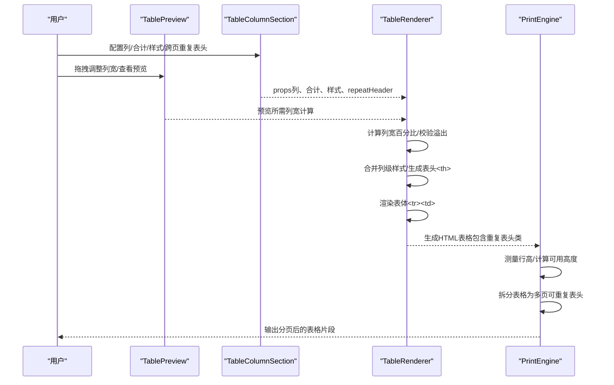
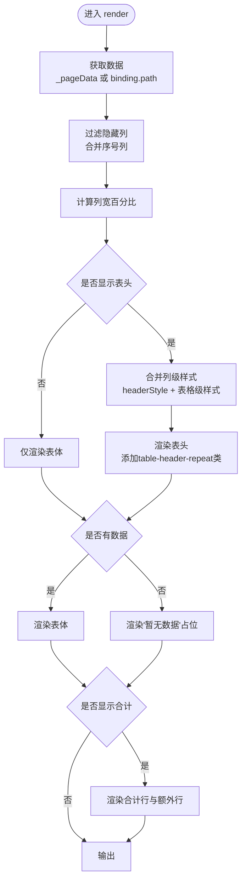
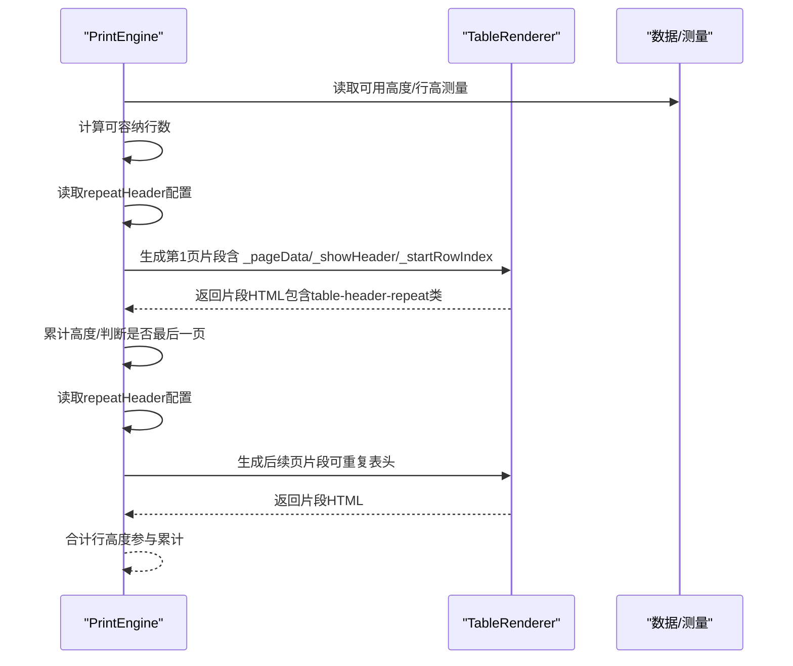
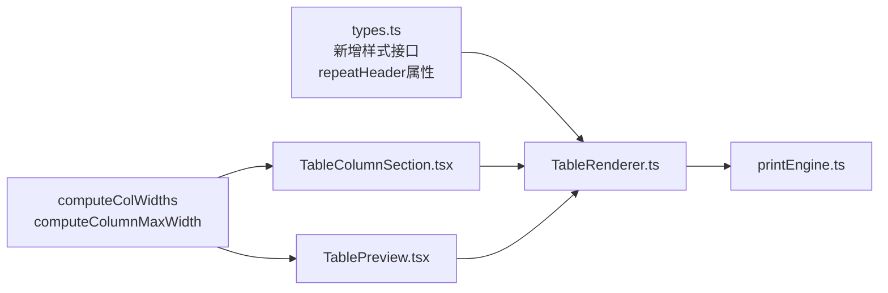

# 表格组件

<cite>
**本文档引用的文件**
- [TableRenderer.ts](file://sdk/src/printEngine/renderers/TableRenderer.ts)
- [TablePreview.tsx](file://designer/src/pages/Designer/components/Canvas/componentRenderers/TablePreview.tsx)
- [TableColumnSection.tsx](file://designer/src/pages/Designer/components/PropertyPanel/TableColumnSection.tsx)
- [TableStylePlugin.tsx](file://designer/src/pages/Designer/components/PropertyPanel/stylePlugins/TableStylePlugin.tsx)
- [types.ts](file://sdk/src/types.ts)
- [printEngine.ts](file://sdk/src/printEngine.ts)
</cite>

## 更新摘要
**变更内容**
- 新增'跨页重复表头'功能，支持 repeatHeader 属性控制
- 改进表头显示控制逻辑，新增 showHeader 与 repeatHeader 的组合控制
- 移除 TablePaginationConfig 接口架构优化
- 增强跨页分页显示与表头重复机制

## 目录
1. [简介](#简介)
2. [项目结构](#项目结构)
3. [核心组件](#核心组件)
4. [架构概览](#架构概览)
5. [详细组件分析](#详细组件分析)
6. [依赖关系分析](#依赖关系分析)
7. [性能考量](#性能考量)
8. [故障排查指南](#故障排查指南)
9. [结论](#结论)
10. [附录](#附录)

## 简介
本文件系统性地介绍表格组件的设计与实现，涵盖以下能力：
- 数据绑定到二维数组，支持嵌套路径取值
- 跨页分页显示与表头重复机制
- 列宽自动计算与列宽溢出保护
- 列隐藏/显示控制与序号列
- 表格合计功能（含合计额外行与管道转换）
- **新增** 跨页重复表头功能（repeatHeader 属性）
- **新增** 改进的表头显示控制逻辑
- **新增** 列级样式系统（TableColumnStyle、TableHeaderStyle接口）
- **新增** 单元格样式定制（边框、对齐、字体、背景等）
- 渲染引擎工作原理（数据结构映射、HTML 表格生成、样式应用）

## 项目结构
表格组件由"设计期"和"渲染期"两部分协同完成：
- 设计期（设计器）：提供列配置、样式配置、列宽拖拽、合计额外行配置、跨页重复表头设置等交互
- 渲染期（打印引擎）：负责将组件树渲染为可打印的 HTML，并进行跨页拆分与高度估算

**图表来源**
- [TablePreview.tsx:69-175](file://designer/src/pages/Designer/components/Canvas/componentRenderers/TablePreview.tsx#L69-L175)
- [TableColumnSection.tsx:22-718](file://designer/src/pages/Designer/components/PropertyPanel/TableColumnSection.tsx#L22-L718)
- [TableStylePlugin.tsx:11-48](file://designer/src/pages/Designer/components/PropertyPanel/stylePlugins/TableStylePlugin.tsx#L11-L48)
- [TableRenderer.ts:147-602](file://sdk/src/printEngine/renderers/TableRenderer.ts#L147-L602)
- [printEngine.ts:762-978](file://sdk/src/printEngine.ts#L762-L978)
- [types.ts:131-161](file://sdk/src/types.ts#L131-L161)

**章节来源**
- [TablePreview.tsx:69-175](file://designer/src/pages/Designer/components/Canvas/componentRenderers/TablePreview.tsx#L69-L175)
- [TableColumnSection.tsx:22-718](file://designer/src/pages/Designer/components/PropertyPanel/TableColumnSection.tsx#L22-L718)
- [TableStylePlugin.tsx:11-48](file://designer/src/pages/Designer/components/PropertyPanel/stylePlugins/TableStylePlugin.tsx#L11-L48)
- [TableRenderer.ts:147-602](file://sdk/src/printEngine/renderers/TableRenderer.ts#L147-L602)
- [printEngine.ts:762-978](file://sdk/src/printEngine.ts#L762-L978)
- [types.ts:131-161](file://sdk/src/types.ts#L131-L161)

## 核心组件
- 表格渲染器（TableRenderer）
  - 负责根据组件节点与上下文生成最终 HTML 表格
  - 支持数据绑定路径取值、列宽计算、表头/表体/合计渲染、样式拼装
  - **新增** 支持跨页重复表头渲染（thead class="table-header-repeat"）
  - **新增** 支持列级样式合并与优先级处理
- 表格预览（TablePreview）
  - 设计期预览，支持列宽拖拽、表头显示、边框样式、文本对齐
- 列配置面板（TableColumnSection）
  - 提供列增删改、隐藏/显示、标题/字段名/宽度配置
  - **新增** 支持跨页重复表头设置（repeatHeader 属性）
  - **新增** 支持列级样式配置（表头样式、数据样式）
  - 支持合计配置（聚合类型、精度、前后缀、管道转换）、合计额外行
- 表格样式插件（TableStylePlugin）
  - 提供字体大小、对齐方式等基础样式配置
- 跨页拆分引擎（printEngine）
  - 基于相对间距的表格跨页策略，支持重复表头、渲染后测量、空表格保护
  - **新增** 支持 repeatHeader 配置参数

**章节来源**
- [TableRenderer.ts:147-602](file://sdk/src/printEngine/renderers/TableRenderer.ts#L147-L602)
- [TablePreview.tsx:69-175](file://designer/src/pages/Designer/components/Canvas/componentRenderers/TablePreview.tsx#L69-L175)
- [TableColumnSection.tsx:22-718](file://designer/src/pages/Designer/components/PropertyPanel/TableColumnSection.tsx#L22-L718)
- [TableStylePlugin.tsx:11-48](file://designer/src/pages/Designer/components/PropertyPanel/stylePlugins/TableStylePlugin.tsx#L11-L48)
- [printEngine.ts:762-978](file://sdk/src/printEngine.ts#L762-L978)

## 架构概览
表格组件的运行流程如下：
- 设计期：用户通过列配置面板设置列、合计、样式、跨页重复表头；通过预览查看列宽与表头效果
- 渲染期：渲染器读取绑定数据或分页数据，计算列宽，生成表头/表体/合计 HTML
- 跨页：打印引擎根据页面高度与行高测量结果，将表格拆分为多个片段，必要时重复表头

**图表来源**
- [TablePreview.tsx:69-175](file://designer/src/pages/Designer/components/Canvas/componentRenderers/TablePreview.tsx#L69-L175)
- [TableColumnSection.tsx:22-718](file://designer/src/pages/Designer/components/PropertyPanel/TableColumnSection.tsx#L22-L718)
- [TableRenderer.ts:150-327](file://sdk/src/printEngine/renderers/TableRenderer.ts#L150-L327)
- [printEngine.ts:762-978](file://sdk/src/printEngine.ts#L762-L978)

## 详细组件分析

### 表格渲染器（TableRenderer）
职责与特性：
- 数据绑定与取值：支持嵌套路径取值，空值安全
- 列宽计算：自动分配、固定列缩放、溢出保护、最后一列误差修正
- 表头/表体/合计：条件渲染、样式拼装、对齐与背景
- **新增** 跨页重复表头渲染：使用 thead class="table-header-repeat" 实现重复表头效果
- **新增** 列级样式合并：支持列级 headerStyle 和 style 与表格级样式合并
- 跨页参数注入：_pageData/_showHeader/_isLastPage/_totalData/_startRowIndex
- 安全与健壮性：HTML 转义、最小宽度保护、溢出警告、异常降级

**新增** 跨页重复表头机制：
- 表头渲染时添加 table-header-repeat 类，使 CSS 支持重复表头功能
- 与跨页拆分引擎配合，在每页顶部重复显示表头

**新增** 样式合并机制：
- 列级样式字段映射：fontSize → font-size, fontWeight → font-weight, color → color, backgroundColor → background-color, textAlign → text-align
- 样式优先级：列级样式 > 表格级样式 > 默认样式
- 字体大小自动 px 转换

关键算法与逻辑：
- 列宽计算（百分比）：根据固定列与剩余空间分配，处理全部固定、部分固定、均分三种情形，并保证总和为 100%
- 合计计算：使用高精度计算库，支持 sum/avg/max/min/count，格式化与管道转换
- 合计额外行：支持多行多项，可引用列合计并叠加管道转换
- 高度估算：基于常量与行数估算，实际分页使用测量值

**图表来源**
- [TableRenderer.ts:150-327](file://sdk/src/printEngine/renderers/TableRenderer.ts#L150-L327)
- [TableRenderer.ts:332-579](file://sdk/src/printEngine/renderers/TableRenderer.ts#L332-L579)

**章节来源**
- [TableRenderer.ts:147-602](file://sdk/src/printEngine/renderers/TableRenderer.ts#L147-L602)

### 表格预览（TablePreview）
职责与特性：
- 设计期可视化：显示表头、占位数据、边框与对齐
- 列宽拖拽：实时计算新宽度并提交到设计器 Store
- 宽度校验：结合 SDK 的列宽计算与最大宽度限制，提供视觉反馈

交互要点：
- 鼠标拖拽列边界，实时显示当前宽度
- 提交时一次性写入，避免频繁历史记录
- 与设计器 Store 同步，保持设计期与渲染期一致

**章节来源**
- [TablePreview.tsx:69-175](file://designer/src/pages/Designer/components/Canvas/componentRenderers/TablePreview.tsx#L69-L175)

### 列配置面板（TableColumnSection）
职责与特性：
- 列管理：增删改、上下移动、隐藏/显示、标题/字段名/宽度
- **新增** 跨页重复表头设置：提供 repeatHeader 复选框，支持跨页重复表头功能
- **新增** 列级样式配置：支持表头样式（headerStyle）和数据样式（style）
- 合计配置：聚合类型、精度、前后缀、管道转换
- 合计额外行：多行多项、对齐方式、引用列合计、管道转换
- 宽度溢出检测：总宽度超过可用宽度时给出告警与最大宽度提示

**新增** 跨页重复表头功能：
- 新增 repeatHeader 属性配置，控制跨页时是否重复表头
- 与 showHeader 配置联动：当 showHeader 为 false 时，repeatHeader 自动设为 false
- 提供禁用状态提示，未启用表头时该选项无效

**新增** 样式配置功能：
- 表头样式：字重、字号、颜色、对齐方式
- 数据样式：字重、字号、颜色、对齐方式
- 支持"继承"选项，未设置时使用表格级样式
- 实时预览样式变化

最佳实践：
- 合计额外行建议先为引用列自动创建合计配置
- 管道转换（如货币、中文大写）建议在合计配置中统一处理

**章节来源**
- [TableColumnSection.tsx:22-718](file://designer/src/pages/Designer/components/PropertyPanel/TableColumnSection.tsx#L22-L718)

### 表格样式插件（TableStylePlugin）
职责与特性：
- 字体大小：影响单元格内文字尺寸
- 文本对齐：支持左/中/右对齐，应用于表头与表体

**章节来源**
- [TableStylePlugin.tsx:11-48](file://designer/src/pages/Designer/components/PropertyPanel/stylePlugins/TableStylePlugin.tsx#L11-L48)

### 跨页拆分引擎（printEngine）
职责与特性：
- 基于相对间距的拆分策略，支持重复表头
- 渲染后测量行高，若测量异常则回退到估算值
- 防御性检查：避免空页、死循环、异常行高
- 合计行高度参与累计，支持每页合计与最后一页合计两种模式
- **新增** 支持 repeatHeader 配置参数

**新增** 跨页重复表头控制：
- 读取 repeatHeader 配置，默认为 true（启用重复表头）
- 与 showHeader 配置配合，实现灵活的表头显示策略
- 表头显示矩阵：
  - showHeader=false：所有页都不显示表头
  - showHeader=true, repeatHeader=true：所有页都显示
  - showHeader=true, repeatHeader=false：仅第一页显示

**图表来源**
- [printEngine.ts:762-978](file://sdk/src/printEngine.ts#L762-L978)
- [TableRenderer.ts:942-956](file://sdk/src/printEngine/renderers/TableRenderer.ts#L942-L956)

**章节来源**
- [printEngine.ts:762-978](file://sdk/src/printEngine.ts#L762-L978)

## 依赖关系分析
- 组件耦合
  - TableRenderer 依赖类型定义（TableProps、TableColumn 等）
  - 设计期预览与列配置依赖 SDK 的列宽计算工具
  - 跨页拆分引擎与渲染器协作，通过 props 注入分页参数
  - **新增** 跨页重复表头功能依赖 repeatHeader 属性
- 外部依赖
  - 高精度计算库用于合计精度保障
  - 管道注册中心用于合计与额外行的格式化转换

**图表来源**
- [types.ts:131-161](file://sdk/src/types.ts#L131-L161)
- [TableRenderer.ts:51-145](file://sdk/src/printEngine/renderers/TableRenderer.ts#L51-L145)
- [TablePreview.tsx:1-6](file://designer/src/pages/Designer/components/Canvas/componentRenderers/TablePreview.tsx#L1-L6)
- [TableColumnSection.tsx:1-13](file://designer/src/pages/Designer/components/PropertyPanel/TableColumnSection.tsx#L1-L13)

**章节来源**
- [types.ts:131-161](file://sdk/src/types.ts#L131-L161)
- [TableRenderer.ts:51-145](file://sdk/src/printEngine/renderers/TableRenderer.ts#L51-L145)
- [TablePreview.tsx:1-6](file://designer/src/pages/Designer/components/Canvas/componentRenderers/TablePreview.tsx#L1-L6)
- [TableColumnSection.tsx:1-13](file://designer/src/pages/Designer/components/PropertyPanel/TableColumnSection.tsx#L1-L13)

## 性能考量
- 列宽计算
  - 采用 O(n) 的单次遍历计算百分比与溢出缩放，复杂度低
  - 最后一列误差修正避免浮点累积误差导致的布局偏差
- 合计计算
  - 使用高精度计算库，避免浮点误差；聚合类型切换与格式化分离，便于扩展
- **新增** 跨页重复表头
  - 通过 CSS 类实现重复表头，性能开销极小
  - 与渲染器集成，无需额外计算成本
- **新增** 样式合并
  - 列级样式合并采用浅拷贝和字段映射，性能开销极小
  - 样式优先级判断采用短路求值，避免不必要的计算
- 渲染与拆分
  - 预估高度用于初始布局，实际分页使用测量高度，兼顾性能与准确性
  - 防御性检查在异常情况下快速回退，避免长时间卡顿

## 故障排查指南
常见问题与解决思路：
- 表格宽度溢出
  - 现象：列宽总和超过表格可用宽度，出现告警
  - 处理：减少固定列宽度或移除部分固定列；利用最大宽度提示进行微调
- 表头不重复或重复异常
  - 现象：跨页后表头缺失或重复过多
  - 处理：确认跨页配置中的重复表头开关；确保每页片段正确注入 _showHeader
  - **新增** 检查 repeatHeader 属性设置，确保跨页重复表头功能正常
- 合计显示异常
  - 现象：合计值为"计算错误"或"-"
  - 处理：检查数据字段路径与数值类型；核对聚合类型与精度；确认管道转换选项
- **新增** 跨页重复表头不生效
  - 现象：跨页后表头未重复显示
  - 处理：检查 repeatHeader 属性是否启用；确认表头 HTML 是否包含 table-header-repeat 类
  - 验证 CSS 样式是否支持重复表头功能
- **新增** 样式显示异常
  - 现象：列级样式未生效或样式冲突
  - 处理：检查样式优先级（列级 > 表格级 > 默认）；确认样式字段名称正确；验证 CSS 属性映射
- 空表格导致的分页问题
  - 现象：仅表头的页面或死循环
  - 处理：引擎已做防御性检查，确保至少放置一行；如仍异常，检查数据与测量结果

**章节来源**
- [TableRenderer.ts:195-228](file://sdk/src/printEngine/renderers/TableRenderer.ts#L195-L228)
- [TableRenderer.ts:429-433](file://sdk/src/printEngine/renderers/TableRenderer.ts#L429-L433)
- [printEngine.ts:860-935](file://sdk/src/printEngine.ts#L860-L935)

## 结论
表格组件通过"设计期配置 + 渲染期精确计算 + 跨页智能拆分"的架构，实现了复杂报表场景下的高可用与高一致性。其列宽自动计算、合计与额外行、**新增的跨页重复表头**等能力，满足了打印场景对布局与数据表达的严格要求。**新增的列级样式系统进一步增强了表格的视觉表现力，为不同业务场景提供了更精细的样式控制能力。**

## 附录

### 表格属性配置清单
- 列定义（columns）
  - title：列标题
  - dataIndex：数据字段路径（支持嵌套）
  - width：列宽（mm），未设置时参与均分
  - align：列对齐（优先于全局 textAlign）
  - summary：列合计配置（聚合类型、精度、前后缀、管道）
  - hidden：是否隐藏
  - **新增** style：列级数据样式（TableColumnStyle）
  - **新增** headerStyle：列级表头样式（TableColumnStyle）
- 表格级属性（props）
  - showHeader：是否显示表头
  - bordered/borderStyle/borderColor/borderWidth：边框样式
  - **新增** repeatHeader：跨页重复表头（默认 true）
  - showSummary/summaryMode/summaryLabel/summaryStyle：合计行配置
  - summaryExtraRows：合计额外行（多行多项，支持引用列与管道）
  - showRowNumber/rowNumberLabel/rowNumberWidth：序号列
  - **新增** headerStyle：表格级表头样式（TableHeaderStyle）
  - **新增** rowNumberStyle：序号列数据样式（TableColumnStyle）
  - **新增** rowNumberHeaderStyle：序号列表头样式（TableColumnStyle）
  - 分页相关内部字段：_pageData/_showHeader/_isLastPage/_totalData/_startRowIndex
- 样式（style）
  - fontSize：字体大小
  - textAlign：文本对齐

**新增样式接口说明**：
- TableColumnStyle：列级单元格样式配置
  - fontSize：字体大小（px）
  - fontWeight：字重（normal/bold/数字）
  - color：文字颜色
  - backgroundColor：背景颜色
  - textAlign：对齐方式（left/center/right）
- TableHeaderStyle：表格表头默认样式
  - backgroundColor：表头背景色
  - fontWeight：表头字重
  - fontSize：表头字体大小（px）
  - color：表头文字颜色
  - textAlign：表头对齐方式

**章节来源**
- [types.ts:131-161](file://sdk/src/types.ts#L131-L161)
- [TableColumnSection.tsx:22-718](file://designer/src/pages/Designer/components/PropertyPanel/TableColumnSection.tsx#L22-L718)
- [TableStylePlugin.tsx:11-48](file://designer/src/pages/Designer/components/PropertyPanel/stylePlugins/TableStylePlugin.tsx#L11-L48)

### 使用示例（步骤说明）
- 配置数据绑定
  - 在"数据绑定"区域设置 JSON 路径与默认值
- 定义列与样式
  - 在"表格列管理"中添加列，设置标题、dataIndex、宽度
  - **新增** 配置跨页重复表头：勾选"跨页重复表头"复选框
  - **新增** 配置列级样式：选择"表头样式"或"数据样式"面板
  - 设置字重、字号、颜色、对齐方式等属性
  - 使用"继承"选项保持与表格级样式的统一
  - 开启"显示边框/显示合计"，配置合计模式与标签
  - 为需要的列配置合计（聚合类型、精度、前后缀或管道）
- 配置合计额外行
  - 添加额外行，设置对齐方式与数据项
  - 为数据项选择引用列（自动创建合计配置）并添加管道转换
- 预览与微调
  - 使用预览面板拖拽列宽，观察表头与数据排版
  - **新增** 实时查看跨页重复表头效果
  - **新增** 实时查看列级样式的预览效果
  - 如遇宽度溢出，调整列宽或移除固定列
- 跨页表格最佳实践
  - 合计模式建议使用"最后一页合计"，以减少跨页成本
  - 若需每页合计，注意合计行高度参与累计，确保页面高度充足
  - 为长表格预留足够空白间距，避免与上一个组件重叠
  - **新增** 利用跨页重复表头提高表格可读性，特别是在长表格场景
  - **新增** 利用列级样式突出重要数据，提高表格可读性

**章节来源**
- [TableColumnSection.tsx:22-718](file://designer/src/pages/Designer/components/PropertyPanel/TableColumnSection.tsx#L22-L718)
- [TablePreview.tsx:69-175](file://designer/src/pages/Designer/components/Canvas/componentRenderers/TablePreview.tsx#L69-L175)
- [printEngine.ts:762-978](file://sdk/src/printEngine.ts#L762-L978)