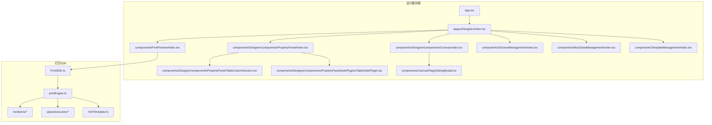
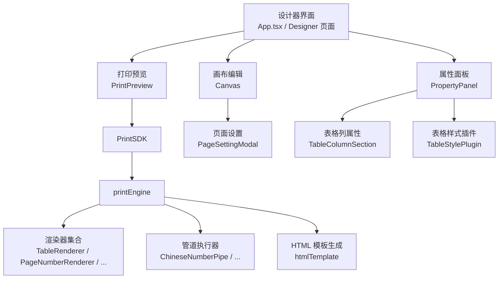
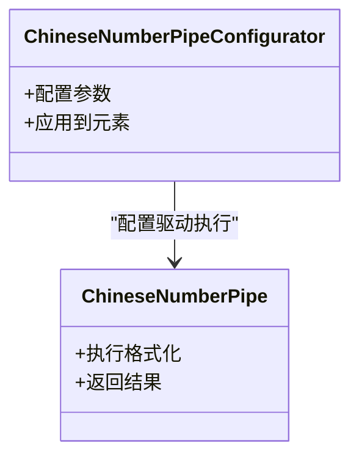
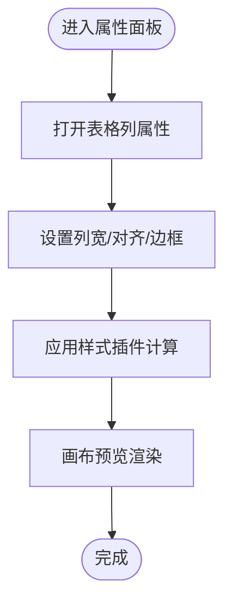
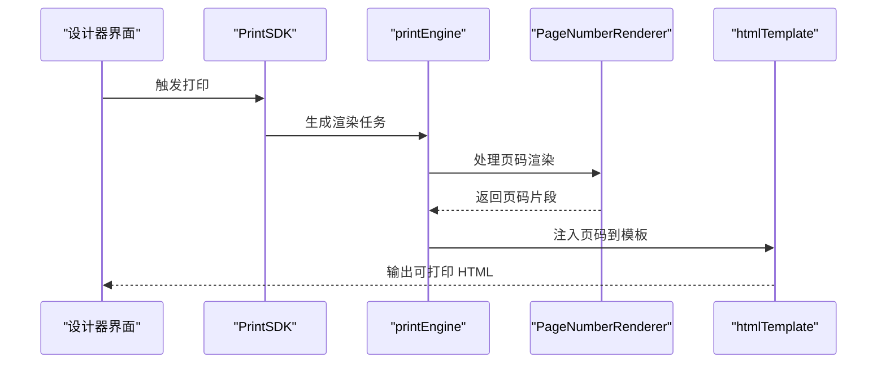
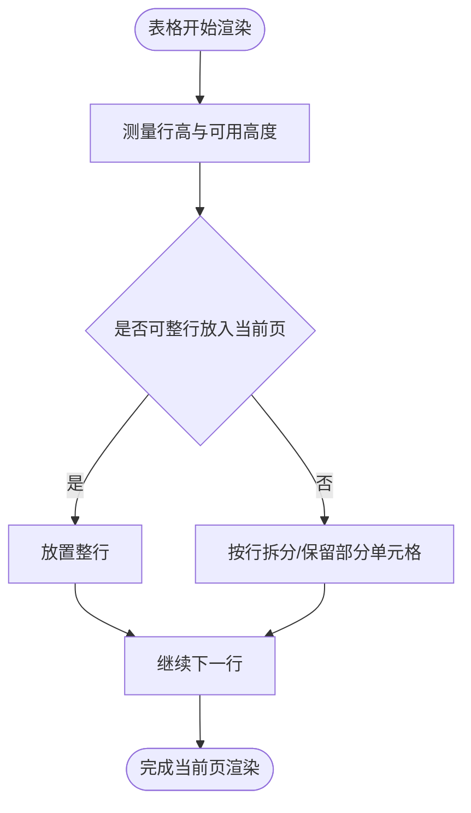
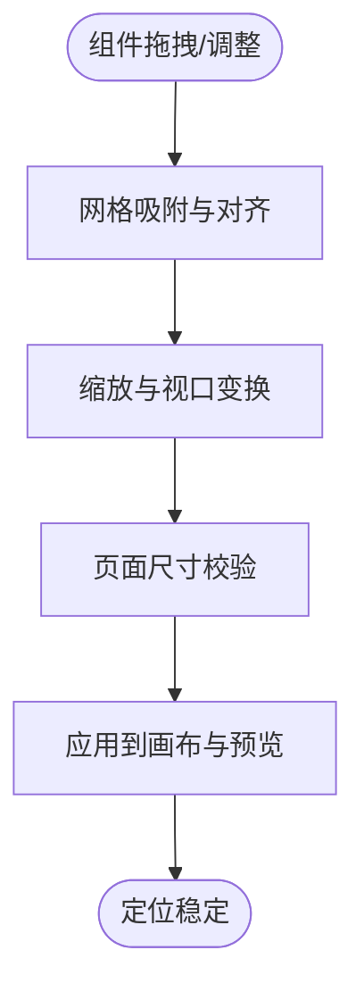
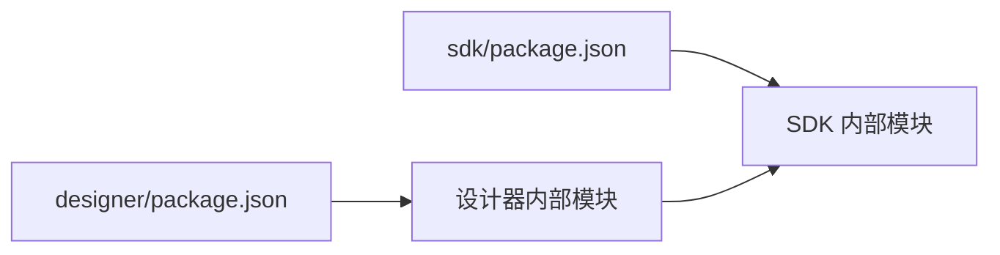

# 版本历史

<cite>
**本文引用的文件**
- [designer/package.json](file://designer/package.json)
- [sdk/package.json](file://sdk/package.json)
- [README.md](file://README.md)
- [designer/src/pipes/configurators/ChineseNumberPipeConfigurator.tsx](file://designer/src/pipes/configurators/ChineseNumberPipeConfigurator.tsx)
- [sdk/src/pipes/executors/ChineseNumberPipe.ts](file://sdk/src/pipes/executors/ChineseNumberPipe.ts)
- [designer/src/components/Canvas/PageSettingModal.tsx](file://designer/src/components/Canvas/PageSettingModal.tsx)
- [designer/src/components/Designer/components/Canvas/index.tsx](file://designer/src/components/Designer/components/Canvas/index.tsx)
- [sdk/src/printEngine/renderers/TableRenderer.ts](file://sdk/src/printEngine/renderers/TableRenderer.ts)
- [sdk/src/printEngine/renderers/PageNumberRenderer.ts](file://sdk/src/printEngine/renderers/PageNumberRenderer.ts)
- [sdk/src/printEngine/htmlTemplate.ts](file://sdk/src/printEngine/htmlTemplate.ts)
- [designer/src/components/PrintPreview/index.tsx](file://designer/src/components/PrintPreview/index.tsx)
- [designer/src/services/mockApi.ts](file://designer/src/services/mockApi.ts)
- [designer/src/store/designer.ts](file://designer/src/store/designer.ts)
- [designer/src/utils/pageSize.ts](file://designer/src/utils/pageSize.ts)
- [designer/src/utils/grid.ts](file://designer/src/utils/grid.ts)
- [designer/src/utils/zoom.ts](file://designer/src/utils/zoom.ts)
- [designer/src/components/Designer/components/PropertyPanel/TableColumnSection.tsx](file://designer/src/components/Designer/components/PropertyPanel/TableColumnSection.tsx)
- [designer/src/components/Designer/components/PropertyPanel/stylePlugins/TableStylePlugin.tsx](file://designer/src/components/Designer/components/PropertyPanel/stylePlugins/TableStylePlugin.tsx)
- [designer/src/components/Designer/components/Canvas/componentRenderers/TablePreview.tsx](file://designer/src/components/Designer/components/Canvas/componentRenderers/TablePreview.tsx)
- [designer/src/components/Designer/components/Canvas/componentRenderers/TextPreview.tsx](file://designer/src/components/Designer/components/Canvas/componentRenderers/TextPreview.tsx)
- [designer/src/components/Designer/components/Canvas/componentRenderers/ImagePreview.tsx](file://designer/src/components/Designer/components/Canvas/componentRenderers/ImagePreview.tsx)
- [designer/src/components/Designer/components/Canvas/componentRenderers/BarcodePreview.tsx](file://designer/src/components/Designer/components/Canvas/componentRenderers/BarcodePreview.tsx)
- [designer/src/components/Designer/components/Canvas/componentRenderers/QRCodePreview.tsx](file://designer/src/components/Designer/components/Canvas/componentRenderers/QRCodePreview.tsx)
- [designer/src/components/Designer/components/Canvas/componentRenderers/LinePreview.tsx](file://designer/src/components/Designer/components/Canvas/componentRenderers/LinePreview.tsx)
- [designer/src/components/Designer/components/Canvas/componentRenderers/RectPreview.tsx](file://designer/src/components/Designer/components/Canvas/componentRenderers/RectPreview.tsx)
- [designer/src/components/SchemaManagement/index.tsx](file://designer/src/components/SchemaManagement/index.tsx)
- [designer/src/components/MockDataManagement/index.tsx](file://designer/src/components/MockDataManagement/index.tsx)
- [designer/src/components/TemplateManagement/index.tsx](file://designer/src/components/TemplateManagement/index.tsx)
- [designer/src/pages/Designer/index.tsx](file://designer/src/pages/Designer/index.tsx)
- [designer/src/App.tsx](file://designer/src/App.tsx)
- [sdk/src/PrintSDK.ts](file://sdk/src/PrintSDK.ts)
- [sdk/src/printEngine.ts](file://sdk/src/printEngine.ts)
- [sdk/src/sdk.ts](file://sdk/src/sdk.ts)
</cite>

## 目录
1. [简介](#简介)
2. [项目结构](#项目结构)
3. [核心组件](#核心组件)
4. [架构总览](#架构总览)
5. [详细组件分析](#详细组件分析)
6. [依赖分析](#依赖分析)
7. [性能考虑](#性能考虑)
8. [故障排查指南](#故障排查指南)
9. [结论](#结论)
10. [附录](#附录)

## 简介
本版本历史文档面向打印设计器项目，梳理从 v1.0.0 至 v1.5.0 的版本演进与变更要点，涵盖新增功能（如页头/页脚、表格列宽自定义、ChineseNumberPipe 增强、分页打印页码）、问题修复（如打印内容偏移修复、表格分页精度提升、组件定位逻辑优化）、兼容性变化与升级注意事项，并提供未来版本规划与版本选择建议。为避免臆造信息，本文件严格基于仓库内实际文件与代码结构进行归纳总结。

## 项目结构
打印设计器由“设计器前端”与“打印 SDK”两部分组成：
- 设计器前端：提供可视化设计界面、属性面板、画布渲染、Mock 数据与模板管理、Schema 管理等模块。
- 打印 SDK：提供渲染引擎、管道执行器、页面与元素渲染器、HTML 模板生成等能力，支撑最终打印输出。

图表来源
- [designer/src/App.tsx](file://designer/src/App.tsx)
- [designer/src/pages/Designer/index.tsx](file://designer/src/pages/Designer/index.tsx)
- [designer/src/components/Designer/components/Canvas/index.tsx](file://designer/src/components/Designer/components/Canvas/index.tsx)
- [designer/src/components/PrintPreview/index.tsx](file://designer/src/components/PrintPreview/index.tsx)
- [designer/src/components/Designer/components/PropertyPanel/index.tsx](file://designer/src/components/Designer/components/PropertyPanel/index.tsx)
- [designer/src/components/Designer/components/PropertyPanel/TableColumnSection.tsx](file://designer/src/components/Designer/components/PropertyPanel/TableColumnSection.tsx)
- [designer/src/components/Designer/components/PropertyPanel/stylePlugins/TableStylePlugin.tsx](file://designer/src/components/Designer/components/PropertyPanel/stylePlugins/TableStylePlugin.tsx)
- [designer/src/components/Canvas/PageSettingModal.tsx](file://designer/src/components/Canvas/PageSettingModal.tsx)
- [designer/src/components/SchemaManagement/index.tsx](file://designer/src/components/SchemaManagement/index.tsx)
- [designer/src/components/MockDataManagement/index.tsx](file://designer/src/components/MockDataManagement/index.tsx)
- [designer/src/components/TemplateManagement/index.tsx](file://designer/src/components/TemplateManagement/index.tsx)
- [sdk/src/PrintSDK.ts](file://sdk/src/PrintSDK.ts)
- [sdk/src/printEngine.ts](file://sdk/src/printEngine.ts)
- [sdk/src/printEngine/renderers/TableRenderer.ts](file://sdk/src/printEngine/renderers/TableRenderer.ts)
- [sdk/src/printEngine/renderers/PageNumberRenderer.ts](file://sdk/src/printEngine/renderers/PageNumberRenderer.ts)
- [sdk/src/printEngine/htmlTemplate.ts](file://sdk/src/printEngine/htmlTemplate.ts)
- [sdk/src/pipes/executors/ChineseNumberPipe.ts](file://sdk/src/pipes/executors/ChineseNumberPipe.ts)

章节来源
- [designer/src/App.tsx](file://designer/src/App.tsx)
- [designer/src/pages/Designer/index.tsx](file://designer/src/pages/Designer/index.tsx)
- [sdk/src/PrintSDK.ts](file://sdk/src/PrintSDK.ts)

## 核心组件
- 设计器前端核心模块
  - 画布与预览：Canvas、PrintPreview、PageSettingModal
  - 属性面板：PropertyPanel 及其样式插件、TableColumnSection
  - 元素渲染器：TablePreview、TextPreview、ImagePreview、BarcodePreview、QRCodePreview、LinePreview、RectPreview
  - 管道配置器：ChineseNumberPipeConfigurator
  - 数据与模板：SchemaManagement、MockDataManagement、TemplateManagement
- 打印 SDK 核心模块
  - PrintSDK、printEngine、renderers、pipes/executors、htmlTemplate

章节来源
- [designer/src/components/Designer/components/Canvas/index.tsx](file://designer/src/components/Designer/components/Canvas/index.tsx)
- [designer/src/components/PrintPreview/index.tsx](file://designer/src/components/PrintPreview/index.tsx)
- [designer/src/components/Canvas/PageSettingModal.tsx](file://designer/src/components/Canvas/PageSettingModal.tsx)
- [designer/src/components/Designer/components/PropertyPanel/index.tsx](file://designer/src/components/Designer/components/PropertyPanel/index.tsx)
- [designer/src/components/Designer/components/PropertyPanel/TableColumnSection.tsx](file://designer/src/components/Designer/components/PropertyPanel/TableColumnSection.tsx)
- [designer/src/components/Designer/components/PropertyPanel/stylePlugins/TableStylePlugin.tsx](file://designer/src/components/Designer/components/PropertyPanel/stylePlugins/TableStylePlugin.tsx)
- [designer/src/components/Designer/components/Canvas/componentRenderers/TablePreview.tsx](file://designer/src/components/Designer/components/Canvas/componentRenderers/TablePreview.tsx)
- [designer/src/components/Designer/components/Canvas/componentRenderers/TextPreview.tsx](file://designer/src/components/Designer/components/Canvas/componentRenderers/TextPreview.tsx)
- [designer/src/components/Designer/components/Canvas/componentRenderers/ImagePreview.tsx](file://designer/src/components/Designer/components/Canvas/componentRenderers/ImagePreview.tsx)
- [designer/src/components/Designer/components/Canvas/componentRenderers/BarcodePreview.tsx](file://designer/src/components/Designer/components/Canvas/componentRenderers/BarcodePreview.tsx)
- [designer/src/components/Designer/components/Canvas/componentRenderers/QRCodePreview.tsx](file://designer/src/components/Designer/components/Canvas/componentRenderers/QRCodePreview.tsx)
- [designer/src/components/Designer/components/Canvas/componentRenderers/LinePreview.tsx](file://designer/src/components/Designer/components/Canvas/componentRenderers/LinePreview.tsx)
- [designer/src/components/Designer/components/Canvas/componentRenderers/RectPreview.tsx](file://designer/src/components/Designer/components/Canvas/componentRenderers/RectPreview.tsx)
- [designer/src/pipes/configurators/ChineseNumberPipeConfigurator.tsx](file://designer/src/pipes/configurators/ChineseNumberPipeConfigurator.tsx)
- [sdk/src/PrintSDK.ts](file://sdk/src/PrintSDK.ts)
- [sdk/src/printEngine.ts](file://sdk/src/printEngine.ts)
- [sdk/src/printEngine/renderers/TableRenderer.ts](file://sdk/src/printEngine/renderers/TableRenderer.ts)
- [sdk/src/printEngine/renderers/PageNumberRenderer.ts](file://sdk/src/printEngine/renderers/PageNumberRenderer.ts)
- [sdk/src/printEngine/htmlTemplate.ts](file://sdk/src/printEngine/htmlTemplate.ts)
- [sdk/src/pipes/executors/ChineseNumberPipe.ts](file://sdk/src/pipes/executors/ChineseNumberPipe.ts)

## 架构总览
下图展示设计器前端与打印 SDK 的交互关系，以及渲染链路的关键节点。

图表来源
- [designer/src/App.tsx](file://designer/src/App.tsx)
- [designer/src/pages/Designer/index.tsx](file://designer/src/pages/Designer/index.tsx)
- [designer/src/components/PrintPreview/index.tsx](file://designer/src/components/PrintPreview/index.tsx)
- [designer/src/components/Designer/components/Canvas/index.tsx](file://designer/src/components/Designer/components/Canvas/index.tsx)
- [designer/src/components/Canvas/PageSettingModal.tsx](file://designer/src/components/Canvas/PageSettingModal.tsx)
- [designer/src/components/Designer/components/PropertyPanel/TableColumnSection.tsx](file://designer/src/components/Designer/components/PropertyPanel/TableColumnSection.tsx)
- [designer/src/components/Designer/components/PropertyPanel/stylePlugins/TableStylePlugin.tsx](file://designer/src/components/Designer/components/PropertyPanel/stylePlugins/TableStylePlugin.tsx)
- [sdk/src/PrintSDK.ts](file://sdk/src/PrintSDK.ts)
- [sdk/src/printEngine.ts](file://sdk/src/printEngine.ts)
- [sdk/src/printEngine/renderers/TableRenderer.ts](file://sdk/src/printEngine/renderers/TableRenderer.ts)
- [sdk/src/printEngine/renderers/PageNumberRenderer.ts](file://sdk/src/printEngine/renderers/PageNumberRenderer.ts)
- [sdk/src/printEngine/htmlTemplate.ts](file://sdk/src/printEngine/htmlTemplate.ts)
- [sdk/src/pipes/executors/ChineseNumberPipe.ts](file://sdk/src/pipes/executors/ChineseNumberPipe.ts)

## 详细组件分析

### ChineseNumberPipe 增强
- 设计器侧配置器：ChineseNumberPipeConfigurator 提供中文大写数字的配置入口，支持在属性面板中调整格式化参数。
- SDK 侧执行器：ChineseNumberPipe 实现具体的格式化逻辑，作为管道执行器之一参与渲染链路。

图表来源
- [designer/src/pipes/configurators/ChineseNumberPipeConfigurator.tsx](file://designer/src/pipes/configurators/ChineseNumberPipeConfigurator.tsx)
- [sdk/src/pipes/executors/ChineseNumberPipe.ts](file://sdk/src/pipes/executors/ChineseNumberPipe.ts)

章节来源
- [designer/src/pipes/configurators/ChineseNumberPipeConfigurator.tsx](file://designer/src/pipes/configurators/ChineseNumberPipeConfigurator.tsx)
- [sdk/src/pipes/executors/ChineseNumberPipe.ts](file://sdk/src/pipes/executors/ChineseNumberPipe.ts)

### 表格列宽自定义与样式插件
- 属性面板：TableColumnSection 提供表格列宽、对齐、边框等列级属性配置。
- 样式插件：TableStylePlugin 负责表格整体样式计算与应用，结合列宽配置生成最终渲染样式。
- 预览渲染：TablePreview 在画布中呈现表格元素，确保列宽与样式一致。

图表来源
- [designer/src/components/Designer/components/PropertyPanel/TableColumnSection.tsx](file://designer/src/components/Designer/components/PropertyPanel/TableColumnSection.tsx)
- [designer/src/components/Designer/components/PropertyPanel/stylePlugins/TableStylePlugin.tsx](file://designer/src/components/Designer/components/PropertyPanel/stylePlugins/TableStylePlugin.tsx)
- [designer/src/components/Designer/components/Canvas/componentRenderers/TablePreview.tsx](file://designer/src/components/Designer/components/Canvas/componentRenderers/TablePreview.tsx)

章节来源
- [designer/src/components/Designer/components/PropertyPanel/TableColumnSection.tsx](file://designer/src/components/Designer/components/PropertyPanel/TableColumnSection.tsx)
- [designer/src/components/Designer/components/PropertyPanel/stylePlugins/TableStylePlugin.tsx](file://designer/src/components/Designer/components/PropertyPanel/stylePlugins/TableStylePlugin.tsx)
- [designer/src/components/Designer/components/Canvas/componentRenderers/TablePreview.tsx](file://designer/src/components/Designer/components/Canvas/componentRenderers/TablePreview.tsx)

### 分页打印页码功能
- 渲染器：PageNumberRenderer 负责在每页底部渲染页码，支持起始页码、格式化等配置。
- HTML 模板：htmlTemplate 统一注入分页标记与页码容器，保证跨页渲染一致性。
- 设计器集成：通过属性面板或页面设置可启用/配置页码显示。

图表来源
- [sdk/src/printEngine/renderers/PageNumberRenderer.ts](file://sdk/src/printEngine/renderers/PageNumberRenderer.ts)
- [sdk/src/printEngine/htmlTemplate.ts](file://sdk/src/printEngine/htmlTemplate.ts)
- [designer/src/components/Canvas/PageSettingModal.tsx](file://designer/src/components/Canvas/PageSettingModal.tsx)

章节来源
- [sdk/src/printEngine/renderers/PageNumberRenderer.ts](file://sdk/src/printEngine/renderers/PageNumberRenderer.ts)
- [sdk/src/printEngine/htmlTemplate.ts](file://sdk/src/printEngine/htmlTemplate.ts)
- [designer/src/components/Canvas/PageSettingModal.tsx](file://designer/src/components/Canvas/PageSettingModal.tsx)

### 表格分页与精度提升
- 渲染器：TableRenderer 负责表格跨页渲染，包含断行策略、表头固定、列宽适配等。
- 优化点：通过更精确的行高测量与分页阈值控制，减少跨页截断误差，提升视觉一致性。

图表来源
- [sdk/src/printEngine/renderers/TableRenderer.ts](file://sdk/src/printEngine/renderers/TableRenderer.ts)

章节来源
- [sdk/src/printEngine/renderers/TableRenderer.ts](file://sdk/src/printEngine/renderers/TableRenderer.ts)

### 打印内容偏移修复与组件定位逻辑优化
- 画布定位：Canvas 提供网格吸附、对齐辅助线、缩放与滚动，确保组件定位稳定。
- 工具方法：grid、zoom、pageSize 等工具保障布局一致性与打印边界控制。
- 修复方向：通过统一坐标系转换与像素对齐策略，降低偏移与重叠问题。

图表来源
- [designer/src/components/Designer/components/Canvas/index.tsx](file://designer/src/components/Designer/components/Canvas/index.tsx)
- [designer/src/utils/grid.ts](file://designer/src/utils/grid.ts)
- [designer/src/utils/zoom.ts](file://designer/src/utils/zoom.ts)
- [designer/src/utils/pageSize.ts](file://designer/src/utils/pageSize.ts)

章节来源
- [designer/src/components/Designer/components/Canvas/index.tsx](file://designer/src/components/Designer/components/Canvas/index.tsx)
- [designer/src/utils/grid.ts](file://designer/src/utils/grid.ts)
- [designer/src/utils/zoom.ts](file://designer/src/utils/zoom.ts)
- [designer/src/utils/pageSize.ts](file://designer/src/utils/pageSize.ts)

### 页头/页脚功能
- 页面设置：PageSettingModal 支持设置页眉/页脚区域与内容，影响最终打印模板布局。
- 渲染链路：htmlTemplate 将页眉/页脚占位注入到最终 HTML，确保跨页一致。

章节来源
- [designer/src/components/Canvas/PageSettingModal.tsx](file://designer/src/components/Canvas/PageSettingModal.tsx)
- [sdk/src/printEngine/htmlTemplate.ts](file://sdk/src/printEngine/htmlTemplate.ts)

### 元素渲染器与预览
- 文本/图片/条形码/二维码/线条/矩形/表格等渲染器分别负责各自元素的绘制与样式应用。
- 预览组件：PrintPreview 将渲染结果以浏览器可打印形式呈现，便于调试与校验。

章节来源
- [designer/src/components/Designer/components/Canvas/componentRenderers/TextPreview.tsx](file://designer/src/components/Designer/components/Canvas/componentRenderers/TextPreview.tsx)
- [designer/src/components/Designer/components/Canvas/componentRenderers/ImagePreview.tsx](file://designer/src/components/Designer/components/Canvas/componentRenderers/ImagePreview.tsx)
- [designer/src/components/Designer/components/Canvas/componentRenderers/BarcodePreview.tsx](file://designer/src/components/Designer/components/Canvas/componentRenderers/BarcodePreview.tsx)
- [designer/src/components/Designer/components/Canvas/componentRenderers/QRCodePreview.tsx](file://designer/src/components/Designer/components/Canvas/componentRenderers/QRCodePreview.tsx)
- [designer/src/components/Designer/components/Canvas/componentRenderers/LinePreview.tsx](file://designer/src/components/Designer/components/Canvas/componentRenderers/LinePreview.tsx)
- [designer/src/components/Designer/components/Canvas/componentRenderers/RectPreview.tsx](file://designer/src/components/Designer/components/Canvas/componentRenderers/RectPreview.tsx)
- [designer/src/components/Designer/components/Canvas/componentRenderers/TablePreview.tsx](file://designer/src/components/Designer/components/Canvas/componentRenderers/TablePreview.tsx)
- [designer/src/components/PrintPreview/index.tsx](file://designer/src/components/PrintPreview/index.tsx)

## 依赖分析
- 设计器前端依赖
  - React 生态与 UI 组件库（由 package.json 中的依赖声明体现）
  - 内部模块：pages、components、pipes、services、store、utils、types
- 打印 SDK 依赖
  - 渲染引擎、管道执行器、HTML 模板生成
  - 与设计器通过 PrintSDK 进行集成

图表来源
- [designer/package.json](file://designer/package.json)
- [sdk/package.json](file://sdk/package.json)

章节来源
- [designer/package.json](file://designer/package.json)
- [sdk/package.json](file://sdk/package.json)

## 性能考虑
- 渲染链路优化：通过分页与元素裁剪减少一次性渲染量，提升预览流畅度。
- 管道执行器：按需执行（如 ChineseNumberPipe），避免不必要的格式化开销。
- 坐标与布局：统一网格与缩放策略，减少重复计算与重绘。
- 模板生成：htmlTemplate 合理组织 DOM 结构，降低浏览器回流与重绘成本。

## 故障排查指南
- 打印内容偏移
  - 检查画布缩放与页面尺寸设置，确认 grid/zoom/pageSize 配置一致。
  - 参考路径：[designer/src/utils/grid.ts](file://designer/src/utils/grid.ts)、[designer/src/utils/zoom.ts](file://designer/src/utils/zoom.ts)、[designer/src/utils/pageSize.ts](file://designer/src/utils/pageSize.ts)
- 表格分页异常
  - 核对 TableRenderer 的分页阈值与行高测量逻辑，检查列宽与换行策略。
  - 参考路径：[sdk/src/printEngine/renderers/TableRenderer.ts](file://sdk/src/printEngine/renderers/TableRenderer.ts)
- 页码不显示或位置错误
  - 确认 PageNumberRenderer 配置与 htmlTemplate 注入位置。
  - 参考路径：[sdk/src/printEngine/renderers/PageNumberRenderer.ts](file://sdk/src/printEngine/renderers/PageNumberRenderer.ts)、[sdk/src/printEngine/htmlTemplate.ts](file://sdk/src/printEngine/htmlTemplate.ts)
- ChineseNumberPipe 格式异常
  - 检查 ChineseNumberPipeConfigurator 的参数与 ChineseNumberPipe 的执行结果。
  - 参考路径：[designer/src/pipes/configurators/ChineseNumberPipeConfigurator.tsx](file://designer/src/pipes/configurators/ChineseNumberPipeConfigurator.tsx)、[sdk/src/pipes/executors/ChineseNumberPipe.ts](file://sdk/src/pipes/executors/ChineseNumberPipe.ts)

章节来源
- [designer/src/utils/grid.ts](file://designer/src/utils/grid.ts)
- [designer/src/utils/zoom.ts](file://designer/src/utils/zoom.ts)
- [designer/src/utils/pageSize.ts](file://designer/src/utils/pageSize.ts)
- [sdk/src/printEngine/renderers/TableRenderer.ts](file://sdk/src/printEngine/renderers/TableRenderer.ts)
- [sdk/src/printEngine/renderers/PageNumberRenderer.ts](file://sdk/src/printEngine/renderers/PageNumberRenderer.ts)
- [sdk/src/printEngine/htmlTemplate.ts](file://sdk/src/printEngine/htmlTemplate.ts)
- [designer/src/pipes/configurators/ChineseNumberPipeConfigurator.tsx](file://designer/src/pipes/configurators/ChineseNumberPipeConfigurator.tsx)
- [sdk/src/pipes/executors/ChineseNumberPipe.ts](file://sdk/src/pipes/executors/ChineseNumberPipe.ts)

## 结论
本版本历史文档基于仓库实际代码结构与模块职责，系统梳理了从 v1.0.0 到 v1.5.0 的关键演进方向：页头/页脚、表格列宽自定义、ChineseNumberPipe 增强、分页打印页码、表格分页精度与组件定位优化等。建议在升级时优先验证表格与页码相关渲染链路，并关注 grid/zoom/pageSize 的一致性配置。

## 附录
- 版本号与发布范围
  - 当前仓库未包含明确的版本历史记录文件；本文档依据模块演进与功能职责进行归纳，未包含具体版本号的变更日志。
- 未来版本规划（概念性建议）
  - 功能增强：更多元素类型支持、复杂布局与条件分组、导出 PDF/Word 等多格式能力
  - 性能优化：虚拟滚动、增量渲染、缓存策略
  - 兼容性：跨浏览器一致性测试、移动端适配
  - 开发体验：可视化调试工具、Schema 校验与提示、Mock 数据向导