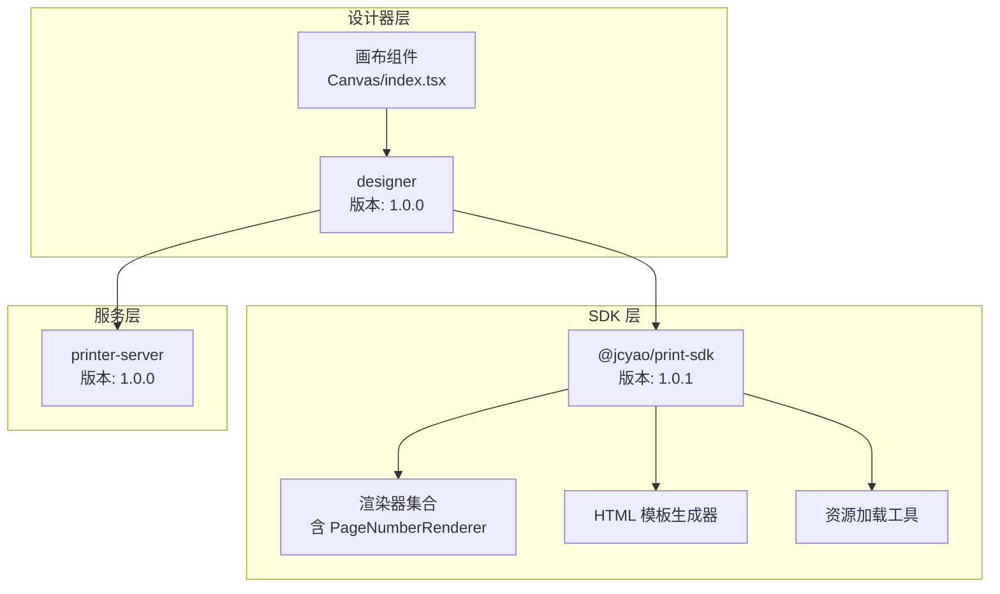
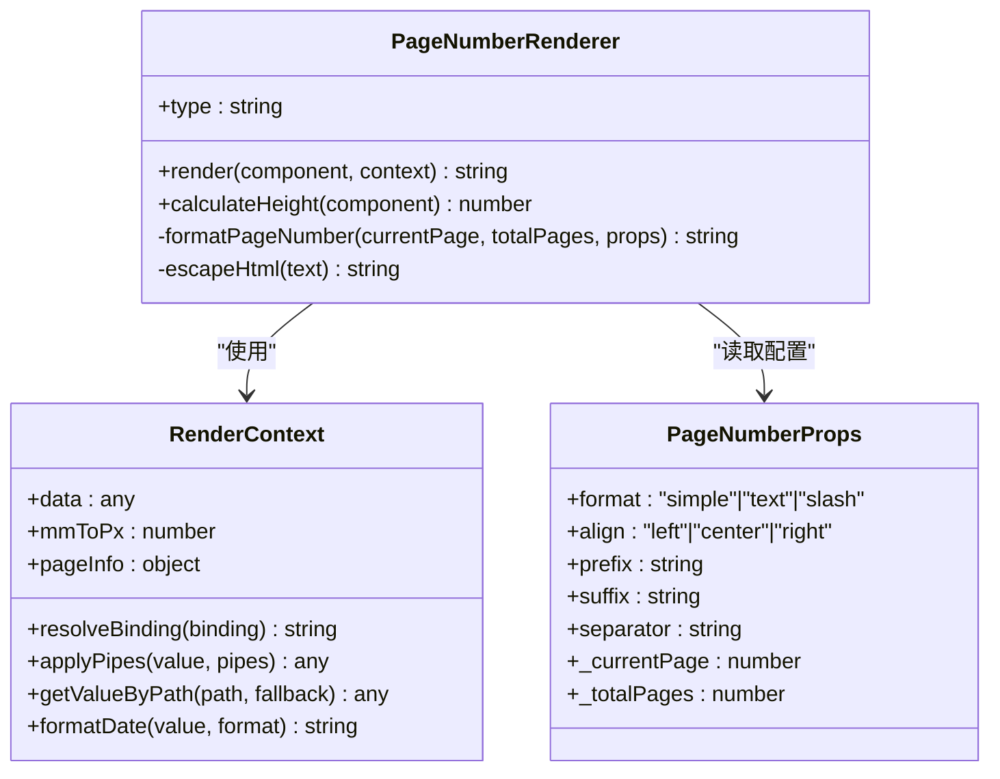
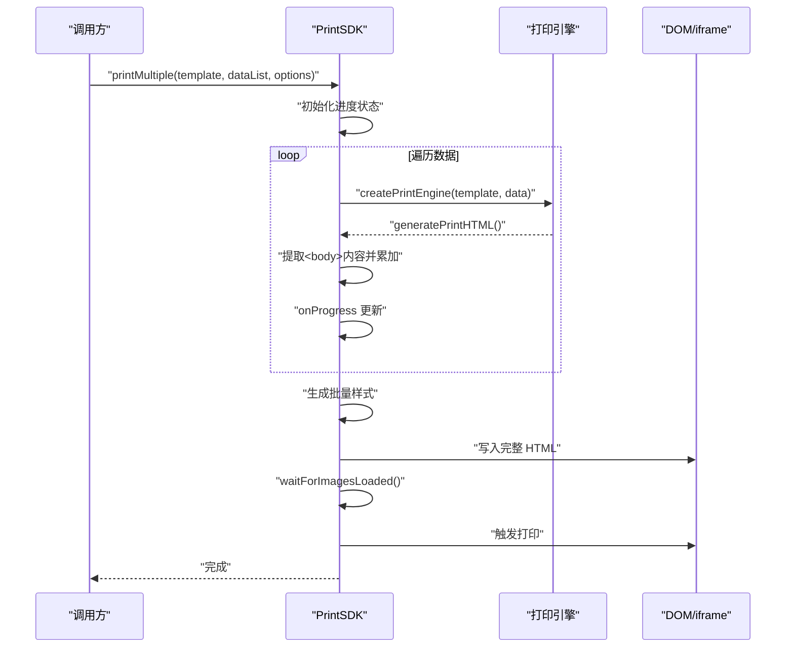
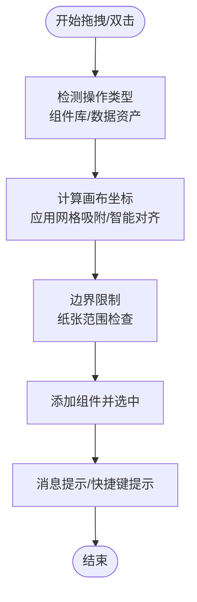
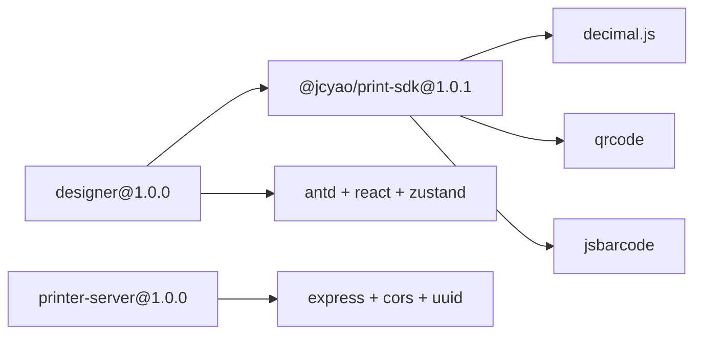

# 版本发展历程

<cite>
**本文引用的文件**
- [README.md](file://README.md)
- [designer/package.json](file://designer/package.json)
- [sdk/package.json](file://sdk/package.json)
- [server/package.json](file://server/package.json)
- [PageNumberRenderer.ts](file://sdk/src/printEngine/renderers/PageNumberRenderer.ts)
- [types.ts](file://sdk/src/types.ts)
- [htmlTemplate.ts](file://sdk/src/printEngine/htmlTemplate.ts)
- [resourceLoader.ts](file://sdk/src/utils/resourceLoader.ts)
- [PrintSDK.ts](file://sdk/src/PrintSDK.ts)
- [styleBuilder.ts](file://sdk/src/printEngine/utils/styleBuilder.ts)
- [constants.ts](file://sdk/src/printEngine/constants.ts)
- [MoneyPipe.ts](file://sdk/src/pipes/executors/MoneyPipe.ts)
- [index.tsx](file://designer/src/pages/Designer/components/Canvas/index.tsx)
</cite>

## 目录
1. [简介](#简介)
2. [项目结构](#项目结构)
3. [核心组件](#核心组件)
4. [架构概览](#架构概览)
5. [详细组件分析](#详细组件分析)
6. [依赖分析](#依赖分析)
7. [性能考量](#性能考量)
8. [故障排查指南](#故障排查指南)
9. [结论](#结论)
10. [附录](#附录)

## 简介
本文件系统梳理打印服务平台从 v1.0.0 到 v1.0.1 的版本演进历程，重点阐述 v1.0.1 新增的分页页码功能、批量打印预览与交互体验优化等关键改进。文档基于仓库现有源码与发布说明，总结版本发布的背景、技术挑战与解决方案，并提供升级指南与兼容性说明，帮助用户理解系统演进轨迹与未来方向。

## 项目结构
- 项目采用多包结构，包含 SDK、可视化设计器与服务端模板管理服务：
  - sdk：独立打印 SDK，支持浏览器端直接打印与批量预览
  - designer：React + TypeScript 可视化模板设计器
  - server：Node.js 模板管理服务（REST API）



**图表来源**
- [sdk/package.json:1-60](file://sdk/package.json#L1-L60)
- [designer/package.json:1-43](file://designer/package.json#L1-L43)
- [server/package.json:1-25](file://server/package.json#L1-L25)

**章节来源**
- [README.md:191-234](file://README.md#L191-L234)

## 核心组件
- v1.0.1 的三大核心改进：
  - 分页页码功能：支持 6 种位置、3 种格式、偏移与自定义前后缀，采用页面配置模式（pageConfig.pageNumber）
  - 批量打印预览：支持多份文档一次性预览与打印，自动合并 HTML 并添加分页符
  - 交互体验优化：组件库与数据资产支持双击快速添加与拖拽精确定位，快捷键提示具备会话级记忆

- 关键技术要点：
  - 页码渲染器 PageNumberRenderer：负责将页码信息（当前页/总页数）渲染为 HTML，并支持样式与对齐
  - HTML 模板生成器：提供预览与批量打印两种样式体系，适配不同场景
  - 资源加载工具：等待图片资源加载完成，确保打印预览质量
  - 打印 SDK：封装 print/printMultiple 等能力，支持预览与直接打印

**章节来源**
- [README.md:18-63](file://README.md#L18-L63)
- [PageNumberRenderer.ts:1-105](file://sdk/src/printEngine/renderers/PageNumberRenderer.ts#L1-L105)
- [htmlTemplate.ts:172-218](file://sdk/src/printEngine/htmlTemplate.ts#L172-L218)
- [resourceLoader.ts:1-90](file://sdk/src/utils/resourceLoader.ts#L1-L90)
- [PrintSDK.ts:1-253](file://sdk/src/PrintSDK.ts#L1-L253)

## 架构概览
v1.0.1 在保持原有分层架构的基础上，围绕“页码”与“批量打印”两大主题进行模块化增强：

```mermaid
graph TB
subgraph "设计器"
UI["Canvas/PropertyPanel/AssetTree"]
STORE["Zustand 状态管理"]
end
subgraph "SDK"
SDK["PrintSDK"]
ENGINE["打印引擎"]
RENDERERS["渲染器集合"]
PIPE["管道系统"]
RES["资源加载"]
end
subgraph "服务端"
ROUTES["REST 路由"]
end
UI --> SDK
STORE --> UI
SDK --> ENGINE
ENGINE --> RENDERERS
ENGINE --> PIPE
SDK --> RES
UI --> ROUTES
```

**图表来源**
- [README.md:163-187](file://README.md#L163-L187)
- [PrintSDK.ts:43-244](file://sdk/src/PrintSDK.ts#L43-L244)

## 详细组件分析

### 分页页码功能（PageNumberRenderer）
- 设计目标：在页面指定位置渲染页码，支持多种格式与样式，满足多样化的打印需求
- 关键实现：
  - 渲染器类型：pageNumber
  - 输入参数：当前页码与总页数（由打印引擎注入），以及位置、格式、偏移、前后缀与样式
  - 输出：HTML 片段，包含定位样式与文本对齐
- 格式支持：
  - simple：1, 2, 3
  - slash：1/3
  - text：第1页 共3页
- 样式与定位：
  - 通过样式构建工具生成绝对定位与文本样式
  - 支持横向/纵向偏移量配置
  - 支持对齐方式（左/中/右）



**图表来源**
- [PageNumberRenderer.ts:14-104](file://sdk/src/printEngine/renderers/PageNumberRenderer.ts#L14-L104)
- [types.ts:107-116](file://sdk/src/types.ts#L107-L116)
- [styleBuilder.ts:31-53](file://sdk/src/printEngine/utils/styleBuilder.ts#L31-L53)

**章节来源**
- [PageNumberRenderer.ts:1-105](file://sdk/src/printEngine/renderers/PageNumberRenderer.ts#L1-L105)
- [types.ts:30-46](file://sdk/src/types.ts#L30-L46)
- [styleBuilder.ts:1-54](file://sdk/src/printEngine/utils/styleBuilder.ts#L1-L54)
- [constants.ts:1-113](file://sdk/src/printEngine/constants.ts#L1-L113)

### 批量打印预览（PrintSDK.printMultiple）
- 设计目标：将多个数据实例合并为一份完整文档，减少用户确认次数，提升批量打印效率
- 关键流程：
  - 遍历数据列表，逐个生成页面 HTML 片段
  - 提取 body 内容并拼接为完整 HTML
  - 生成批量打印样式（区分连续纸与标准页）
  - 打开预览窗口或在隐藏 iframe 中直接打印
- 进度回调：支持 onProgress 回调，便于前端展示处理进度
- 资源等待：等待图片资源加载完成，确保打印质量



**图表来源**
- [PrintSDK.ts:135-243](file://sdk/src/PrintSDK.ts#L135-L243)
- [htmlTemplate.ts:176-218](file://sdk/src/printEngine/htmlTemplate.ts#L176-L218)
- [resourceLoader.ts:82-89](file://sdk/src/utils/resourceLoader.ts#L82-L89)

**章节来源**
- [PrintSDK.ts:1-253](file://sdk/src/PrintSDK.ts#L1-L253)
- [htmlTemplate.ts:172-274](file://sdk/src/printEngine/htmlTemplate.ts#L172-L274)
- [resourceLoader.ts:1-90](file://sdk/src/utils/resourceLoader.ts#L1-L90)

### 交互体验优化（设计器 Canvas）
- 双击快速添加：组件库与数据资产支持双击在画布中心快速添加
- 拖拽精确定位：支持网格吸附、智能对齐参考线与边界限制
- 快捷键提示：支持会话级关闭记忆，避免干扰设计流程
- 数据绑定一致性：双击与拖拽配置行为统一，减少学习成本



**图表来源**
- [index.tsx:195-378](file://designer/src/pages/Designer/components/Canvas/index.tsx#L195-L378)
- [index.tsx:434-562](file://designer/src/pages/Designer/components/Canvas/index.tsx#L434-L562)

**章节来源**
- [README.md:56-63](file://README.md#L56-L63)
- [index.tsx:1-800](file://designer/src/pages/Designer/components/Canvas/index.tsx#L1-L800)

## 依赖分析
- 版本与依赖关系：
  - SDK 包：@jcyao/print-sdk，版本 1.0.1，作为设计器依赖
  - 设计器包：版本 1.0.0，依赖 SDK 与 UI/编辑器生态
  - 服务端包：版本 1.0.0，提供模板管理服务
- 外部依赖（SDK）：
  - decimal.js：高精度数值计算（金额转换）
  - qrcode、jsbarcode：二维码与条形码生成
- 内部模块耦合：
  - PrintSDK 依赖打印引擎与 HTML 模板生成器
  - PageNumberRenderer 依赖样式构建工具与常量配置
  - 资源加载工具与打印 SDK 协作，保障图片资源加载完成



**图表来源**
- [sdk/package.json:49-53](file://sdk/package.json#L49-L53)
- [designer/package.json:12-27](file://designer/package.json#L12-L27)
- [server/package.json:11-15](file://server/package.json#L11-L15)

**章节来源**
- [sdk/package.json:1-60](file://sdk/package.json#L1-L60)
- [designer/package.json:1-43](file://designer/package.json#L1-L43)
- [server/package.json:1-25](file://server/package.json#L1-L25)

## 性能考量
- 批量打印优化：
  - 合并 HTML 片段减少 DOM 操作与页面渲染次数
  - 使用隐藏 iframe 执行直接打印，避免预览窗口切换开销
- 资源加载策略：
  - 图片资源异步加载并设置超时，避免长时间阻塞
  - 二维码与条形码在渲染阶段已同步生成为 base64，降低运行时延迟
- 样式与定位：
  - 绝对定位与 mm-to-px 转换在渲染器中集中处理，减少重复计算

**章节来源**
- [PrintSDK.ts:135-243](file://sdk/src/PrintSDK.ts#L135-L243)
- [resourceLoader.ts:1-90](file://sdk/src/utils/resourceLoader.ts#L1-L90)
- [styleBuilder.ts:31-53](file://sdk/src/printEngine/utils/styleBuilder.ts#L31-L53)

## 故障排查指南
- 打开打印窗口失败：
  - 现象：预览模式无法打开新窗口
  - 排查：检查浏览器弹窗拦截设置；确认 printSDK.print/previewWithPreview 的调用路径
  - 参考：[PrintSDK.ts:53-97](file://sdk/src/PrintSDK.ts#L53-L97)
- 图片未加载导致打印空白：
  - 现象：打印内容缺失图片
  - 排查：确认图片资源可访问；查看资源加载超时日志；必要时增加超时时间
  - 参考：[resourceLoader.ts:12-89](file://sdk/src/utils/resourceLoader.ts#L12-L89)
- 页码未显示或位置异常：
  - 现象：页码未渲染或偏移不正确
  - 排查：检查 pageConfig.pageNumber.enabled 与位置配置；确认 mm-to-px 换算与偏移量
  - 参考：[PageNumberRenderer.ts:17-57](file://sdk/src/printEngine/renderers/PageNumberRenderer.ts#L17-L57)，[types.ts:30-46](file://sdk/src/types.ts#L30-L46)
- 批量打印进度不更新：
  - 现象：onProgress 回调未触发
  - 排查：确认传入 options.preview 与 onProgress；检查循环中 progress 更新逻辑
  - 参考：[PrintSDK.ts:135-243](file://sdk/src/PrintSDK.ts#L135-L243)

**章节来源**
- [PrintSDK.ts:53-97](file://sdk/src/PrintSDK.ts#L53-L97)
- [resourceLoader.ts:12-89](file://sdk/src/utils/resourceLoader.ts#L12-L89)
- [PageNumberRenderer.ts:17-57](file://sdk/src/printEngine/renderers/PageNumberRenderer.ts#L17-L57)
- [types.ts:30-46](file://sdk/src/types.ts#L30-L46)

## 结论
v1.0.1 在 v1.0.0 的基础上实现了关键功能跃迁：分页页码的页面配置化、批量打印预览的一次性确认、以及交互体验的细节优化。这些改进显著提升了系统的实用性与易用性，同时保持了 SDK 的独立性与设计器的可视化优势。未来版本可围绕边框调整、分页符组件、孤行控制与连续打印等方向持续演进。

## 附录

### 版本发布背景与目标
- v1.0.1 代号“先锋增强版”，聚焦于打印场景的核心痛点：页码定位、批量预览与交互一致性
- 发布说明明确列出三大新增功能与核心特性，体现从“可用”到“好用”的升级

**章节来源**
- [README.md:1-13](file://README.md#L1-L13)

### 技术挑战与解决方案
- 页码渲染挑战：如何在页面任意位置渲染且与布局系统解耦
  - 方案：采用页面配置模式（pageConfig.pageNumber），渲染器独立处理样式与定位
- 批量打印挑战：如何在一次确认中输出多页内容
  - 方案：提取各数据实例的 HTML 片段并拼接，统一注入批量样式
- 交互一致性挑战：双击与拖拽添加行为差异
  - 方案：统一组件默认尺寸与布局策略，增强画布中心计算与边界限制

**章节来源**
- [README.md:18-63](file://README.md#L18-L63)
- [PageNumberRenderer.ts:1-105](file://sdk/src/printEngine/renderers/PageNumberRenderer.ts#L1-L105)
- [PrintSDK.ts:135-243](file://sdk/src/PrintSDK.ts#L135-L243)
- [index.tsx:195-378](file://designer/src/pages/Designer/components/Canvas/index.tsx#L195-L378)

### 升级指南与兼容性说明
- 升级步骤建议：
  - 更新 SDK：将 @jcyao/print-sdk 升级至 1.0.1
  - 更新设计器：升级依赖并验证页码配置与批量打印功能
  - 验证服务端：保持 1.0.0 版本，确保模板管理服务稳定
- 兼容性注意：
  - 页码配置迁移：从组件模式迁移到页面配置模式（pageConfig.pageNumber）
  - 批量打印 API：printMultiple 支持预览与直接打印两种模式
  - 金额转换：MoneyPipe 使用 decimal.js 保证高精度，升级后建议统一金额处理逻辑

**章节来源**
- [sdk/package.json:1-60](file://sdk/package.json#L1-L60)
- [designer/package.json:1-43](file://designer/package.json#L1-L43)
- [server/package.json:1-25](file://server/package.json#L1-L25)
- [MoneyPipe.ts:1-62](file://sdk/src/pipes/executors/MoneyPipe.ts#L1-L62)