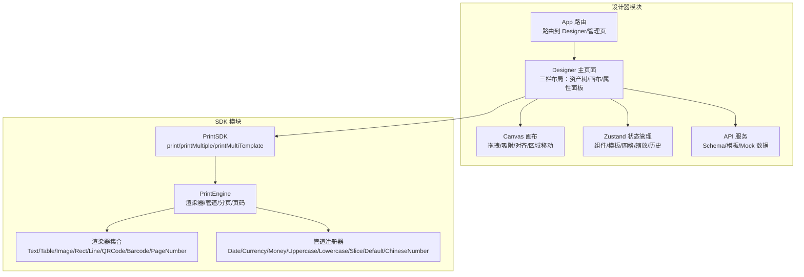
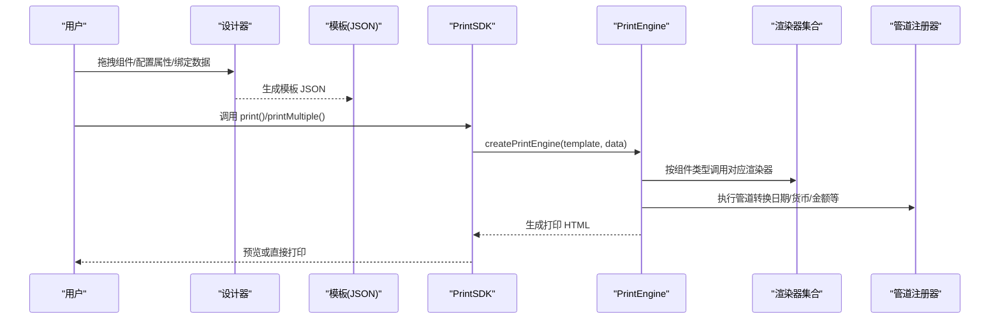
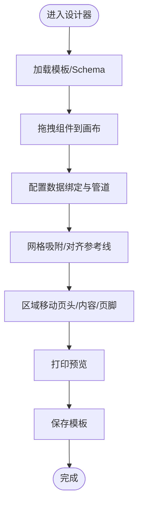
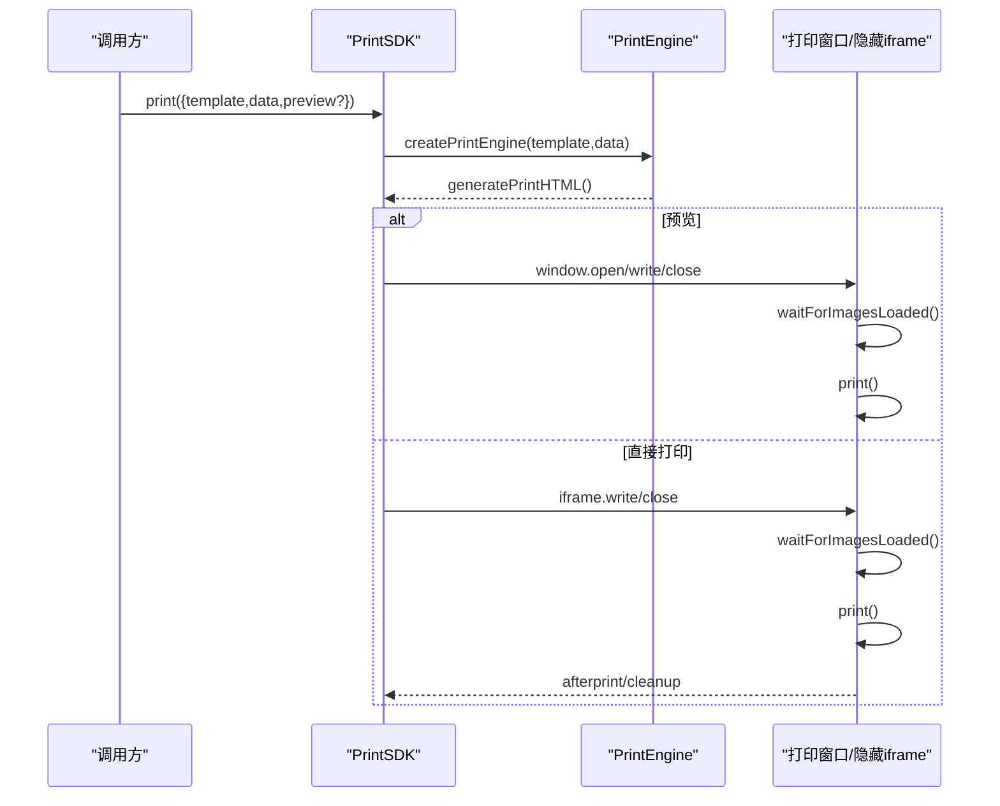
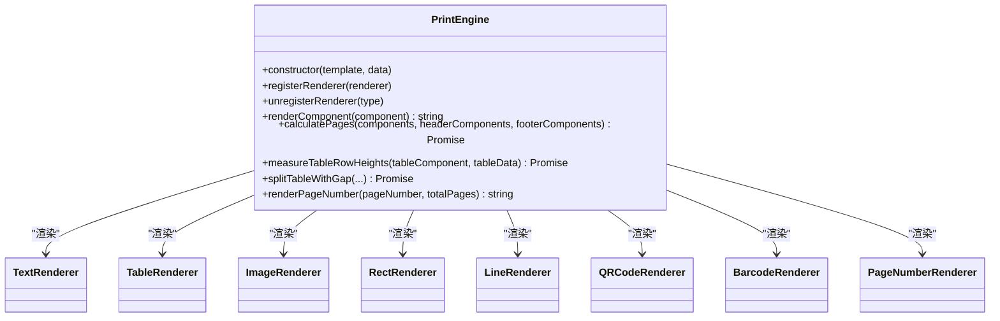
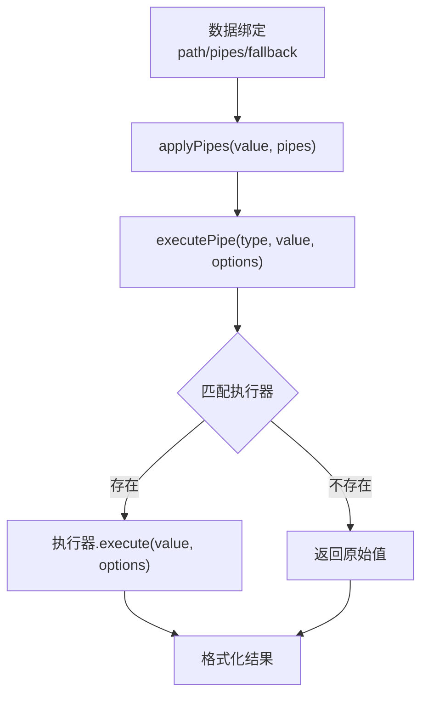
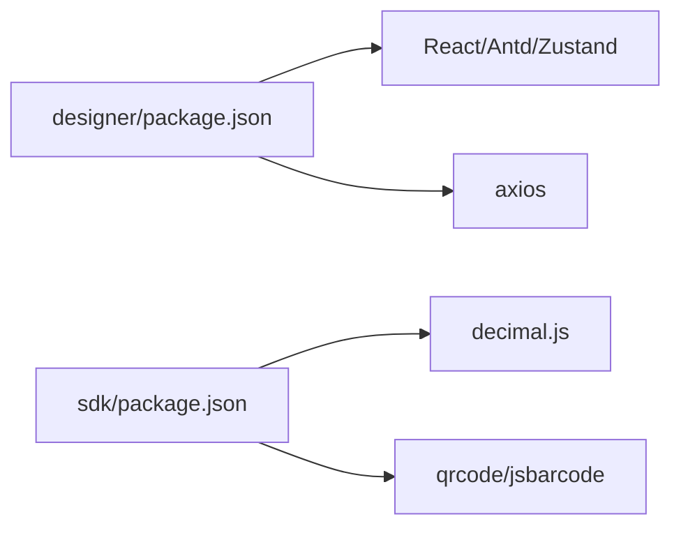

# 项目介绍

<cite>
**本文引用的文件**
- [README.md](file://README.md)
- [designer/src/App.tsx](file://designer/src/App.tsx)
- [designer/src/pages/Designer/index.tsx](file://designer/src/pages/Designer/index.tsx)
- [designer/src/pages/Designer/components/Canvas/index.tsx](file://designer/src/pages/Designer/components/Canvas/index.tsx)
- [designer/src/store/designer.ts](file://designer/src/store/designer.ts)
- [designer/src/types/index.ts](file://designer/src/types/index.ts)
- [designer/src/services/api.ts](file://designer/src/services/api.ts)
- [sdk/src/PrintSDK.ts](file://sdk/src/PrintSDK.ts)
- [sdk/src/printEngine.ts](file://sdk/src/printEngine.ts)
- [sdk/src/pipes/registry.ts](file://sdk/src/pipes/registry.ts)
- [sdk/src/printEngine/renderers/index.ts](file://sdk/src/printEngine/renderers/index.ts)
- [sdk/src/types.ts](file://sdk/src/types.ts)
- [designer/package.json](file://designer/package.json)
- [sdk/package.json](file://sdk/package.json)
</cite>

## 目录
1. [简介](#简介)
2. [项目结构](#项目结构)
3. [核心组件](#核心组件)
4. [架构总览](#架构总览)
5. [详细组件分析](#详细组件分析)
6. [依赖分析](#依赖分析)
7. [性能考量](#性能考量)
8. [故障排查指南](#故障排查指南)
9. [结论](#结论)
10. [附录](#附录)

## 简介
本项目是一个面向“打印模板设计与打印”的一体化解决方案，包含两大核心模块：
- 可视化模板设计器：提供所见即所得的拖拽式设计体验，支持三区域（页头/内容/页脚）画布、智能网格吸附、对齐参考线、撤销/重做、组件树与属性面板等，帮助用户快速构建订单、发票、报表等各类打印模板。
- 打印 SDK：提供纯前端的打印能力封装，支持浏览器直接打印、批量打印、预览、页码、页头/页脚、表格跨页与合计、数据绑定与管道转换等，开箱即用，零配置。

项目旨在解决传统打印模板制作的复杂性与低效性，通过“所见即所得”的可视化设计与“零配置”的打印能力，显著降低技术门槛，提升业务效率。

## 项目结构
项目采用“设计器 + SDK”双模块架构，分别独立开发与发布，便于在不同场景下灵活使用：
- designer：可视化模板设计器，基于 React + TypeScript + Zustand 状态管理，提供拖拽布局、属性配置、数据绑定、打印预览等功能。
- sdk：打印 SDK，基于 TypeScript + Rollup 打包，提供 print、printMultiple、printMultiTemplate 等打印接口，支持浏览器打印与批量打印。

图表来源
- [designer/src/App.tsx:1-31](file://designer/src/App.tsx#L1-L31)
- [designer/src/pages/Designer/index.tsx:1-365](file://designer/src/pages/Designer/index.tsx#L1-L365)
- [designer/src/pages/Designer/components/Canvas/index.tsx:1-800](file://designer/src/pages/Designer/components/Canvas/index.tsx#L1-L800)
- [designer/src/store/designer.ts:1-773](file://designer/src/store/designer.ts#L1-L773)
- [sdk/src/PrintSDK.ts:100-477](file://sdk/src/PrintSDK.ts#L100-L477)
- [sdk/src/printEngine.ts:30-800](file://sdk/src/printEngine.ts#L30-L800)
- [sdk/src/printEngine/renderers/index.ts:1-13](file://sdk/src/printEngine/renderers/index.ts#L1-L13)
- [sdk/src/pipes/registry.ts:1-65](file://sdk/src/pipes/registry.ts#L1-L65)

章节来源
- [README.md:369-406](file://README.md#L369-L406)
- [designer/src/App.tsx:1-31](file://designer/src/App.tsx#L1-L31)
- [sdk/src/PrintSDK.ts:100-477](file://sdk/src/PrintSDK.ts#L100-L477)

## 核心组件
- 可视化模板设计器
  - 三栏布局：左侧数据资产树、中间画布编辑器、右侧属性面板（组件树/属性配置/样式/数据绑定）
  - 三区域画布：页头/内容/页脚，支持组件跨区域拖拽与坐标转换
  - 智能网格吸附、对齐参考线、撤销/重做、缩放控件、键盘快捷键
  - 数据绑定与管道系统：Schema 驱动、点号路径取值、数组字段自动生成表格、管道转换链
  - 打印预览与批量打印：支持预览窗口与 iframe 直接打印，批量合并与分页符
- 打印 SDK
  - PrintSDK：print/printMultiple/printMultiTemplate，支持预览与直接打印，进度回调
  - PrintEngine：插件化渲染器、数据绑定、管道执行、虚拟分页、表格跨页与合计、页码渲染
  - 管道系统：日期、货币、金额、中文大写、大小写、截取、默认值、中文大写数字等
  - 渲染器插件：文本、表格、图片、矩形、线条、二维码、条形码、页码

章节来源
- [README.md:242-338](file://README.md#L242-L338)
- [designer/src/types/index.ts:1-378](file://designer/src/types/index.ts#L1-L378)
- [sdk/src/types.ts:1-228](file://sdk/src/types.ts#L1-L228)
- [sdk/src/pipes/registry.ts:1-65](file://sdk/src/pipes/registry.ts#L1-L65)

## 架构总览
整体架构强调“解耦”与“插件化”：
- 设计器与 SDK 通过模板 JSON 解耦，设计器生成模板，SDK 直接消费模板进行打印
- 打印引擎采用注册器模式管理渲染器与管道，易于扩展新组件与新转换器
- 数据绑定与管道系统贯穿渲染阶段，保证数据到可视化的统一转换

图表来源
- [sdk/src/PrintSDK.ts:100-477](file://sdk/src/PrintSDK.ts#L100-L477)
- [sdk/src/printEngine.ts:30-800](file://sdk/src/printEngine.ts#L30-L800)
- [sdk/src/printEngine/renderers/index.ts:1-13](file://sdk/src/printEngine/renderers/index.ts#L1-L13)
- [sdk/src/pipes/registry.ts:1-65](file://sdk/src/pipes/registry.ts#L1-L65)

## 详细组件分析

### 可视化模板设计器（Designer）
- 设计器主页面负责组织三栏布局与浮动工具栏，支持缩放、返回模板管理、调试面板等
- 画布区域实现组件拖拽、网格吸附、智能对齐、区域移动（页头/内容/页脚）、尺寸调整、键盘快捷键等
- 状态管理（Zustand）集中管理组件列表、选中状态、模板信息、网格/缩放、历史记录、复制粘贴等
- 类型系统（Schema/PrintTemplate/ComponentNode/数据绑定/管道配置）定义模板结构与数据约束

图表来源
- [designer/src/pages/Designer/index.tsx:17-365](file://designer/src/pages/Designer/index.tsx#L17-L365)
- [designer/src/pages/Designer/components/Canvas/index.tsx:22-800](file://designer/src/pages/Designer/components/Canvas/index.tsx#L22-L800)
- [designer/src/store/designer.ts:108-773](file://designer/src/store/designer.ts#L108-L773)
- [designer/src/types/index.ts:1-378](file://designer/src/types/index.ts#L1-L378)

章节来源
- [designer/src/pages/Designer/index.tsx:17-365](file://designer/src/pages/Designer/index.tsx#L17-L365)
- [designer/src/pages/Designer/components/Canvas/index.tsx:22-800](file://designer/src/pages/Designer/components/Canvas/index.tsx#L22-L800)
- [designer/src/store/designer.ts:108-773](file://designer/src/store/designer.ts#L108-L773)
- [designer/src/types/index.ts:1-378](file://designer/src/types/index.ts#L1-L378)

### 打印 SDK（PrintSDK）
- PrintSDK 提供三种核心打印能力：
  - print：直接打印或预览
  - printMultiple：同模板多数据批量打印，合并为单一文档
  - printMultiTemplate：多模板各自绑定数据列表，一次打印确认
- SDK 内部通过 PrintEngine 生成打印 HTML，再通过新窗口或隐藏 iframe 触发打印，支持图片资源加载完成后再打印，以及 afterprint 事件兜底清理

图表来源
- [sdk/src/PrintSDK.ts:100-477](file://sdk/src/PrintSDK.ts#L100-L477)
- [sdk/src/printEngine.ts:30-800](file://sdk/src/printEngine.ts#L30-L800)

章节来源
- [sdk/src/PrintSDK.ts:100-477](file://sdk/src/PrintSDK.ts#L100-L477)

### 打印引擎（PrintEngine）
- 负责模板解析、数据绑定、管道执行、虚拟分页计算、表格跨页与合计、页码渲染、渲染器插件化
- 采用“相对间距（Gap）分页模型”，支持表格真实高度测量、表头重复、合计额外行等高级特性
- 渲染器注册器模式，便于扩展新组件类型

图表来源
- [sdk/src/printEngine.ts:30-800](file://sdk/src/printEngine.ts#L30-L800)
- [sdk/src/printEngine/renderers/index.ts:1-13](file://sdk/src/printEngine/renderers/index.ts#L1-L13)

章节来源
- [sdk/src/printEngine.ts:30-800](file://sdk/src/printEngine.ts#L30-L800)

### 管道系统（Pipes）
- 管道注册器统一管理执行器，支持日期、货币、金额、中文大写、大小写、截取、默认值、中文大写数字等
- 执行链路：resolveBinding -> applyPipes -> executePipe -> 具体执行器

图表来源
- [sdk/src/printEngine.ts:109-125](file://sdk/src/printEngine.ts#L109-L125)
- [sdk/src/pipes/registry.ts:1-65](file://sdk/src/pipes/registry.ts#L1-L65)

章节来源
- [sdk/src/printEngine.ts:109-125](file://sdk/src/printEngine.ts#L109-L125)
- [sdk/src/pipes/registry.ts:1-65](file://sdk/src/pipes/registry.ts#L1-L65)

## 依赖分析
- 设计器依赖
  - React + TypeScript + Zustand：状态管理与组件化
  - Ant Design + Monaco Editor：UI 与代码编辑器
  - axios：HTTP 客户端，支持 Mock 模式与真实后端切换
- SDK 依赖
  - decimal.js：高精度数值计算
  - qrcode、jsbarcode：二维码与条形码生成
  - Rollup：打包 ESM/CJS

图表来源
- [designer/package.json:1-46](file://designer/package.json#L1-L46)
- [sdk/package.json:1-61](file://sdk/package.json#L1-L61)

章节来源
- [designer/package.json:1-46](file://designer/package.json#L1-L46)
- [sdk/package.json:1-61](file://sdk/package.json#L1-L61)

## 性能考量
- 渲染后测量表格高度：通过隐藏 DOM 渲染测量表头、数据行与合计行的真实高度，避免估算误差导致的分页截断
- 虚拟分页与 Gap 模型：基于相对间距累加高度，支持负 gap（组件重叠），确保跨页定位准确
- 图片资源加载：打印前等待图片加载完成，避免打印内容缺失
- 批量打印合并：将多个页面 HTML 片段合并为单一文档，减少多次打印确认

章节来源
- [sdk/src/printEngine.ts:626-756](file://sdk/src/printEngine.ts#L626-L756)
- [sdk/src/PrintSDK.ts:209-322](file://sdk/src/PrintSDK.ts#L209-L322)

## 故障排查指南
- 打印内容偏左或边距异常
  - 检查 @media print 中 margin 配置是否覆盖，确保与批量打印样式一致
- 打印预览与实际输出不一致
  - 确认图片资源已加载完成再触发打印；若用户取消打印，检查 afterprint 事件兜底清理
- 表格跨页与合计显示异常
  - 确认表格数据非空且列配置正确；检查表头重复与合计额外行配置
- 模板与数据不匹配
  - 确认 Schema 字段与绑定路径一致；检查管道配置与回退值

章节来源
- [README.md:138-142](file://README.md#L138-L142)
- [sdk/src/PrintSDK.ts:110-172](file://sdk/src/PrintSDK.ts#L110-L172)
- [sdk/src/printEngine.ts:762-800](file://sdk/src/printEngine.ts#L762-L800)

## 结论
本项目通过“可视化模板设计器 + 打印 SDK”的双模块设计，实现了从“模板设计到打印输出”的完整闭环。其核心价值在于：
- 降低门槛：所见即所得的拖拽设计，无需编程经验
- 提升效率：零配置打印、批量打印、页头/页脚、表格跨页与合计等高级能力
- 增强质量：渲染后测量、虚拟分页、高精度计算、管道系统保障数据与格式一致性

适用于订单打印、发票打印、报表生成、收据打印等多种业务场景，既可作为企业内部的打印平台，也可作为第三方打印服务的基础能力。

## 附录
- 在线演示与示例数据：无需后端即可体验设计器功能
- 版本与功能更新：持续迭代页头/页脚、表格列宽、分页精度、多模板批量打印等
- 快速开始：一键启动或手动启动设计器，构建 SDK 并集成到业务系统

章节来源
- [README.md:9-19](file://README.md#L9-L19)
- [README.md:436-467](file://README.md#L436-L467)