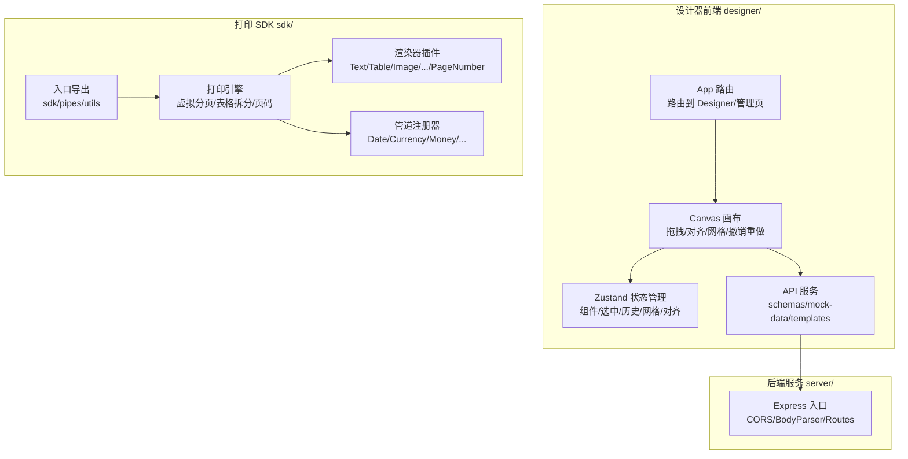
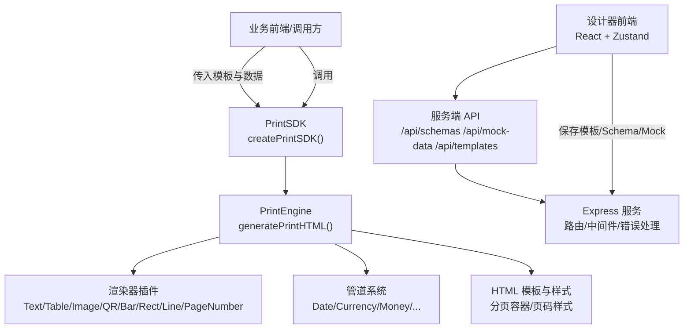
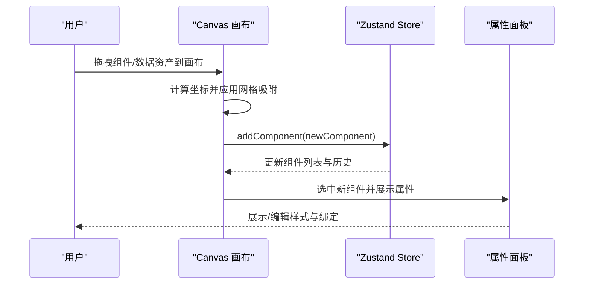
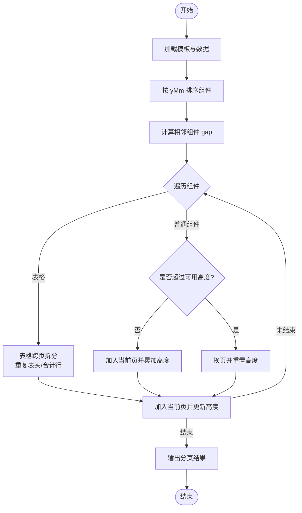
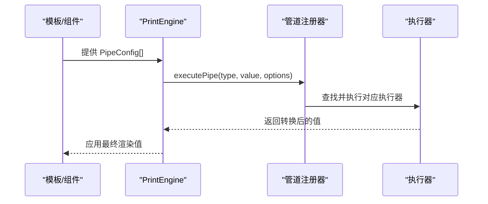
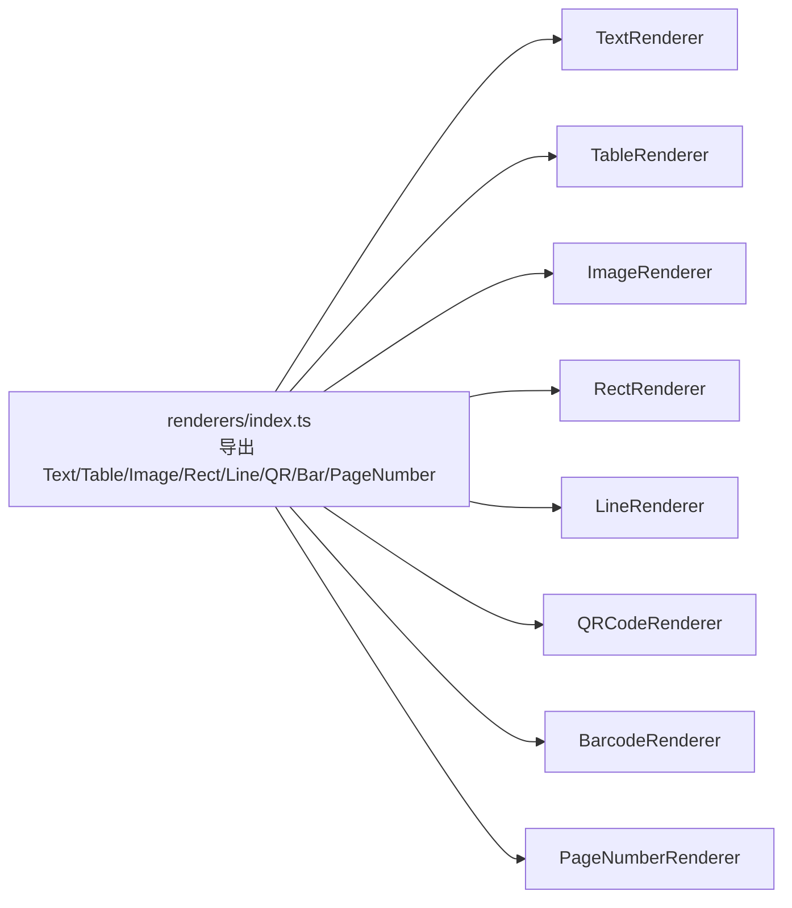
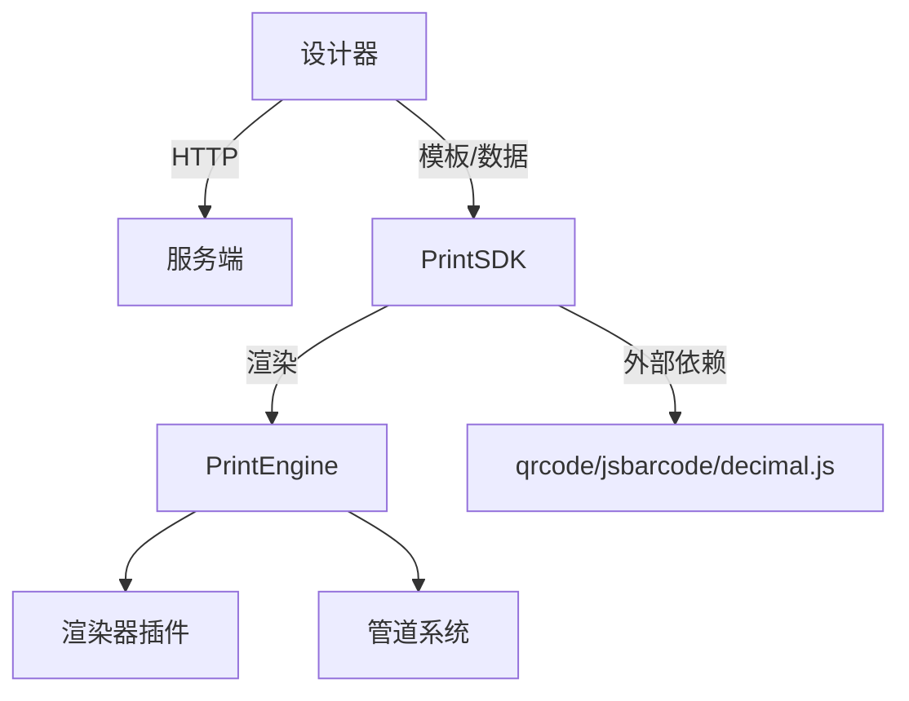

# 项目概述

<cite>
**本文引用的文件**
- [README.md](file://README.md)
- [DEV_README.md](file://DEV_README.md)
- [需求文档.md](file://docs/需求文档.md)
- [App.tsx](file://designer/src/App.tsx)
- [index.tsx](file://designer/src/pages/Designer/components/Canvas/index.tsx)
- [designer.ts](file://designer/src/store/designer.ts)
- [index.ts](file://designer/src/types/index.ts)
- [index.ts](file://sdk/src/index.ts)
- [sdk.ts](file://sdk/src/sdk.ts)
- [printEngine.ts](file://sdk/src/printEngine.ts)
- [registry.ts](file://sdk/src/pipes/registry.ts)
- [index.ts](file://sdk/src/printEngine/renderers/index.ts)
- [index.ts](file://server/src/index.ts)
</cite>

## 目录
1. [引言](#引言)
2. [项目结构](#项目结构)
3. [核心组件](#核心组件)
4. [架构总览](#架构总览)
5. [详细组件分析](#详细组件分析)
6. [依赖分析](#依赖分析)
7. [性能考量](#性能考量)
8. [故障排查指南](#故障排查指南)
9. [结论](#结论)
10. [附录](#附录)

## 引言
打印服务平台是一个面向多行业（电商、医疗、金融等）的“所见即所得”打印解决方案，强调“零服务端压力”的客户端渲染模式。项目围绕四大核心能力展开：可视化模板设计器、Schema 驱动的数据绑定系统、插件化打印引擎与独立 SDK。其设计理念是“模板与数据解耦、渲染与服务解耦、组件与样式解耦”，通过浏览器原生打印能力实现高质量、低成本的打印体验。

- 核心价值
  - 降低重复开发与维护成本：一套模板可在多业务线复用
  - 零服务端压力：客户端虚拟分页与打印，后端仅提供 Schema 与 Mock 数据
  - 高扩展性：插件化渲染器与管道系统，便于持续演进
  - 易用性：拖拽式设计器、智能网格与对齐、批量预览与页码配置

- 主要功能特性
  - 可视化模板设计器：三栏布局、网格吸附、智能对齐、撤销/重做、组件树与属性面板
  - 丰富的组件库：文本、表格、图片、二维码、条形码、线条、矩形
  - 强大的数据绑定系统：Schema 驱动、点号路径取值、数组自动生成表格、管道转换链
  - 插件化打印引擎：注册器模式、相对间距分页模型、表格跨页拆分与表头重复、页码渲染
  - 独立 SDK：纯 TS 实现、无 UI 依赖、支持浏览器打印与批量预览、Rollup 打包

- 技术架构
  - 前端：React 18 + TypeScript + Zustand + Ant Design 6 + Vite 5
  - SDK：Rollup 打包，ESM/CJS 双格式，依赖 qrcode、jsbarcode、decimal.js
  - 后端：Express + 路由 + 中间件（CORS、错误处理）

- 发展历程与版本演进
  - v1.0.0：发布基础设计器、7 种组件、Schema 管理、Mock 数据、SDK 打印引擎
  - v1.0.1：新增分页页码（6 位置、3 格式）、批量打印预览、交互体验优化、页码从组件模式重构为页面配置模式

- 未来规划
  - 边框调整、分页符组件、孤/寡行控制、连续打印
  - 管道与组件扩展、模板版本管理与分享、批量打印优化
  - 性能优化：大数据表格虚拟滚动、图片懒加载、打印队列与缓存策略

**章节来源**
- [README.md: 1-375:1-375](file://README.md#L1-L375)
- [需求文档.md: 1-180:1-180](file://docs/需求文档.md#L1-L180)

## 项目结构
项目采用“多包/多模块”组织方式，分为设计器前端、打印 SDK、后端服务与文档资源：

- sdk/：打印 SDK（独立 npm 包），包含打印引擎、渲染器插件、管道系统、类型定义与工具
- designer/：可视化模板设计器（React + Zustand），提供拖拽、对齐、网格、撤销重做、属性面板、打印预览
- server/：模板/Schema/Mock 数据管理服务（Node.js + Express）
- docs/：技术文档与需求文档
- 根目录：README、开发指南、启动脚本与停止脚本

**图示来源**
- [App.tsx: 1-31:1-31](file://designer/src/App.tsx#L1-L31)
- [index.tsx: 1-1006:1-1006](file://designer/src/pages/Designer/components/Canvas/index.tsx#L1-L1006)
- [designer.ts: 1-539:1-539](file://designer/src/store/designer.ts#L1-L539)
- [index.ts:1-25](file://server/src/index.ts#L1-L25)
- [index.ts:1-22](file://sdk/src/index.ts#L1-L22)
- [sdk.ts:1-63](file://sdk/src/sdk.ts#L1-L63)
- [printEngine.ts: 1-757:1-757](file://sdk/src/printEngine.ts#L1-L757)
- [registry.ts: 1-64:1-64](file://sdk/src/pipes/registry.ts#L1-L64)
- [index.ts:1-13](file://sdk/src/printEngine/renderers/index.ts#L1-L13)

**章节来源**
- [README.md: 191-234:191-234](file://README.md#L191-L234)
- [DEV_README.md: 27-52:27-52](file://DEV_README.md#L27-L52)

## 核心组件
- 可视化模板设计器
  - 三栏布局：数据资产树、画布编辑器、属性面板
  - 交互能力：网格吸附、智能对齐参考线、撤销/重做、快捷键、组件树与调试面板
  - 页面配置：纸张尺寸、方向、边距、页码（v1.0.1 新增）

- 数据绑定系统
  - Schema 驱动：字段类型、嵌套路径、数组自动生成表格
  - 管道转换链：日期、货币、金额、大小写、截取、默认值
  - 空值与回退：fallback 机制保障容错

- 打印引擎
  - 相对间距分页模型：按组件 yMm 与 gap 累加，自动换页
  - 表格跨页拆分：重复表头、合计行（页/总计模式）、高精度计算
  - 页码渲染：6 位置、3 格式、偏移与样式
  - 渲染器插件化：注册器模式，易于扩展新组件

- 独立 SDK
  - 无 UI 依赖：纯 TS，支持浏览器打印与批量预览
  - 打包格式：ESM/CJS，Rollup 构建
  - 外部依赖：qrcode、jsbarcode、decimal.js

**章节来源**
- [README.md: 66-187:66-187](file://README.md#L66-L187)
- [需求文档.md: 54-149:54-149](file://docs/需求文档.md#L54-L149)
- [index.tsx: 1-1006:1-1006](file://designer/src/pages/Designer/components/Canvas/index.tsx#L1-L1006)
- [designer.ts: 1-539:1-539](file://designer/src/store/designer.ts#L1-L539)
- [printEngine.ts: 1-757:1-757](file://sdk/src/printEngine.ts#L1-L757)
- [sdk.ts: 1-63:1-63](file://sdk/src/sdk.ts#L1-L63)

## 架构总览
系统采用“设计器 + SDK + 服务”的分层架构，强调“渲染在客户端、数据在服务端、模板在设计器”的职责划分。设计器负责模板与数据资产的可视化管理，SDK 负责在浏览器端完成虚拟分页与打印，服务提供 Schema 与 Mock 数据的 CRUD。

**图示来源**
- [sdk.ts: 1-63:1-63](file://sdk/src/sdk.ts#L1-L63)
- [printEngine.ts: 1-757:1-757](file://sdk/src/printEngine.ts#L1-L757)
- [index.ts:1-13](file://sdk/src/printEngine/renderers/index.ts#L1-L13)
- [registry.ts: 1-64:1-64](file://sdk/src/pipes/registry.ts#L1-L64)
- [App.tsx: 1-31:1-31](file://designer/src/App.tsx#L1-L31)
- [index.ts:1-25](file://server/src/index.ts#L1-L25)

## 详细组件分析

### 可视化模板设计器（Canvas 画布）
- 关键职责
  - 组件拖拽与放置：支持组件库与数据资产拖拽，自动吸附与智能对齐
  - 画布操作：缩放、平移、网格开关、对齐与分布、层级管理、复制/粘贴/克隆
  - 页面配置：纸张尺寸、方向、边距、页码配置（v1.0.1）
  - 预览与保存：快速打印预览、模板保存、撤销/重做

- 交互流程（组件拖拽到画布）

**图示来源**
- [index.tsx: 195-378:195-378](file://designer/src/pages/Designer/components/Canvas/index.tsx#L195-L378)
- [designer.ts: 85-171:85-171](file://designer/src/store/designer.ts#L85-L171)

**章节来源**
- [index.tsx: 1-1006:1-1006](file://designer/src/pages/Designer/components/Canvas/index.tsx#L1-L1006)
- [designer.ts: 1-539:1-539](file://designer/src/store/designer.ts#L1-L539)

### 打印引擎（PrintEngine）与分页算法
- 关键职责
  - 数据绑定解析：支持嵌套路径与 root. 前缀兼容
  - 管道转换：按配置链式执行
  - 虚拟分页：基于相对间距与 gap 的流式布局
  - 表格跨页：重复表头、合计行、高精度计算
  - 页码渲染：位置、格式、偏移与样式

- 分页算法流程（相对间距模型）

**图示来源**
- [printEngine.ts: 396-541:396-541](file://sdk/src/printEngine.ts#L396-L541)
- [printEngine.ts: 547-663:547-663](file://sdk/src/printEngine.ts#L547-L663)

**章节来源**
- [printEngine.ts: 1-757:1-757](file://sdk/src/printEngine.ts#L1-L757)

### 管道系统（注册器模式）
- 设计要点
  - 注册器模式：集中管理管道执行器，支持动态注册与查询
  - 执行链：按配置顺序依次执行，失败回退原始值
  - 内置管道：日期、货币、金额、大小写、截取、默认值

- 管道执行流程

**图示来源**
- [registry.ts: 45-52:45-52](file://sdk/src/pipes/registry.ts#L45-L52)
- [printEngine.ts: 110-126:110-126](file://sdk/src/printEngine.ts#L110-L126)

**章节来源**
- [registry.ts: 1-64:1-64](file://sdk/src/pipes/registry.ts#L1-L64)
- [printEngine.ts: 1-757:1-757](file://sdk/src/printEngine.ts#L1-L757)

### 渲染器插件体系
- 设计要点
  - 注册器模式：统一注册与查找组件渲染器
  - 插件化：每种组件类型拥有独立渲染器，便于扩展
  - 统一上下文：渲染器共享 RenderContext（数据、尺寸、页边距、格式化工具）

- 渲染器导出与使用

**图示来源**
- [index.ts:1-13](file://sdk/src/printEngine/renderers/index.ts#L1-L13)
- [sdk.ts: 38-46:38-46](file://sdk/src/sdk.ts#L38-L46)

**章节来源**
- [index.ts:1-13](file://sdk/src/printEngine/renderers/index.ts#L1-L13)
- [sdk.ts: 1-63:1-63](file://sdk/src/sdk.ts#L1-L63)

### 数据绑定与类型系统
- Schema 字典：字段类型、嵌套结构、枚举与格式化建议
- 数据绑定：点号路径安全取值、数组自动生成表格、回退值
- 类型定义：组件节点、页面配置、表格属性、管道配置、Mock 数据

**章节来源**
- [index.ts:1-160](file://designer/src/types/index.ts#L1-L160)
- [index.ts:1-171](file://sdk/src/types.ts#L1-L171)
- [需求文档.md: 103-126:103-126](file://docs/需求文档.md#L103-L126)

### 服务端 API（模板/Schema/Mock 数据）
- 路由
  - GET /api/schemas：获取所有 Schema
  - GET /api/mock-data：获取所有 Mock 数据
  - GET /api/templates：获取所有模板
- 中间件：CORS、BodyParser、错误处理

**章节来源**
- [DEV_README.md: 118-125:118-125](file://DEV_README.md#L118-L125)
- [index.ts:1-25](file://server/src/index.ts#L1-L25)

## 依赖分析
- 组件耦合与内聚
  - 设计器与服务端：通过 REST API 交互，低耦合、高内聚
  - SDK 与渲染器：通过注册器解耦，渲染器插件可独立扩展
  - 打印引擎与管道：通过注册器与执行器解耦，便于新增管道类型

- 外部依赖
  - SDK：qrcode、jsbarcode、decimal.js
  - 设计器：Ant Design、Monaco Editor、Zustand
  - 服务端：Express、CORS、BodyParser

- 潜在风险
  - 浏览器内核差异：依赖 Chromium 内核浏览器
  - 大数据表格：需关注虚拟滚动与性能优化

**图示来源**
- [index.ts:1-25](file://server/src/index.ts#L1-L25)
- [sdk.ts: 17-27:17-27](file://sdk/src/sdk.ts#L17-L27)
- [printEngine.ts: 16-25:16-25](file://sdk/src/printEngine.ts#L16-L25)

**章节来源**
- [README.md: 173-181:173-181](file://README.md#L173-L181)
- [sdk.ts: 17-27:17-27](file://sdk/src/sdk.ts#L17-L27)

## 性能考量
- 客户端渲染优势
  - 零服务端压力：虚拟分页与打印在浏览器完成
  - 快速迭代：模板与数据解耦，减少后端变更成本

- 性能瓶颈与优化方向
  - 大表格渲染：引入虚拟滚动，减少 DOM 节点数量
  - 图片加载：懒加载与预加载策略，提升首屏渲染速度
  - 打印队列：批量打印时的资源加载与分页合并优化
  - 缓存策略：模板与管道配置的本地缓存，减少重复计算

[本节为通用指导，无需特定文件引用]

## 故障排查指南
- 常见问题
  - 端口占用：修改服务端 PORT 或前端 Vite 端口
  - 日志过大：清理 logs 目录下的日志文件
  - 数据重置：重启服务后系统会恢复默认内置数据

- 开发调试
  - 一键启动：./dev.sh 同时启动服务端与设计器，并输出日志
  - 实时日志：tail -f logs/server.log 与 tail -f logs/designer.log

**章节来源**
- [DEV_README.md: 130-148:130-148](file://DEV_README.md#L130-L148)
- [DEV_README.md: 7-23:7-23](file://DEV_README.md#L7-L23)

## 结论
打印服务平台通过“可视化设计器 + 插件化打印引擎 + 独立 SDK + 服务端数据管理”的组合，实现了模板与数据的深度解耦、渲染与服务的彻底分离。v1.0.1 在页码、批量预览与交互体验方面取得显著进展，为后续扩展（边框调整、分页符、连续打印、更多管道与组件）奠定了坚实基础。项目具备良好的扩展性与工程化实践，适合在多业务线快速落地与持续演进。

[本节为总结性内容，无需特定文件引用]

## 附录
- 快速开始
  - 启动服务端：cd server && npm install && npm start
  - 启动设计器：cd designer && npm install && npm run dev
  - 构建 SDK：cd sdk && npm install && npm run build

- 使用示例（SDK）
  - 引入 SDK：createPrintSDK()
  - 执行打印：print({ template, data })

**章节来源**
- [README.md: 265-293:265-293](file://README.md#L265-L293)
- [README.md: 309-326:309-326](file://README.md#L309-L326)