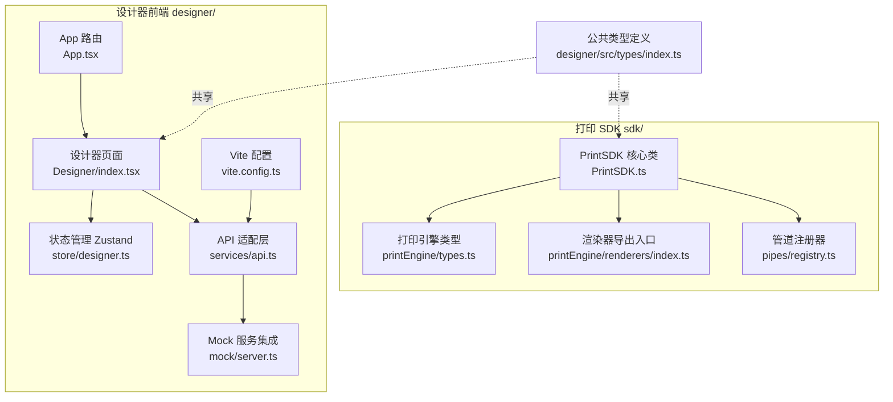
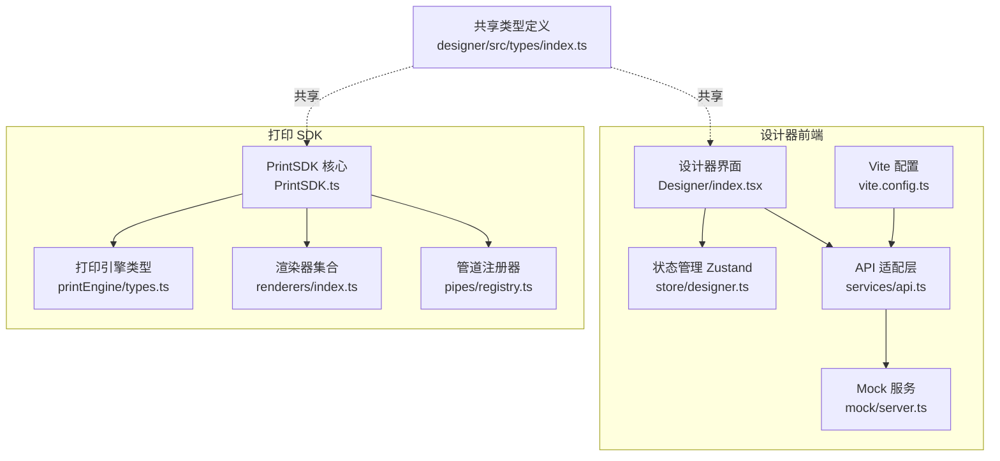
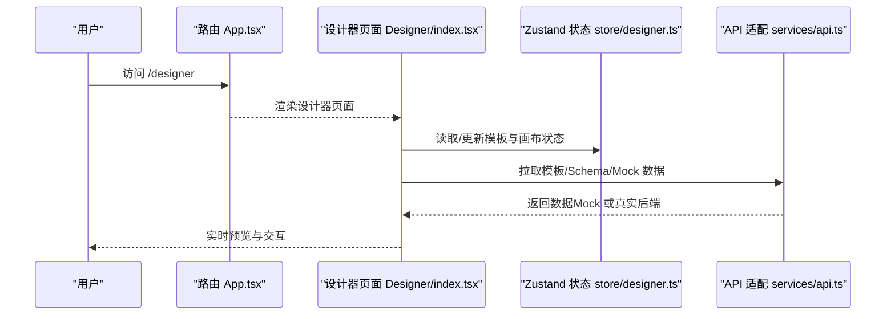
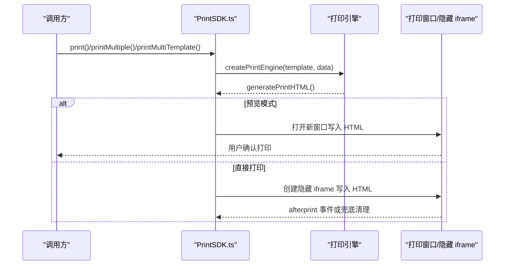
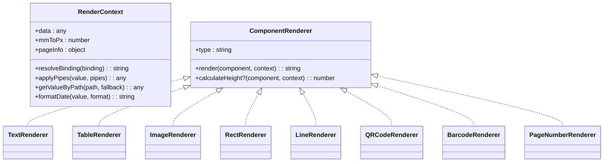
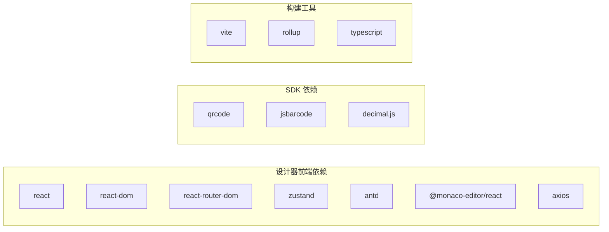

# 项目概述

<cite>
**本文引用的文件**
- [README.md](file://README.md)
- [package.json](file://package.json)
- [designer/package.json](file://designer/package.json)
- [sdk/package.json](file://sdk/package.json)
- [designer/src/App.tsx](file://designer/src/App.tsx)
- [designer/src/pages/Designer/index.tsx](file://designer/src/pages/Designer/index.tsx)
- [designer/src/store/designer.ts](file://designer/src/store/designer.ts)
- [designer/src/services/api.ts](file://designer/src/services/api.ts)
- [designer/vite.config.ts](file://designer/vite.config.ts)
- [designer/mock/server.ts](file://designer/mock/server.ts)
- [sdk/src/PrintSDK.ts](file://sdk/src/PrintSDK.ts)
- [sdk/src/printEngine/types.ts](file://sdk/src/printEngine/types.ts)
- [sdk/src/printEngine/renderers/index.ts](file://sdk/src/printEngine/renderers/index.ts)
- [sdk/src/pipes/registry.ts](file://sdk/src/pipes/registry.ts)
- [designer/src/types/index.ts](file://designer/src/types/index.ts)
</cite>

## 目录
1. [简介](#简介)
2. [项目结构](#项目结构)
3. [核心组件](#核心组件)
4. [架构总览](#架构总览)
5. [详细组件分析](#详细组件分析)
6. [依赖分析](#依赖分析)
7. [性能考量](#性能考量)
8. [故障排查指南](#故障排查指南)
9. [结论](#结论)
10. [附录](#附录)

## 简介
打印设计器是一个面向“客户端打印”的一体化解决方案，包含“可视化模板设计器”和“打印 SDK”两大核心模块。项目旨在以所见即所得的方式，帮助用户快速设计可打印的模板，并通过纯前端的打印 SDK 将模板与数据渲染为浏览器可打印的 HTML，支持批量打印、页头/页脚、表格跨页、页码等功能。

- 在线演示地址：https://printer-pi-five.vercel.app
- 当前版本：v1.5.0
- 下一版本规划：v1.6.0（计划中）

## 项目结构
项目采用多包结构，分为设计器前端与独立 SDK 两部分，共享类型定义与通用工具。

图表来源
- [designer/src/App.tsx:1-31](file://designer/src/App.tsx#L1-L31)
- [designer/src/pages/Designer/index.tsx:1-365](file://designer/src/pages/Designer/index.tsx#L1-L365)
- [designer/src/store/designer.ts:1-773](file://designer/src/store/designer.ts#L1-L773)
- [designer/src/services/api.ts:1-134](file://designer/src/services/api.ts#L1-L134)
- [designer/mock/server.ts:1-193](file://designer/mock/server.ts#L1-L193)
- [designer/vite.config.ts:1-29](file://designer/vite.config.ts#L1-L29)
- [sdk/src/PrintSDK.ts:1-477](file://sdk/src/PrintSDK.ts#L1-L477)
- [sdk/src/printEngine/types.ts:1-116](file://sdk/src/printEngine/types.ts#L1-L116)
- [sdk/src/printEngine/renderers/index.ts:1-13](file://sdk/src/printEngine/renderers/index.ts#L1-L13)
- [sdk/src/pipes/registry.ts:1-65](file://sdk/src/pipes/registry.ts#L1-L65)
- [designer/src/types/index.ts:1-378](file://designer/src/types/index.ts#L1-L378)

章节来源
- [README.md:369-406](file://README.md#L369-L406)
- [designer/src/App.tsx:1-31](file://designer/src/App.tsx#L1-L31)
- [designer/src/pages/Designer/index.tsx:1-365](file://designer/src/pages/Designer/index.tsx#L1-L365)
- [designer/src/store/designer.ts:1-773](file://designer/src/store/designer.ts#L1-L773)
- [designer/src/services/api.ts:1-134](file://designer/src/services/api.ts#L1-L134)
- [designer/vite.config.ts:1-29](file://designer/vite.config.ts#L1-L29)
- [designer/mock/server.ts:1-193](file://designer/mock/server.ts#L1-L193)
- [sdk/src/PrintSDK.ts:1-477](file://sdk/src/PrintSDK.ts#L1-L477)
- [sdk/src/printEngine/types.ts:1-116](file://sdk/src/printEngine/types.ts#L1-L116)
- [sdk/src/printEngine/renderers/index.ts:1-13](file://sdk/src/printEngine/renderers/index.ts#L1-L13)
- [sdk/src/pipes/registry.ts:1-65](file://sdk/src/pipes/registry.ts#L1-L65)
- [designer/src/types/index.ts:1-378](file://designer/src/types/index.ts#L1-L378)

## 核心组件
- 可视化模板设计器
  - 三栏布局：左侧数据资产树、中央画布、右侧属性面板
  - 三区域画布：页头/内容/页脚，支持组件跨区域拖拽与独立渲染
  - 智能网格吸附、对齐参考线、撤销/重做、缩放控件、组件树与调试面板
- 打印 SDK
  - 纯前端打印：生成 HTML 并触发浏览器打印，支持预览与直接打印
  - 批量打印：同模板多数据合并打印，支持进度回调
  - 多模板批量打印：多个模板各自绑定数据列表，一次打印确认
  - 渲染器插件化：文本、表格、图片、二维码、条形码、线条、矩形、页码渲染器
  - 管道系统：日期、货币、金额、中文大写、大小写、截取、默认值等内置管道

章节来源
- [README.md:242-337](file://README.md#L242-L337)
- [sdk/src/PrintSDK.ts:100-477](file://sdk/src/PrintSDK.ts#L100-L477)
- [sdk/src/printEngine/renderers/index.ts:1-13](file://sdk/src/printEngine/renderers/index.ts#L1-L13)
- [sdk/src/pipes/registry.ts:1-65](file://sdk/src/pipes/registry.ts#L1-L65)

## 架构总览
整体采用“设计器前端 + 打印 SDK”的双模块架构，设计器负责模板设计与管理，SDK 负责模板渲染与打印；两者通过共享类型定义协同工作。

图表来源
- [designer/src/pages/Designer/index.tsx:1-365](file://designer/src/pages/Designer/index.tsx#L1-L365)
- [designer/src/store/designer.ts:1-773](file://designer/src/store/designer.ts#L1-L773)
- [designer/src/services/api.ts:1-134](file://designer/src/services/api.ts#L1-L134)
- [designer/mock/server.ts:1-193](file://designer/mock/server.ts#L1-L193)
- [designer/vite.config.ts:1-29](file://designer/vite.config.ts#L1-L29)
- [sdk/src/PrintSDK.ts:1-477](file://sdk/src/PrintSDK.ts#L1-L477)
- [sdk/src/printEngine/types.ts:1-116](file://sdk/src/printEngine/types.ts#L1-L116)
- [sdk/src/printEngine/renderers/index.ts:1-13](file://sdk/src/printEngine/renderers/index.ts#L1-L13)
- [sdk/src/pipes/registry.ts:1-65](file://sdk/src/pipes/registry.ts#L1-L65)
- [designer/src/types/index.ts:1-378](file://designer/src/types/index.ts#L1-L378)

## 详细组件分析

### 设计器前端（React 18 + Zustand）
- 路由与布局
  - 主路由集中于 App，提供设计器全屏模式与管理页布局
  - 设计器页面采用三栏布局，支持左右侧栏折叠与悬浮缩放控件
- 状态管理
  - 使用 Zustand 管理组件列表（含 header/content/footer 三区域）、选中状态、网格/缩放、对齐/分布、层级管理、撤销/重做历史
  - 支持复制/粘贴、组件移动到不同区域、区域开关与高度推断
- API 与 Mock
  - 通过环境变量切换真实后端或前端内存 Mock
  - Vite 集成 Mock 服务，统一暴露 /api 路由
- 开发体验
  - 本地开发可映射 @jcyao/print-sdk 指向 SDK 源码，便于联调

图表来源
- [designer/src/App.tsx:1-31](file://designer/src/App.tsx#L1-L31)
- [designer/src/pages/Designer/index.tsx:1-365](file://designer/src/pages/Designer/index.tsx#L1-L365)
- [designer/src/store/designer.ts:1-773](file://designer/src/store/designer.ts#L1-L773)
- [designer/src/services/api.ts:1-134](file://designer/src/services/api.ts#L1-L134)

章节来源
- [designer/src/App.tsx:1-31](file://designer/src/App.tsx#L1-L31)
- [designer/src/pages/Designer/index.tsx:1-365](file://designer/src/pages/Designer/index.tsx#L1-L365)
- [designer/src/store/designer.ts:1-773](file://designer/src/store/designer.ts#L1-L773)
- [designer/src/services/api.ts:1-134](file://designer/src/services/api.ts#L1-L134)
- [designer/vite.config.ts:1-29](file://designer/vite.config.ts#L1-L29)
- [designer/mock/server.ts:1-193](file://designer/mock/server.ts#L1-L193)

### 打印 SDK（纯前端打印引擎）
- 打印流程
  - 接收模板与数据，创建打印引擎，生成 HTML，触发浏览器打印或预览
  - 支持图片资源加载完成后再打印，保证渲染完整性
- 批量与多模板打印
  - 同模板多数据合并打印，支持进度回调
  - 多模板各自绑定数据列表，统一生成完整 HTML 后打印
- 渲染器与管道
  - 渲染器插件化，统一接口，便于扩展新组件
  - 管道注册器集中管理内置执行器，支持链式转换

图表来源
- [sdk/src/PrintSDK.ts:100-477](file://sdk/src/PrintSDK.ts#L100-L477)

章节来源
- [sdk/src/PrintSDK.ts:1-477](file://sdk/src/PrintSDK.ts#L1-L477)
- [sdk/src/printEngine/types.ts:1-116](file://sdk/src/printEngine/types.ts#L1-L116)
- [sdk/src/printEngine/renderers/index.ts:1-13](file://sdk/src/printEngine/renderers/index.ts#L1-L13)
- [sdk/src/pipes/registry.ts:1-65](file://sdk/src/pipes/registry.ts#L1-L65)

### 管道系统与渲染器体系
- 管道系统
  - 注册器模式：集中注册与获取执行器，支持内置与扩展
  - 执行链：按配置顺序对数据进行转换
- 渲染器体系
  - 统一接口：type + render + 可选 calculateHeight
  - 导出入口：集中导出各组件渲染器，便于引擎统一调度

图表来源
- [sdk/src/printEngine/types.ts:57-82](file://sdk/src/printEngine/types.ts#L57-L82)
- [sdk/src/printEngine/renderers/index.ts:1-13](file://sdk/src/printEngine/renderers/index.ts#L1-L13)

章节来源
- [sdk/src/pipes/registry.ts:1-65](file://sdk/src/pipes/registry.ts#L1-L65)
- [sdk/src/printEngine/types.ts:1-116](file://sdk/src/printEngine/types.ts#L1-L116)
- [sdk/src/printEngine/renderers/index.ts:1-13](file://sdk/src/printEngine/renderers/index.ts#L1-L13)

## 依赖分析
- 技术栈选择与优势
  - 前端框架：React 18 + TypeScript，提供强类型与高效更新
  - 构建工具：Vite 5，开发热更新与生产构建速度快
  - 状态管理：Zustand，轻量易用，减少样板代码
  - UI 组件库：Ant Design 6，生态完善，组件丰富
  - 代码编辑器：Monaco Editor，提供良好的 Schema/模板编辑体验
  - SDK 构建：Rollup，产物体积小，支持 ESM/CJS
- 外部依赖
  - 打印相关：qrcode、jsbarcode、decimal.js
  - 网络请求：axios
  - 路由：react-router-dom
  - 开发工具：@vitejs/plugin-react、ESLint、TypeScript

图表来源
- [designer/package.json:13-29](file://designer/package.json#L13-L29)
- [sdk/package.json:49-53](file://sdk/package.json#L49-L53)
- [designer/vite.config.ts:1-29](file://designer/vite.config.ts#L1-L29)

章节来源
- [README.md:341-366](file://README.md#L341-L366)
- [designer/package.json:1-46](file://designer/package.json#L1-L46)
- [sdk/package.json:1-61](file://sdk/package.json#L1-L61)

## 性能考量
- 渲染与分页
  - 表格分页采用真实测量方案，避免估算误差导致的截断
  - 高精度计算使用 decimal.js，减少浮点误差
- 资源加载
  - 打印前等待图片资源加载完成，保证内容完整
  - 二维码/条形码同步生成为 base64，减少异步依赖
- 构建与打包
  - Vite 快速开发与构建，Rollup 产物体积小，按需引入
- 可扩展性
  - 渲染器与管道采用注册器模式，易于扩展新组件与转换规则

[本节为通用性能讨论，不直接分析具体文件]

## 故障排查指南
- 打印内容偏移
  - 检查 @media print 样式与边距设置，确保 margin/padding 正确覆盖
- 打印窗口未触发 afterprint
  - SDK 已提供兜底清理逻辑（5 秒后清理），若仍异常，检查浏览器打印对话框行为
- Mock 与后端切换
  - 确认 VITE_USE_MOCK 与 VITE_API_BASE_URL 环境变量配置
- 模板加载失败
  - 检查 /api 路由是否被正确挂载（Mock 服务集成）
- 二维码/条形码不显示
  - 确认资源已同步生成为 base64，外部图片需等待加载完成

章节来源
- [README.md:136-147](file://README.md#L136-L147)
- [sdk/src/PrintSDK.ts:149-171](file://sdk/src/PrintSDK.ts#L149-L171)
- [designer/src/services/api.ts:13-20](file://designer/src/services/api.ts#L13-L20)
- [designer/mock/server.ts:184-192](file://designer/mock/server.ts#L184-L192)

## 结论
打印设计器通过“可视化模板设计器 + 独立打印 SDK”的架构，实现了从设计到打印的完整闭环。其技术栈成熟稳定，组件与管道系统插件化，具备良好的扩展性与可维护性。v1.5.0 版本在页头/页脚、表格列宽与边框、分页精度等方面进行了重要增强，生产就绪状态明确。未来版本将持续完善分页符、孤行控制、用户手册等能力，并在大数据表格、图片懒加载、打印队列等方面进行性能优化。

[本节为总结性内容，不直接分析具体文件]

## 附录

### 版本信息与发布历史
- 当前版本：v1.5.0（页头大师版）
- 发布日期：2026-05-30
- 下一版本：v1.6.0（计划中）

章节来源
- [README.md:1-11](file://README.md#L1-L11)
- [README.md:542-547](file://README.md#L542-L547)

### 快速开始
- 一键启动（推荐）
  - 在根目录执行 ./dev.sh，自动检查依赖、启动设计器与 Mock 服务
- 手动启动
  - cd designer && npm install && npm run dev
  - 访问 http://localhost:5173
- 构建 SDK
  - cd sdk && npm install && npm run build

章节来源
- [README.md:436-467](file://README.md#L436-L467)

### 在线演示
- 演示地址：https://printer-pi-five.vercel.app
- 内置示例数据（Schema、模板、Mock 数据），无需后端即可体验完整功能

章节来源
- [README.md:9-20](file://README.md#L9-L20)

### 应用场景与目标用户
- 场景
  - 订单/发票/收据等文档模板设计与批量打印
  - 一客一模板的个性化文档输出
  - 无后端环境下的快速原型验证
- 用户
  - 前端/全栈工程师（集成 SDK）
  - 产品经理/运营（使用设计器设计模板）
  - 业务人员（基于 Schema 与 Mock 数据进行测试）

章节来源
- [README.md:242-337](file://README.md#L242-L337)