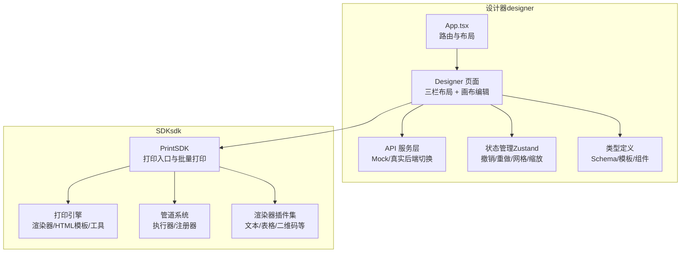
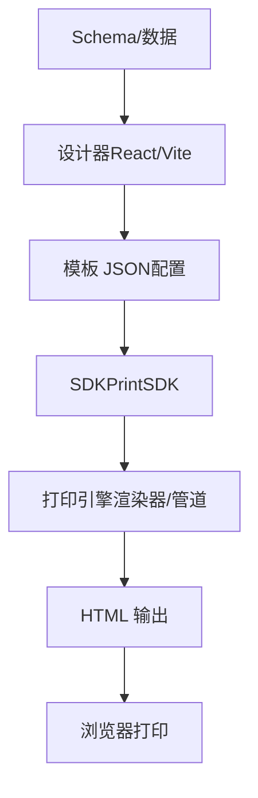
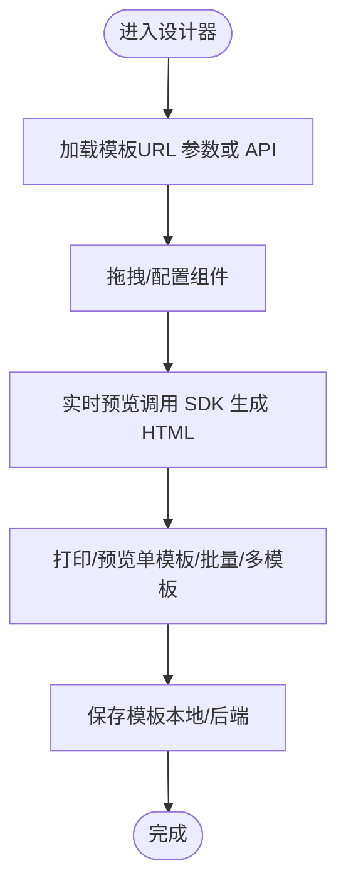
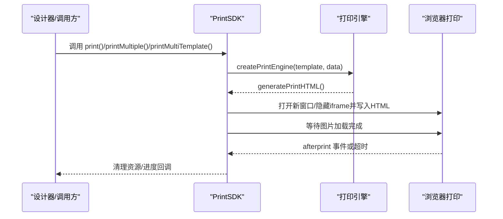
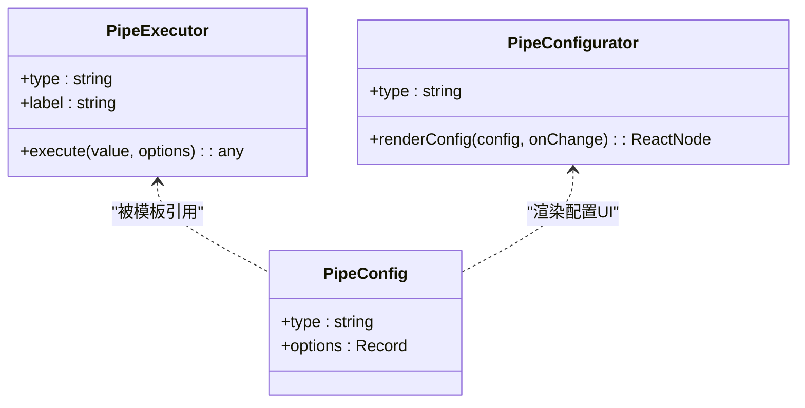
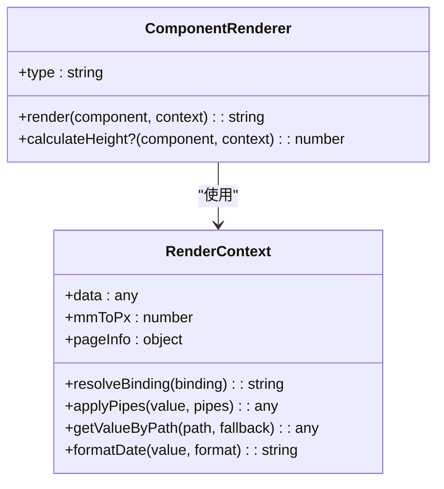
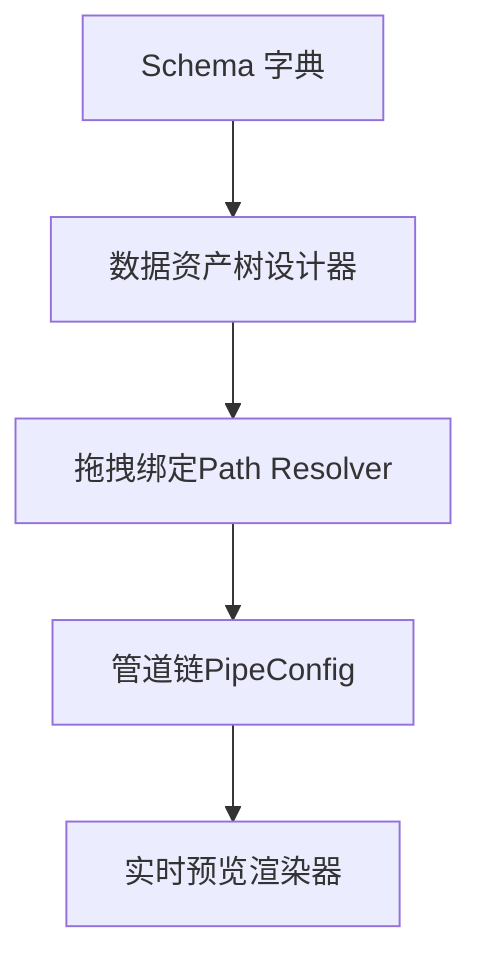
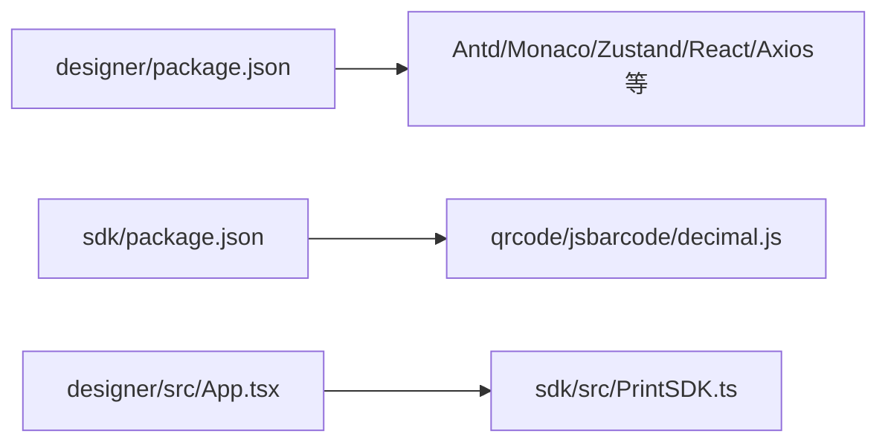

# 项目概述

<cite>
**本文引用的文件**
- [README.md](file://README.md)
- [package.json](file://package.json)
- [designer/package.json](file://designer/package.json)
- [sdk/package.json](file://sdk/package.json)
- [designer/src/App.tsx](file://designer/src/App.tsx)
- [designer/src/pages/Designer/index.tsx](file://designer/src/pages/Designer/index.tsx)
- [designer/src/services/api.ts](file://designer/src/services/api.ts)
- [designer/src/store/designer.ts](file://designer/src/store/designer.ts)
- [designer/src/types/index.ts](file://designer/src/types/index.ts)
- [sdk/src/PrintSDK.ts](file://sdk/src/PrintSDK.ts)
- [sdk/src/printEngine/types.ts](file://sdk/src/printEngine/types.ts)
- [sdk/src/pipes/types.ts](file://sdk/src/pipes/types.ts)
- [sdk/src/printEngine/renderers/index.ts](file://sdk/src/printEngine/renderers/index.ts)
- [sdk/src/pipes/executors/index.ts](file://sdk/src/pipes/executors/index.ts)
- [docs/技术架构文档(仅参考).md](file://docs/技术架构文档(仅参考).md)
</cite>

## 目录
1. [简介](#简介)
2. [项目结构](#项目结构)
3. [核心组件](#核心组件)
4. [架构总览](#架构总览)
5. [详细组件分析](#详细组件分析)
6. [依赖关系分析](#依赖关系分析)
7. [性能考量](#性能考量)
8. [故障排查指南](#故障排查指南)
9. [结论](#结论)
10. [附录](#附录)

## 简介
打印服务平台是一个面向浏览器端的“所见即所得”打印解决方案，提供可视化模板设计器与独立 SDK 两部分能力。其核心价值在于：
- 以“设计态配置化、运行态轻量化”的思路，将复杂打印逻辑下沉至客户端，实现零后端依赖、零安装部署成本；
- 通过 Schema 驱动的数据绑定与插件化管道系统，实现从数据到页面元素的高可配置化与高扩展性；
- 采用相对间距（Gap）分页模型与渲染后测量的表格分页方案，彻底解决长文本换行与跨页截断问题；
- SDK 完全解耦设计，支持浏览器直接打印与批量打印预览，同时提供多模板混合打印能力。

应用场景广泛，适用于订单小票、发票收据、报表单据、标签打印、批量通知等多种文档打印需求。

在线演示地址：https://printer-pi-five.vercel.app  
版本：v1.4.0（Column Master）

**章节来源**
- [README.md:1-532](file://README.md#L1-L532)

## 项目结构
项目采用“多包多入口”的组织方式，分为设计器与 SDK 两大模块，配合文档与示例模板，形成完整的开发与使用闭环。

**图表来源**
- [designer/src/App.tsx:1-31](file://designer/src/App.tsx#L1-L31)
- [designer/src/pages/Designer/index.tsx:1-365](file://designer/src/pages/Designer/index.tsx#L1-L365)
- [designer/src/services/api.ts:1-134](file://designer/src/services/api.ts#L1-L134)
- [designer/src/store/designer.ts:1-773](file://designer/src/store/designer.ts#L1-L773)
- [sdk/src/PrintSDK.ts:1-477](file://sdk/src/PrintSDK.ts#L1-L477)

**章节来源**
- [README.md:353-391](file://README.md#L353-L391)
- [package.json:1-10](file://package.json#L1-L10)
- [designer/package.json:1-46](file://designer/package.json#L1-L46)
- [sdk/package.json:1-61](file://sdk/package.json#L1-L61)

## 核心组件
- 可视化模板设计器：三栏布局（数据资产树、画布编辑器、属性面板），支持网格吸附、智能对齐、组件树、撤销/重做、缩放与悬浮工具组、调试抽屉等。
- 打印引擎与渲染器：基于注册器模式的组件渲染器插件集，覆盖文本、表格、图片、二维码、条形码、线条、矩形、页码等组件。
- 管道系统：插件化数据转换链，内置日期、货币、金额、中文大写、大小写、截取、默认值等执行器，支持配置器在设计器中可视化配置。
- SDK：纯 TS 实现，无 UI 依赖，支持单模板打印、批量打印、多模板混合打印，支持预览与直接打印，内置图片加载等待与打印完成清理机制。

**章节来源**
- [README.md:227-322](file://README.md#L227-L322)
- [sdk/src/PrintSDK.ts:100-477](file://sdk/src/PrintSDK.ts#L100-L477)
- [sdk/src/printEngine/types.ts:1-116](file://sdk/src/printEngine/types.ts#L1-L116)
- [sdk/src/pipes/types.ts:1-30](file://sdk/src/pipes/types.ts#L1-L30)

## 架构总览
整体采用“设计态配置化、运行态轻量化”的分层架构：
- 数据层：Schema 字典与 Mock 数据管理；
- 配置层：设计器生成 JSON 模板；
- 设计层：React 可视化设计器（内置 Mock API）；
- 执行层：SDK 载入模板与数据，完成数据加工与虚拟分页，生成 HTML 并调用浏览器打印。

模块分离原则：
- SDK 仅包含纯逻辑，无 UI 依赖；
- 设计器从 SDK 导入所有打印相关功能；
- 管道系统：执行器在 SDK，配置器在设计器；
- 新增功能优先在 SDK 实现，设计器调用。

**图表来源**
- [docs/技术架构文档(仅参考).md:21-76](file://docs/技术架构文档(仅参考).md#L21-L76)
- [designer/src/services/api.ts:127-134](file://designer/src/services/api.ts#L127-L134)
- [sdk/src/PrintSDK.ts:100-172](file://sdk/src/PrintSDK.ts#L100-L172)

**章节来源**
- [docs/技术架构文档(仅参考).md:1-800](file://docs/技术架构文档(仅参考).md#L1-L800)

## 详细组件分析

### 可视化模板设计器（React + Zustand）
- 路由与布局：BrowserRouter 路由，主布局包含模板管理、Schema 管理、Mock 数据管理与设计器全屏模式。
- 三栏布局：左侧数据资产树、中间画布编辑器、右侧属性面板（组件树与属性配置）。
- 交互能力：网格吸附、智能对齐、组件复制/粘贴/多选、层级管理（置顶/置底/上移/下移）、撤销/重做、缩放与悬浮工具组、调试抽屉（模板 JSON 预览与复制）。
- 状态管理：Zustand Store 统一管理组件列表、选中状态、模板信息、页面配置、网格/缩放、历史记录等。

**图表来源**
- [designer/src/App.tsx:9-28](file://designer/src/App.tsx#L9-L28)
- [designer/src/pages/Designer/index.tsx:17-365](file://designer/src/pages/Designer/index.tsx#L17-L365)
- [designer/src/store/designer.ts:108-773](file://designer/src/store/designer.ts#L108-L773)

**章节来源**
- [designer/src/App.tsx:1-31](file://designer/src/App.tsx#L1-L31)
- [designer/src/pages/Designer/index.tsx:1-365](file://designer/src/pages/Designer/index.tsx#L1-L365)
- [designer/src/store/designer.ts:1-773](file://designer/src/store/designer.ts#L1-L773)

### 打印 SDK（PrintSDK）
- 单模板打印：支持预览与直接打印，预览模式打开新窗口，直接打印模式使用隐藏 iframe，打印完成后清理；
- 批量打印（同模板多数据）：将多个数据渲染为完整 HTML 片段，合并后一次性打印，支持进度回调；
- 多模板打印：支持多个模板各自绑定数据列表，一次打印确认，要求所有模板使用相同纸张尺寸；
- HTML 生成与资源加载：使用 DOMParser 提取 body 内容，等待图片资源加载后触发打印；
- 打印完成清理：优先使用 afterprint 事件，兜底 5 秒清理隐藏 iframe。

**图表来源**
- [sdk/src/PrintSDK.ts:100-477](file://sdk/src/PrintSDK.ts#L100-L477)

**章节来源**
- [sdk/src/PrintSDK.ts:1-477](file://sdk/src/PrintSDK.ts#L1-L477)

### 管道系统（插件化）
- 执行器（SDK）：日期、货币、金额、中文大写、大小写、截取、默认值等；
- 配置器（设计器）：将执行器的配置 UI 与模板 JSON 绑定，支持在属性面板中可视化配置；
- 注册器：执行器与配置器分别注册，使用 type 唯一标识，模板中以 PipeConfig 形式存储。

**图表来源**
- [sdk/src/pipes/types.ts:1-30](file://sdk/src/pipes/types.ts#L1-L30)
- [sdk/src/pipes/executors/index.ts:1-45](file://sdk/src/pipes/executors/index.ts#L1-L45)

**章节来源**
- [docs/技术架构文档(仅参考).md:100-176](file://docs/技术架构文档(仅参考).md#L100-L176)
- [sdk/src/pipes/types.ts:1-30](file://sdk/src/pipes/types.ts#L1-L30)
- [sdk/src/pipes/executors/index.ts:1-45](file://sdk/src/pipes/executors/index.ts#L1-L45)

### 渲染器插件集（组件渲染）
- 文本、表格、图片、矩形、线条、二维码、条形码、页码等组件渲染器；
- 统一接口：render(component, context) 与可选的 calculateHeight；
- 上下文：提供数据解析、管道应用、路径取值、格式化日期、mm→px 转换、页面信息等。

**图表来源**
- [sdk/src/printEngine/types.ts:11-82](file://sdk/src/printEngine/types.ts#L11-L82)
- [sdk/src/printEngine/renderers/index.ts:1-13](file://sdk/src/printEngine/renderers/index.ts#L1-L13)

**章节来源**
- [sdk/src/printEngine/types.ts:1-116](file://sdk/src/printEngine/types.ts#L1-L116)
- [sdk/src/printEngine/renderers/index.ts:1-13](file://sdk/src/printEngine/renderers/index.ts#L1-L13)

### 数据绑定与 Schema 驱动
- Schema 字典：定义字段类型、枚举、格式化类型等元数据；
- 数据绑定：支持点号路径（a.b.c）安全取值，数组字段自动生成表格，管道链式转换；
- 设计器 API：支持 Mock 与真实后端切换，便于演示与开发。

**图表来源**
- [designer/src/types/index.ts:1-378](file://designer/src/types/index.ts#L1-L378)
- [designer/src/services/api.ts:1-134](file://designer/src/services/api.ts#L1-L134)

**章节来源**
- [designer/src/types/index.ts:1-378](file://designer/src/types/index.ts#L1-L378)
- [designer/src/services/api.ts:1-134](file://designer/src/services/api.ts#L1-L134)

## 依赖关系分析
- 设计器依赖 SDK：设计器通过导入 SDK 的打印能力实现预览与打印；
- SDK 依赖外部库：qrcode、jsbarcode、decimal.js；
- 设计器依赖 UI 与状态管理：Ant Design、Monaco Editor、Zustand；
- 构建工具：Vite（设计器）、Rollup（SDK）。

**图表来源**
- [designer/package.json:13-29](file://designer/package.json#L13-L29)
- [sdk/package.json:49-53](file://sdk/package.json#L49-L53)
- [designer/src/App.tsx:1-31](file://designer/src/App.tsx#L1-L31)
- [sdk/src/PrintSDK.ts:1-15](file://sdk/src/PrintSDK.ts#L1-L15)

**章节来源**
- [designer/package.json:1-46](file://designer/package.json#L1-L46)
- [sdk/package.json:1-61](file://sdk/package.json#L1-L61)
- [package.json:1-10](file://package.json#L1-L10)

## 性能考量
- 表格分页精度：采用“渲染后测量”方案，真实渲染到隐藏 DOM 中测量每行高度，彻底解决长文本换行与分页截断问题；
- 相对间距模型：统一按相对间距处理，天然支持多表格、组件重叠与跨页自动跟随；
- 二维码/条形码同步渲染：同步生成 base64，避免 CDN 依赖与异步等待；
- 图片懒加载与预加载：建议在业务侧结合业务场景进行优化；
- 打印队列与缓存策略：未来版本可进一步增强。

**章节来源**
- [docs/技术架构文档(仅参考).md:510-554](file://docs/技术架构文档(仅参考).md#L510-L554)
- [docs/技术架构文档(仅参考).md:250-333](file://docs/技术架构文档(仅参考).md#L250-L333)
- [docs/技术架构文档(仅参考).md:633-800](file://docs/技术架构文档(仅参考).md#L633-L800)

## 故障排查指南
- 打印内容偏移：确认 @media print 中 .print-page margin 覆盖，批量打印样式增加 padding；
- 打印预览与实际输出不一致：检查设计器与 SDK 的 HTML 生成逻辑，确保 DOMParser 提取 body 成功；
- 二维码/条形码未显示：确认渲染器已同步生成 base64，检查浏览器控制台错误；
- 打印完成后未清理隐藏 iframe：确认 afterprint 事件或兜底清理逻辑；
- 多模板打印尺寸不一致：当前版本要求所有模板使用相同纸张尺寸，避免混合尺寸。

**章节来源**
- [README.md:121-128](file://README.md#L121-L128)
- [sdk/src/PrintSDK.ts:21-42](file://sdk/src/PrintSDK.ts#L21-L42)
- [docs/技术架构文档(仅参考).md:781-800](file://docs/技术架构文档(仅参考).md#L781-L800)

## 结论
打印服务平台以“设计态配置化、运行态轻量化”为核心理念，通过可视化设计器与独立 SDK 的协同，实现了从模板设计到浏览器打印的完整闭环。其插件化的管道系统与渲染器架构具备良好的扩展性，相对间距分页模型与渲染后测量方案解决了长期存在的打印精度问题。v1.4.0 在表格列宽自定义、行号列宽度、边框样式等方面进一步完善，为生产环境提供了稳定可靠的打印能力。

## 附录
- 在线演示：https://printer-pi-five.vercel.app
- 快速开始与使用指南详见 README；
- 未来规划（v1.5+）：分页符组件、孤行/寡行控制、连续打印、用户手册、更多管道与组件类型、模板版本管理与分享、批量打印优化、性能优化等。

**章节来源**
- [README.md:420-532](file://README.md#L420-L532)