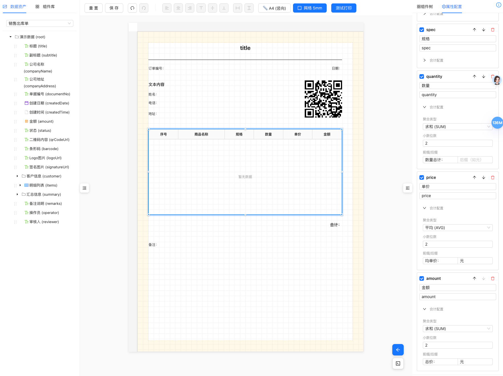
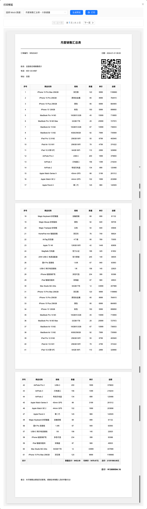

# 打印服务平台 v1.0.1 发布说明

**版本号**: 1.0.1  
**代号**: Pioneer Plus（先锋增强版）
**发布日期**: 2026-01-22

---

## 🎉 重要里程碑

打印服务平台 **v1.0.1** 正式发布！在 v1.0.0 的基础上，新增了**分页页码功能**、**批量打印预览**以及**交互体验优化**，进一步提升了系统的实用性和易用性。

---




## 🆕 v1.0.1 新增功能

### 1. 分页打印页码功能 ⭐

- ✅ 支持6种页码位置：上左/上中/上右/下左/下中/下右
- ✅ 支持3种页码格式：简单格式(1)、斜线格式(1/3)、文字格式(第1页 共3页)
- ✅ 支持横向/纵向偏移量配置
- ✅ 支持自定义前后缀文本
- ✅ 设计器画布实时预览页码位置（蓝色虚线框标识）
- ✅ 架构优化：从组件模式重构为页面配置模式（pageConfig.pageNumber）

```typescript
// 页码配置示例
pageConfig: {
  pageNumber: {
    enabled: true,
    position: 'bottom-center',  // 位置
    format: 'slash',            // 格式：1/3
    offsetX: 0,                 // 横向偏移
    offsetY: 0,                 // 纵向偏移
    prefix: '页码：',             // 前缀
    suffix: '',                 // 后缀
    style: {
      fontSize: 12,
      color: '#666',
      fontWeight: 'normal'
    }
  }
}
```

### 2. 批量打印预览功能 ⭐

- ✅ 支持多份文档一次性预览和打印
- ✅ 自动合并HTML并添加分页符
- ✅ 显示文档分割线和文档序号
- ✅ Mock数据支持数组格式，自动识别批量打印

### 3. 交互体验优化 ⭐

- ✅ **组件库**：支持双击快速添加（画布中心）+ 拖拽精确定位
- ✅ **数据资产**：支持双击快速添加（画布中心）+ 拖拽精确定位
- ✅ 智能计算画布中心位置（考虑纸张尺寸和方向）
- ✅ 快捷键提示会话级关闭记忆（sessionStorage）
- ✅ 修复数据绑定一致性问题（双击和拖拽配置完全一致）

---

## ✨ 核心特性

### 1. 可视化模板设计器

- ✅ 所见即所得的拖拽式设计界面
- ✅ 三栏布局：数据资产树 + 画布编辑器 + 属性面板
- ✅ 智能网格吸附（Shift 键临时禁用）
- ✅ 智能对齐参考线（自动检测对齐）
- ✅ 组件树面板（树状展示、快速定位）
- ✅ 撤销/重做功能（Ctrl+Z / Ctrl+Shift+Z）
- ✅ 多页预览与实时打印

### 2. 丰富的组件库

支持多种基础组件类型：

- **文本组件**：支持标签、数据绑定、样式配置
- **表格组件**：支持跨页分页、表头重复、列隐藏、表格合计
- **图片组件**：支持本地/远程图片、base64 编码
- **二维码组件**：自动生成二维码
- **条形码组件**：支持多种条形码格式
- **线条组件**：实线/虚线样式
- **矩形组件**：边框装饰

### 3. 强大的数据绑定系统

- ✅ Schema 驱动的数据模型
- ✅ 点号路径（a.b.c）安全取值
- ✅ 数组字段自动生成表格
- ✅ 数组子字段智能标记（禁止拖拽）
- ✅ 管道（Pipe）转换链
- ✅ 空值默认值处理

### 4. 插件化管道系统

内置 6 种数据转换管道：

| 管道类型 | 功能说明 | 典型场景 |
|---------|---------|---------|
| **日期格式化** | YYYY-MM-DD HH:mm:ss | 订单日期显示 |
| **货币格式化** | ¥9999.00 | 金额显示 |
| **金额转换** ⭐ | 分↔元、千分位分隔 | 后端分值转前端元值 |
| **大小写转换** | HELLO / hello | 姓名大写 |
| **字符串截取** | 138****8000 | 手机号脱敏 |
| **默认值** | 空值 → "-" | 数据容错 |

> ⭐ **v1.0 新增**：金额转换管道使用 decimal.js 保证精度

### 5. 高级打印引擎

#### 相对间距（Gap）分页模型

- ✅ 组件按相对间距布局
- ✅ 自动虚拟分页计算
- ✅ 表格智能跨页拆分
- ✅ 表头重复渲染
- ✅ 页边距精确控制
- ✅ **页码功能** ⭐ v1.0.1：6种位置、3种格式、自定义样式

#### 表格高级功能

- ✅ **表格合计**：支持 SUM、AVG、MAX、MIN、COUNT
- ✅ **合计模式**：总计（最后一页）/ 分页合计
- ✅ **高精度计算**：使用 decimal.js 避免浮点误差
- ✅ **合计行样式**：背景色、字重、字号可配置
- ✅ **Gap 兼容**：合计行高度纳入分页计算

#### 渲染器插件化

- ✅ 注册器模式 (Registry Pattern)
- ✅ 每个组件类型独立渲染器
- ✅ 易于扩展新组件
- ✅ 统一渲染上下文

### 6. 独立 SDK

- ✅ 纯 TypeScript 实现
- ✅ 无 UI 依赖，可独立使用
- ✅ 支持浏览器打印
- ✅ 支持批量打印预览 ⭐ v1.0.1
- ✅ Rollup 打包，支持 ESM/CJS
- ✅ 外部依赖：qrcode、jsbarcode、decimal.js

```typescript
// SDK 使用示例
import { createPrintSDK } from '@jcyao/print-sdk';

const sdk = createPrintSDK();

await sdk.print({
  template: templateJson,
  data: orderData
});
```

---

## 🔧 技术架构

### 前端技术栈

- **框架**: React 18 + TypeScript
- **构建工具**: Vite 5
- **状态管理**: Zustand
- **UI 组件库**: Ant Design 6
- **代码编辑器**: Monaco Editor

### SDK 技术栈

- **构建工具**: Rollup
- **打包格式**: ESM + CommonJS
- **核心依赖**:
  - qrcode ^1.5.4 - 二维码生成
  - jsbarcode ^3.12.3 - 条形码生成
  - decimal.js ^10.6.0 - 高精度数值计算

### 设计模式

- **注册器模式**：管道系统、渲染器系统
- **插件化架构**：组件渲染器
- **分层架构**：SDK 层 / Designer 层 / Service 层
- **执行器/配置器分离**：逻辑与 UI 解耦

---

## 📦 项目结构

```
/printer
├── sdk/                    # 打印 SDK（独立 npm 包）
│   ├── src/
│   │   ├── printEngine/    # 打印引擎核心
│   │   │   ├── renderers/  # 组件渲染器插件
│   │   │   └── utils/      # 工具函数
│   │   ├── pipes/          # 管道系统
│   │   │   ├── executors/  # 管道执行器
│   │   │   ├── registry.ts # 注册器
│   │   │   └── types.ts    # 类型定义
│   │   ├── index.ts        # SDK 入口
│   │   └── types.ts        # 全局类型
│   └── package.json        # v1.0.0
│
├── designer/               # 可视化设计器
│   ├── src/
│   │   ├── pages/
│   │   │   └── Designer/
│   │   │       ├── components/
│   │   │       │   ├── AssetTree/         # 数据资产树
│   │   │       │   ├── Canvas/            # 画布编辑器
│   │   │       │   ├── PropertyPanel/     # 属性配置面板
│   │   │       │   ├── ComponentTree/     # 组件树面板
│   │   │       │   └── PrintPreview/      # 打印预览
│   │   ├── pipes/
│   │   │   └── configurators/  # 管道配置器（UI）
│   │   ├── store/              # Zustand 状态管理
│   │   └── services/           # API 服务
│   └── package.json            # v1.0.0
│
├── service/                # 模板管理服务（Node.js）
│   ├── src/
│   │   ├── routes/         # REST API 路由
│   │   ├── storage/        # 数据存储（内存）
│   │   └── index.ts        # 服务入口
│   └── package.json
│
└── docs/                   # 文档
    ├── 技术架构文档.md     # 架构设计文档
    └── 需求文档.md         # 产品需求文档 
```

---

## 📊 版本统计

### 代码量统计

- **SDK 源码**：约 3,500 行 TypeScript
- **Designer 源码**：约 8,000 行 TypeScript + React
- **Service 源码**：约 500 行 TypeScript + Express

### 组件数量

- **核心组件**：7 种（页码为页面配置，非组件）
- **内置管道**：6 种
- **渲染器插件**：8 个（含 PageNumberRenderer）

### 功能完成度

| 模块 | 完成度 | 备注 |
|------|--------|------|
| 可视化设计器 | 98% | 双击/拖拽交互统一 |
| 打印引擎 | 100% | 页码功能完善 |
| 管道系统 | 100% | 插件化完成 |
| 表格功能 | 100% | 合计、跨页、精度全部解决 |
| SDK | 100% | 独立可用，支持批量打印 |
| 示例模板 | 100% | 3 个示例完成 |

---

## 🚀 快速开始

### 1. 启动模板管理服务

```bash
cd service
npm install
npm start
# 服务运行在 http://localhost:3000
```

### 2. 启动设计器

```bash
cd designer
npm install
npm run dev
# 设计器运行在 http://localhost:5173
```

### 3. 构建 SDK

```bash
cd sdk
npm install
npm run build
# 生成 dist/index.js 和 dist/index.esm.js
```

---

## 📚 使用指南

### 创建打印模板

1. 打开设计器 (http://localhost:5173)
2. 从左侧数据资产树选择 Schema
3. 拖拽字段到画布生成组件
4. 在右侧属性面板配置样式和管道
5. 点击"测试打印"预览效果
6. 保存模板

### 集成 SDK

```typescript
import { createPrintSDK } from '@jcyao/print-sdk';

// 创建 SDK 实例
const sdk = createPrintSDK();

// 执行打印
await sdk.print({
  template: {
    pageConfig: { size: 'A4', orientation: 'portrait', marginMm: { ... } },
    components: [ ... ]
  },
  data: {
    orderNo: 'SR202401',
    items: [ ... ]
  }
});
```

---

## 🔮 未来规划 (v1.1+)

### 待实现功能

- ⏳ **边框调整**：拖拽边框调整组件尺寸
- ⏳ **分页符组件**：手动控制分页位置
- ⏳ **孤行/寡行控制**：避免单行内容跨页
- ⏳ **连续打印**：多页内容连续输出
- ⏳ **用户手册**：详细的操作指南

### 功能增强

- 更多管道类型（正则替换、条件格式化）
- 更多组件类型（分页符、水印、签名框）
- 模板版本管理
- 模板分享与导入导出
- 批量打印优化

### 性能优化

- 大数据表格虚拟滚动
- 图片懒加载与预加载
- 打印队列管理
- 缓存策略优化

---

## 📄 许可证

MIT License

---

## 📮 联系方式

- **项目维护者**: joke_yao
- **技术支持**: 参考 `/docs/技术架构文档.md`

---

**版本状态**: ✅ 生产就绪 (Production Ready)

**当前版本**: v1.0.1

**下一个版本**: v1.1.0 (计划中)
