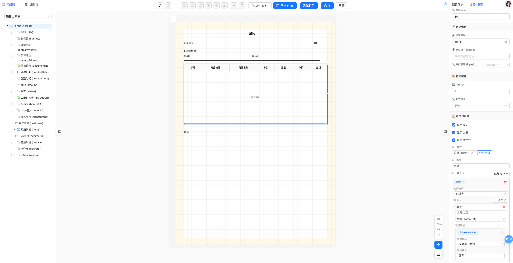
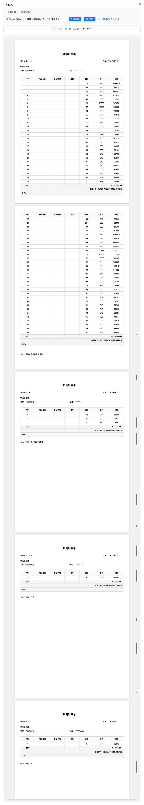

# 打印服务平台

**当前版本**: v1.13.0 | **代号**: Custom Group（自定义分组版）

---

## 🌐 在线演示

**演示地址**: https://printer-pi-five.vercel.app

内置示例数据（Schema、模板、Mock 数据），无需后端即可体验完整功能：
- 可视化模板设计器（拖拽组件、配置属性、实时预览）
- 模板管理（查看、编辑、删除示例模板）
- 打印预览与批量打印
- Mock 数据管理

> 适合不想自己搭建环境的用户，直接访问即可体验设计器功能。数据存储在浏览器内存中，刷新页面会重置为默认示例数据。

---

## 📋 更新日志

各子包独立维护更新日志：

- **SDK**：[sdk/CHANGELOG.md](./sdk/CHANGELOG.md)（npm 包 `@jcyao/print-sdk` 的完整变更记录）
- **Designer**：跟随 SDK 同步迭代，更新内容参见 SDK CHANGELOG 中的相关条目

---




## ✨ 核心特性

### 1. 可视化模板设计器

- **所见即所得的拖拽式设计界面**
- ✅ 三栏布局：数据资产树 + 画布编辑器 + 属性面板
- ✅ 三区域独立画布（页头/内容/页脚），支持组件跨区域拖拽
- ✅ 智能网格吸附（Shift 键临时禁用）
- ✅ 智能对齐参考线（自动检测对齐）
- ✅ 组件树面板（树状展示、快速定位）
- ✅ 撤销/重做功能（Ctrl+Z / Ctrl+Shift+Z）
- ✅ 多页预览与实时打印

### 2. 丰富的组件库

支持多种基础组件类型：

- **文本组件**：支持标签、数据绑定、样式配置
- **表格组件**：支持跨页分页、表头重复、列隐藏、表格合计
- **图片组件**：支持本地/远程图片、base64 编码
- **二维码组件**：自动生成二维码
- **条形码组件**：支持多种条形码格式
- **线条组件**：实线/虚线样式
- **矩形组件**：边框装饰

### 3. 强大的数据绑定系统

- ✅ Schema 驱动的数据模型
- ✅ 点号路径（a.b.c）安全取值
- ✅ 数组字段自动生成表格
- ✅ 数组子字段智能标记（禁止拖拽）
- ✅ 管道（Pipe）转换链
- ✅ 空值默认值处理

### 4. 插件化管道系统（支持自定义管道）

内置 8 种数据转换管道，并支持通过 `createPrintSDK({ customPipes })` 注入自定义管道：

| 管道类型 | 功能说明 | 典型场景 |
|---------|---------|---------|
| **日期格式化** | YYYY-MM-DD HH:mm:ss | 订单日期显示 |
| **货币格式化** | ¥9999.00 | 金额显示 |
| **金额转换** | 分↔元、千分位、中文大写金额 | 后端分值转前端元值、会计大写 |
| **中文大写数字** | 壹仟、叁点壹肆（支持小数） | 金额大写、数量大写 |
| **大小写转换** | HELLO / hello | 姓名大写 |
| **字符串截取** | 138****8000 | 手机号脱敏 |
| **默认值** | 空值 → "-" | 数据容错 |

### 5. 高级打印引擎

#### 相对间距（Gap）分页模型

- ✅ 组件按相对间距布局
- ✅ 自动虚拟分页计算
- ✅ 表格智能跨页拆分
- ✅ 表头重复渲染
- ✅ 页边距精确控制
- ✅ **页码功能**：6种位置、3种格式、自定义样式

#### 表格高级功能

- ✅ **表格合计**：支持 SUM、AVG、MAX、MIN、COUNT，及自定义聚合器（运行时注入/覆盖）
- ✅ **表格分组**：按字段分组渲染，支持组标题、组小计、跨页拆分
- ✅ **合计模式**：总计（最后一页）/ 分页合计
- ✅ **高精度计算**：使用 decimal.js 避免浮点误差
- ✅ **合计行样式**：背景色、字重、字号可配置
- ✅ **Gap 兼容**：合计行高度纳入分页计算

#### 渲染器插件化

- ✅ 注册器模式 (Registry Pattern)
- ✅ 每个组件类型独立渲染器
- ✅ 易于扩展新组件
- ✅ 统一渲染上下文

### 6. 独立 SDK

- ✅ 纯 TypeScript 实现
- ✅ 无 UI 依赖，可独立使用
- ✅ 支持浏览器打印
- ✅ 支持批量打印预览
- ✅ Rollup 打包，支持 ESM/CJS
- ✅ 外部依赖：qrcode、jsbarcode、decimal.js

```typescript
// SDK 使用示例
import { createPrintSDK } from '@jcyao/print-sdk';

const sdk = createPrintSDK();

await sdk.print({
  template: templateJson,
  data: orderData
});
```

---

## 🔧 技术架构

### 前端技术栈

- **框架**: React 18 + TypeScript
- **构建工具**: Vite 5
- **状态管理**: Zustand
- **UI 组件库**: Ant Design 6
- **代码编辑器**: Monaco Editor

### SDK 技术栈

- **构建工具**: Rollup
- **打包格式**: ESM + CommonJS
- **核心依赖**:
  - qrcode ^1.5.4 - 二维码生成
  - jsbarcode ^3.12.3 - 条形码生成
  - decimal.js ^10.6.0 - 高精度数值计算

### 设计模式

- **注册器模式**：管道系统、渲染器系统
- **插件化架构**：组件渲染器
- **分层架构**：SDK 层 / Designer 层 / Service 层
- **执行器/配置器分离**：逻辑与 UI 解耦

---

## 📦 项目结构

```
/printer
├── sdk/                    # 打印 SDK（独立 npm 包 @jcyao/print-sdk）
│   ├── src/
│   │   ├── printEngine/    # 打印引擎核心
│   │   │   ├── renderers/  # 组件渲染器插件（8 个）
│   │   │   ├── utils/      # 工具函数
│   │   │   ├── htmlTemplate.ts
│   │   │   └── constants.ts
│   │   ├── pipes/          # 管道系统（8 种内置管道）
│   │   │   ├── executors/  # 管道执行器
│   │   │   ├── registry.ts # 注册器
│   │   │   └── types.ts    # 类型定义
│   │   ├── PrintSDK.ts     # SDK 主类
│   │   ├── index.ts        # SDK 入口
│   │   └── types.ts        # 全局类型
│   ├── CHANGELOG.md        # 版本变更记录
│   └── package.json
│
├── designer/               # 可视化设计器（Vite + React，私有包）
│   ├── mock/               # Mock API 数据
│   ├── src/
│   │   ├── pages/
│   │   │   ├── Designer/           # 可视化设计器（全屏）
│   │   │   │   └── components/
│   │   │   │       ├── AssetPanel/     # 资产面板（数据资产 + 组件库）
│   │   │   │       ├── Canvas/         # 画布编辑器
│   │   │   │       ├── PropertyPanel/  # 属性配置面板
│   │   │   │       ├── ComponentTreePanel/  # 组件树面板
│   │   │   │       └── DebugPanel/     # 调试面板
│   │   │   ├── TemplateManagement/ # 模板管理页
│   │   │   ├── SchemaManagement/   # Schema 管理页
│   │   │   └── MockDataManagement/ # Mock 数据管理页
│   │   ├── components/         # 通用组件（PrintPreview、Barcode、QRCode）
│   │   ├── pipes/configurators/  # 管道配置器（UI）
│   │   ├── layouts/            # 布局组件
│   │   ├── store/              # Zustand 状态管理
│   │   └── services/           # API 服务 + mockStore
│   └── package.json
│
└── docs/                   # 文档
    ├── 技术架构文档(仅参考).md
    ├── bugs/               # BUG 记录
    └── 截图资源
```

---

## 📊 版本统计

### 代码量统计

- **SDK 源码**：约 4,000 行 TypeScript
- **Designer 源码**：约 12,800 行 TypeScript + React

### 组件数量

- **核心组件**：7 种（页码为页面配置，非组件）
- **内置管道**：8 种
- **渲染器插件**：8 个（含 PageNumberRenderer）

### 功能完成度

| 模块 | 完成度 | 备注 |
|------|--------|------|
| 可视化设计器 | 100% | 三区域画布、页头/页脚支持 |
| 打印引擎 | 100% | 页码、页头/页脚分页，功能完善 |
| 管道系统 | 100% | 插件化 + 自定义管道适配器 |
| 表格功能 | 100% | 合计、跨页、精度全部解决 |
| SDK | 100% | 独立可用，支持批量打印、自定义管道 |
| 示例模板 | 100% | 3 个示例完成 |

---

## 🚀 快速开始

### 方式一：启动设计器

```bash
cd designer
npm install
npm run dev
# 设计器运行在 http://localhost:5173
# Mock API 已集成到 Vite，无需单独启动后端
```

设计器路由：

| 路径 | 功能 |
|------|------|
| `/templates` | 模板管理（默认首页） |
| `/schemas` | Schema 字典管理 |
| `/mock-data` | Mock 数据管理 |
| `/designer` | 可视化设计器（全屏） |

### 方式二：构建 SDK

```bash
cd sdk
npm install
npm run build
# 生成 dist/index.js 和 dist/index.esm.js
```

根目录也提供快捷脚本：

```bash
npm run start            # 启动设计器
npm run build:sdk        # 构建 SDK
npm run build:designer   # 构建设计器
```

---

## 📚 使用指南

### 创建打印模板

1. 打开设计器 (http://localhost:5173)
2. 从左侧数据资产树选择 Schema
3. 拖拽字段到画布生成组件
4. 在右侧属性面板配置样式和管道
5. 点击"测试打印"预览效果
6. 保存模板

### 集成 SDK

```typescript
import { createPrintSDK } from '@jcyao/print-sdk';

// 创建 SDK 实例
const sdk = createPrintSDK();

// 执行打印
await sdk.print({
  template: {
    pageConfig: { size: 'A4', orientation: 'portrait', marginMm: { ... } },
    components: [ ... ]
  },
  data: {
    orderNo: 'SR202401',
    items: [ ... ]
  }
});
```

---

## 🔮 未来规划 (v1.6+)

### 待实现功能

- ⏳ **分页符组件**：手动控制分页位置
- ⏳ **孤行/寡行控制**：避免单行内容跨页
- ⏳ **用户手册**：详细的操作指南

### 功能增强

- 更多组件类型（分页符、水印、签名框）
- 模板版本管理
- 模板分享与导入导出
- 批量打印优化

### 性能优化

- 大数据表格虚拟滚动
- 图片懒加载与预加载
- 打印队列管理
- 缓存策略优化

---

## 📄 许可证

MIT License

---

## 📮 联系方式

- **项目维护者**: joke_yao
- **技术支持**: 参考 `/docs/技术架构文档(仅参考).md`

---

**版本状态**: ✅ 生产就绪 (Production Ready)
